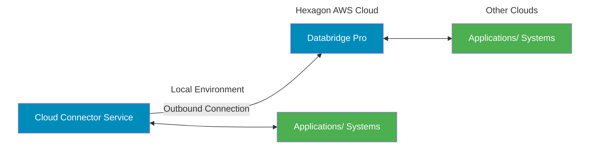
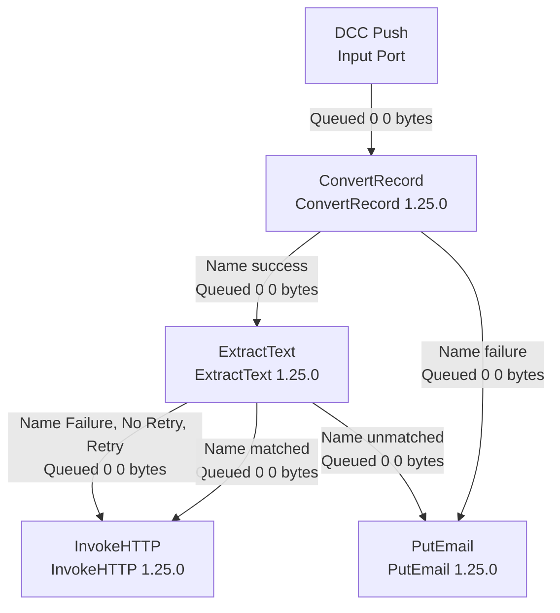

# Databridge Pro Cloud Connector Help 25.3

Hexagon Documentation

> Generated 02/28/2026

# Databridge Pro Cloud Connector

Welcome to the Databridge Pro Cloud Connector Help page.

© 2025-2026, [Hexagon AB](https://hexagon.com/company/divisions/asset-lifecycle-intelligence) and/or its subsidiaries and affiliates
25.3
Published Wednesday, October 29, 2025 at 8:11 PM

## Overview

The Databridge Pro Cloud Connector (DCC) provides connectivity between cloud and on-premises systems. It is a lightweight version of Databridge Pro, built for edge systems where access to certain resources is restricted. The Cloud Connector service is installed and run within the local environment, enabling real-time data ingestion and processing with local applications and systems.

The Cloud Connector supports lightweight data connection and processing capabilities such as filtering, transformation and routing. It is deployed in the on-premises infrastructure and is responsible for communication with Databridge Pro in cloud.

The Cloud Connector service uses outbound connection exposed through HTTPS and port 443. Only an outbound connection is required.



## Components

There are several components related to the Cloud Connector service, with which you must be familiar to understand the remaining aspects within this guide:

*   **Cloud Connector Process Groups** — Groups in which data flows integrating with local applications are designed and stored. Cloud Connector groups are the user interface for building flows for on-premises connections. Flow definitions are exported from these groups for inclusion in the local service.
*   **Cloud Connector Broker** — Broker enables the interaction and exchange of data between the local Cloud Connector instances and Databridge Pro cloud instance. Broker leverages Remote Ports for cloud communication and must be integrated within the Cloud Connector data flows.
*   **Cloud Connector Locations** — Screen to view and manage locations of Cloud Connector instances in the local environment, including their associated process group, last communication received, connector credentials and access keys, as well as the managing the status of Cloud Connector instances. Cloud Connector package also available for download.
*   **Remote Input Port** — Allows data to flow between the local Cloud Connector instance and Databridge Pro cloud instance. Remote Input Port is used when data must be pushed from the Cloud Connector local instance to the cloud instance for further processing.
*   **Remote Output Port** — Allows data to flow between the local Cloud Connector instance and Databridge Pro cloud instance. Remote Output Port is used when data must be pulled by the local Cloud Connector instance from the cloud instance.
*   **Cloud Connector Service** — Cloud Connector Service is the local component, a lightweight java application, installed in the local environment. This service executes the desired integration flow between locally deployed systems and Databridge Pro cloud.

# Connections
The Cloud Connector is used to integrate locally deployed applications or systems. It currently supports the following connections:

*   **HTTPS**
    - **Invoke.** Make HTTPS requests to external web services or APIs
    - **Listen.** Receive incoming HTTP requests from clients.
    - **OSIsoft PI.** Connect to a PI Server URL through the PI Web API RESTful interface.

* **File Storage**
    * **FTP/SFTP.** Transfer files to and from remote servers using File Transfer Protocol (FTP) and Secure File Protocol Transfer (SFTP).
    * **Box.** Connect to Box cloud content to interact with specified files and folders.
    * **Local Files.** Connect to a local file system with support for deleting, reading, creating, retrieving, and writing flowfiles to the local system.
* **Databases**
    * **Oracle 12+, MS SQL, and PostgreSQL.** Connect to various databases to query or interact with data.
* **Data Lake**
    * **Snowflake.** Push data into Snowflake using Snowpipes or Database Record Processors.
* **Streaming Platforms**
    * **Apache Kafka.** Consume or publish messages through Apache Kafka to facilitate data streaming.
    * **MQTT.** Connect to MQTT (Message Queuing Telemetry Transport) brokers to publish data or subscribe to specific topics for IoT and messaging use cases.
    * **AMQP.** Consume or publish AMQP messages from an AMQP broker, using AMQP 0.9.1 protocol.
    * **JMS.** Consume or publish JMS messages from a JMS Destination (queue or topic).
* **Notifications**
    * **Email.** Connect to your SMTP server to send e-mails to the configured recipients.

# Cloud Connector Quick Start

Below are the basic steps to get started using the Databridge Pro Cloud Connector (DCC). Further information and details for each step, as well as additional functionality, can be found in the remainder of this guide.

Quick Start:

1. Create a Cloud Connector Process Group to contain your desired flow. One group should be created for each Cloud Connector instance being installed in the local environment.
2. Build a Cloud Connector flow for your on-premises application within the Cloud Connector Process Group. Each group should contain only one flow for best performance.
3. Export the Cloud Connector Flow from Databridge Pro cloud, for import into the local Cloud Connector service.
4. Create a Cloud Connector Location for the Cloud Connector Process Group.
5. Download the Credentials File for the Cloud Connector Location for addition in the local Cloud Connector service.
6. Generate an API Key for the Cloud Connector Location and put into the downloaded credentials file.
7. Download the Cloud Connector package and install in the local environment.
8. Configure local Cloud Connector service. Add the Location credentials and flow export files, replacing the existing placeholders in the downloaded package.
9. Test the local Cloud Connector service and flow to verify everything is functioning as expected. (Cloud Connector flows cannot be tested within Databridge Pro Cloud canvas.)
    - a. If flow is not working as expected, modifications can be made to the flow in Databridge Pro cloud. A new flow export and update in the local service will be required.

Read through the corresponding sections in the remainder of the document for further details and other functionality available.

# Cloud Connector Process Groups

The Databridge Pro Cloud Connector does not have a dedicated user interface. Therefore, all data flows integrating with on-premises or edge applications must be designed and finalized in the Databridge Pro cloud interface.

Data flows integrating with on-premises or edge applications are designed and stored in Cloud Connector groups. Cloud Connector groups are designated by a flag within the Add Process Group dialog. For ease of recognition, Cloud Connector groups are color-coded in Hexagon blue and are labeled "DCC" within the breadcrumbs trail in the canvas.

A Cloud Connector Process Group should be created for each system or application connecting to in the local environment.

## Add a Cloud Connector Process Group

Cloud Connector process groups are required to build integration flows for on-premises application connections. A Cloud Connector Process Group should be created for each system or application connection (ex. 1 group for database A, 1 group for database b, 1 group for

To add a Cloud Connector process group:

1. Drag-and-drop the **Process Group** icon to the canvas.
2. In the Add Process Group dialog:
   - a. Check the **Cloud Connector Process Group** flag.
   - b. Enter a Process Group Name, relevant to your use case.
   - c. Click **Add**.

Cloud Connector Process Group is added to the canvas and color-coded in Hexagon blue for easy recognition.

> 

- **Create Process Group**
  - Name: Test Cloud Connector Group
  - [x] Cloud Connector Process Group
  - Parameter Context: HXGNDEV0008_PP1_PARAMETER_CTX
  - Cancel | Add

- **DCC Process Group**
  - [ ] 0 [ ] 0 ▶ 0 [ ] 2 △ 2 ✕ 0
  - Queued 0 (0 bytes)
  - In 0 (0 bytes) → 0 5 min
  - Read/Write 0 bytes / 0 bytes 5 min
  - Out 0 → 0 (0 bytes) 5 min
  - ✓ 0 * 0 ↑ 0 ! 0 ? 0

> **NOTE** Import flow definition function is disabled when Cloud Connector Process Group flag is checked.

# Delete a Cloud Connector Process Group

Deletion of Cloud Connector Process Groups should be approached with caution, as these groups act as the user interface for designing the data flows for on-premises application connections. These groups provide the ability to manage the flow definitions which will be run in the local Cloud Connector services. Therefore, it is recommended these groups not be deleted to avoid accidental loss of a data flow design.

However, if necessary, a Cloud Connector Process Group can be deleted. Only Cloud Connector Process Groups which are not associated with or assigned to a Cloud Connector Location can be deleted.

To delete a Cloud Connector Process Group:

1. Right-click the Cloud Connector Process Group.
2. Select **Delete**.
    a. If the Cloud Connector Process Group is not associated with a Location, the group will be removed from the canvas.
    b. If a Cloud Connector Process Group is associated with a Location, a warning message is displayed.

To delete a Cloud Connector Process Group that is associated with a Location:

1. Select the Cloud Connector Process Group to be deleted.
2. Review the Operation Palette and note the ID (36 characters) for the selected group.
3. Go to the Global Menu and select **Cloud Connector**.
4. Find the Location record that is associated to the group ID noted in step 2.
5. Click the **More** icon for the record, and select **Edit**.
6. In the Edit Location window, select a new Process Group to associate with this Location.
7. Click **Apply**.

The Cloud Connector Process Group will no longer be associated with the Location record and can be deleted from the canvas. Additionally, the Cloud Connector service associated with this now deleted group should be removed from the local environment to prevent confusion or communication disruptions.

> NOTE Cloud Connector Process Groups cannot be recovered once deleted. Additionally, Cloud Connector flow definition files cannot be re-imported into the canvas. Proceed with extreme caution when deleting.

# Cloud Connector Data Flows

The Cloud Connector is designed to facilitate data collection at the source of creation and enable interaction between Databridge Pro cloud and on-prem applications with restricted access.

In line with this design, flows can be thought of and organized into two primary categories:

- **Cloud Flows** – These flows run within the Databridge Pro cloud instance, either receiving data from or queuing data for the local Cloud Connector service. This setup allows for extensive processing and transport, taking advantage of cloud resources.
- **Cloud Connector Flows** – These flows are lightweight and operate within the local Cloud Connector service, establishing connections to edge systems with restricted access. Cloud Connector flows may also retrieve or send data to the Databridge Pro cloud instance for additional processing and transport, though this connection is not required for all use cases.

All data flows are designed and built within the Databridge Pro cloud interface. It is recommended to group related Cloud and Cloud Connector flows within a parent process group (standard) to maintain organization and understanding.

Example: A parent process group (standard) "DCC Flows – Local Database 123" contains two child groups, one for our Cloud flow and one for our Cloud Connector flow.

Figure 1: Grouping Organization

The following sections outline the steps needed to design and build flows with these two categories in mind.

## Cloud Flows for DCC connection

Cloud flows may be designed to either receive data from or queue data for a local Cloud Connector service. When building a cloud flow for communication with a Cloud Connector service, there are crucial elements and steps required.

### Build a Cloud Flow

Cloud flows are designed within standard process groups.

1. In your Cloud flow group, add the necessary data processing and connection components to the canvas for the desired use case.
2. Add the necessary remote ports for communication between cloud and Cloud Connector service:
    a. If data is pulled from cloud into a Cloud Connector flow, add a Remote Output Port.
    i. Drag and drop the Output Port icon on to the canvas.
    ii. Enter a meaningful name for the port.
    iii. From the Send To drop down, select ‘Remote connections’.
    iv. Click Add.
    b. If data is to be sent from a Cloud Connector flow to the cloud flow, add a Remote Input Port.
    i. Drag and drop the Input Port icon on to the canvas.
    ii. Enter a meaningful name for the port.
    iii. From the Send To drop down, select ‘Remote connections’.
    iv. Click Add.
3. Connect all components based on the desired use case.

# Example:

Below are simplified flows to showcase the use of Remote Input and Output ports, continuing from the process group example.

In this example we want to build a flow where the local Cloud Connector instance is pulling data from the cloud. This flow will call a REST API endpoint (InvokeHTTP) and queue the data for the local Cloud Connector instance to pull via a remote output port component ('DCC Pull').

> Figure 2: Cloud Flow Example - DCC Pull

Additionally, we want data coming from the local Cloud Connector instance to be processed back in the cloud. This flow relies on data from the local Cloud Connector instance, therefore the flow starts with a remote input port ('DCC Push'). This component will receive and route data from the local Cloud Connector instance, perform data processing (ConvertRecord & ExtractText), and send the data to a REST API endpoint (InvokeHTTP).



Figure 3: Cloud Flow Example - DCC Push

# Cloud Connector Flows

Cloud Connector flows should be lightweight, performing simple data collection and/or basic processing within the local environment. When building a Cloud Connector flow, there are crucial elements and steps required.

## Cloud Connector Broker

The Cloud Connector Broker enables the interaction and exchange of data between the local Cloud Connector service and the Databridge Pro cloud instance. Cloud Connector Broker can only be added within Cloud Connector Process Groups and must be included within Cloud Connector data flows, when communication with Databridge Pro cloud is required or desired. Cloud Connector Broker is used in conjunction with the Remote Input and Output.

The Cloud Connector Broker requires outbound access to port 443, as well as the Cloud Connector URL. The Cloud Connector Broker URL is automatically generated based on the location of the Databridge Pro Cloud tenant. The Cloud Connector Broker URL follows a predictable pattern based on the tenant's location:

https://dataflow-cloud-connector-[ENV]-
[REGION].eam[DOMAIN].hxgnsmartcloud.com

## Example 1:

- Login URL: https://dataflow-prd-
  use1.eam.hxgnsmartcloud.com/nifi/login?tenant=ACME_PRD
- Cloud Connector Broker URL: https://dataflow-cloud-connector-prd-
  use1.eam.hxgnsmartcloud.com

## Example 2:

- Login URL: https://dataflow-ppd-
  use1.eambeta.hxgnsmartcloud.com/nifi/login?tenant=ACME_PRD
- Cloud Connector Broker URL: https://dataflow-cloud-connector-ppd-
  use1.eambeta.hxgnsmartcloud.com

> NOTE The URL will also be displayed within the Broker component, after adding it to the canvas within Databridge Pro Cloud.

<figure>
  
</figure>

<figure>
  
</figure>

# Build a Cloud Connector Flow

Cloud Connector data flows are designed within a Cloud Connector Process Group. Only one flow (or one system connection) should be used within a Cloud Connector Process Group.

1. In your Cloud Connector Process Group, add the necessary data processing and connection components for the desired use case.
2. Build the flow for the desired use case and system connections.
3. If the flow requires connection to the cloud instance, drag-and-drop the Cloud Connector Broker icon to the canvas.
    a. If data is being pulled from a cloud flow into a Cloud Connector flow, connect the Cloud Connector Broker to the appropriate component that will process the incoming data.
    * In the Create Connection dialog, select the appropriate Remote Output Port from which the data should be pulled.
    b. If data is to be sent to a cloud flow from the Cloud Connector flow, connect the output component to the Cloud Connector Broker.
    * In the Create Connection dialog, select the appropriate Remote Input Port to which the data should be pushed.

### Example:

Below is a simplified flow to showcase the use of Cloud Connector Broker when building a Cloud Connector flow, continuing from the examples used in sections above.

In our ‘Cloud Connector Flow — Local Database 123’ group, we need to build a flow that runs in the local environment, Cloud Connector service.

In this flow, let’s both pull and push data to the cloud instance. In the first portion, we'll define the data pull from the cloud, putting it into a local database. To accomplish this pull action, the Cloud Connector Broker is connected to PutDatabaseRecord, and ‘DCC Pull (Output Port)’ remote output port is selected as the connection. This connection will pull from the cloud flow from Figure 2, through the ‘DCC Pull (Output Port)’ queue.

```mermaid
graph LR
    subgraph "Cloud Connector Flow - Local Database 123"
        Broker1[Cloud Connector Broker] -- "DCC Pull (Output Port)" --> PutDB[PutDatabaseRecord]
        
        GetFile[GetFile] -- "success" --> Broker2[Cloud Connector Broker]
        Broker2 -.-> Port[DCC Push (Input Port)]
    end
```

*Figure 3: Cloud Connector Flow Example*

> Figure 4: Cloud Connector Flow - Pt1

To finish the flow, let’s push data from our local database back to the cloud for further processing and distribution. For the push portion of the flow, we will connect the QueryDatabaseTableRecord processor to the Cloud Connector Broker and select our ‘DCC Push (Input Port)’ remote input port, which connects to our cloud flow in Figure 3.

> Figure 5: Cloud Connector Flow - Pt2

> **NOTE** Cloud Connector flows do not require communication with the Databridge Pro cloud instance. If the Cloud Connector flow is only performing local operations, the Cloud Connector Broker component is not required.

## Export a Cloud Connector Flow

Once a flow is built and ready for deployment into the local Cloud Connector service, it needs to be exported from the cloud canvas. Cloud Connector flow definitions are exported as a json file, which is the format supported by the local Cloud Connector service.

Cloud Connector flows do not run in the cloud environment. They must be exported and put into the local Cloud Connector service for local execution. The only export supported for Cloud Connector flows is the json format, which is used by the locally installed service.

To export a Cloud Connector flow:

1. Right-click the Cloud Connector Process Group.
    a. Alternatively, go into the Cloud Connector Process Group canvas.
2. Select ‘Download Cloud Connector Flow’ option from the context menu.
3. System will initiate file download (json) to the local machine.

> **IMPORTANT** Cloud Connector flows cannot be exported as part of standard flow definitions. Meaning, these flow types cannot be exported or imported between cloud tenants.

## Cloud Connector Locations

Location provides a way to register and manage Cloud Connector services utilized in the local environment. Locations have a 1:1 relationship with Cloud Connector Process Groups. When a Cloud Connector flow is complete, a location should be created to register the process group in which the flow is contained.

## Manage Cloud Connector Locations

### Add a Location

Once a flow is built for Cloud Connector, a location should be created in Databridge Pro.

1. From the Global Menu, select the **Cloud Connector** option.
2. In the **Locations** tab, click the **Add (+)** icon.

3. Complete the following information:
    a. **Name**: name or identifier for the location of the cloud connector service going into the local environment. Ex. "SAPDATABASE"
        i. Required field. String value. 60-character max.
    b. **Active**: status of the location.
        i. Flag set to Active, by default.
    c. **Process Group (select)**: Select the Process Group to which this location is associated.
        i. Only one group can be selected. Only Cloud Connector Process Groups are displayed.
    d. **Description**: description of the location.
        i. Optional field. 125-character max.

4. Click **Add**.

System will add the new location to the locations list view.

## Edit a Location
Cloud Connector Locations details can be modified, when needed.

1. From the Global Menu, select the **Cloud Connector** option.
2. In the **Locations** tab, click the **More** icon and select **Edit** for the Location to be modified.
3. Update the desired information. All fields are available for modification.
4. Click **Update**.

While any information can be modified for a Cloud Connector Location, proceed with caution when updating a Process Group.

## View Location Details
Details of an Cloud Connector Location can be viewed for additional information. To view a Location's details:

1. From the Global Menu, select the Cloud Connector option.
2. In the Locations tab, click the More icon and select View Details (i) for the Location.
3. Review the presented information:
    a. Name: Name of the Location.
    b. State: State or status of the Location, Active or Inactive.
    c. Description: Description of the location.
    d. Process Group Id: Unique identifier for the Cloud Connector process group linked to this Location.
    e. Last Communication: Date and time of the last communication received from the local Cloud Connector service.
    f. Version: Version of the Cloud Connector service communicating with Databridge Pro in cloud.
    g. API Key Created: Date and time an API Key was created for the Location.

## Remove a Location

Protections are in place to ensure Cloud Connector Locations are not removed by mistake. Locations can only be removed if the service running in the local environment has not communicated with Databridge Pro cloud. Only Cloud Connector Locations which do not have a ‘Last Communication’ timestamp can be removed from the Location listings.

To remove an eligible Cloud Connector Location:
1. From the Global Menu, select the Cloud Connector option.
2. In the Locations tab, click the More icon and select Remove for the Location.
3. If Location is eligible for Deletion, confirm by clicking Delete.
    a. If Location is not eligible for Deletion, a message an error is displayed.

If a Cloud Connector Location is not eligible for deletion, two options are available to the user:
1. Set the Location to Inactive state.
2. Edit the Location and change the Process Group to one which is unused.

a. Once modified, Location can be removed, as no ‘Last Communication’ timestamp will be present.

# Cloud Connector Location Credentials

Cloud Connector services installed in the local environment will require a credentials file to enable communication with Databridge Pro cloud. Location credentials are generated for each specific Location registered in the Locations tab.

## Download Location Credentials File

To download a credentials file for a Cloud Connector Location:

1. From the Global Menu, select the Cloud Connector option.
2. In the Locations tab, click the More icon and select Download Credentials File for the desired Location.
3. System will download the credentials file to the local machine.

The credentials file includes necessary details used to establish secure communication between the local Cloud Connector Service and Databridge Pro cloud:

* **location.name** = the name designated for the Cloud Connector service location.
* **api.key** = blank (API key must be generated separately and manually added)
* **location.id** = system assigned id for the Cloud Connector service location.
* **process.group.id** = id of the associated Cloud Connector Process Group.
* **tenant.id** = id of the Databridge Pro tenant.

The credentials file is necessary when configuring the local Cloud Connector service. See these sections for more details: Cloud Connector Location API Keys and Configure Cloud Connector service.

## Cloud Connector Location API Keys

Each Cloud Connector service and Location requires an API Key to establish secure communicate with Databridge Pro cloud. API Keys are required for each individual Location to ensure secure communication. This 1:1 relationship also allows generation and/or revocation of API Keys for a single Cloud Connector Location without disrupting other Locations which may be running in the local environment.

# Generate Location API Key

Each Cloud Connector service and Location requires an API Key to establish secure communicate with Databridge Pro cloud.

To generate an API Key for a Cloud Connector Location:

1. From the Global Menu, select the **Cloud Connector** option.
2. In the Locations tab, click the **More** icon and select **Generate API Key** for the Location.
3. Copy the API Key presented by the system and save for later usage.

> **NOTE** The API Key is presented only once and is not available for viewing after the dialog is closed.

The generated API Key must be added to the credentials file for the corresponding Cloud Connector service. See the Configure Cloud Connector service section for details on how to perform this update.

# Update Location API Key

Cloud Connector API Keys can be updated, if needed. This function should be performed with caution as updating an API Key will revoke the current key which may actively being used in the local Cloud Connector service. Updating a key in use could cause disruption in service and communication.

To update an existing API Key:

1. From the Global Menu, select the **Cloud Connector** option.
2. In the Locations tab, click the **More** icon and select **Update API Key** for the Location.
3. System will display a warning message, indicating an API Key exists.
4. Click **Continue** to proceed with updating the API Key.
   - a. Click **Cancel** to backout of the update API Key function.
5. Copy the new API Key presented by the system.

When updating an API Key, the corresponding Cloud Connector service credentials file must be reconfigured with the new API Key presented in the steps above. See the Configure Cloud Connector service section for details on how to perform this update.

# Cloud Connector Service

The Cloud Connector service is the component package installed in the local environment. This service executes the desired integration flow between locally deployed systems and Databridge Pro in the cloud.

The Cloud Connector service is a lightweight Java application

## System Requirements

Before you begin the installation of the Cloud Connector service package, review the system requirements to understand operating system and JDK support.

### Operating System

- Databridge Pro Cloud Connector is Java-based. It can run on any operating system that supports Java. (Java Runtime (JRE) must be compatible with your OS.)

### JDK Support

- Install Java 21 (required) – Cloud Connector v25.3 requires Java Development Kit (JDK) version 21 or higher. (Previous versions of Cloud Connector supported version 8.0 or higher.)
- Ensure your system meets the minimum memory requirement for Windows, 4GB. RAM minimum (16GB RAM recommended for production use).
- Set the `JAVA_HOME` environment variable to point to your Java 21 installation.

> ★ IMPORTANT Java versions 8-17 are not supported with Cloud Connector version 25.3. Previous versions of Cloud Connector are compatible with Databridge Pro Cloud version 25.3.

### Network Access Requirements

- Enable outbound access to port 443
- enable access to Databridge Pro Cloud Connector Broker URL (`https://dataflow-cloud-connector-[ENV]-[REGION].eam[DOMAIN].hxgnsmartcloud.com`)

### Performance Considerations

The size of machine required for the Cloud Connector (DCC) will vary based on the integration use cases. It is important to note that memory is more important than CPU. For

example, a modern PC/Server with at least 16GB of RAM should be sufficient for a simple use case, such as pulling data into a local database from a separate server.

# Download and Install Cloud Connector Service

## Download Cloud Connector package

The Cloud Connector service must be installed in the local environment. A package is available in Databridge Pro cloud for download to the local machine.

To download the Cloud Connector service package:

1. From the Global Menu, select the **Cloud Connector** option.
2. Select the **Download** tab.
3. Click the **Download** button.
4. System will download the zip file to the local machine: ‘cloud-connector.zip’
    - a. Download may take several minutes due to the file size and bandwidth available.

The extracted file package may be copied into the desired directories within the local environments, if the initial download was completed recently. However, it is recommended to download a new package from Databridge Pro each time a new installation is required.

## Install Cloud Connector package

The cloud-connector service package should be installed close to the applications or systems for which it will be making a connection. It is also recommended that it’s installed in the same network segment to achieve low latency.

One Cloud Connector service package is required for each Cloud Connector Location and its Cloud Connector Process Group.

**Pre-requisites for Install:** JDK 21 (or higher) installed and package downloaded from Databridge Pro.

To install the Cloud Connector package:

1. Go to the downloads folder on your local machine, where the package was downloaded from Databridge Pro.

2. Extract the ‘cloud-connector.zip’ file to your desired local directory.

3. Inside the extracted folder, a ‘cloud-connector-2.4.0’ folder will contain the file structure for the Cloud Connector java application, including the following folders:
    * a. bin (folder)
    * b. con (folder)
    * c. dfs (folder)
    * d. docs (folder)
    * e. extensions (folder)
    * f. lib (folder)
    * g. python (folder)
    * h. build (properties file)
    * i. license (file)
    * j. notice (file)
    * k. readme (file)

The package is installed and ready for configuration.

# Configure Cloud Connector service

Once the Cloud Connector service package is installed, it must be configured with the appropriate credentials, flow definition, and other information to function as intended. The following sections outline the various configurations required for the local Cloud Connector service.

## Add Credentials File

To establish communication with Databridge Pro cloud, the Location credentials file must be added to the Cloud Connector service installed locally.

**Pre-requisites:** Location credentials file is downloaded, and Location API Key is generated and noted.

1. Open the ‘dfs’ folder from the cloud-connector service directory in the local Cloud Connector service.

2. Replace the placeholder credentials file with corresponding Location credentials downloaded from Databridge Pro.

3. Open the replaced credentials file:

   a. Ensure the following fields are populated: `location.name`, `location.id`, `process.group.id`, and `tenant.id`.

      i. If fields are not populated, you do not have a Location credentials file. Redownload from Databridge Pro.

   b. In the `api.key` field, input the Location API Key generated in Databridge Pro.

   c. Save and close the file.

> Example:
>
```
location.name=ENABLEMENT
api.key=APIKEY123
location.id=11111111-1111-1111-1111-111111111111
process.group.id=010101-0101-0101-0000-000011111111
tenant.id=HXGNTENANT_1
```

The local Cloud Connector service is now configured with the appropriate credentials to communicate with Databridge Pro cloud.

## Add Cloud Connector Flow Definition

The Cloud Connector flow definition (json) must be loaded in the Cloud Connector service file directory to execute locally. The file must be renamed to ‘flow.json’, replacing the file name given when downloaded from Databridge Pro.

As with all flow definition exports, all sensitive property and field values have been removed for security purposes. These sensitive values must be manually entered within the flow definition file, otherwise failures and errors will occur.

To add the flow definition file:

1. Open the ‘dfs’ folder from the cloud-connector service directory in the local Cloud Connector service.

2. Remove the placeholder "flow.json" file from the ‘dfs’ folder.

3. Paste the desired Cloud Connector flow definition json file in the ‘dfs’ folder.

4. Rename the flow definition to "flow.json"
    a. This renaming is crucial, as the Cloud Connector looks for this naming when running.

5. Open the new "flow.json" file and set any sensitive property values (ex. passwords) which were part of the Cloud Connector flow.
    a. Value entry must align to json formatting.

6. Save the file and close.

*Example:*

```json
130   Controller Services:
131   - id: ed9fd952-0b0c-3db8-ad9d-3055797
132     name: DBCPConnectionPool
133     type: org.apache.nifi.dbcp.DBCPConn
134   - Properties:
135       Database Connection URL:
136       Database User:
137       Max Total Connections: '8'
138       Max Wait Time: 500 millis
139       Password: Password1234
140       Validation-query:
141       dbcp-max-conn-lifetime: '-1'
```

The Cloud Connector service can now execute the desired flow in the local environment.

## Start Cloud Connector Service

Once the Cloud Connector service is installed and configured with the appropriate credentials and flow definition, it can now be started. The service must be started to begin executing the flow definition loaded in the configurations.

To start the Cloud Connector service:

1. Pre-requisite: Network access must be granted as indicated in the System Requirements.

2. Open the ‘bin’ folder from the cloud-connector service directory in the local Cloud Connector service.

3. Open the run-cloud-connector.bat (windows) or ‘cloud-connector.sh (linux) file to start the Cloud Connector service.

4. A Command session will open, showing the Cloud Connector has started.

5. If the Cloud Connector flow is pulling or pushing data with Databridge Pro cloud, the relevant cloud flows must be started.

a. Log into Databridge Pro.

b. Locate the corresponding cloud flow and start all components.

c. As data is flowing, the Remote Output and Input Port queues will start

The Cloud Connector service is now running and should be executing the flow located in the ‘dfs’ folder. As data is flowing between the local Cloud Connector and Databridge Pro cloud, files should be queueing for Remote Output and Remote Input port connections, indicating the communication between on-prem and cloud is established.

> 

## Monitor Cloud Connector Service

Cloud Connector services can be monitored from within the local environment. Once the service is running, monitoring folders such as logs and provenance_repository, are accessible from the cloud-connector service directory.

## Cloud Connector Logs

In the logs folder, the ‘cloud-connector-app’ log file will provide insights into how the system is performing, executing, and communicating with Databridge Pro cloud.

Downloads > cloud-connector-1.25.0 >

*   bin
*   conf
*   content_repository
*   dfs
*   docs
*   extensions
*   flowfile_repository
*   lib
*   logs
    *   Date created: 18-10-2024 17:17
    *   Size: 350 KB
    *   Files: cloud-connector-app.log
*   provenance_repository
*   run
*   state
*   work
*   build
*   LICENSE
*   NOTICE
*   README

```text
cloud-connector-app - Notepad
File Edit Format View Help
2024-10-18 17:17:40,222 WARN [Http Site-to-Site PeerSelector] o.a.h.c.protocol.ResponseProcessCookies Cookie rejected [__Secure-Request-Token="d1b1eeb3-19d9-474d-8881-7627a75e5542", version=0, domain=n
2024-10-18 17:17:40,230 INFO [Http Site-to-Site PeerSelector] o.apache.nifi.remote.client.PeerSelector Successfully refreshed peer status cache; remote group consists of 3 peers
2024-10-18 17:17:41,565 WARN [I/O dispatcher 241] o.a.h.c.protocol.ResponseProcessCookies Cookie rejected [__Secure-Request-Token="08d3dc79-f840-4e97-935f-9a234dbdfff6", version=0, domain=n
2024-10-18 17:17:42,426 WARN [I/O dispatcher 241] o.a.h.c.protocol.ResponseProcessCookies Cookie rejected [__Secure-Request-Token="0181b3c7-80fe-44fe-8a90-91e5686af156", version=0, domain=n
2024-10-18 17:17:43,796 WARN [Timer-Driven Process Thread-1] o.a.h.c.protocol.ResponseProcessCookies Cookie rejected [__Secure-Request-Token="04b82143-e1f5-48bb-9883-0b6a24f0d707", version=0, domain=n
2024-10-18 17:17:43,812 INFO [Timer-Driven Process Thread-1] o.a.nifi.remote.standardRemoteGroupPort RemoteGroupPort[name=DCC In,targets=https://dataflow-cloud-connector-dfs-use1.eamade.hxg
2024-10-18 17:17:45,804 WARN [Timer-Driven Process Thread-1] o.a.h.c.protocol.ResponseProcessCookies Cookie rejected [__Secure-Request-Token="fe9d4175-f1cd-4172-bfa5-84c1512a81cd", version=0, domain=n
2024-10-18 17:17:46,080 WARN [Timer-Driven Process Thread-4] o.a.h.c.protocol.ResponseProcessCookies Cookie rejected [__Secure-Request-Token="5d650b60-9da0-4519-9bb6-83a1e62bb451", version=0, domain=n
2024-10-18 17:17:46,484 WARN [Timer-Driven Process Thread-1] o.a.h.c.protocol.ResponseProcessCookies Cookie rejected [__Secure-Request-Token="d7d2bca0-e065-4584-9d23-9052a3b170cc", version=0, domain=n
2024-10-18 17:17:46,501 INFO [Timer-Driven Process Thread-1] o.a.nifi.remote.standardRemoteGroupPort RemoteGroupPort[name=DCC Out,targets=https://dataflow-cloud-connector-dfs-use1.eamade.hxg
83,size=215], StandardFlowFileRecord[uuid=709d1371-b5cd-434b-acb3-858a111bd4e1,claim=StandardContentClaim [resourceClaim=StandardResourceClaim[id=1729251922890-1, container=default, section
offset=0,name=84d58f77-e1a1-426a-b68b-affdf88fd3cc,size=215], StandardFlowFileRecord[uuid=0ec8f0e9-9b68-4790-a95d-0bee39b5aaa8,claim=StandardContentClaim [resourceClaim=StandardResourceClai
=default, section=1], offset=45535, length=215],offset=0,name=8006a54b-7a2c-47f3-a5c9-ad77b5264b0c,size=215], StandardFlowFileRecord[uuid=b9b7cee5-025b-4e5e-a909-c8ca732703f7,claim=Standard
2024-10-18 17:17:48,335 WARN [Timer-Driven Process Thread-261] o.a.h.c.protocol.ResponseProcessCookies Cookie rejected [__Secure-Request-Token="7d6fd2c0-64bd-4253-8168-9701ba14e18e", version=0, domain=n
2024-10-18 17:17:48,591 WARN [Timer-Driven Process Thread-261] o.a.h.c.protocol.ResponseProcessCookies Cookie rejected [__Secure-Request-Token="dea85968-ae7e-4b14-a6a9-758f558b8345", version=0, domain=n
2024-10-18 17:17:50,623 WARN [Timer-Driven Process Thread-1] o.a.h.c.protocol.ResponseProcessCookies Cookie rejected [__Secure-Request-Token="ec1ecee0-8bf4-43d2-9e16-4b355f06368d", version=0, domain=n
2024-10-18 17:17:50,631 INFO [Timer-Driven Process Thread-1] o.a.nifi.remote.standardRemoteGroupPort RemoteGroupPort[name=DCC In,targets=https://dataflow-cloud-connector-dfs-use1.eamade.hxg
2024-10-18 17:17:50,647 INFO [Timer-Driven Process Thread-1] o.a.n.processors.standard.LogAttribute LogAttribute[id=45b1ac96-672b-3819-a861-0626ec5932ff] logging for flow file StandardFlowF
```

> **FlowFile Properties**
> key: "entryDate"
> Value: "Fri Oct 18 17:17:46 IST 2024"
> key: "lineageStartDate"
> Value: "Fri Oct 18 17:17:46 IST 2024"

# Appendix

## Cloud Connector Processors

The following processors are supported in the Cloud Connector:

<table>
  <tbody>
    <tr>
        <td>AttributesToJSON</td>
        <td>GetFTP</td>
        <td>PutDropbox</td>
    </tr>
    <tr>
        <td>CompressContent</td>
        <td>GetFile</td>
        <td>PutEmail</td>
    </tr>
    <tr>
        <td>ConsumeAMQP</td>
        <td>GetSFTP</td>
        <td>PutFTP</td>
    </tr>
    <tr>
        <td>ConsumeJMS</td>
        <td>GetSnowflakeIngestStatus</td>
        <td>PutFile</td>
    </tr>
    <tr>
        <td>ConsumeKafka</td>
        <td>InvokeHTTP</td>
        <td>PutSFTP</td>
    </tr>
  </tbody>
</table>

<table>
  <tbody>
    <tr>
        <td>ConsumeKafka_2_6</td>
        <td>InvokeHTTP</td>
        <td>PutSnowflakeInternalStage</td>
    </tr>
    <tr>
        <td>ConsumeKafkaRecord_2_6</td>
        <td>ListBoxFile</td>
        <td>PutSQL</td>
    </tr>
    <tr>
        <td>ConsumeMQTT</td>
        <td>ListDatabaseTables</td>
        <td>QueryDatabaseTable</td>
    </tr>
    <tr>
        <td>ControlRate</td>
        <td>ListDropbox</td>
        <td>QueryDatabaseTableRecord</td>
    </tr>
    <tr>
        <td>ConvertCharacterSet</td>
        <td>ListFTP</td>
        <td>ReplaceText</td>
    </tr>
    <tr>
        <td>ConvertRecord</td>
        <td>ListFile</td>
        <td>ReplaceTextWithMapping</td>
    </tr>
    <tr>
        <td>DeleteFile</td>
        <td>ListSFTP</td>
        <td>RouteOnAttribute</td>
    </tr>
    <tr>
        <td>EvaluateJsonPath</td>
        <td>ListenHTTP</td>
        <td>RouteOnContent</td>
    </tr>
    <tr>
        <td>EvaluateXPath</td>
        <td>LogAttribute</td>
        <td>RouteText</td>
    </tr>
    <tr>
        <td>EvaluateXQuery</td>
        <td>LogMessage</td>
        <td>SegmentContent</td>
    </tr>
    <tr>
        <td>ExecuteSQL</td>
        <td>MergeContent</td>
        <td>SplitContent</td>
    </tr>
    <tr>
        <td>ExecuteSQLRecord</td>
        <td>MonitorActivity</td>
        <td>SplitJson</td>
    </tr>
    <tr>
        <td>ExtractText</td>
        <td>PublishAMQP</td>
        <td>SplitText</td>
    </tr>
    <tr>
        <td>FetchBoxFile</td>
        <td>PublishJMS</td>
        <td>SplitXml</td>
    </tr>
    <tr>
        <td>FetchDropbox</td>
        <td>PublishKafka</td>
        <td>StartSnowflakeIngest</td>
    </tr>
  </tbody>
</table>

<table>
  <tbody>
    <tr>
        <td>FetchFTP</td>
        <td>PublishKafka_2_6</td>
        <td>TransformXml</td>
        <td></td>
    </tr>
    <tr>
        <td>FetchFile</td>
        <td>PublishKafkaRecord_2_6</td>
        <td>UnpackContent</td>
        <td></td>
    </tr>
    <tr>
        <td>FetchSFTP</td>
        <td>PublishMQTT</td>
        <td>UpdateAttribute</td>
        <td></td>
    </tr>
    <tr>
        <td>GenerateFlowFile</td>
        <td>PutBoxFile</td>
        <td>UpdateDatabaseTable</td>
        <td></td>
    </tr>
    <tr>
        <td>GenerateTableFetch</td>
        <td>PutDatabaseRecord</td>
        <td>ValidateRecord</td>
        <td></td>
    </tr>
    <tr>
        <td></td>
        <td colspan="2"></td>
        <td>ValidateXml</td>
    </tr>
  </tbody>
</table>

### Cloud Connector Controller Services

The following controller services are supported in the Cloud Connector:

* AvroReader
* AvroRecordSetWriter
* CSVReader
* CSVRecordSetWriter
* DBCPConnectionPool
* ExcelReader
* FreeFormTextRecordSetWriter

[ ] JMSConnectionFactoryProvider
[ ] JsonConfigBasedBoxClientService
[ ] JsonPathReader
[ ] JsonRecordSetWriter
[ ] JsonTreeReader
[ ] Kafka3ConnectionService
[ ] ParquetReader
[ ] ParquetRecordSetWriter
[ ] ReaderLookup
[ ] RecordSetWriterLookup
[ ] SnowflakeComputingConnectionPool
[ ] StandardDropboxCredentialService
[ ] StandardOAuth2AccessTokenProvider
[ ] StandardPrivateKeyService
[ ] StandardProxyConfigurationService

StandardSnowflakeIngestManagerProviderService

XMLReader

XMLRecordSetWriter

Copyright

Copyright © Hexagon AB and/or its subsidiaries and affiliates. All rights reserved.