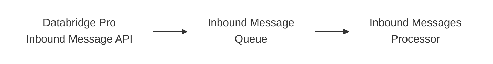
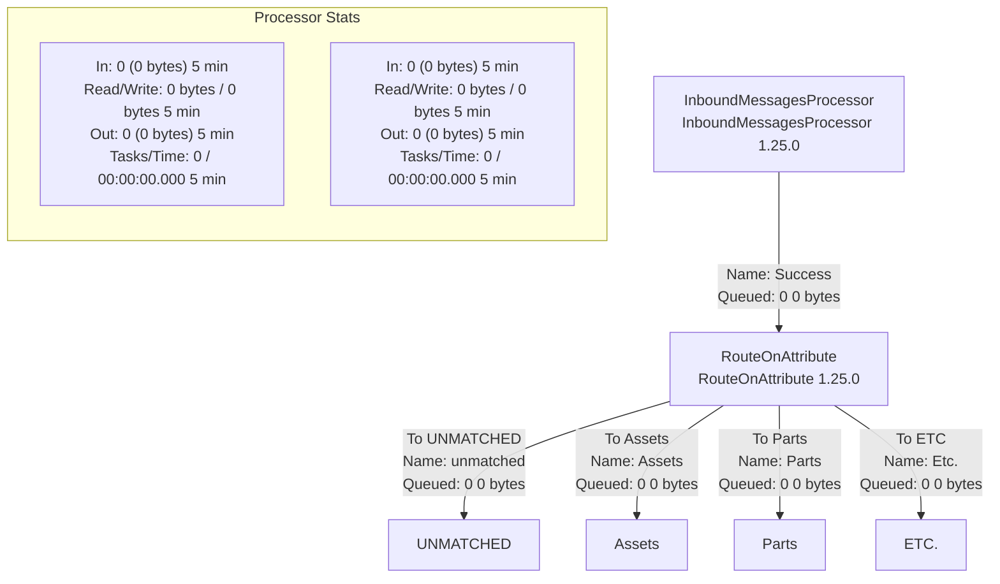

HEXAGON

# Databridge Pro Technical Reference

## Hexagon Documentation

Generated 02/28/2026

# Table of Contents

Databridge Pro Technical Reference
*   Overview
*   Sending messages to Databridge Pro
*   Databridge Pro and EAM Data Lake Upload
*   Using available ports in Databridge Pro
*   Scaling and optimizing data flows
*   Using EAM BODs with Databridge Pro

# Databridge Pro Technical Reference

© 2025-2026, Intergraph Corporation <https://hexagon.com/company/divisions/asset-lifecycle-intelligence> and/or its subsidiaries and affiliates
25.3
Published Wednesday, October 29, 2025 at 4:14 PM

## Overview

This document provides information about technical aspects and interactions with Databridge Pro. It details the available ports, Inbound Messaging, flow optimization, and more.

### Intended audience

Users interacting with Databridge Pro.

See these documents for more information about how to work with Databridge Pro:

* HxGN EAM Integrating with Dataflow Studio
* EAM Databridge Pro
* HxGN EAM Rest Web Services

## Sending messages to Databridge Pro

Databridge Pro allows users to easily send messages into their pipelines using the Inbound Messaging mechanism. Inbound Messaging is composed of the following underlying components:

* A RESTful API to receive messages
* Message queue to store incoming messages
* Processor in Databridge Pro to consume messages



# Inbound Messages API

Databridge Pro provides a RESTful Web Service API for Inbound Messages. It is defined in Open API 3 standard containing 4 major parts: Endpoint URL, Parameters, Request Body, and Response. The calling model is a simple http request/response model.

Swagger documentation can be found within HxGN EAM's Web Services page.

## API Actions and Endpoint URLs

Inbound Message API supports a POST action to add a single message to the specified tenant message queue.

**Message** Message endpoints

<table>
  <tbody>
    <tr>
        <td>POST</td>
        <td>/api/message</td>
        <td>Sends a message to the specified tenant id</td>
    </tr>
  </tbody>
</table>

The URL to access the Inbound Messages endpoint from the desired system follows the below format:

*https://dataflow-inbound-message-\<deployment-id\>.\<domain_name\>/api/messages*

If messages are to be tagged with a corresponding name, for routing messages within Databridge Pro, the endpoint should be appended with the following:

*?tag=\<tagName\>*

The deployment-id and domain-name are available in the corresponding Databridge Pro Tenant URL.

For example:

<table>
  <tbody>
    <tr>
        <td>Tenant URL</td>
        <td>https://dataflow-prd-**use1.eam.hxgnsmartcloud.com**/nifi/login?tenant=&lt;tenant&gt;</td>
    </tr>
    <tr>
        <td>Inbound Messages Endpoint</td>
        <td>https://dataflow-inbound-message-**prd-use1.eam.hxgnsmartcloud.com**/api/message</td>
    </tr>
    <tr>
        <td>Inbound Messages Endpoint with Tag addition</td>
        <td>https://dataflow-inboun-message-**prd-use1.eam.hxgnsmartcloud.com**/api/message**?tag=requisitions**</td>
    </tr>
  </tbody>
</table>

## API Authorization

Inbound Messages API supports basic authentication and OAuth 2.0 protocol.

### Basic Authentication

A valid Databridge Pro username and password are required for API basic authorization. The credentials entered are validated against the Databridge Pro system.

A Service Account user can be created in Databridge Pro and used for API authorization. Service Account users are restricted, only having access to the Inbound Messages API. This user will not have access to the tenant canvas and will be unable to log into Databridge Pro.

See Adding service account users in Databridge Pro Help for details on how to add this user type

> **NOTE** The Inbound Messages API does not reference the EAM user database and does not require an EAM Connector user.

### OAuth 2.0 Authentication

OAuth 2.0 client credentials must be obtained from the API Client Auth screen in Databridge Pro. The following credentials are provided when an API Client record is created:

* Client id

* Client secret
* Scope
* Authorization URL (token generation).

See Managing API Client Authorization in Databridge Pro Help for details.

These client credentials are used to obtain OAuth 2.0 access tokens that authorize requests to the API service noted within the scope.

### Get an API token

To get an OAuth 2.0 token:

1. Make a POST request to the Authorization URL (token) endpoint.
2. Include the following parameters:
    a. grant_type=client credentials
    b. client_id=YOUR_CLIENT_ID
    c. client_secret=YOUR_CLIENT_SECRET
    d. scope=SCOPE_FROM_FILE
3. Include the following header:
    a. Content-Type=application/x-ww-form-urlencoded
4. After making the call, the server will respond with a json object containing:
    a. access token
    b. token type
    c. expiration timeframe (seconds)

### Using the API token

Once an access token is obtained:

1. Include it in the Authorization header of your API request.
2. The token is only authorized to access the API service indicated within the scope.

> **NOTE** If the token is being used within the StandardOauth2AccessTokenProvider service in Databridge Pro, the Client Authentication Strategy must be set to BASIC_AUTHENTICATION.

### **Token Expiration**

Access tokens typically expire after a set period. Applications should request new tokens before expiration to maintain uninterrupted access.

## **API Parameters**

Inbound Messages API supports the following parameters:

<table>
  <thead>
    <tr>
        <th>Parameter Type</th>
        <th>Parameter Name</th>
        <th>Description</th>
    </tr>
  </thead>
  <tbody>
    <tr>
        <td>Header</td>
        <td>X-Tenant-Id</td>
        <td>(Required) Tenant id of Databridge Pro application.</td>
    </tr>
    <tr>
        <td>Query</td>
        <td>tag</td>
        <td>(Optional) String value to indicate a message type, to be added as an attribute of the message in Databridge Pro for routing and distribution in flows.</td>
    </tr>
  </tbody>
</table>

## **API Request Body**

The request body contains the message content string, to be consumed and processed within Databridge Pro. Any type of message can be input within the request body, such as: JSON, XML, etc., using plain text with UTF-8 encoding.

While any message type can be accepted, the content type must be specified as text/plain to be accepted by the API. An error will occur if any other content type is specified.

Databridge Pro does not assume character encoding. If special characters are present in the inbound message body, the character set must also be specified to ensure proper processing. The character set should be specified along with the content type of text/plain. Example: "charset=utf-8."

Request body <sup>required</sup> [text/plain]

Message content string.

Example Value | Schema
--- | ---
`bXkgYmFzZTY0IGVuY29kZWQgbWVzc2FnZQ==`

# API Successful Response

## 200 Code: Successful server response. Message sent.

200 OK
Media type [application/json]
Examples [Message send]
Controls Accept header.

Example Value | Schema
--- | ---
```json
{
  "status": "SUCCESS",
  "message": "Message send"
}
```

# API Error Responses

The Inbound Messages API provides multiple error responses, covering primary communication scenarios.

## 400 Code: Invalid Tenant Id

400 Bad Request
Media type [application/json]
Examples [Invalid Tenant Id]

Example Value | Schema
--- | ---
```json
{
  "status": "FAIL",
  "message": "Tenant id cannot be null, empty or blank"
}
```

**Example Description**
Invalid Tenant Id

## 401 Code: Incorrect username or password

401 Unauthorized
Media type [application/json]
Examples [Incorrect username or password]

Example Value | Schema
--- | ---
```json
{
  "status": "FAIL",
  "message": "Username or password is incorrect."
}
```

**Example Description**
Incorrect username or password

### 403 Code: API access is denied

403 Forbidden
<table>
  <tbody>
    <tr>
        <td>Media type</td>
        <td>Examples</td>
    </tr>
    <tr>
        <td>application/json</td>
        <td>Access Denied</td>
    </tr>
  </tbody>
</table>

**Example Value** Schema
```json
{
  "status": "FAIL",
  "message": "Access denied"
}
```

**Example Description**
Access Denied

---

### 405 Code: action Method is not supported

405 Method not supported
<table>
  <tbody>
    <tr>
        <td>Media type</td>
        <td>Examples</td>
    </tr>
    <tr>
        <td>application/json</td>
        <td>Method not supported</td>
    </tr>
  </tbody>
</table>

**Example Value** Schema
```json
{
  "status": "FAIL",
  "message": "GET method not supported for this request. Supported method is POST."
}
```

**Example Description**
Method not supported

---

### 415 Code: Content or media type specified is not supported.

415 MediaType not supported
<table>
  <tbody>
    <tr>
        <td>Media type</td>
        <td>Examples</td>
    </tr>
    <tr>
        <td>application/json</td>
        <td>MediaType not supported</td>
    </tr>
  </tbody>
</table>

**Example Value** Schema
```json
{
  "status": "FAIL",
  "message": "application/json media type not supported. Supported media types are text/plain."
}
```

**Example Description**
MediaType not supported

---

### 500 Code: Internal server error

500 Internal server error
<table>
  <tbody>
    <tr>
        <td>Media type</td>
        <td>Examples</td>
    </tr>
    <tr>
        <td>application/json</td>
        <td>Internal server error</td>
    </tr>
  </tbody>
</table>

**Example Value** Schema
```json
{
  "status": "ERROR",
  "message": "Internal server error. code: 1001"
}
```

**Example Description**
Internal server error

---

## Inbound Message Size

Viewing provenance data within Databridge Pro is limited to files of 50MB or less. Files exceeding 50MB cannot be viewed within the provenance interface.

For cases where viewing provenance data is not necessary, Databridge Pro recommends keeping file sizes under 250MB to ensure optimal processing without compromising

performance.

## Inbound Message Queue

A queue is provided for each Databridge Pro tenant for use with Inbound Messaging.

Successful messages sent through the Inbound Messages API are fed into the tenant's dedicated queue, based on the Tenant Id provided in the header parameter.

Once in the queue, messages are available for consumption and processing within Databridge Pro. Messages are retained for 72 hours (about 3 days).

## Inbound Messages Processor

A processor, named InboundMessagesProcessor, is available within Databridge Pro to consume and process messages from the tenant message queue. InboundMessageProcessor is accessible from the Processor icon and categorized under the Hexagon tag group.

When enabled, the InboundMessagesProcessor will retrieve all messages waiting in the tenant message queue. This InboundMessagesProcessor should be utilized only once within a tenant's canvas to ensure efficient operation. It is recommended the processor be located within a root group (such as the primary canvas) to perform necessary routing to subsequent groups and flows.

**Add Processor Dialog Screenshot:**

The screenshot shows an "Add Processor" interface with a list of available processors. The visible processors include:

<table>
    <thead>
        <tr>
            <th>Source</th>
            <th>Displaying 3 of 124</th>
            <th>Name</th>
            <th>Version</th>
            <th>Tags</th>
        </tr>
    </thead>
    <tbody>
        <tr>
            <td>all groups</td>
            <td></td>
            <td>BODTHeaderAM</td>
            <td>1.19.5</td>
            <td>hexagon</td>
        </tr>
        <tr>
            <td></td>
            <td></td>
            <td>BODTHeaderAM</td>
            <td>1.19.5</td>
            <td>hexagon</td>
        </tr>
        <tr>
            <td></td>
            <td></td>
            <td>InboundMessagesProcessor</td>
            <td>1.19.5</td>
            <td>hexagon</td>
        </tr>
    </tbody>
</table>

The left sidebar shows various tag groups including: amazon, attributes, avro, aws, azure, cloud, consume, csv, hexagon, files, get, ingest, json, kafka, logs, message, microsoft, and others.

## Routing with Tag Attributes

When the tag query parameter is used in the Inbound Messages API, the message FlowFile is attributed with the value provided. This allows flow designers to use the RouteOnAttribute processor to route each incoming message to the appropriate downstream flow within their canvas.

> **NOTE** RouteOnAttribute is one of the many options by which routing can be accomplished within Databridge Pro.

To configure the RouteOnAttribute processor for tags, a dynamic relationship must be added for each tag that requires routing. These dynamic relationships are defined as custom properties within the RouteOnAttribute processor, including the tag relationship and an evaluation statement.

To configure tag relationships using RouteOnAttribute:

*   Go to the **Properties** configuration for the RouteOnAttribute processor.
*   Add a new property ('+' button).
*   Define the property name for the tag relationship, e.g., "tagName_relationship".
*   Set the property value to an Expression Language statement that evaluates to true (or false) for the tag expected, e.g., "${im.tag:equals('tagName')}"
    > **NOTE** "im.tag" is the name of the attribute added to the FlowFile. The tagName entered in the statement must match what is sent through the API query parameter. Other expressions may be used, outside of true or false statements.

Once all dynamic relationships are defined and applied to the processor, they can be used for downstream processor connections.

### Example:

Tag "po" and "asset" are sent through Inbound Messages API, indicate the BOD message coming to the system. In Databridge Pro, each tag needs to be routed to a different BODToEAM processor for the appropriate BOD Type selection to ensure processing once it reaches EAM.

In the RouteOnAttribute processor, a dynamic relationship property must be added and defined for each tag:

**Configure Processor | RouteOnAttribute 1.19.1**
⚠ Invalid

<table>
  <tbody>
    <tr>
        <td>SETTINGS</td>
        <td>SCHEDULING</td>
        <td>PROPERTIES</td>
        <td>RELATIONSHIPS</td>
        <td>COMMENTS</td>
    </tr>
    <tr>
        <td colspan="3">Required field</td>
        <td colspan="2">[x] +</td>
    </tr>
    <tr>
        <td>Property</td>
        <td></td>
        <td>Value</td>
        <td></td>
        <td></td>
    </tr>
    <tr>
        <td>Routing Strategy</td>
        <td>?</td>
        <td>Route to Property name</td>
        <td></td>
        <td></td>
    </tr>
    <tr>
        <td>po_relationship</td>
        <td>?</td>
        <td>${im.tag:equals('po')}</td>
        <td>[delete icon]</td>
        <td></td>
    </tr>
    <tr>
        <td>asset_relationship</td>
        <td>?</td>
        <td>${im.tag:equals('asset')}</td>
        <td>[delete icon]</td>
        <td></td>
    </tr>
  </tbody>
</table>

Once entered and saved, these newly defined relationships are shown in the Create Connection dialog and in the processor Relationship tab.

# Create Connection

<table>
  <thead>
    <tr>
        <th>DETAILS</th>
        <th>SETTINGS</th>
    </tr>
  </thead>
  <tbody>
    <tr>
        <td>From Processor</td>
        <td>To Processor</td>
    </tr>
    <tr>
        <td>RouteOnAttribute</td>
        <td>BODToEAM</td>
    </tr>
    <tr>
        <td>RouteOnAttribute</td>
        <td>BODToEAM</td>
    </tr>
    <tr>
        <td>Within Group</td>
        <td>Within Group</td>
    </tr>
    <tr>
        <td>Documentation</td>
        <td>Documentation</td>
    </tr>
    <tr>
        <td>For Relationships</td>
        <td></td>
    </tr>
    <tr>
        <td>[ ] asset_relationship</td>
        <td></td>
    </tr>
    <tr>
        <td>[ ] po_relationship</td>
        <td></td>
    </tr>
    <tr>
        <td>[ ] unmatched</td>
        <td></td>
    </tr>
  </tbody>
</table>

These dynamic relationships allow each tag ("po" and "asset") to be connected and routed to the appropriate BODToEAM processor, for its corresponding each BOD type into EAM.

Using this as our example, the flow from Inbound Message queue to EAM may look something like the below.

* The InboundMessagesProcessor resides in the tenant root level, connected to RouteOnAttribute.
* Relationships are defined for each specific message, connecting to specific Process Groups for each message type and tag being received.
* Each subsequent Process Group would contain a dedicated flow to transform and transport that specific message.



**Process Group Details (from screenshot):**

<table>
  <thead>
    <tr>
        <th>Component</th>
        <th>Queued</th>
        <th>In (5 min)</th>
        <th>Read/Write (5 min)</th>
        <th>Out (5 min)</th>
    </tr>
  </thead>
  <tbody>
    <tr>
        <td>UNMATCHED</td>
        <td>0 (0 bytes)</td>
        <td>0 (0 bytes) → 1</td>
        <td>0 bytes / 0 bytes</td>
        <td>0 → 0 (0 bytes)</td>
    </tr>
    <tr>
        <td>Assets</td>
        <td>0 (0 bytes)</td>
        <td>0 (0 bytes) → 1</td>
        <td>0 bytes / 0 bytes</td>
        <td>0 → 0 (0 bytes)</td>
    </tr>
    <tr>
        <td>Parts</td>
        <td>0 (0 bytes)</td>
        <td>0 (0 bytes) → 1</td>
        <td>0 bytes / 0 bytes</td>
        <td>0 → 0 (0 bytes)</td>
    </tr>
    <tr>
        <td>ETC.</td>
        <td>0 (0 bytes)</td>
        <td>0 (0 bytes) → 1</td>
        <td>0 bytes / 0 bytes</td>
        <td>0 → 0 (0 bytes)</td>
    </tr>
  </tbody>
</table>

The InboundMessagesProcessor is placed at the root level and is connected to the RouteOnAttribute processor. Within RouteOnAttribute, relationships are defined for each specific message type and tag being used. Based on the tag-relationship,

RouteOnAttribute is connected to subsequent Process Groups, where a dedicated flow exists for the necessary transformation and transit of the data.

## Databridge Pro and EAM Data Lake Upload

HxGN EAM's Data Lake Upload Setup (DLU) has a dedicated connection with Databridge Pro.

Flow designers can utilize the GetEAMDataLakeMessageProcessor within Databridge Pro to retrieve data messages that are sent from the EAM DLU. Messages are retained for 72 hours (about 3 days).

### Add Processor Interface

The following table shows the processor selection interface displaying 4 of 155 available processors:

<table>
<thead>
<tr>
<th>Type</th>
<th>Version</th>
<th>Tags</th>
</tr>
</thead>
<tbody>
<tr>
<td>BODFromEAM_V2</td>
<td>1.25.0</td>
<td>hexagon</td>
</tr>
<tr>
<td>BODToEAM</td>
<td>1.25.0</td>
<td>hexagon</td>
</tr>
<tr>
<td>GetEAMDataLakeMessageProcessor</td>
<td>1.25.0</td>
<td>hexagon</td>
</tr>
<tr>
<td>InboundMessagesProcessor</td>
<td>1.25.0</td>
<td>hexagon</td>
</tr>
</tbody>
</table>

These messages will automatically contain a tag attribute that can be used for routing. The tag attribute for DLU messages, `datalake.tag`, will be set with the EAM table name, following the format of `'eam_TableName'` (Ex. eam_R5PARTS, eam_R5INSTALL).

The desired routing mechanism, or component, can be used to move the DLU data, as required.

If using the RouteOnAttribute processor, the relationship property may be set up, similar to the following:

* In RouteOnAttribute properties, add a new property ('+' button).
* Define the property name for the DLU tag relationship, ex. `"tagName_PARTS"`.
* Set the property value to an Expression Language statement that evaluates to true for the DLU tag, e.g., `"${datalake.tag:equals('eam_R5PARTS')}"` (or utilize a `startsWith` expression).
* Repeat these steps for all desired tags or tables coming from EAM DLU.

* Once all dynamic relationships are defined and applied to the processor, they can be used for downstream connections.

> **NOTES** The tag name value entered in the statement must match what is sent from the DLU and attached to the flowfile(s).
>
> DLUTXDBP install parameter must be set to "YES" within HxGN EAM to enable Databridge Pro connection with the DLU tool. See HxGN EAM Data Lake Integration from Hexagon Cloud for more details. InboundMessagesProcessor can no longer be used to retrieve EAM Data Lake messages.

## Using available ports in Databridge Pro

The following Ports are available and supported for use within Databridge Pro processors.

**IMPORTANT** Using Ports not listed may result in processor failure when attempting data flow execution.

<table>
  <tbody>
    <tr>
        <td>Connection Type</td>
        <td>Port(s)</td>
        <td>Notes</td>
    </tr>
    <tr>
        <th>Azure EventHub</th>
        <th>5671<br/>5672</th>
        <th></th>
    </tr>
    <tr>
        <th>Email (SMTP)</th>
        <th>465<br/>586<br/>587<br/>2525</th>
        <th></th>
    </tr>
    <tr>
        <th>FTP</th>
        <th>21<br/>2121</th>
        <th></th>
    </tr>
    <tr>
        <th>Invoke HTTP</th>
        <th>443</th>
        <th></th>
    </tr>
    <tr>
        <th>JMS</th>
        <th>1099 (IBM)</th>
        <th></th>
    </tr>
  </tbody>
</table>

<table>
  <tbody>
    <tr>
        <td>4447<br/>5445,<br/>6745+ (Oracle)</td>
        <td></td>
        <td></td>
    </tr>
    <tr>
        <td>Kafka</td>
        <td>9092<br/>9094<br/>9096<br/>9194<br/>9196</td>
        <td>Use 9092 to communicate with brokers in plaintext<br/><br/>Communicate with brokers with TLS encryption<br/><br/>Port 9094 and 9096 for access from within AWS<br/><br/>Port 9194 and 9196 for public access<br/><br/>Communicate with brokers with SASL/SCRAM</td>
    </tr>
    <tr>
        <td>MQTT</td>
        <td>8083<br/>8084<br/>8883</td>
        <td>WebSocket Port: 8083<br/><br/>WebSocket Secure Port: 8084<br/><br/>SSL/TLS Port: 8883</td>
    </tr>
    <tr>
        <td>SFTP (Secure File Transfer Protocol)</td>
        <td>22<br/>222</td>
        <td></td>
    </tr>
    <tr>
        <td>SQL</td>
        <td>1433<br/>1434</td>
        <td></td>
    </tr>
    <tr>
        <td>SAP</td>
        <td>8000</td>
        <td></td>
    </tr>
    <tr>
        <td>DataPower</td>
        <td>4201</td>
        <td></td>
    </tr>
  </tbody>
</table>

4202

# Scaling and optimizing data flows

Data flow optimization is affected by several aspects of the system including, the size of the data flow, the types of processors used, the number and size of files being processed, the balance between system resources, and underlying configurations.

While there are no strict rules to achieve this, the following sections are recommendations for optimization and scalability within Databridge Pro.

## Scheduling and distributing the first processor

Databridge Pro is deployed on multiple nodes for reliability and scalability but, it is up to the flow designer or user creating the flow to ensure that scalability and optimization is realized when a flow executes.

The scheduling execution of the first processor in a process flow depends on how data is accessed.

<table>
  <thead>
    <tr>
        <th>Execution Setting</th>
        <th>When to Use</th>
        <th>Distribution Setting</th>
    </tr>
  </thead>
  <tbody>
    <tr>
        <td>Primary Nodes</td>
        <td>When each execution of the processor could result in reading the same record from the source, thereby resulting in duplicate processing.</td>
        <td>Set connections to "Round robin" load balance strategy</td>
    </tr>
    <tr>
        <td>All Nodes</td>
        <td>When each execution of the processor is guaranteed to read distinct data from the source.</td>
        <td></td>
    </tr>
  </tbody>
</table>

Primary Node should be used in cases where the processor may read the same record or data from the source system, each time it executes (e.g., running a database query or retrieving record sets from filesystem). If these processors are set to run on all nodes, there is potential for duplicate records being retrieved and processed.

All Nodes should be used in cases where the processor is guaranteed to read distinct data or records from the source system, posing no risk of duplicate records or processing.

To adjust the Execution schedule on a processor, open the Configure Processor dialog. On the **Scheduling** tab, set the Execution value accordingly and apply.

### Configure Processor | BODFromEAM 1.19.1
Stopped

<table>
  <thead>
    <tr>
        <th>SETTINGS</th>
        <th>SCHEDULING</th>
        <th>PROPERTIES</th>
        <th>RELATIONSHIPS</th>
        <th>COMMENTS</th>
    </tr>
  </thead>
  <tbody>
    <tr>
        <td>Scheduling Strategy 🛈</td>
        <td colspan="2">Run Schedule 🛈</td>
        <td colspan="2"></td>
    </tr>
    <tr>
        <td>Timer driven [v]</td>
        <td colspan="2">5 sec</td>
        <td colspan="2"></td>
    </tr>
    <tr>
        <td>Concurrent Tasks 🛈</td>
        <td colspan="2"></td>
        <td colspan="2"></td>
    </tr>
    <tr>
        <td>1</td>
        <td colspan="2"></td>
        <td colspan="2"></td>
    </tr>
    <tr>
        <td>Execution 🛈</td>
        <td colspan="2"></td>
        <td colspan="2"></td>
    </tr>
    <tr>
        <td>Primary node [v]</td>
        <td colspan="2"></td>
        <td colspan="2"></td>
    </tr>
  </tbody>
</table>

Processors running on the primary node should also be set to distribute FlowFiles to all nodes in subsequent connections to allow the load to be spread out.

To adjust the distribution, open the Configure Connection dialog. Select the Settings tab and set the Load Balance Strategy to "Round robin." This should be done for all connections following the processor set to primary node.

### Configure Connection

<table>
  <thead>
    <tr>
        <th>DETAILS</th>
        <th>SETTINGS</th>
        <th colspan="2"></th>
    </tr>
  </thead>
  <tbody>
    <tr>
        <td>Name</td>
        <td colspan="2">Available Prioritizers 🛈</td>
        <td></td>
    </tr>
    <tr>
        <td>[___]</td>
        <td colspan="2">FirstInFirstOutPrioritizer</td>
        <td></td>
    </tr>
    <tr>
        <td>Id</td>
        <td colspan="2">NewestFlowFileFirstPrioritizer</td>
        <td></td>
    </tr>
    <tr>
        <td>578ec7b9-0187-1000-0000-00007bd5342e</td>
        <td colspan="2">OldestFlowFileFirstPrioritizer</td>
        <td></td>
    </tr>
    <tr>
        <td>FlowFile Expiration 🛈</td>
        <td colspan="2">PriorityAttributePrioritizer</td>
        <td></td>
    </tr>
    <tr>
        <td>0 sec</td>
        <td colspan="2"></td>
        <td></td>
    </tr>
    <tr>
        <td>Back Pressure Object Threshold 🛈</td>
        <td>Size Threshold 🛈</td>
        <td>Selected Prioritizers 🛈</td>
        <td></td>
    </tr>
    <tr>
        <td>10000</td>
        <td>1 GB</td>
        <td>[___]</td>
        <td></td>
    </tr>
    <tr>
        <td>Load Balance Strategy 🛈</td>
        <td colspan="2"></td>
        <td></td>
    </tr>
    <tr>
        <td>Round robin [v]</td>
        <td colspan="2"></td>
        <td></td>
    </tr>
    <tr>
        <td>Load Balance Compression 🛈</td>
        <td colspan="2"></td>
        <td></td>
    </tr>
    <tr>
        <td>Do not compress [v]</td>
        <td colspan="2"></td>
        <td></td>
    </tr>
    <tr>
        <td colspan="2"></td>
        <td>CANCEL</td>
        <td>APPLY</td>
    </tr>
  </tbody>
</table>

# Simplifying and grouping functionality

Two simple options for achieving optimization are to use the fewest number of processors possible and group repeated operations into referenceable Process Groups.

Many processors allow data to be processed in batches within each thread. If you spread tasks across several processors, and each works on a smaller portion of a large dataset, you may not fully benefit from the batch processing.

Databridge Pro offers several processor options to route or funnel data from a single source into different branches of a flow based on specific data, file attributes, etc.

If repeated operations are necessary, it is recommended to group these into Process Groups and reference throughout the necessary flows. By grouping repeated operations, it removes redundancy as the same processes are not repeated in multiple places taking up resources.

Data can be passed into these groups for processing, then passed back to continue through the necessary flow(s), making an efficient operation.

# Using EAM BODs with Databridge Pro

## BODs in data flows

It is essential to have a clear understanding of how and when to use Business Object Documents (BODs) effectively when building a flow to between HxGN EAM and other systems. The flow designer holds the responsibility of ensuring that the appropriate BODs are utilized, and all routing and responses are handled correctly.

When building a flow, it is important to ensure that all systems involved are capable of processing the BOD and any corresponding BOD responses. Additionally, the flow should be designed to effectively handle and route all BODs between the systems, including the management of any responses or potential errors that may arise. If a system cannot process a particular BOD, or a BOD is not routed to the necessary system, processing may not occur as expected.

For example, if a Process BOD is sent from HxGN EAM to an external system which cannot return an Acknowledgement BOD, no further processing will occur in EAM as it is awaiting the acknowledgement.

Similarly, if the Acknowledgement BOD is provided by an external system but is not accounted for within the flow design, e.g., not sent back to EAM, no further processing will occur as EAM is waiting for the acknowledgement to proceed.

# BOD overview

EAM Databridge messages are known as Business Object Documents (BODs) and are based on integration specification standards developed by the Open Applications Group, Inc. (OAGi). These messages are created to encapsulate different business transactions or operations, such as purchase orders, invoices, or inventory updates, in a structured format.

BODs are XML documents consisting of two main components: a verb and a noun. The verb specifies the purpose of the entire BOD, while the noun specifies the business-specific data object or document. (e.g., SyncItemMaster or ProcessAssetMaster).

BOD XML documents also include an action code, which indicates the type of operation being performed in a BOD. This helps define the specific nature of a message relative to the verb component.

# System of record

To gain a better understanding of BOD verbs and their usage, it is crucial to first understand the system of record (SOR) concept.

A piece of information such as a customer address, or a document, such as Purchase Order, is maintained, or owned, by only one system – the system of record (SOR). The SOR publishes all changes for that piece of information. Other applications that want to add or change that piece of information must make a request to the SOR.

The BOD message used will vary and be based on the system that owns a specific business object.

# BOD verbs and actions

HxGN EAM supports the following verbs and action codes for BODs.

## Sync BOD

The Sync message is a broadcast message published by the system of record. It is used to inform other applications about the latest information for the noun. It is published after a business event causes a change in the data.

These action codes are supported for Sync:

* Add: Notifies other applications that a document or record has been created.

* Replace: Notifies other applications that an existing document or record has been updated. The entire document replaces (updates) all data elements.

### Confirm replies

Confirm is a special type of verb sent when an error occurs in processing an inbound BOD.

### Process BOD

The Process Message is a point-to-point message, used to request changes or a service from another application. The Process message is usually sent to the system of record (SOR) which owns the noun or business object.

These action codes are supported for Process:

* Add: Requests that the other application create a new document or record.
* Change: Requests that the other application update an existing document or record. The elements that have a change are required (change only updates the field elements sent).

### Acknowledge replies

In response to a Process message, acknowledge reply messages are sent from the system of record to indicate whether the request was accepted or rejected.

# Copyright

Copyright© Hexagon AB and/or its subsidiaries and affiliates. All rights reserved.