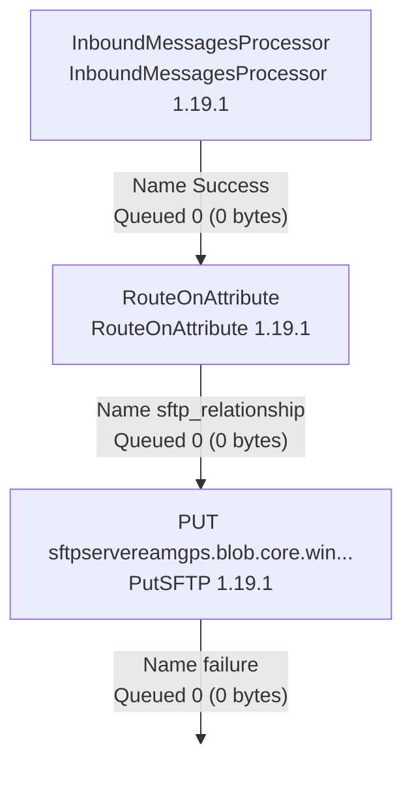

# Partner training

Databridge Pro - Examples  
Version 1.1

"Partner Training"  
23 May 2025

HEXAGON Databridge Configuration

Prerequisites:
1. A SFTP server accessible from Internet with a user/password authentication.
2. An HxGN EAM tenant in the HxGN Cloud with an account in the R5 group.
3. A Databridge Pro tenant associated with the HxGN EAM tenant with an account.
4. A Connector key in HxGN EAM
5. An HxGN EAM user assigned with a Connector license.
6. Postman or equivalent, to be able to call a REST API.

# Databridge Configuration

## General Setup

We will configure Databridge to publish a Sync.PurchaseOrder BOD when a Purchase Order is approved for the first time or re-approved.

Logon on HxGN EAM with a user in the R5 group.  
Select the menu Administration | Databridge | Databridge Setup  
Change to Yes:
- Enable Work Order Outbound
- Enable Add PO Outbound
- Enable Change PO Outbound

Save on the changes with the Save Record icon from the toolbar.

## Databridge Pro Partner Setup

Databridge Pro introduces a new partner named Dataflow Studio Partner. It is not activated by default. We are going to activate that partner and to subscribe to the Purchase Order BOD for that partner.

Select the menu Administration | Databridge | Databridge Partners.  
Change the dataspy to All Partners as the default dataspy shows only the Active Partners.

The partner Dataflow Studio Partner of code HXGN-DFS will appear in the list.
- Select the partner Dataflow Studio Partner.
- Check the box Active.
- Select the Subscriptions tab.

On the Subscriptions tab:
- Search for the event ADDPO and the document type SyncPurchaseOrder.
- Double click on the line to select it.
- Check the box Enabled in the Subscription Details panel.
- Save on the changes with the Save Record icon located above the Subscription Details panel.

23 May 2025 4

HEXAGON    Example 1 – EAM Outbounding

- Repeat the same steps for the following couple event/document type: CHANGEPO/SyncPurchaseOrder.

# Example 1 - EAM Outbounding

## Objective

In this example, we are going to create a simple flow. We are going to push the Purchase Order BOD from HxGN EAM to a SFTP server. According to our previous configuration, the Purchase Order BOD will be published to Databridge Pro when a Purchase Order is created or updated.

## SFTP server Configuration

- Logon on your HxGN EAM tenant with a user in the R5 group.
- Select the menu Administration | Databridge | Databridge Partners
- Select the HXGN-DFS partner.
- Select the DFS Catalog tab.
- Select the Add Catalog Record icon 📝 located below the record list:

  - In the Catalog Panel:
    - Type the following description in the field following the Endpoint ID: Put <your SFTP server>.
    - Check the Active box.
  - In the Endpoint Definition
    - In the Type field, select SFTP.
    - In the Method field, select Put.
    - In the hostname field, type the public hostname or IP of your SFTP server.
    - In the Port field, modified if needed the port of your SFTP server (default is 22).
    - In the username field, type the username of your SFTP server.
    - In the password field, type the password corresponding to the username.
    - If a remote path is needed, type it in that field.
- Save the record.

## Dataflow creation in Databridge Pro

Logon on your Databridge Pro tenant with your account.

The main toolbar is located on the top of the screen:

23 May 2025    5

HEXAGON
Example 1 – EAM Outbounding

The main toolbar on the top contains the following icons: Processor, Input Port, Output Port, Process Group, Remote Process Group, Funnel, Template, and Label.

*   ***Processors*** are the basic blocks for creating a data flow. Every processor has different functionality, which contributes to the creation of output flowfile.
*   ***EAM Endpoints Processor*** are defined in EAM, in the DFS Catalog.
*   ***Input port*** is used to get data from the processor, which is not present in that process group.
*   ***Output Port*** provide a mechanism for transferring data from a Process Group to destinations outside of the Process Group. All Input/Output Ports within a Process Group must have unique name
*   ***Process Group*** can be used to logically group a set of components so that the dataflow is easier to understand and maintain.
*   ***Funnel*** is a NiFi component that is used to combine the data from several Connections into a single Connection.
*   ***Template*** helps to reuse the data flow in the same or different NiFi instances.
*   ***Label*** are used to provide documentation to parts of a dataflow.

From the main toolbar on the top, drag and drop the Process Group icon.
A new window named Add Process Group will appear:
*   Type Example 1 in the field.
*   Click on the Add button.

The following Process Group will appear on the screen:

<table>
  <thead>
    <tr>
        <th colspan="3">Example 1</th>
    </tr>
  </thead>
  <tbody>
    <tr>
        <td colspan="3">0 0 0 0 0 0</td>
    </tr>
    <tr>
        <td>Queued</td>
        <td>0 (0 bytes)</td>
        <td></td>
    </tr>
    <tr>
        <td>In</td>
        <td>0 (0 bytes) → 0</td>
        <td>5 min</td>
    </tr>
    <tr>
        <td>Read/Write</td>
        <td>0 bytes / 0 bytes</td>
        <td>5 min</td>
    </tr>
    <tr>
        <td>Out</td>
        <td>0 → 0 (0 bytes)</td>
        <td>5 min</td>
    </tr>
    <tr>
        <td colspan="3">0 0 0 0 ? 0</td>
    </tr>
  </tbody>
</table>

To enter that new Process Group Example 1:
*   Either double click on it,
*   Or right click on it Group and select the menu item Enter Group.

From the main toolbar on the top, drag and drop the Processor icon on the worksheet. A new window named Add Processor will appear:

23 May 2025
6

# Example 1 – EAM Outbounding

## Add Processor

Source
Displaying 154 of 154
Filter
all groups
Type
Version
Tags

<table>
    <tr>
        <th>Type</th>
        <th>Version</th>
        <th>Tags</th>
    </tr>
    <tr>
        <td>AttributeRollingWindow</td>
        <td>1.25.0</td>
        <td>rolling, data science, Attribute ...</td>
    </tr>
    <tr>
        <td>AttributesToCSV</td>
        <td>1.25.0</td>
        <td>flowfile, csv, attributes</td>
    </tr>
    <tr>
        <td>AttributesToJSON</td>
        <td>1.25.0</td>
        <td>flowfile, json, attributes</td>
    </tr>
    <tr>
        <td>BODFromEAM_V2</td>
        <td>1.25.0</td>
        <td>hexagon</td>
    </tr>
    <tr>
        <td>BODToEAM</td>
        <td>1.25.0</td>
        <td>hexagon</td>
    </tr>
    <tr>
        <td>Base64EncodeContent</td>
        <td>1.25.0</td>
        <td>encode, base64</td>
    </tr>
    <tr>
        <td>CalculateRecordStats</td>
        <td>1.25.0</td>
        <td>stats, record, metrics</td>
    </tr>
    <tr>
        <td>CompressContent</td>
        <td>1.25.0</td>
        <td>compress, snappy framed, bro...</td>
    </tr>
    <tr>
        <td>ConsumeAzureEventHub</td>
        <td>1.25.0</td>
        <td>cloud, streaming, streams, eve...</td>
    </tr>
    <tr>
        <td>ConsumeElasticsearch</td>
        <td>1.25.0</td>
        <td>search, elasticsearch, query, el...</td>
    </tr>
    <tr>
        <td>ConsumeKafkaRecord_2_6</td>
        <td>1.25.0</td>
        <td>PubSub, Consume, Ingest, Get,...</td>
    </tr>
    <tr>
        <td>ConsumeKafka_2_6</td>
        <td>1.25.0</td>
        <td>PubSub, Consume, Ingest, Get,...</td>
    </tr>
</table>**AttributeRollingWindow 1.25.0**

Track a Rolling Window based on evaluating an Expression Language expression on each FlowFile and add that value to the processor's state. Each FlowFile will be emitted with the count of FlowFiles and total aggregate value of values processed in the current time window.

CANCEL
ADD

Type BOD in the filter box:
- Select the line BODFromEAM_V2
- Then click on the Add button.

The processor with the default name BODFromEAM_V2 is displayed:

BODFromEAM_V2
BODFromEAM_V2 1.25.0

<table>
    <tr>
        <th>In</th>
        <th>0 (0 bytes)</th>
        <th>5 min</th>
    </tr>
    <tr>
        <td>Read/Write</td>
        <td>0 bytes / 0 bytes</td>
        <td>5 min</td>
    </tr>
    <tr>
        <td>Out</td>
        <td>0 (0 bytes)</td>
        <td>5 min</td>
    </tr>
    <tr>
        <td>Tasks/Time</td>
        <td>0 / 00:00:00.000</td>
        <td>5 min</td>
    </tr>
</table>Right click on the BODFromEAM_V2 processor and select the menu item Configure:
- On the Settings tab, update the field name to PO from EAM.
- On the Properties tab:
  - Select Sync.PurchaseOrder
  - Set Value to true
- Click Apply

From the main toolbar on the top, drag and drop the EAM endpoints Processor icon 🔄 on the worksheet.

A new window named Add EAM Endpoint Processor will appear:
- Select the line with the description SFTP for PO BOD.
- Click on the button Add.

The EAM Endpoint Processor named PUT <your SFTP server name> will appear on the screen:

23 May 2025
7

# Example 1 – EAM Outbounding

sFTP - Ravi  
PutSFTP 1.25.0

<table>
    <tr>
        <th>In</th>
        <th>0 (0 bytes)</th>
        <th>5 min</th>
    </tr>
    <tr>
        <td>Read/Write</td>
        <td>0 bytes / 0 bytes</td>
        <td>5 min</td>
    </tr>
    <tr>
        <td>Out</td>
        <td>0 (0 bytes)</td>
        <td>5 min</td>
    </tr>
    <tr>
        <td>Tasks/Time</td>
        <td>0 / 00:00:00.000</td>
        <td>5 min</td>
    </tr>
</table>Now we need to link the two processors together:

- Move the mouse pointer over the PO from EAM processor. You will notice an arrow appearing in its center.
- Press the mouse button on the appearing arrow, maintain the mouse button pressed and move the mouse cursor over the EAM Endpoint Processor.
- When the PUT <your SFTP server> outline is green, release the mouse button.

BODFromEAM_V2  
BODFromEAM_V2 1.25.0

<table>
    <tr>
        <th>In</th>
        <th>0 (0 bytes)</th>
        <th>5 min</th>
    </tr>
    <tr>
        <td>Read/Write</td>
        <td>0 bytes / 0 bytes</td>
        <td>5 min</td>
    </tr>
    <tr>
        <td>Out</td>
        <td>0 (0 bytes)</td>
        <td>5 min</td>
    </tr>
    <tr>
        <td>Tasks/Time</td>
        <td>0 / 00:00:00.000</td>
        <td>5 min</td>
    </tr>
</table>Name unmatched  
Queued 0 (0 bytes)

sFTP - Ravi  
PutSFTP 1.25.0

<table>
    <tr>
        <th>In</th>
        <th>0 (0 bytes)</th>
        <th>5 min</th>
    </tr>
    <tr>
        <td>Read/Write</td>
        <td>0 bytes / 0 bytes</td>
        <td>5 min</td>
    </tr>
    <tr>
        <td>Out</td>
        <td>0 (0 bytes)</td>
        <td>5 min</td>
    </tr>
    <tr>
        <td>Tasks/Time</td>
        <td>0 / 00:00:00.000</td>
        <td>5 min</td>
    </tr>
</table>A window named Create Connection appears with the box Success already checked. Click on the Add button.

An arrow labeled Success appears linking the PO from EAM processor and the PUT <your SFTP server> processor. You will also notice the icon on the PO from EAM processor changed from an orange warning to a red square:

BODFromEAM_V2  
BODFromEAM_V2 1.25.0

<table>
    <tr>
        <th>In</th>
        <th>0 (0 bytes)</th>
        <th>5 min</th>
    </tr>
    <tr>
        <td>Read/Write</td>
        <td>0 bytes / 0 bytes</td>
        <td>5 min</td>
    </tr>
    <tr>
        <td>Out</td>
        <td>0 (0 bytes)</td>
        <td>5 min</td>
    </tr>
    <tr>
        <td>Tasks/Time</td>
        <td>0 / 00:00:00.000</td>
        <td>5 min</td>
    </tr>
</table>Name Sync.PurchaseOrder, un...  
Queued 0 (0 bytes)

sFTP - Ravi  
PutSFTP 1.25.0

<table>
    <tr>
        <th>In</th>
        <th>0 (0 bytes)</th>
        <th>5 min</th>
    </tr>
    <tr>
        <td>Read/Write</td>
        <td>0 bytes / 0 bytes</td>
        <td>5 min</td>
    </tr>
    <tr>
        <td>Out</td>
        <td>0 (0 bytes)</td>
        <td>5 min</td>
    </tr>
    <tr>
        <td>Tasks/Time</td>
        <td>0 / 00:00:00.000</td>
        <td>5 min</td>
    </tr>
</table>23 May 2025 8

HEXAGON    Example 1 – EAM Outbounding

The orange warning icon is still present on the PUT <your SFTP server> processor. Move the
mouse over the orange icon on that processor to read the reasons:

sFTP - Ravi
PutSFTP 1.25.0
In 0 (0 bytes) 5 min 'Relationship reject' is invalid because Relationship 'reject' is not connected to any component and is not auto-terminated
Read/Write 0 bytes / 0 bytes 5 min 'Relationship failure' is invalid because Relationship 'failure' is not connected to any component and is not auto-terminated
Out 0 (0 bytes) 5 min
Tasks/Time 0 / 00:00:00.000 5 min

Right click on the PUT <your SFTP server> processor and select the menu item Configure:
On the tab Relationships:
- For failure, check retry.
- For reject, check terminate.
- For success, check also terminate.

Select Apply to save the configuration.

Configure Processor | PutSFTP 1.25.0
Invalid
>
> SETTINGS SCHEDULING PROPERTIES RELATIONSHIPS COMMENTS
>
Automatically Terminate / Retry Relationships
failure
☐ terminate ☐ retry
FlowFiles that failed to send to the remote system; failure is usually looped back to this processor
>
reject
☐ terminate ☐ retry
FlowFiles that were rejected by the destination system
>
success
☐ terminate ☐ retry
FlowFiles that are successfully sent will be routed to success
>
> CANCEL APPLY

As mentioned in the failure case, we are going to loop back failure to the processor:
- Move the mouse pointer over the PUT <your SFTP server> processor. You will notice an arrow appearing in its center.
- Press the mouse button on the appearing arrow, maintain the mouse button pressed and move the mouse cursor out of the processor, then redirect again inside the Processor.
- When the loop back line is green, release the mouse button.

sFTP - Ravi
PutSFTP 1.25.0
In 0 (0 bytes) 5 min
Read/Write 0 bytes / 0 bytes 5 min Name failure
Out 0 (0 bytes) 5 min Queued 0 (0 bytes)
Tasks/Time 0 / 00:00:00.000 5 min

A screen named Create Connection will appear:
- Check the box failure.
- Click on the Add button.

23 May 2025    9

HEXAGON    Example 1 – EAM Outbounding

The warning icon disappeared.

BODFromEAM_V2
BODFromEAM_V2 1.25.0
In 0 (0 bytes) 5 min
Read/Write 0 bytes / 0 bytes 5 min
Out 0 (0 bytes) 5 min
Tasks/Time 0 / 00:00:00.000 5 min

Name Sync.PurchaseOrder, un...
Queued 0 (0 bytes)

sFTP - Ravi
PutSFTP 1.25.0
In 0 (0 bytes) 5 min
Read/Write 0 bytes / 0 bytes 5 min Name failure
Out 0 (0 bytes) 5 min Queued 0 (0 bytes)
Tasks/Time 0 / 00:00:00.000 5 min

We have successfully created our first dataflow. Let’s start it!

You have two ways to start it:
- You can manually right click on each processor and select the Start menu item.
- You can start the Processor Group itself. Click on the quadrille paper to unselect if something was selected. You will find on the left of the screen the Example 1 Process Group. You can simply click on the Play icon ▶ to start it. That will start all the elements of the group.

Operate
Example 1
Process Group
0b22c7e1-018e-1000-ffff-ffff8382a87b
[X] DELETE

## Test

To test the dataflow, approved or reapproved a purchase order in HxGN EAM.

If the dataflow is working, shortly you should find the BOD xml on your SFTP server. The filename will be the uuid of the FlowFile as we do not set it up.

To visualize the path of your document in Databridge Pro:
Logon on HxGN EAM with a user in the R5 group.
- Select the menu Administration | Databridge | Databridge Message Status
- Filter on the document SyncPurchaseOrder, in the ContextID field, you can read your Purchase Order code.
- Double click on the lines to open it.
- Select the Dataflow Events tab.

23 May 2025    10

# Example 2 – EAM Inbounding By API

## Objective

In this example, we are pushing a document to Databridge Pro with the REST API.

> You can check [https://docs.hexagonppm.com/r/en-US/HxGN-EAM-Databridge-Pro-Technical-Reference/12.2/1398985](https://docs.hexagonppm.com/r/en-US/HxGN-EAM-Databridge-Pro-Technical-Reference/12.2/1398985) for more information about the Inbound Messages REST API.

## Dataflow creation

- Logon on your Databridge Pro tenant with your account.
- Create a new process group named Example 3.
- Enter that new process group Example 3.
- Add a processor InboundMessagesProcessor.
- Add a processor RouteOnAttribute.
- Create the relationship from the InboundMessagesProcessor processor to the RouteOnAttribute processor.
- Configure the RouteOnAttribute processor:
  - In the Relationships tab, check terminate for unmatched.
  - In the Properties tab, Click on + to add a line with the name sftp_relationship and the value `${im.tag:equals('mysftp')}`
  - Click on Apply.

<figure>
  
  
</figure>

- Add the EAM Endpoint Processor named PUT <your SFTP server name> like in the Example 1.
- Create the relationship from RouteOnAttribute processor to the PUT <your SFTP server> processor for sftp_relationship.

23 May 2025 11

HEXAGON Example 2 – EAM Inbounding By API



# Test
URL Endpoint construction:

<table>
  <tbody>
    <tr>
        <td>Tenant URL</td>
        <td>https://dataflow-&lt;deployment-id&gt;.&lt;domain_name&gt;/nifi/login?tenant=&lt;tenant&gt;</td>
    </tr>
    <tr>
        <td>Inbound Messages Endpoint</td>
        <td>https://dataflow-inbound-message-&lt;deployment-id&gt;.&lt;domain_name&gt;/api/message</td>
    </tr>
    <tr>
        <td>Inbound Messages Endpoint with Tag addition</td>
        <td>https://dataflow-inbound-message-&lt;deployment-id&gt;.&lt;domain_name&gt;/api/message?tag=mysftp</td>
    </tr>
  </tbody>
</table>

Example:

<u>If your dataflow URL is:</u>

https://dataflow-ppd-use1.eambeta.hxgnsmartcloud.com/nifi/login?tenant=HXGNDEV0012_PP1

<u>Then your inbound messages endpoint will be:</u>

https://dataflow-inbound-message-ppd-use1.eambeta.hxgnsmartcloud.com/nifi/login?tenant=HXGNDEV0012_PP1

To push your document with Postman:

* Set the method to POST.
* Define the URL to https://dataflow-inbound-message-<deployment-id>.<domain_name>/api/message?tag=mysftp
* Set the X-Tenant-Id to your tenant.
* In the body section, enter an XML or a JSON document.
* Provide your DB Pro login details as Basic Authentication.

23 May 2025 12

HEXAGON    Example 3 – EAM Inbounding By File

In Databridge Pro, start the dataflow, then push your document with Postman, do the first test with the tag=sftp and another test with the tag=mysftp.

To observe the first was ROUTE and DROP and the second was only ROUTE, right click on the processor and select the menu item View Data Provenance:

> Dataflow Studio Data Provenance
>
> Displaying 7 of 7
>
> Oldest event available: 02/24/2024 19:59:45 UTC
>
> Showing the events that match the specified query. Clear search
>
<table>
    <tr>
        <th></th>
        <th>Date/Time</th>
        <th>Type</th>
        <th>FlowFile Uuid</th>
        <th>Size</th>
        <th>Component Name</th>
        <th>Component Type</th>
        <th>Node</th>
    </tr>
    <tr>
        <td></td>
        <td>03/05/2024 19:57:48.329 UTC</td>
        <td>ROUTE</td>
        <td>c671deda-ab0e-488e-a089-f812bbb0aa31</td>
        <td>42 bytes</td>
        <td>RouteOnAttribute</td>
        <td>RouteOnAttribute</td>
        <td>dataflow-nifi-1.dataflow-nifi-headless...</td>
    </tr>
    <tr>
        <td></td>
        <td>03/05/2024 19:56:32.754 UTC</td>
        <td>DROP</td>
        <td>03a50624-07d3-4525-9820-8e7422fee39b</td>
        <td>42 bytes</td>
        <td>RouteOnAttribute</td>
        <td>RouteOnAttribute</td>
        <td>dataflow-nifi-2.dataflow-nifi-headless...</td>
    </tr>
    <tr>
        <td></td>
        <td>03/05/2024 19:56:32.754 UTC</td>
        <td>ROUTE</td>
        <td>03a50624-07d3-4525-9820-8e7422fee39b</td>
        <td>42 bytes</td>
        <td>RouteOnAttribute</td>
        <td>RouteOnAttribute</td>
        <td>dataflow-nifi-2.dataflow-nifi-headless...</td>
    </tr>
    <tr>
        <td></td>
        <td>03/05/2024 19:53:14.302 UTC</td>
        <td>DROP</td>
        <td>61c1ad7b-dc33-4d4f-9a6d-47bb8f33019e</td>
        <td>42 bytes</td>
        <td>RouteOnAttribute</td>
        <td>RouteOnAttribute</td>
        <td>dataflow-nifi-0.dataflow-nifi-headless...</td>
    </tr>
    <tr>
        <td></td>
        <td>03/05/2024 19:53:14.302 UTC</td>
        <td>ROUTE</td>
        <td>61c1ad7b-dc33-4d4f-9a6d-47bb8f33019e</td>
        <td>42 bytes</td>
        <td>RouteOnAttribute</td>
        <td>RouteOnAttribute</td>
        <td>dataflow-nifi-0.dataflow-nifi-headless...</td>
    </tr>
    <tr>
        <td></td>
        <td>03/05/2024 19:53:14.278 UTC</td>
        <td>DROP</td>
        <td>fda4b524-ecee-4408-851b-4a16c4a24d5d</td>
        <td>42 bytes</td>
        <td>RouteOnAttribute</td>
        <td>RouteOnAttribute</td>
        <td>dataflow-nifi-2.dataflow-nifi-headless...</td>
    </tr>
    <tr>
        <td></td>
        <td>03/05/2024 19:53:14.278 UTC</td>
        <td>ROUTE</td>
        <td>fda4b524-ecee-4408-851b-4a16c4a24d5d</td>
        <td>42 bytes</td>
        <td>RouteOnAttribute</td>
        <td>RouteOnAttribute</td>
        <td>dataflow-nifi-2.dataflow-nifi-headless...</td>
    </tr>
</table># Example 3 - EAM Inbounding By File

## Objective

In this example, we will create or update Suppliers in EAM from a NDJSON (Newline Delimited JSON) file.

## Part 1

The file will come from a GenerateFlowFile processor.

## Part 1 - Dataflow creation

- Logon on your Databridge Pro tenant with your account.
- Create a new process group named Example 5.
- Enter that new process group Example 5.
- Add the processor GenerateFlowFile:
  - On the Schedulings tab:
    - Scheduling Strategy: Timer driven
    - Concurrent Tasks: 1
    - Run Schedule: 1 sec
    - Execution: Primary Node
  - On the Properties tab:

23 May 2025    13

HEXAGON Example 3 – EAM Inbounding By File

- Batch Size: 1
- Data Format: Text
- Unique FlowFiles: false
- Custom Text (adapt it to your EAM if needed):

{
  "MySupplier": {
    "Code": "0000000087",
    "Org": "*",
    "Description": "Supplier Ex 1",
    "Lang": "EN",
    "Currency": "USD",
    "IsAnActiveSupplier": true,
    "TypeAddress": "",
    "StreetAddress": "160 5th Avenue",
    "ZipCode": "10012",
    "City": "NEW YORK",
    "AddressCountry": "US",
    "Country": "US",
    "PurchaseSite": true
  }
}

{
  "MySupplier": {
    "Code": "0000000114",
    "Org": "*",
    "Description": "Supplier Ex 2",
    "Lang": "EN",
    "Currency": "EUR",
    "IsAnActiveSupplier": true,
    "TypeAddress": "",
    "StreetAddress": "40 Freihamer Allee",
    "ZipCode": "80331",
    "City": "MUNICH",
    "AddressCountry": "DE",
    "Country": "DE",
    "PurchaseSite": true
  }
}

{
  "MySupplier": {
    "Code": "0000000131",
    "Org": "*",
    "Description": "Supplier Ex 3",
    "Lang": "EN",
    "Currency": "AUD",
    "IsAnActiveSupplier": true,
    "TypeAddress": "",
    "StreetAddress": "452 Bayswater Road",
    "ZipCode": "45365",
    "City": "SIDNEY",
    "AddressCountry": "AU",
    "Country": "AU",
    "PurchaseSite": true
  }
}

- Character Set: UTF-8
- Add the processor SplitText:
  - On the Properties tab:
    - Line Split Count: 1
    - Header Line Count: 0
    - Remove Trailing Newlines: true
- Connect the processor GenerateFlowFile to the processor SplitText for success.

We are going to create the Controller Services needed for the next processor. On the right in the panel Operate of the Example 5, click on the <mark>⚙️</mark> icon. A window named Example 5 Configuration appears; select the Controller Services tab if needed.

- Create a new service JsonTreeReader named Ex5_JsonTreeReader with the <mark>➕</mark> icon.
  - Click on the View Configuration icon <mark>⚙️</mark> of the service.
  - On the Properties tab:
    - Schema Access Strategy: Use ‘Schema Text’ Property
    - Schema Text:

```json
{
  "type": "record",
  "name": "Record",
  "fields": [
    {
      "name": "MySupplier",
      "type": {
        "type": "record",
        "namespace": "Record",
        "name": "MySupplier",
        "fields": [
          {
            "name": "Code",
            "type": "string"
          },
          {
            "name": "Description",
            "type": "string"
          },
          {
            "name": "IsAnActiveSupplier",
            "type": "boolean"
          },
          {
            "name": "TypeAddress",
            "type": "string"
          },
          {
            "name": "StreetAddress",
            "type": "string"
          },
          {
            "name": "ZipCode",
            "type": "string"
          },
          {
            "name": "City",
            "type": "string"
          },
          {
            "name": "AddressCountry",
            "type": "string"
          },
          {
            "name": "Country",
            "type": "string"
          },
          {
            "name": "PurchaseSite",
            "type": "boolean"
          }
        ]
      }
    }
  ]
}
```

23 May 2025 14

HEXAGON Example 3 – EAM Inbounding By File

```json
{
  "name": "Org",
  "type": "string"
},
{
  "name": "Description",
  "type": "string"
},
{
  "name": "Lang",
  "type": "string"
},
{
  "name": "Currency",
  "type": "string"
},
{
  "name": "IsAnActiveSupplier",
  "type": "boolean"
},
{
  "name": "TypeAddress",
  "type": "string"
},
{
  "name": "StreetAddress",
  "type": "string"
},
{
  "name": "ZipCode",
  "type": "string"
},
{
  "name": "City",
  "type": "string"
},
{
  "name": "AddressCountry",
  "type": "string"
},
{
  "name": "Country",
  "type": "string"
},
{
  "name": "PurchaseSite",
  "type": "boolean"
}
]
}
}
]
}
```

- Starting Field Strategy: Root Node
- Click APPLY
- Enable the service controller Ex5_JsonTreeReader with the icon <mark>⚡</mark>.
- Create a new service XMLRecordSetWriter named Ex5_XMLRecordSetWriter with the <mark>+</mark> icon.
  - Click on the View Configuration icon <mark>⚙️</mark> of the service.
  - On the Properties tab:
    - Schema Write Strategy: Do Not Write Schema
    - Schema Access Strategy: Inherit Record Schema
    - Suppress Null Values: Never Suppress
    - Pretty Print XML: true

23 May 2025 15

# Example 3 – EAM Inbounding By File

- Omit XML Declaration: false
- Wrap Elements of Arrays: No Wrapping
- Character Set: UTF-8
- Click APPLY
- Enable the service controller Ex5_XMLRecordSetWriter with the icon ⚡.
- Create a new service SimpleKeyValueLookupService named Ex5_SimpleKeyValueLookupService with the + icon.
- On the Properties tab:
  - Create a property named supplier with value:

```xml
<?xml version="1.0" encoding="UTF-8"?>
<xsl:stylesheet version="1.0" xmlns:xsl="http://www.w3.org/1999/XSL/Transform">
<xsl:template match="/Record/MySupplier">
<SyncSupplierPartyMaster xmlns="http://schema.infor.com/InforOAGIS/2">
<ApplicationArea>
<Sender>
<LogicalID>lid://thirdpart.app.demo</LogicalID>
<ConfirmationCode>OnError</ConfirmationCode>
</Sender>
<BODID>
<xsl:value-of select="Code"/>?SupplierPartyMaster&amp;verb=Sync&amp;event=<xsl:value-of select="generate-id(.)"/>
</BODID>
</ApplicationArea>
<DataArea>
<Sync>
<ActionCriteria>
<ActionExpression actionCode="Add"/>
<ChangeStatus>
<Code>Open</Code>
</ChangeStatus>
</ActionCriteria>
</Sync>
<SupplierPartyMaster>
<PartyIDs>
<ID>
<xsl:attribute name="accountingEntity">
<xsl:value-of select="Org"/>
</xsl:attribute>
<xsl:value-of select="Code"/>
</ID>
</PartyIDs>
<Name>
<xsl:value-of select="Description"/>
</Name>
<Location>
<Address type="Invoice">Invoice
<AddressLine sequence="1">
<xsl:value-of select="StreetAddress"/>
</AddressLine>
<CityName>
<xsl:value-of select="City"/>
</CityName>
<CountryCode>
<xsl:value-of select="AddressCountry"/>
</CountryCode>
<PostalCode>
<xsl:value-of select="ZipCode"/>
</PostalCode>
</Address>
</Location>
<LanguageCode>
<xsl:value-of select="Lang"/>
</LanguageCode>
<UserArea>
<Property>
```

23 May 2025 16

HEXAGON    Example 3 – EAM Inbounding By File

```
<NameValue name="eam.PurchaseSiteIndicator"
type="StringType">
  <xsl:choose>
    <xsl:when test="PurchaseSite = 'true'">true</xsl:when>
    <xsl:otherwise>false</xsl:otherwise>
  </xsl:choose>
</NameValue>
</Property>
</UserArea>
<Status>
  <Code>Open</Code>
</Status>
<CurrencyCode>
  <xsl:value-of select="Currency"/>
</CurrencyCode>
</SupplierPartyMaster>
</DataArea>
</SyncSupplierPartyMaster>
</xsl:template>
</xsl:stylesheet>
```

- Click on the button OK
- Enable the service controller Ex5_SimpleKeyValueLookupService with the icon ⚡.

Close the window as we will now continue to design the flow:

- Add the processor ConvertRecord:
  - On the Properties tab:
    - Record Reader: Ex5_JsonTreeReader
    - Record Writer: Ex5_XMLRecordSetWriter
    - Include Zero Record Flowfiles: false
- Connect the processor SplitText to the processor ConvertRecord for splits.
- Add the processor TransformXml:
  - On the Properties tab:
    - XLST Lookup: Ex5_SimpleKeyValueLookupService
    - XLST Lookup key: supplier
    - Indent: false
    - Secure processing: true
- Connect the processor ConvertRecord to the processor TransformXml for success.
- Add the processor BODToEAM:
  - On the Properties tab:
    - Select BOD TYPE: Sync.SupplierPartyMaster
- Connect the processor TransformXml to the processor BODToEAM for success.
- Drap and drop a funnel 🧩 from the main toolbar:

23 May 2025    17

HEXAGON    Example 3 – EAM Inbounding By File

- Connect the SplitText, ConvertRecord and TransformXml processors to that funnel for Failure.
- Add the processor LogMessage.
- Connect the funnel to the LogMessage processor.

GenerateFlowFile
GenerateFlowFile 1.19.1
In 0 (0 bytes) 5 min
Read/Write 0 bytes / 0 bytes 5 min
Out 0 (0 bytes) 5 min
Tasks/Time 0 / 00:00:00.000 5 min
Name success
Queued 0 (0 bytes)
SplitText
SplitText 1.19.1
In 0 (0 bytes) 5 min
Read/Write 0 bytes / 0 bytes 5 min
Out 0 (0 bytes) 5 min
Tasks/Time 0 / 00:00:00.000 5 min
Name splits
Queued 0 (0 bytes)
ConvertRecord
ConvertRecord 1.19.1
In 0 (0 bytes) 5 min
Read/Write 0 bytes / 0 bytes 5 min
Out 0 (0 bytes) 5 min
Tasks/Time 0 / 00:00:00.000 5 min
Name success
Queued 0 (0 bytes)
TransformXml
TransformXml 1.19.1
In 0 (0 bytes) 5 min
Read/Write 0 bytes / 0 bytes 5 min
Out 0 (0 bytes) 5 min
Tasks/Time 0 / 00:00:00.000 5 min
Name failure
Queued 0 (0 bytes)
Name failure
Queued 0 (0 bytes)
LogMessage
LogMessage 1.19.1
In 0 (0 bytes) 5 min
Read/Write 0 bytes / 0 bytes 5 min
Out 0 (0 bytes) 5 min
Tasks/Time 0 / 00:00:00.000 5 min
BODToEAM
BODToEAM 1.19.1
In 0 (0 bytes) 5 min
Read/Write 0 bytes / 0 bytes 5 min
Out 0 (0 bytes) 5 min
Tasks/Time 0 / 00:00:00.000 5 min
Name success
Queued 0 (0 bytes)

## Part 1 - Test

To test the dataflow, start all the processors but the GenerateFlowFile processor. Then Run Once the GenerateFlowFile processor behind a right-click. You should see the BOD arriving with the EAM menu Administration | Databridge | Databridge Messages Status and find the suppliers created in EAM for the BOD messages processed successfully.

## Part 2

We will now also read the file from a SFTP server.

## Part 2 - SFTP server Configuration

- Logon on your HxGN EAM tenant with a user in the R5 group.
- Select the menu Administration | Databridge | Databridge Partners
- Select the HXGN-DFS partner.
- Select the DFS Catalog tab.
- Select the Add Catalog Record icon <mark>+</mark> located below the record list:
  - In the Catalog Panel:

23 May 2025    18

HEXAGON Example 3 – EAM Inbounding By File

- Type the following description in the field following the Endpoint ID: List <your SFTP server>.
- Check the Active box.
- In the Endpoint Definition
  - In the Type field, select SFTP.
  - In the Method field, select List.
  - In the hostname field, type the public hostname or IP of your SFTP server.
  - In the Port field, modified if needed the port of your SFTP server (default is 22).
  - In the username field, type the username of your SFTP server.
  - In the password field, type the password corresponding to the username.
  - If the remote path field, type /Supplier.
- Save the record.

Create a directory named Supplier on your SFTP server in the / folder.

Create a directory named SupplierDone within the directory Supplier on your SFTP server.

## Part 2 - Dataflow creation

- Enter the process group Example 5.
- Add the EAM Endpoint processor List <your SFTP server>:
- Add the FetchSFTP processor:
  - On the Properties tab:
    - Hostname: ${sftp.remote.host}
    - Port: 22
    - Username: ${sftp.listing.user}
    - Password: type the password of the user
    - Remote File: ${path:append('/'):append(${filename})}
    - Completion Strategy: Move File
    - Move Destination Directory: /Supplier/SupplierDone
- Connect the processor LIST <your SFTP server> to the processor FetchSFTP for success.
- Stop the processor SplitText
- Connect the processor FetchSFTP to the processor SplitText for success.

23 May 2025 19

HEXAGON    Example 3 – EAM Inbounding By File

- Connect the processor FetchSFTP to the funnel for comms.failure, not.found and permission.denied

> Flowchart Diagram

## Part 2 - Test

Start all the processors not already started but not the GenerateFlowFile processor. Copy the NDJSON file as suppliers.txt on the SFTP server in the directory /Supplier.

You should see the BOD arriving with the EAM menu Administration | Databridge | Databridge Messages Status and find the suppliers created in EAM for the BOD messages processed successfully.

23 May 2025    20

# Example 4 - Export Grid

## Objective

We will loop on an EAM Grid REST API to retrieve all the lines of a custom grid then push the merged FileFlow to the SFTP server.

> Databridge Pro can handle large files but for the example purpose, as the goal is to loop on the data, we are going to limit the custom grid to 99 rows and the API call to 10 rows per call.

## EAM Setup

### EAM User Defined Grid Setup

We create the user defined grid we are going to call from Databridge Pro:

- Logon on your HxGN EAM tenant with a user in the R5 group.
- Select Administration | Screen Configuration | Grid Designer
- Click on + to create a new grid:
  - Grid Type: Alert Management
  - Grid Name: TUDBP1
  - Description: List of WO called by DB Pro Example 4
  - From Clause: R5EVENTS
  - SELECT Clause: EVT_CODE evt_code,evt_desc evt_desc,evt_created evt_created
  - WHERE Clause: ROWNUM<100
  - On the Fields tab, evt_code is the Grid key.
  - On the Validate tab, active the grid.

### DFS Catalog creation

- Select the menu Administration | Databridge | Databridge Partners
- Select the HXGN-DFS partner.
- Select the DFS Catalog tab.
- Select the Add Catalog Record icon <mark>+</mark> located below the record list:
  - In the Catalog Panel:
    - Type the following description in the field following the Endpoint ID: Grid Data

23 May 2025    21

HEXAGON    Example 4 – Export Grid

- Check the Active box.
- In the Endpoint Definition
  - In the Type field, select HTTPS - General.
  - In the Method field, select HTTP Method.
  - In the HTTP Method field, select POST.
  - In the HTTP URL field, https://<your EAM URL>/axis/restservices/griddata
  - In the Request username field, type your EAM user code, that user must have a Connector license.
  - In the request password field, type your EAM user password.
- Save the record.

## Dataflow creation

- Logon on your Databridge Pro tenant with your account.
- Create a new process group named Example 4.
- Enter that new process group Example 4.
- Add the processor GenerateFlowFile:
  - On the On the Schedulings tab:
    - Scheduling Strategy: Timer driven
    - Concurrent Tasks: 1
    - Run Schedule: 1min
    - Execution: Primary Node (as it is always the same data)
  - On the Properties tab:
    - Batch Size: 1
    - Data Format: Text
    - Unique FlowFiles: false
    - Custom Text:
      {
      "GRID": {
        "GRID_NAME": "TUDBP1",
        "NUMBER_OF_ROWS_FIRST_RETURNED": 10,
        "CURSOR_POSITION": 0
      },
      }

23 May 2025    22

HEXAGON    Example 4 – Export Grid

"GRID_TYPE": {
    "TYPE": "LIST"
},
"REQUEST_TYPE": "LIST.DATA_ONLY.STORED"

- Character Set: UTF-8
- Mime type: application/json
- For the following properties, click on the + icon each time to create them:
    - fragment.identifier of value: ${filename}
    - fragment.index of value: 1
    - MORERECORDPRESENT of value: +
    - organization of value: *
    - rowspercall of value: 10
    - tenant of value: <your tenant>
- Add the UpdateAttribute processor:
    - On the Properties tab:
        - Create a property named fragment.identifier of value: ${filename}
- Connect the GenerateFlowFile processor to the UpdateAttribute processor.

GenerateFlowFile
GenerateFlowFile 1.19.1
In 0 (0 bytes) 5 min
Read/Write 0 bytes / 0 bytes 5 min
Out 0 (0 bytes) 5 min
Tasks/Time 0 / 00:00:00.000 5 min
Name success
Queued 0 (0 bytes)
UpdateAttribute
UpdateAttribute 1.19.1
In 0 (0 bytes) 5 min
Read/Write 0 bytes / 0 bytes 5 min
Out 0 (0 bytes) 5 min
Tasks/Time 0 / 00:00:00.000 5 min

The following are going to be used in a loop:

- Add the EAM Endpoints processor Grid Data:
    - On the Properties tab:
        - Request Content-Type: ${mime.type}
        - Create a property named organization of value: ${organization}
        - Create a property named tenant of value: ${tenant}
    - On the Relationships tab:

23 May 2025    23

HEXAGON    Example 4 – Export Grid

- For Original, check terminate.
- Connect that Grid Data processor to the previous UpdateAttribute processor created.
- Connect that Grid Data processor to itself for Relationship Failure and Retry.
- Drap and drop a funnel 🌀 from the main toolbar:
  - Connect that Grid Data processor to that funnel for Relationship, No Retry, Retry and Failure.
- Add a LogMessage processor:
  - On the Properties tab:
    - Log Level: error
    - Log prefix: Example_4
    - Log message: Error in Example 4
  - On the Relationships tab:
    - For Success, check terminate.
  - Connect the previous funnel to that LogMessage processor.
- Add a EvaluateJsonPath processor:
  - On the Properties tab:
    - Destination: flowfile-attribute.
    - Return-Type: auto-detect.
    - Path Not found behavior: ignore.
    - Null value representation: empty string.
    - Create a property named CURRENTCURSORPOSITION of value: Result.ResultData.GRID.METADATA.CURRENTCURSORPOSITION
    - Create a property named MORERECORDPRESENT of value: Result.ResultData.GRID.METADATA.MORERECORDPRESENT
    - Create a property named TOTALRECORDS of value: Result.ResultData.GRID.METADATA.RECORDS
  - On the Relationships tab:
    - For Failure and Unmatched, check terminate.
- Connect the Grid Data processor to the EvaluateJsonPath processor for Response.
- Add an UpdateAttribute processor:
  - On the Properties tab:
    - Create a property named fragment.count of value: ${TOTALRECORDS:mod(${rowspercall}):equals(0):ifElse(${TOTALRECORDS:divide(${rowspercall})},${TOTALRECORDS:divide(${rowspercall}):plus(1)})}

23 May 2025    24

HEXAGON    Example 4 – Export Grid

- Connect the UpdateAttribute processor to the previous EvaluateJsonPath processor for matched.
- Add a RouteOnAttribute processor:
  - On the Properties tab:
    - Routing Strategy: Route to ‘matched’ if all match
    - Create a property named morerecords of value: ${MORERECORDPRESENT:equals('+')}
- Connect the RouteOnAttribute processor to the previous UpdateAttribute processor for success.
- Add an UpdateAttribute processor:
  - On the Properties tab:
    - Create a property named CURRENTCURSORPOSITION of value: ${CURRENTCURSORPOSITION:plus(1)}
    - Create a property named fragment.index of value: ${fragment.index:plus(1)}
- Connect that UpdateAttribute processor to the previous RouteOnAttribute processor created.(matched,unmatched)
- Add an ExecuteScript processor:
  - On the Properties tab:
    - Script engine: Groovy
    - Script body:
      ```groovy
      import org.apache.nifi.processor.io.StreamCallback
      import org.apache.commons.io.IOUtils
      import groovy.json.JsonOutput
      import java.nio.charset.StandardCharsets

      flowFile = session.get()
      if (!flowFile) return

      def errorOccurred = false

      try {
          def currentcursor = flowFile.getAttribute('CURRENTCURSORPOSITION') ?: '0'
          def rowspercall = flowFile.getAttribute('rowspercall') ?: '10'

          def jsonMap = [
              "GRID": [
                  "GRID_NAME": "TUDBP1",
                  "NUMBER_OF_ROWS_FIRST_RETURNED": rowspercall.toInteger(),
          ]
      }
      ```
23 May 2025    25

HEXAGON    Example 4 – Export Grid

```
"CURSOR_POSITION": currentcursor.toInteger()
],
"GRID_TYPE": ["TYPE": "LIST"],
"REQUEST_TYPE": "LIST.DATA_ONLY.STORED"
]

flowFile = session.write(flowFile, { inputStream, outputStream ->
    def json = JsonOutput.toJson(jsonMap)
    outputStream.write(json.getBytes(StandardCharsets.UTF_8))
} as StreamCallback)

} catch (Exception e) {
    log.error("Error processing FlowFile", e)
    errorOccurred = true
}

if (errorOccurred) {
    session.transfer(flowFile, REL_FAILURE)
} else {
    session.transfer(flowFile, REL_SUCCESS)
}

- Connect that ExecuteScript processor to the UpdateAttribute processor for success and to GridData processor created as in the screenshot below. We are closing the loop.
- Connect that ExecuteScript processor to the Funnel for Failure.
```

23 May 2025    26

HEXAGON    Example 4 – Export Grid

Grid Data - Ravi
InvokeHTTP 1.25.0
In 0 (0 bytes) 5 min
Read/Write 0 bytes / 0 bytes 5 min
Out 0 (0 bytes) 5 min
Tasks/Time 0 / 00:00:00.000 5 min
Name success
Queued 0 (0 bytes)
Name Failure, Retry
Queued 0 (0 bytes)
Name Response
Queued 0 (0 bytes)
EvaluateJsonPath
EvaluateJsonPath 1.25.0
In 0 (0 bytes) 5 min
Read/Write 0 bytes / 0 bytes 5 min
Out 0 (0 bytes) 5 min
Tasks/Time 0 / 00:00:00.000 5 min
Name matched
Queued 0 (0 bytes)
UpdateAttribute
UpdateAttribute 1.25.0
In 0 (0 bytes) 5 min
Read/Write 0 bytes / 0 bytes 5 min
Out 0 (0 bytes) 5 min
Tasks/Time 0 / 00:00:00.000 5 min
Name success
Queued 0 (0 bytes)
RouteOnAttribute
RouteOnAttribute 1.25.0
In 0 (0 bytes) 5 min
Read/Write 0 bytes / 0 bytes 5 min
Out 0 (0 bytes) 5 min
Tasks/Time 0 / 00:00:00.000 5 min
Name matched
Queued 0 (0 bytes)
AExecuteScript
ExecuteScript 1.25.0
In 0 (0 bytes) 5 min
Read/Write 0 bytes / 0 bytes 5 min
Out 0 (0 bytes) 5 min
Tasks/Time 0 / 00:00:00.000 5 min
Name failure
Queued 0 (0 bytes)
Name Failure, No Retry, Retry
Queued 0 (0 bytes)
LogMessage
LogMessage 1.25.0
In 0 (0 bytes) 5 min
Read/Write 0 bytes / 0 bytes 5 min
Out 0 (0 bytes) 5 min
Tasks/Time 0 / 00:00:00.000 5 min
Name success
Queued 0 (0 bytes)
UpdateAttribute
UpdateAttribute 1.25.0
In 0 (0 bytes) 5 min
Read/Write 0 bytes / 0 bytes 5 min
Out 0 (0 bytes) 5 min
Tasks/Time 0 / 00:00:00.000 5 min

The following are going to be used to transform the data flowfile and consolidate them in one flowfile to be copied on the SFTP server:

- Add an EvaluateJSONPath processor:
  - On the Settings tab:
    - Name: Get data rows from json result
  - On the Properties tab:
    - Destination: flowfile content
    - Return type: auto detect
    - Path not found behavior: ignore
    - Null value representation: empty string
    - Create a property named D with value: Result.ResultData.GRID.DATA.ROW[*]['D']
  - On the Relationships tab:
    - For Unmatched, check terminate.

23 May 2025    27

HEXAGON    Example 4 – Export Grid

- Connect that Get data rows from json result processor to the RouteOnAttribute processor for matched.
- Add an JoltTransformJSON processor:
  - On the Properties tab:
    - JOLT Transformation DSL: chain
    - Jolt Specification:
      ```
      [
        {
          "operation": "shift",
          "spec": {
            "*": {
              "*": {
                "value": "[&2].f&1"
              }
            }
          }
        }
      ]
      ```
  - On the Relationships tab:
    - For Failure, check terminate.
- Connect the Get data rows from json result processor to the JoltTransformJSON processor for matched.

- Create a new service JsonTreeReader named Ex4_JsonTreeReader.
  - Click on the View Configuration icon ⚙️ of the service.
  - On the Properties tab:
    - Schema Access Strategy: Infer Schema
    - Starting Field Strategy: Root Node
  - Click APPLY
- Enable the service Ex4_JsonTreeReader with the icon ⚡.

- Create a new service CSVRecordSetWriter named Ex4_CSVRecordSetWriter.
  - Click on the View Configuration icon ⚙️ of the service.
  - On the Properties tab:

23 May 2025    28

HEXAGON Example 4 – Export Grid

- Schema Write Strategy: Do Not Write Schema
- Schema Access Strategy: Inherit Record Schema
- CSV Format: Custom Format
- Value Separator: type a semicolon character ; or a comma character , (as you would expect)
- Include Header Line: false
- Character Set: UTF-8
- Click APPLY
- Enable the service Ex4_CSVRecordSetWriter with the icon ⚡.

The 2 controller services created and enabled:

<table>
    <tr>
        <th></th>
        <th>JsonTreeReader</th>
        <th>JsonTreeReader 1.25.0</th>
        <th>org.apache.nifi - nifi-record-serialization-...</th>
        <th>✅ Enabled</th>
        <th>Example 4</th>
        <th>⚙️ 🔄</th>
    </tr>
    <tr>
        <td></td>
        <td>CSVRecordSetWriter</td>
        <td>CSVRecordSetWriter 1.25.0</td>
        <td>org.apache.nifi - nifi-record-serialization-...</td>
        <td>✅ Enabled</td>
        <td>Example 4</td>
        <td>⚙️ 🔄</td>
    </tr>
</table>We are now back on the dataflow:

- Add a ConvertRecord processor:
  - On the Properties tab:
    - Record Reader: Ex4_JsonTreeReader.
    - Record Writer: Ex4_CSVRecordSetWriter
- Connect the JoltTransformJSON processor to the ConvertRecord processor for success.
- Add a MergeContent processor:
  - On the Properties tab:
    - Merge Strategy: Defragment
    - Merge Format: Binary Concatenation
    - Attribute Strategy: Keep Only Common Attributes
    - Max Bin Age: 120 seconds
    - Maximum number of Bins: 100
    - Delimiter Strategy: Do not use Delimiters
  - On the Relationships tab:
    - For Original, check terminate.
- Connect the ConvertRecord processor to the MergeContent processor for success.

23 May 2025 29

HEXAGON    Index

- Add the EAM Endpoint Processor named PUT <your SFTP server name> like in the Example 1.
- Connect the MergeContent processor to the PUT <your SFTP server name> processor for merged.
- Drap and drop a funnel 🧩 from the main toolbar:
  - Connect the Get data rows from json result, ConvertRecord, and MergeContent processors to that funnel for failure.
  - Connect that funnel to the LogMessage processor.

RouteOnAttribute
RouteOnAttribute 1.19.1
In 0 (0 bytes) 5 min
Read/Write 0 bytes / 0 bytes 5 min
Out 0 (0 bytes) 5 min
Tasks/Time 0 /00:00:00.000 5 min

Name matched
Queued 0 (0 bytes)

Get data rows from json result
EvaluateJsonPath 1.19.1
In 0 (0 bytes) 5 min
Read/Write 0 bytes / 0 bytes 5 min
Out 0 (0 bytes) 5 min
Tasks/Time 0/00:00:00.000 5 min

Name matched
Queued 0 (0 bytes)

JoltTransformJSON
JoltTransformJSON 1.19.1
In 0 (0 bytes) 5 min
Read/Write 0 bytes / 0 bytes 5 min
Out 0 (0 bytes) 5 min
Tasks/Time 0/00:00:00.000 5 min

Name success
Queued 0 (0 bytes)

ConvertRecord
ConvertRecord 1.19.1
In 0 (0 bytes) 5 min
Read/Write 0 bytes / 0 bytes 5 min
Out 0 (0 bytes) 5 min
Tasks/Time 0/00:00:00.000 5 min

Name matched
Queued 0 (0 bytes)

UpdateAttribute
UpdateAttribute 1.19.1
In 0 (0 bytes) 5 min
Read/Write 0 bytes / 0 bytes 5 min
Out 0 (0 bytes) 5 min
Tasks/Time 0 /00:00:00.000 5 min

PUT sftpservereamgps.blob.core.win...
PutSFTP 1.19.1
In 0 (0 bytes) 5 min
Read/Write 0 bytes / 0 bytes 5 min
Out 0 (0 bytes) 5 min
Tasks/Time 0/00:00:00.000 5 min

Name failure
Queued 0 (0 bytes)

Name failure
Queued 0 (0 bytes)

Name failure
Queued 0 (0 bytes)

Name merged
Queued 0 (0 bytes)

MergeContent
MergeContent 1.19.1
In 0 (0 bytes) 5 min
Read/Write 0 bytes / 0 bytes 5 min
Out 0 (0 bytes) 5 min
Tasks/Time 0/00:00:00.000 5 min

Name success
Queued 0 (0 bytes)

Name success
Queued 0 (0 bytes)

Name failure
Queued 0 (0 bytes)

Name failure
Queued 0 (0 bytes)

Name failure
Queued 0 (0 bytes)

Name merged
Queued 0 (0 bytes)

MergeContent
MergeContent 1.19.1
In 0 (0 bytes) 5 min
Read/Write 0 bytes / 0 bytes 5 min
Out 0 (0 bytes) 5 min
Tasks/Time 0/00:00:00.000 5 min

Name success
Queued 0 (0 bytes)

Name success
Queued 0 (0 bytes)

Name failure
Queued 0 (0 bytes)

Name failure
Queued 0 (0 bytes)

Name failure
Queued 0 (0 bytes)

Name merged
Queued 0 (0 bytes)

MergeContent
MergeContent 1.19.1
In 0 (0 bytes) 5 min
Read/Write 0 bytes / 0 bytes 5 min
Out 0 (0 bytes) 5 min
Tasks/Time 0/00:00:00.000 5 min

Name success
Queued 0 (0 bytes)

Name success
Queued 0 (0 bytes)

Name failure
Queued 0 (0 bytes)

Name failure
Queued 0 (0 bytes)

Name failure
Queued 0 (0 bytes)

Name merged
Queued 0 (0 bytes)

MergeContent
MergeContent 1.19.1
In 0 (0 bytes) 5 min
Read/Write 0 bytes / 0 bytes 5 min
Out 0 (0 bytes) 5 min
Tasks/Time 0/00:00:00.000 5 min

Name success
Queued 0 (0 bytes)

Name success
Queued 0 (0 bytes)

Name failure
Queued 0 (0 bytes)

Name failure
Queued 0 (0 bytes)

Name failure
Queued 0 (0 bytes)

Name merged
Queued 0 (0 bytes)

MergeContent
MergeContent 1.19.1
In 0 (0 bytes) 5 min
Read/Write 0 bytes / 0 bytes 5 min
Out 0 (0 bytes) 5 min
Tasks/Time 0/00:00:00.000 5 min

Name success
Queued 0 (0 bytes)

Name success
Queued 0 (0 bytes)

Name failure
Queued 0 (0 bytes)

Name failure
Queued 0 (0 bytes)

Name failure
Queued 0 (0 bytes)

Name merged
Queued 0 (0 bytes)

MergeContent
MergeContent 1.19.1
In 0 (0 bytes) 5 min
Read/Write 0 bytes / 0 bytes 5 min
Out 0 (0 bytes) 5 min
Tasks/Time 0/00:00:00.000 5 min

Name success
Queued 0 (0 bytes)

Name success
Queued 0 (0 bytes)

Name failure
Queued 0 (0 bytes)

Name failure
Queued 0 (0 bytes)

Name failure
Queued 0 (0 bytes)

Name merged
Queued 0 (0 bytes)

MergeContent
MergeContent 1.19.1
In 0 (0 bytes) 5 min
Read/Write 0 bytes / 0 bytes 5 min
Out 0 (0 bytes) 5 min
Tasks/Time 0/00:00:00.000 5 min

Name success
Queued 0 (0 bytes)

Name success
Queued 0 (0 bytes)

Name failure
Queued 0 (0 bytes)

Name failure
Queued 0 (0 bytes)

Name failure
Queued 0 (0 bytes)

Name merged
Queued 0 (0 bytes)

MergeContent
MergeContent 1.19.1
In 0 (0 bytes) 5 min
Read/Write 0 bytes / 0 bytes 5 min
Out 0 (0 bytes) 5 min
Tasks/Time 0/00:00:00.000 5 min

Name success
Queued 0 (0 bytes)

Name success
Queued 0 (0 bytes)

Name failure
Queued 0 (0 bytes)

Name failure
Queued 0 (0 bytes)

Name failure
Queued 0 (0 bytes)

Name merged
Queued 0 (0 bytes)

MergeContent
MergeContent 1.19.1
In 0 (0 bytes) 5 min
Read/Write 0 bytes / 0 bytes 5 min
Out 0 (0 bytes) 5 min
Tasks/Time 0/00:00:00.000 5 min

Name success
Queued 0 (0 bytes)

Name success
Queued 0 (0 bytes)

Name failure
Queued 0 (0 bytes)

Name failure
Queued 0 (0 bytes)

Name failure
Queued 0 (0 bytes)

Name merged
Queued 0 (0 bytes)

MergeContent
MergeContent 1.19.1
In 0 (0 bytes) 5 min
Read/Write 0 bytes / 0 bytes 5 min
Out 0 (0 bytes) 5 min
Tasks/Time 0/00:00:00.000 5 min

Name success
Queued 0 (0 bytes)

Name success
Queued 0 (0 bytes)

Name failure
Queued 0 (0 bytes)

Name failure
Queued 0 (0 bytes)

Name failure
Queued 0 (0 bytes)

Name merged
Queued 0 (0 bytes)

MergeContent
MergeContent 1.19.1
In 0 (0 bytes) 5 min
Read/Write 0 bytes / 0 bytes 5 min
Out 0 (0 bytes) 5 min
Tasks/Time 0/00:00:00.000 5 min

Name success
Queued 0 (0 bytes)

Name success
Queued 0 (0 bytes)

Name failure
Queued 0 (0 bytes)

Name failure
Queued 0 (0 bytes)

Name failure
Queued 0 (0 bytes)

Name merged
Queued 0 (0 bytes)

MergeContent
MergeContent 1.19.1
In 0 (0 bytes) 5 min
Read/Write 0 bytes / 0 bytes 5 min
Out 0 (0 bytes) 5 min
Tasks/Time 0/00:00:00.000 5 min

Name success
Queued 0 (0 bytes)

Name success
Queued 0 (0 bytes)

Name failure
Queued 0 (0 bytes)

Name failure
Queued 0 (0 bytes)

Name failure
Queued 0 (0 bytes)

Name merged
Queued 0 (0 bytes)

MergeContent
MergeContent 1.19.1
In 0 (0 bytes) 5 min
Read/Write 0 bytes / 0 bytes 5 min
Out 0 (0 bytes) 5 min
Tasks/Time 0/00:00:00.000 5 min

Name success
Queued 0 (0 bytes)

Name success
Queued 0 (0 bytes)

Name failure
Queued 0 (0 bytes)

Name failure
Queued 0 (0 bytes)

Name failure
Queued 0 (0 bytes)

Name merged
Queued 0 (0 bytes)

MergeContent
MergeContent 1.19.1
In 0 (0 bytes) 5 min
Read/Write 0 bytes / 0 bytes 5 min
Out 0 (0 bytes) 5 min
Tasks/Time 0/00:00:00.000 5 min

Name success
Queued 0 (0 bytes)

Name success
Queued 0 (0 bytes)

Name failure
Queued 0 (0 bytes)

Name failure
Queued 0 (0 bytes)

Name failure
Queued 0 (0 bytes)

Name merged
Queued 0 (0 bytes)

MergeContent
MergeContent 1.19.1
In 0 (0 bytes) 5 min
Read/Write 0 bytes / 0 bytes 5 min
Out 0 (0 bytes) 5 min
Tasks/Time 0/00:00:00.000 5 min

Name success
Queued 0 (0 bytes)

Name success
Queued 0 (0 bytes)

Name failure
Queued 0 (0 bytes)

Name failure
Queued 0 (0 bytes)

Name failure
Queued 0 (0 bytes)

Name merged
Queued 0 (0 bytes)

MergeContent
MergeContent 1.19.1
In 0 (0 bytes) 5 min
Read/Write 0 bytes / 0 bytes 5 min
Out 0 (0 bytes) 5 min
Tasks/Time 0/00:00:00.000 5 min

Name success
Queued 0 (0 bytes)

Name success
Queued 0 (0 bytes)

Name failure
Queued 0 (0 bytes)

Name failure
Queued 0 (0 bytes)

Name failure
Queued 0 (0 bytes)

Name merged
Queued 0 (0 bytes)

MergeContent
MergeContent 1.19.1
In 0 (0 bytes) 5 min
Read/Write 0 bytes / 0 bytes 5 min
Out 0 (0 bytes) 5 min
Tasks/Time 0/00:00:00.000 5 min

Name success
Queued 0 (0 bytes)

Name success
Queued 0 (0 bytes)

Name failure
Queued 0 (0 bytes)

Name failure
Queued 0 (0 bytes)

Name failure
Queued 0 (0 bytes)

Name merged
Queued 0 (0 bytes)

MergeContent
MergeContent 1.19.1
In 0 (0 bytes) 5 min
Read/Write 0 bytes / 0 bytes 5 min
Out 0 (0 bytes) 5 min
Tasks/Time 0/00:00:00.000 5 min

Name success
Queued 0 (0 bytes)

Name success
Queued 0 (0 bytes)

Name failure
Queued 0 (0 bytes)

Name failure
Queued 0 (0 bytes)

Name failure
Queued 0 (0 bytes)

Name merged
Queued 0 (0 bytes)

MergeContent
MergeContent 1.19.1
In 0 (0 bytes) 5 min
Read/Write 0 bytes / 0 bytes 5 min
Out 0 (0 bytes) 5 min
Tasks/Time 0/00:00:00.000 5 min

Name success
Queued 0 (0 bytes)

Name success
Queued 0 (0 bytes)

Name failure
Queued 0 (0 bytes)

Name failure
Queued 0 (0 bytes)

Name failure
Queued 0 (0 bytes)

Name merged
Queued 0 (0 bytes)

MergeContent
MergeContent 1.19.1
In 0 (0 bytes) 5 min
Read/Write 0 bytes / 0 bytes 5 min
Out 0 (0 bytes) 5 min
Tasks/Time 0/00:00:00.000 5 min

Name success
Queued 0 (0 bytes)

Name success
Queued 0 (0 bytes)

Name failure
Queued 0 (0 bytes)

Name failure
Queued 0 (0 bytes)

Name failure
Queued 0 (0 bytes)

Name merged
Queued 0 (0 bytes)

MergeContent
MergeContent 1.19.1
In 0 (0 bytes) 5 min
Read/Write 0 bytes / 0 bytes 5 min
Out 0 (0 bytes) 5 min
Tasks/Time 0/00:00:00.000 5 min

Name success
Queued 0 (0 bytes)

Name success
Queued 0 (0 bytes)

Name failure
Queued 0 (0 bytes)

Name failure
Queued 0 (0 bytes)

Name failure
Queued 0 (0 bytes)

Name merged
Queued 0 (0 bytes)

MergeContent
MergeContent 1.19.1
In 0 (0 bytes) 5 min
Read/Write 0 bytes / 0 bytes 5 min
Out 0 (0 bytes) 5 min
Tasks/Time 0/00:00:00.000 5 min

Name success
Queued 0 (0 bytes)

Name success
Queued 0 (0 bytes)

Name failure
Queued 0 (0 bytes)

Name failure
Queued 0 (0 bytes)

Name failure
Queued 0 (0 bytes)

Name merged
Queued 0 (0 bytes)

MergeContent
MergeContent 1.19.1
In 0 (0 bytes) 5 min
Read/Write 0 bytes / 0 bytes 5 min
Out 0 (0 bytes) 5 min
Tasks/Time 0/00:00:00.000 5 min

Name success
Queued 0 (0 bytes)

Name success
Queued 0 (0 bytes)

Name failure
Queued 0 (0 bytes)

Name failure
Queued 0 (0 bytes)

Name failure
Queued 0 (0 bytes)

Name merged
Queued 0 (0 bytes)

MergeContent
MergeContent 1.19.1
In 0 (0 bytes) 5 min
Read/Write 0 bytes / 0 bytes 5 min
Out 0 (0 bytes) 5 min
Tasks/Time 0/00:00:00.000 5 min

Name success
Queued 0 (0 bytes)

Name success
Queued 0 (0 bytes)

Name failure
Queued 0 (0 bytes)

Name failure
Queued 0 (0 bytes)

Name failure
Queued 0 (0 bytes)

Name merged
Queued 0 (0 bytes)

MergeContent
MergeContent 1.19.1
In 0 (0 bytes) 5 min
Read/Write 0 bytes / 0 bytes 5 min
Out 0 (0 bytes) 5 min
Tasks/Time 0/00:00:00.000 5 min

Name success
Queued 0 (0 bytes)

Name success
Queued 0 (0 bytes)

Name failure
Queued 0 (0 bytes)

Name failure
Queued 0 (0 bytes)

Name failure
Queued 0 (0 bytes)

Name merged
Queued 0 (0 bytes)

MergeContent
MergeContent 1.19.1
In 0 (0 bytes) 5 min
Read/Write 0 bytes / 0 bytes 5 min
Out 0 (0 bytes) 5 min
Tasks/Time 0/00:00:00.000 5 min

Name success
Queued 0 (0 bytes)

Name success
Queued 0 (0 bytes)

Name failure
Queued 0 (0 bytes)

Name failure
Queued 0 (0 bytes)

Name failure
Queued 0 (0 bytes)

Name merged
Queued 0 (0 bytes)

MergeContent
MergeContent 1.19.1
In 0 (0 bytes) 5 min
Read/Write 0 bytes / 0 bytes 5 min
Out 0 (0 bytes) 5 min
Tasks/Time 0/00:00:00.000 5 min

Name success
Queued 0 (0 bytes)

Name success
Queued 0 (0 bytes)

Name failure
Queued 0 (0 bytes)

Name failure
Queued 0 (0 bytes)

Name failure
Queued 0 (0 bytes)

Name merged
Queued 0 (0 bytes)

MergeContent
MergeContent 1.19.1
In 0 (0 bytes) 5 min
Read/Write 0 bytes / 0 bytes 5 min
Out 0 (0 bytes) 5 min
Tasks/Time 0/00:00:00.000 5 min

Name success
Queued 0 (0 bytes)

Name success
Queued 0 (0 bytes)

Name failure
Queued 0 (0 bytes)

Name failure
Queued 0 (0 bytes)

Name failure
Queued 0 (0 bytes)

Name merged
Queued 0 (0 bytes)

MergeContent
MergeContent 1.19.1
In 0 (0 bytes) 5 min
Read/Write 0 bytes / 0 bytes 5 min
Out 0 (0 bytes) 5 min
Tasks/Time 0/00:00:00.000 5 min

Name success
Queued 0 (0 bytes)

Name success
Queued 0 (0 bytes)

Name failure
Queued 0 (0 bytes)

Name failure
Queued 0 (0 bytes)

Name failure
Queued 0 (0 bytes)

Name merged
Queued 0 (0 bytes)

MergeContent
MergeContent 1.19.1
In 0 (0 bytes) 5 min
Read/Write 0 bytes / 0 bytes 5 min
Out 0 (0 bytes) 5 min
Tasks/Time 0/00:00:00.000 5 min

Name success
Queued 0 (0 bytes)

Name success
Queued 0 (0 bytes)

Name failure
Queued 0 (0 bytes)

Name failure
Queued 0 (0 bytes)

Name failure
Queued 0 (0 bytes)

Name merged
Queued 0 (0 bytes)

MergeContent
MergeContent 1.19.1
In 0 (0 bytes) 5 min
Read/Write 0 bytes / 0 bytes 5 min
Out 0 (0 bytes) 5 min
Tasks/Time 0/00:00:00.000 5 min

Name success
Queued 0 (0 bytes)

Name success
Queued 0 (0 bytes)

Name failure
Queued 0 (0 bytes)

Name failure
Queued 0 (0 bytes)

Name failure
Queued 0 (0 bytes)

Name merged
Queued 0 (0 bytes)

MergeContent
MergeContent 1.19.1
In 0 (0 bytes) 5 min
Read/Write 0 bytes / 0 bytes 5 min
Out 0 (0 bytes) 5 min
Tasks/Time 0/00:00:00.000 5 min

Name success
Queued 0 (0 bytes)

Name success
Queued 0 (0 bytes)

Name failure
Queued 0 (0 bytes)

Name failure
Queued 0 (0 bytes)

Name failure
Queued 0 (0 bytes)

Name merged
Queued 0 (0 bytes)

MergeContent
MergeContent 1.19.1
In 0 (0 bytes) 5 min
Read/Write 0 bytes / 0 bytes 5 min
Out 0 (0 bytes) 5 min
Tasks/Time 0/00:00:00.000 5 min

Name success
Queued 0 (0 bytes)

Name success
Queued 0 (0 bytes)

Name failure
Queued 0 (0 bytes)

Name failure
Queued 0 (0 bytes)

Name failure
Queued 0 (0 bytes)

Name merged
Queued 0 (0 bytes)

MergeContent
MergeContent 1.19.1
In 0 (0 bytes) 5 min
Read/Write 0 bytes / 0 bytes 5 min
Out 0 (0 bytes) 5 min
Tasks/Time 0/00:00:00.000 5 min

Name success
Queued 0 (0 bytes)

Name success
Queued 0 (0 bytes)

Name failure
Queued 0 (0 bytes)

Name failure
Queued 0 (0 bytes)

Name failure
Queued 0 (0 bytes)

Name merged
Queued 0 (0 bytes)

MergeContent
MergeContent 1.19.1
In 0 (0 bytes) 5 min
Read/Write 0 bytes / 0 bytes 5 min
Out 0 (0 bytes) 5 min
Tasks/Time 0/00:00:00.000 5 min

Name success
Queued 0 (0 bytes)

Name success
Queued 0 (0 bytes)

Name failure
Queued 0 (0 bytes)

Name failure
Queued 0 (0 bytes)

Name failure
Queued 0 (0 bytes)

Name merged
Queued 0 (0 bytes)

MergeContent
MergeContent 1.19.1
In 0 (0 bytes) 5 min
Read/Write 0 bytes / 0 bytes 5 min
Out 0 (0 bytes) 5 min
Tasks/Time 0/00:00:00.000 5 min

Name success
Queued 0 (0 bytes)

Name success
Queued 0 (0 bytes)

Name failure
Queued 0 (0 bytes)

Name failure
Queued 0 (0 bytes)

Name failure
Queued 0 (0 bytes)

Name merged
Queued 0 (0 bytes)

MergeContent
MergeContent 1.19.1
In 0 (0 bytes) 5 min
Read/Write 0 bytes / 0 bytes 5 min
Out 0 (0 bytes) 5 min
Tasks/Time 0/00:00:00.000 5 min

Name success
Queued 0 (0 bytes)

Name success
Queued 0 (0 bytes)

Name failure
Queued 0 (0 bytes)

Name failure
Queued 0 (0 bytes)

Name failure
Queued 0 (0 bytes)

Name merged
Queued 0 (0 bytes)

MergeContent
MergeContent 1.19.1
In 0 (0 bytes) 5 min
Read/Write 0 bytes / 0 bytes 5 min
Out 0 (0 bytes) 5 min
Tasks/Time 0/00:00:00.000 5 min

Name success
Queued 0 (0 bytes)

Name success
Queued 0 (0 bytes)

Name failure
Queued 0 (0 bytes)

Name failure
Queued 0 (0 bytes)

Name failure
Queued 0 (0 bytes)

Name merged
Queued 0 (0 bytes)

MergeContent
MergeContent 1.19.1
In 0 (0 bytes) 5 min
Read/Write 0 bytes / 0 bytes 5 min
Out 0 (0 bytes) 5 min
Tasks/Time 0/00:00:00.000 5 min

Name success
Queued 0 (0 bytes)

Name success
Queued 0 (0 bytes)

Name failure
Queued 0 (0 bytes)

Name failure
Queued 0 (0 bytes)

Name failure
Queued 0 (0 bytes)

Name merged
Queued 0 (0 bytes)

MergeContent
MergeContent 1.19.1
In 0 (0 bytes) 5 min
Read/Write 0 bytes / 0 bytes 5 min
Out 0 (0 bytes) 5 min
Tasks/Time 0/00:00:00.000 5 min

Name success
Queued 0 (0 bytes)

Name success
Queued 0 (0 bytes)

Name failure
Queued 0 (0 bytes)

Name failure
Queued 0 (0 bytes)

Name failure
Queued 0 (0 bytes)

Name merged
Queued 0 (0 bytes)

MergeContent
MergeContent 1.19.1
In 0 (0 bytes) 5 min
Read/Write 0 bytes / 0 bytes 5 min
Out 0 (0 bytes) 5 min
Tasks/Time 0/00:00:00.000 5 min

Name success
Queued 0 (0 bytes)

Name success
Queued 0 (0 bytes)

Name failure
Queued 0 (0 bytes)

Name failure
Queued 0 (0 bytes)

Name failure
Queued 0 (0 bytes)

Name merged
Queued 0 (0 bytes)

MergeContent
MergeContent 1.19.1
In 0 (0 bytes) 5 min
Read/Write 0 bytes / 0 bytes 5 min
Out 0 (0 bytes) 5 min
Tasks/Time 0/00:00:00.000 5 min

Name success
Queued 0 (0 bytes)

Name success
Queued 0 (0 bytes)

Name failure
Queued 0 (0 bytes)

Name failure
Queued 0 (0 bytes)

Name failure
Queued 0 (0 bytes)

Name merged
Queued 0 (0 bytes)

MergeContent
MergeContent 1.19.1
In 0 (0 bytes) 5 min
Read/Write 0 bytes / 0 bytes 5 min
Out 0 (0 bytes) 5 min
Tasks/Time 0/00:00:00.000 5 min

Name success
Queued 0 (0 bytes)

Name success
Queued 0 (0 bytes)

Name failure
Queued 0 (0 bytes)

Name failure
Queued 0 (0 bytes)

Name failure
Queued 0 (0 bytes)

Name merged
Queued 0 (0 bytes)

MergeContent
MergeContent 1.19.1
In 0 (0 bytes) 5 min
Read/Write 0 bytes / 0 bytes 5 min
Out 0 (0 bytes) 5 min
Tasks/Time 0/00:00:00.000 5 min

Name success
Queued 0 (0 bytes)

Name success
Queued 0 (0 bytes)

Name failure
Queued 0 (0 bytes)

Name failure
Queued 0 (0 bytes)

Name failure
Queued 0 (0 bytes)

Name merged
Queued 0 (0 bytes)

MergeContent
MergeContent 1.19.1
In 0 (0 bytes) 5 min
Read/Write 0 bytes / 0 bytes 5 min
Out 0 (0 bytes) 5 min
Tasks/Time 0/00:00:00.000 5 min

Name success
Queued 0 (0 bytes)

Name success
Queued 0 (0 bytes)

Name failure
Queued 0 (0 bytes)

Name failure
Queued 0 (0 bytes)

Name failure
Queued 0 (0 bytes)

Name merged
Queued 0 (0 bytes)

MergeContent
MergeContent 1.19.1
In 0 (0 bytes) 5 min
Read/Write 0 bytes / 0 bytes 5 min
Out 0 (0 bytes) 5 min
Tasks/Time 0/00:00:00.000 5 min

Name success
Queued 0 (0 bytes)

Name success
Queued 0 (0 bytes)

Name failure
Queued 0 (0 bytes)

Name failure
Queued 0 (0 bytes)

Name failure
Queued 0 (0 bytes)

Name merged
Queued 0 (0 bytes)

MergeContent
MergeContent 1.19.1
In 0 (0 bytes) 5 min
Read/Write 0 bytes / 0 bytes 5 min
Out 0 (0 bytes) 5 min
Tasks/Time 0/00:00:00.000 5 min

Name success
Queued 0 (0 bytes)

Name success
Queued 0 (0 bytes)

Name failure
Queued 0 (0 bytes)

Name failure
Queued 0 (0 bytes)

Name failure
Queued 0 (0 bytes)

Name merged
Queued 0 (0 bytes)

MergeContent
MergeContent 1.19.1
In 0 (0 bytes) 5 min
Read/Write 0 bytes / 0 bytes 5 min
Out 0 (0 bytes) 5 min
Tasks/Time 0/00:00:00.000 5 min

Name success
Queued 0 (0 bytes)

Name success
Queued 0 (0 bytes)

Name failure
Queued 0 (0 bytes)

Name failure
Queued 0 (0 bytes)

Name failure
Queued 0 (0 bytes)

Name merged
Queued 0 (0 bytes)

MergeContent
MergeContent 1.19.1
In 0 (0 bytes) 5 min
Read/Write 0 bytes / 0 bytes 5 min
Out 0 (0 bytes) 5 min
Tasks/Time 0/00:00:00.000 5 min

Name success
Queued 0 (0 bytes)

Name success
Queued 0 (0 bytes)

Name failure
Queued 0 (0 bytes)

Name failure
Queued 0 (0 bytes)

Name failure
Queued 0 (0 bytes)

Name merged
Queued 0 (0 bytes)

MergeContent
MergeContent 1.19.1
In 0 (0 bytes) 5 min
Read/Write 0 bytes / 0 bytes 5 min
Out 0 (0 bytes) 5 min
Tasks/Time 0/00:00:00.000 5 min

Name success
Queued 0 (0 bytes)

Name success
Queued 0 (0 bytes)

Name failure
Queued 0 (0 bytes)

Name failure
Queued 0 (0 bytes)

Name failure
Queued 0 (0 bytes)

Name merged
Queued 0 (0 bytes)

MergeContent
MergeContent 1.19.1
In 0 (0 bytes) 5 min
Read/Write 0 bytes / 0 bytes 5 min
Out 0 (0 bytes) 5 min
Tasks/Time 0/00:00:00.000 5 min

Name success
Queued 0 (0 bytes)

Name success
Queued 0 (0 bytes)

Name failure
Queued 0 (0 bytes)

Name failure
Queued 0 (0 bytes)

Name failure
Queued 0 (0 bytes)

Name merged
Queued 0 (0 bytes)

MergeContent
MergeContent 1.19.1
In 0 (0 bytes) 5 min
Read/Write 0 bytes / 0 bytes 5 min
Out 0 (0 bytes) 5 min
Tasks/Time 0/00:00:00.000 5 min

Name success
Queued 0 (0 bytes)

Name success
Queued 0 (0 bytes)

Name failure
Queued 0 (0 bytes)

Name failure
Queued 0 (0 bytes)

Name failure
Queued 0 (0 bytes)

Name merged
Queued 0 (0 bytes)

MergeContent
MergeContent 1.19.1
In 0 (0 bytes) 5 min
Read/Write 0 bytes / 0 bytes 5 min
Out 0 (0 bytes) 5 min
Tasks/Time 0/00:00:00.000 5 min

Name success
Queued 0 (0 bytes)

Name success
Queued 0 (0 bytes)

Name failure
Queued 0 (0 bytes)

Name failure
Queued 0 (0 bytes)

Name failure
Queued 0 (0 bytes)

Name merged
Queued 0 (0 bytes)

MergeContent
MergeContent 1.19.1
In 0 (0 bytes) 5 min
Read/Write 0 bytes / 0 bytes 5 min
Out 0 (0 bytes) 5 min
Tasks/Time 0/00:00:00.000 5 min

Name success
Queued 0 (0 bytes)

Name success
Queued 0 (0 bytes)

Name failure
Queued 0 (0 bytes)

Name failure
Queued 0 (0 bytes)

Name failure
Queued 0 (0 bytes)

Name merged
Queued 0 (0 bytes)

MergeContent
MergeContent 1.19.1
In 0 (0 bytes) 5 min
Read/Write 0 bytes / 0 bytes 5 min
Out 0 (0 bytes) 5 min
Tasks/Time 0/00:00:00.000 5 min

Name success
Queued 0 (0 bytes)

Name success
Queued 0 (0 bytes)

Name failure
Queued 0 (0 bytes)

Name failure
Queued 0 (0 bytes)

Name failure
Queued 0 (0 bytes)

Name merged
Queued 0 (0 bytes)

MergeContent
MergeContent 1.19.1
In 0 (0 bytes) 5 min
Read/Write 0 bytes / 0 bytes 5 min
Out 0 (0 bytes) 5 min
Tasks/Time 0/00:00:00.000 5 min

Name success
Queued 0 (0 bytes)

Name success
Queued 0 (0 bytes)

Name failure
Queued 0 (0 bytes)

Name failure
Queued 0 (0 bytes)

Name failure
Queued 0 (0 bytes)

Name merged
Queued 0 (0 bytes)

MergeContent
MergeContent 1.19.1
In 0 (0 bytes) 5 min
Read/Write 0 bytes / 0 bytes 5 min
Out 0 (0 bytes) 5 min
Tasks/Time 0/00:00:00.000 5 min

Name success
Queued 0 (0 bytes)

Name success
Queued 0 (0 bytes)

Name failure
Queued 0 (0 bytes)

Name failure
Queued 0 (0 bytes)

Name failure
Queued 0 (0 bytes)

Name merged
Queued 0 (0 bytes)

MergeContent
MergeContent 1.19.1
In 0 (0 bytes) 5 min
Read/Write 0 bytes / 0 bytes 5 min
Out 0 (0 bytes) 5 min
Tasks/Time 0/00:00:00.000 5 min

Name success
Queued 0 (0 bytes)

Name success
Queued 0 (0 bytes)

Name failure
Queued 0 (0 bytes)

Name failure
Queued 0 (0 bytes)

Name failure
Queued 0 (0 bytes)

Name merged
Queued 0 (0 bytes)

MergeContent
MergeContent 1.19.1
In 0 (0 bytes) 5 min
Read/Write 0 bytes / 0 bytes 5 min
Out 0 (0 bytes) 5 min
Tasks/Time 0/00:00:00.000 5 min

Name success
Queued 0 (0 bytes)

Name success
Queued 0 (0 bytes)

Name failure
Queued 0 (0 bytes)

Name failure
Queued 0 (0 bytes)

Name failure
Queued 0 (0 bytes)

Name merged
Queued 0 (0 bytes)

MergeContent
MergeContent 1.19.1
In 0 (0 bytes) 5 min
Read/Write 0 bytes / 0 bytes 5 min
Out 0 (0 bytes) 5 min
Tasks/Time 0/00:00:00.000 5 min

Name success
Queued 0 (0 bytes)

Name success
Queued 0 (0 bytes)

Name failure
Queued 0 (0 bytes)

Name failure
Queued 0 (0 bytes)

Name failure
Queued 0 (0 bytes)

Name merged
Queued 0 (0 bytes)

MergeContent
MergeContent 1.19.1
In 0 (0 bytes) 5 min
Read/Write 0 bytes / 0 bytes 5 min
Out 0 (0 bytes) 5 min
Tasks/Time 0/00:00:00.000 5 min

Name success
Queued 0 (0 bytes)

Name success
Queued 0 (0 bytes)

Name failure
Queued 0 (0 bytes)

Name failure
Queued 0 (0 bytes)

Name failure
Queued 0 (0 bytes)

Name merged
Queued 0 (0 bytes)

MergeContent
MergeContent 1.19.1
In 0 (0 bytes) 5 min
Read/Write 0 bytes / 0 bytes 5 min
Out 0 (0 bytes) 5 min
Tasks/Time 0/00:00:00.000 5 min

Name success
Queued 0 (0 bytes)

Name success
Queued 0 (0 bytes)

Name failure
Queued 0 (0 bytes)

Name failure
Queued 0 (0 bytes)

Name failure
Queued 0 (0 bytes)

Name merged
Queued 0 (0 bytes)

MergeContent
MergeContent 1.19.1
In 0 (0 bytes) 5 min
Read/Write 0 bytes / 0 bytes 5 min
Out 0 (0 bytes) 5 min
Tasks/Time 0/00:00:00.000 5 min

Name success
Queued 0 (0 bytes)

Name success
Queued 0 (0 bytes)

Name failure
Queued 0 (0 bytes)

Name failure
Queued 0 (0 bytes)

Name failure
Queued 0 (0 bytes)

Name merged
Queued 0 (0 bytes)

MergeContent
MergeContent 1.19.1
In 0 (0 bytes) 5 min
Read/Write 0 bytes / 0 bytes 5 min
Out 0 (0 bytes) 5 min
Tasks/Time 0/00:00:00.000 5 min

Name success
Queued 0 (0 bytes)

Name success
Queued 0 (0 bytes)

Name failure
Queued 0 (0 bytes)

Name failure
Queued 0 (0 bytes)

Name failure
Queued 0 (0 bytes)

Name merged
Queued 0 (0 bytes)

MergeContent
MergeContent 1.19.1
In 0 (0 bytes) 5 min
Read/Write 0 bytes / 0 bytes 5 min
Out 0 (0 bytes) 5 min
Tasks/Time 0/00:00:00.000 5 min

Name success
Queued 0 (0 bytes)

Name success
Queued 0 (0 bytes)

Name failure
Queued 0 (0 bytes)

Name failure
Queued 0 (0 bytes)

Name failure
Queued 0 (0 bytes)

Name merged
Queued 0 (0 bytes)

MergeContent
MergeContent 1.19.1
In 0 (0 bytes) 5 min
Read/Write 0 bytes / 0 bytes 5 min
Out 0 (0 bytes) 5 min
Tasks/Time 0/00:00:00.000 5 min

Name success
Queued 0 (0 bytes)

Name success
Queued 0 (0 bytes)

Name failure
Queued 0 (0 bytes)

Name failure
Queued 0 (0 bytes)

Name failure
Queued 0 (0 bytes)

Name merged
Queued 0 (0 bytes)

MergeContent
MergeContent 1.19.1
In 0 (0 bytes) 5 min
Read/Write 0 bytes / 0 bytes 5 min
Out 0 (0 bytes) 5 min
Tasks/Time 0/00:00:00.000 5 min

Name success
Queued 0 (0 bytes)

Name success
Queued 0 (0 bytes)

Name failure
Queued 0 (0 bytes)

Name failure
Queued 0 (0 bytes)

Name failure
Queued 0 (0 bytes)

Name merged
Queued 0 (0 bytes)

MergeContent
MergeContent 1.19.1
In 0 (0 bytes) 5 min
Read/Write 0 bytes / 0 bytes 5 min
Out 0 (0 bytes) 5 min
Tasks/Time 0/00:00:00.000 5 min

Name success
Queued 0 (0 bytes)

Name success
Queued 0 (0 bytes)

Name failure
Queued 0 (0 bytes)

Name failure
Queued 0 (0 bytes)

Name failure
Queued 0 (0 bytes)

Name merged
Queued 0 (0 bytes)

MergeContent
MergeContent 1.19.1
In 0 (0 bytes) 5 min
Read/Write 0 bytes / 0 bytes 5 min
Out 0 (0 bytes) 5 min
Tasks/Time 0/00:00:00.000 5 min

Name success
Queued 0 (0 bytes)

Name success
Queued 0 (0 bytes)

Name failure
Queued 0 (0 bytes)

Name failure
Queued 0 (0 bytes)

Name failure
Queued 0 (0 bytes)

Name merged
Queued 0 (0 bytes)

MergeContent
MergeContent 1.19.1
In 0 (0 bytes) 5 min
Read/Write 0 bytes / 0 bytes 5 min
Out 0 (0 bytes) 5 min
Tasks/Time 0/00:00:00.000 5 min

Name success
Queued 0 (0 bytes)

Name success
Queued 0 (0 bytes)

Name failure
Queued 0 (0 bytes)

Name failure
Queued 0 (0 bytes)

Name failure
Queued 0 (0 bytes)

Name merged
Queued 0 (0 bytes)

MergeContent
MergeContent 1.19.1
In 0 (0 bytes) 5 min
Read/Write 0 bytes / 0 bytes 5 min
Out 0 (0 bytes) 5 min
Tasks/Time 0/00:00:00.000 5 min

Name success
Queued 0 (0 bytes)

Name success
Queued 0 (0 bytes)

Name failure
Queued 0 (0 bytes)

Name failure
Queued 0 (0 bytes)

Name failure
Queued 0 (0 bytes)

Name merged
Queued 0 (0 bytes)

MergeContent
MergeContent 1.19.1
In 0 (0 bytes) 5 min
Read/Write 0 bytes / 0 bytes 5 min
Out 0 (0 bytes) 5 min
Tasks/Time 0/00:00:00.000 5 min

Name success
Queued 0 (0 bytes)

Name success
Queued 0 (0 bytes)

Name failure
Queued 0 (0 bytes)

Name failure
Queued 0 (0 bytes)

Name failure
Queued 0 (0 bytes)

Name merged
Queued 0 (0 bytes)

MergeContent
MergeContent 1.19.1
In 0 (0 bytes) 5 min
Read/Write 0 bytes / 0 bytes 5 min
Out 0 (0 bytes) 5 min
Tasks/Time 0/00:00:00.000 5 min

Name success
Queued 0 (0 bytes)

Name success
Queued 0 (0 bytes)

Name failure
Queued 0 (0 bytes)

Name failure
Queued 0 (0 bytes)

Name failure
Queued 0 (0 bytes)

Name merged
Queued 0 (0 bytes)

MergeContent
MergeContent 1.19.1
In 0 (0 bytes) 5 min
Read/Write 0 bytes / 0 bytes 5 min
Out 0 (0 bytes) 5 min
Tasks/Time 0/00:00:00.000 5 min

Name success
Queued 0 (0 bytes)

Name success
Queued 0 (0 bytes)

Name failure
Queued 0 (0 bytes)

Name failure
Queued 0 (0 bytes)

Name failure
Queued 0 (0 bytes)

Name merged
Queued 0 (0 bytes)

MergeContent
MergeContent 1.19.1
In 0 (0 bytes) 5 min
Read/Write 0 bytes / 0 bytes 5 min
Out 0 (0 bytes) 5 min
Tasks/Time 0/00:00:00.000 5 min

Name success
Queued 0 (0 bytes)

Name success
Queued 0 (0 bytes)

Name failure
Queued 0 (0 bytes)

Name failure
Queued 0 (0 bytes)

Name failure
Queued 0 (0 bytes)

Name merged
Queued 0 (0 bytes)

MergeContent
MergeContent 1.19.1
In 0 (0 bytes) 5 min
Read/Write 0 bytes / 0 bytes 5 min
Out 0 (0 bytes) 5 min
Tasks/Time 0/00:00:00.000 5 min

Name success
Queued 0 (0 bytes)

Name success
Queued 0 (0 bytes)

Name failure
Queued 0 (0 bytes)

Name failure
Queued 0 (0 bytes)

Name failure
Queued 0 (0 bytes)

Name merged
Queued 0 (0 bytes)

MergeContent
MergeContent 1.19.1
In 0 (0 bytes) 5 min
Read/Write 0 bytes / 0 bytes 5 min
Out 0 (0 bytes) 5 min
Tasks/Time 0/00:00:00.000 5 min

Name success
Queued 0 (0 bytes)

Name success
Queued 0 (0 bytes)

Name failure
Queued 0 (0 bytes)

Name failure
Queued 0 (0 bytes)

Name failure
Queued 0 (0 bytes)

Name merged
Queued 0 (0 bytes)

MergeContent
MergeContent 1.19.1
In 0 (0 bytes) 5 min
Read/Write 0 bytes / 0 bytes 5 min
Out 0 (0 bytes) 5 min
Tasks/Time 0/00:00:00.000 5 min

Name success
Queued 0 (0 bytes)

Name success
Queued 0 (0 bytes)

Name failure
Queued 0 (0 bytes)

Name failure
Queued 0 (0 bytes)

Name failure
Queued 0 (0 bytes)

Name merged
Queued 0 (0 bytes)

MergeContent
MergeContent 1.19.1
In 0 (0 bytes) 5 min
Read/Write 0 bytes / 0 bytes 5 min
Out 0 (0 bytes) 5 min
Tasks/Time 0/00:00:00.000 5 min

Name success
Queued 0 (0 bytes)

Name success
Queued 0 (0 bytes)

Name failure
Queued 0 (0 bytes)

Name failure
Queued 0 (0 bytes)

Name failure
Queued 0 (0 bytes)

Name merged
Queued 0 (0 bytes)

MergeContent
MergeContent 1.19.1
In 0 (0 bytes) 5 min
Read/Write 0 bytes / 0 bytes 5 min
Out 0 (0 bytes) 5 min
Tasks/Time 0/00:00:00.000 5 min

Name success
Queued 0 (0 bytes)

Name success
Queued 0 (0 bytes)

Name failure
Queued 0 (0 bytes)

Name failure
Queued 0 (0 bytes)

Name failure
Queued 0 (0 bytes)

Name merged
Queued 0 (0 bytes)

MergeContent
MergeContent 1.19.1
In 0 (0 bytes) 5 min
Read/Write 0 bytes / 0 bytes 5 min
Out 0 (0 bytes) 5 min
Tasks/Time 0/00:00:00.000 5 min

Name success
Queued 0 (0 bytes)

Name success
Queued 0 (0 bytes)

Name failure
Queued 0 (0 bytes)

Name failure
Queued 0 (0 bytes)

Name failure
Queued 0 (0 bytes)

Name merged
Queued 0 (0 bytes)

MergeContent
MergeContent 1.19.1
In 0 (0 bytes) 5 min
Read/Write 0 bytes / 0 bytes 5 min
Out 0 (0 bytes) 5 min
Tasks/Time 0/00:00:00.000 5 min

Name success
Queued 0 (0 bytes)

Name success
Queued 0 (0 bytes)

Name failure
Queued 0 (0 bytes)

Name failure
Queued 0 (0 bytes)

Name failure
Queued 0 (0 bytes)

Name merged
Queued 0 (0 bytes)

MergeContent
MergeContent 1.19.1
In 0 (0 bytes) 5 min
Read/Write 0 bytes / 0 bytes 5 min
Out 0 (0 bytes) 5 min
Tasks/Time 0/00:00:00.000 5 min

Name success
Queued 0 (0 bytes)

Name success
Queued 0 (0 bytes)

Name failure
Queued 0 (0 bytes)

Name failure
Queued 0 (0 bytes)

Name failure
Queued 0 (0 bytes)

Name merged
Queued 0 (0 bytes)

MergeContent
MergeContent 1.19.1
In 0 (0 bytes) 5 min
Read/Write 0 bytes / 0 bytes 5 min
Out 0 (0 bytes) 5 min
Tasks/Time 0/00:00:00.000 5 min

Name success
Queued 0 (0 bytes)

Name success
Queued 0 (0 bytes)

Name failure
Queued 0 (0 bytes)

Name failure
Queued 0 (0 bytes)

Name failure
Queued 0 (0 bytes)

Name merged
Queued 0 (0 bytes)

MergeContent
MergeContent 1.19.1
In 0 (0 bytes) 5 min
Read/Write 0 bytes / 0 bytes 5 min
Out 0 (0 bytes) 5 min
Tasks/Time 0/00:00:00.000 5 min

Name success
Queued 0 (0 bytes)

Name success
Queued 0 (0 bytes)

Name failure
Queued 0 (0 bytes)

Name failure
Queued 0 (0 bytes)

Name failure
Queued 0 (0 bytes)

Name merged
Queued 0 (0 bytes)

MergeContent
MergeContent 1.19.1
In 0 (0 bytes) 5 min
Read/Write 0 bytes / 0 bytes 5 min
Out 0 (0 bytes) 5 min
Tasks/Time 0/00:00:00.000 5 min

Name success
Queued 0 (0 bytes)

Name success
Queued 0 (0 bytes)

Name failure
Queued 0 (0 bytes)

Name failure
Queued 0 (0 bytes)

Name failure
Queued 0 (0 bytes)

Name merged
Queued 0 (0 bytes)

MergeContent
MergeContent 1.19.1
In 0 (0 bytes) 5 min
Read/Write 0 bytes / 0 bytes 5 min
Out 0 (0 bytes) 5 min
Tasks/Time 0/00:00:00.000 5 min

Name success
Queued 0 (0 bytes)

Name success
Queued 0 (0 bytes)

Name failure
Queued 0 (0 bytes)

Name failure
Queued 0 (0 bytes)

Name failure
Queued 0 (0 bytes)

Name merged
Queued 0 (0 bytes)

MergeContent
MergeContent 1.19.1
In 0 (0 bytes) 5 min
Read/Write 0 bytes / 0 bytes 5 min
Out 0 (0 bytes) 5 min
Tasks/Time 0/00:00:00.000 5 min

Name success
Queued 0 (0 bytes)

Name success
Queued 0 (0 bytes)

Name failure
Queued 0 (0 bytes)

Name failure
Queued 0 (0 bytes)

Name failure
Queued 0 (0 bytes)

Name merged
Queued 0 (0 bytes)

MergeContent
MergeContent 1.19.1
In 0 (0 bytes) 5 min
Read/Write 0 bytes / 0 bytes 5 min
Out 0 (0 bytes) 5 min
Tasks/Time 0/00:00:00.000 5 min

Name success
Queued 0 (0 bytes)

Name success
Queued 0 (0 bytes)

Name failure
Queued 0 (0 bytes)

Name failure
Queued 0 (0 bytes)

Name failure
Queued 0 (0 bytes)

Name merged
Queued 0 (0 bytes)

MergeContent
MergeContent 1.19.1
In 0 (0 bytes) 5 min
Read/Write 0 bytes / 0 bytes 5 min
Out 0 (0 bytes) 5 min
Tasks/Time 0/00:00:00.000 5 min

Name success
Queued 0 (0 bytes)

Name success
Queued 0 (0 bytes)

Name failure
Queued 0 (0 bytes)

Name failure
Queued 0 (0 bytes)

Name failure
Queued 0 (0 bytes)

Name merged
Queued 0 (0 bytes)

MergeContent
MergeContent 1.19.1
In 0 (0 bytes) 5 min
Read/Write 0 bytes / 0 bytes 5 min
Out 0 (0 bytes) 5 min
Tasks/Time 0/00:00:00.000 5 min

Name success
Queued 0 (0 bytes)

Name success
Queued 0 (0 bytes)

Name failure
Queued 0 (0 bytes)

Name failure
Queued 0 (0 bytes)

Name failure
Queued 0 (0 bytes)

Name merged
Queued 0 (0 bytes)

MergeContent
MergeContent 1.19.1
In 0 (0 bytes) 5 min
Read/Write 0 bytes / 0 bytes 5 min
Out 0 (0 bytes) 5 min
Tasks/Time 0/00:00:00.000 5 min

Name success
Queued 0 (0 bytes)

Name success
Queued 0 (0 bytes)

Name failure
Queued 0 (0 bytes)

Name failure
Queued 0 (0 bytes)

Name failure
Queued 0 (0 bytes)

Name merged
Queued 0 (0 bytes)

MergeContent
MergeContent 1.19.1
In 0 (0 bytes) 5 min
Read/Write 0 bytes / 0 bytes 5 min
Out 0 (0 bytes) 5 min
Tasks/Time 0/00:00:00.000 5 min

Name success
Queued 0 (0 bytes)

Name success
Queued 0 (0 bytes)

Name failure
Queued 0 (0 bytes)

Name failure
Queued 0 (0 bytes)

Name failure
Queued 0 (0 bytes)

Name merged
Queued 0 (0 bytes)

MergeContent
MergeContent 1.19.1
In 0 (0 bytes) 5 min
Read/Write 0 bytes / 0 bytes 5 min
Out 0 (0 bytes) 5 min
Tasks/Time 0/00:00:00.000 5 min

Name success
Queued 0 (0 bytes)

Name success
Queued 0 (0 bytes)

Name failure
Queued 0 (0 bytes)

Name failure
Queued 0 (0 bytes)

Name failure
Queued 0 (0 bytes)

Name merged
Queued 0 (0 bytes)

MergeContent
MergeContent 1.19.1
In 0 (0 bytes) 5 min
Read/Write 0 bytes / 0 bytes 5 min
Out 0 (0 bytes) 5 min
Tasks/Time 0/00:00:00.000 5 min

Name success
Queued 0 (0 bytes)

Name success
Queued 0 (0 bytes)

Name failure
Queued 0 (0 bytes)

Name failure
Queued 0 (0 bytes)

Name failure
Queued 0 (0 bytes)

Name merged
Queued 0 (0 bytes)

MergeContent
MergeContent 1.19.1
In 0 (0 bytes) 5 min
Read/Write 0 bytes / 0 bytes 5 min
Out 0 (0 bytes) 5 min
Tasks/Time 0/00:00:00.000 5 min

Name success
Queued 0 (0 bytes)

Name success
Queued 0 (0 bytes)

Name failure
Queued 0 (0 bytes)

Name failure
Queued 0 (0 bytes)

Name failure
Queued 0 (0 bytes)

Name merged
Queued 0 (0 bytes)

MergeContent
MergeContent 1.19.1
In 0 (0 bytes) 5 min
Read/Write 0 bytes / 0 bytes 5 min
Out 0 (0 bytes) 5 min
Tasks/Time 0/00:00:00.000 5 min

Name success
Queued 0 (0 bytes)

Name success
Queued 0 (0 bytes)

Name failure
Queued 0 (0 bytes)

Name failure
Queued 0 (0 bytes)

Name failure
Queued 0 (0 bytes)

Name merged
Queued 0 (0 bytes)

MergeContent
MergeContent 1.19.1
In 0 (0 bytes) 5 min
Read/Write 0 bytes / 0 bytes 5 min
Out 0 (0 bytes) 5 min
Tasks/Time 0/00:00:00.000 5 min

Name success
Queued 0 (0 bytes)

Name success
Queued 0 (0 bytes)

Name failure
Queued 0 (0 bytes)

Name failure
Queued 0 (0 bytes)

Name failure
Queued 0 (0 bytes)

Name merged
Queued 0 (0 bytes)

MergeContent
MergeContent 1.19.1
In 0 (0 bytes) 5 min
Read/Write 0 bytes / 0 bytes 5 min
Out 0 (0 bytes) 5 min
Tasks/Time 0/00:00:00.000 5 min

Name success
Queued 0 (0 bytes)

Name success
Queued 0 (0 bytes)

Name failure
Queued 0 (0 bytes)

Name failure
Queued> Name failure
Queued 0 (0 bytes)

Name failure
Queued 0 (0 bytes)

Name merged
Queued 0 (0 bytes)

MergeContent
MergeContent 1.19.1
In 0 (0 bytes) 5 min
Read/Write 0 bytes / 0 bytes 5 min
Out 0 (0 bytes) 5 min
Tasks/Time 0/00:00:00.000 5 min

Name success
Queued 0 (0 bytes)

Name success
Queued 0 (0 bytes)

Name failure
Queued 0 (0 bytes)

Name failure
Queued 0 (0 bytes)

Name failure
Queued 0 (0 bytes)

Name merged
Queued 0 (0 bytes)

MergeContent
MergeContent 1.19.1
In 0 (0 bytes) 5 min
Read/Write 0 bytes / 0 bytes 5 min
Out 0 (0 bytes) 5 min
Tasks/Time 0/00:00:00.000 5 min

Name success
Queued 0 (0 bytes)

Name success
Queued 0 (0 bytes)

Name failure
Queued 0 (0 bytes)

Name failure
Queued 0 (0 bytes)

Name failure
Queued 0 (0 bytes)

Name merged
Queued 0 (0 bytes)

MergeContent
MergeContent 1.19.1
In 0 (0 bytes) 5 min
Read/Write 0 bytes / 0 bytes 5 min
Out 0 (0 bytes) 5 min
Tasks/Time 0/00:00:00.000 5 min

Name success
Queued 0 (0 bytes)

Name success
Queued 0 (0 bytes)

Name failure
Queued 0 (0 bytes)

Name failure
Queued 0 (0 bytes)

Name failure
Queued 0 (0 bytes)

Name merged
Queued 0 (0 bytes)

MergeContent
MergeContent 1.19.1
In 0 (0 bytes) 5 min
Read/Write 0 bytes / 0 bytes 5 min
Out 0 (0 bytes) 5 min
Tasks/Time 0/00:00:00.000 5 min

Name success
Queued 0 (0 bytes)

Name success
Queued 0 (0 bytes)

Name failure
Queued 0 (0 bytes)

Name failure
Queued 0 (0 bytes)

Name failure
Queued 0 (0 bytes)

Name merged
Queued 0 (0 bytes)

MergeContent
MergeContent 1.19.1
In 0 (0 bytes) 5 min
Read/Write 0 bytes / 0 bytes 5 min
Out 0 (0 bytes) 5 min
Tasks/Time 0/00:00:00.000 5 min

Name success
Queued 0 (0 bytes)

Name success
Queued 0 (0 bytes)

Name failure
Queued 0 (0 bytes)

Name failure
Queued 0 (0 bytes)

Name failure
Queued 0 (0 bytes)

Name merged
Queued 0 (0 bytes)

MergeContent
MergeContent 1.19.1
In 0 (0 bytes) 5 min
Read/Write 0 bytes / 0 bytes 5 min
Out 0 (0 bytes) 5 min
Tasks/Time 0/00:00:00.000 5 min

Name success
Queued 0 (0 bytes)

Name success
Queued 0 (0 bytes)

Name failure
Queued 0 (0 bytes)

Name failure
Queued 0 (0 bytes)

Name failure
Queued 0 (0 bytes)

Name merged
Queued 0 (0 bytes)

MergeContent
MergeContent 1.19.1
In 0 (0 bytes) 5 min
Read/Write 0 bytes / 0 bytes 5 min
Out 0 (0 bytes) 5 min
Tasks/Time 0/00:00:00.000 5 min

Name success
Queued 0 (0 bytes)

Name success
Queued 0 (0 bytes)

Name failure
Queued 0 (0 bytes)

Name failure
Queued 0 (0 bytes)

Name failure
Queued 0 (0 bytes)

Name merged
Queued 0 (0 bytes)

MergeContent
MergeContent 1.19.1
In 0 (0 bytes) 5 min
Read/Write 0 bytes / 0 bytes 5 min
Out 0 (0 bytes) 5 min
Tasks/Time 0/00:00:00.000 5 min

Name success
Queued 0 (0 bytes)

Name success
Queued 0 (0 bytes)

Name failure
Queued 0 (0 bytes)

Name failure
Queued 0 (0 bytes)

Name failure
Queued 0 (0 bytes)

Name merged
Queued 0 (0 bytes)

MergeContent
MergeContent 1.19.1
In 0 (0 bytes) 5 min
Read/Write 0 bytes / 0 bytes 5 min
Out 0 (0 bytes) 5 min
Tasks/Time 0/00:00:00.000 5 min

Name success
Queued 0 (0 bytes)

Name success
Queued 0 (0 bytes)

Name failure
Queued 0 (0 bytes)

Name failure
Queued 0 (0 bytes)

Name failure
Queued 0 (0 bytes)

Name merged
Queued 0 (0 bytes)

MergeContent
MergeContent 1.19.1
In 0 (0 bytes) 5 min
Read/Write 0 bytes / 0 bytes 5 min
Out 0 (0 bytes) 5 min
Tasks/Time 0/00:00:00.000 5 min

Name success
Queued 0 (0 bytes)

Name success
Queued 0 (0 bytes)

Name failure
Queued 0 (0 bytes)

Name failure
Queued 0 (0 bytes)

Name failure
Queued 0 (0 bytes)

Name merged
Queued 0 (0 bytes)

MergeContent
MergeContent 1.19.1
In 0 (0 bytes) 5 min
Read/Write 0 bytes / 0 bytes 5 min
Out 0 (0 bytes) 5 min
Tasks/Time 0/00:00:00.000 5 min

Name success
Queued 0 (0 bytes)

Name success
Queued 0 (0 bytes)

Name failure
Queued 0 (0 bytes)

Name failure
Queued 0 (0 bytes)

Name failure
Queued 0 (0 bytes)

Name merged
Queued 0 (0 bytes)

MergeContent
MergeContent 1.19.1
In 0 (0 bytes) 5 min
Read/Write 0 bytes / 0 bytes 5 min
Out 0 (0 bytes) 5 min
Tasks/Time 0/00:00:00.000 5 min

Name success
Queued 0 (0 bytes)

Name success
Queued 0 (0 bytes)

Name failure
Queued 0 (0 bytes)

Name failure
Queued 0 (0 bytes)

Name failure
Queued 0 (0 bytes)

Name merged
Queued 0 (0 bytes)

MergeContent
MergeContent 1.19.1
In 0 (0 bytes) 5 min
Read/Write 0 bytes / 0 bytes 5 min
Out 0 (0 bytes) 5 min
Tasks/Time 0/00:00:00.000 5 min

Name success
Queued 0 (0 bytes)

Name success
Queued 0 (0 bytes)

Name failure
Queued 0 (0 bytes)

Name failure
Queued 0 (0 bytes)

Name failure
Queued 0 (0 bytes)

Name merged
Queued 0 (0 bytes)

MergeContent
MergeContent 1.19.1
In 0 (0 bytes) 5 min
Read/Write 0 bytes / 0 bytes 5 min
Out 0 (0 bytes) 5 min
Tasks/Time 0/00:00:00.000 5 min

Name success
Queued 0 (0 bytes)

Name success
Queued 0 (0 bytes)

Name failure
Queued 0 (0 bytes)

Name failure
Queued 0 (0 bytes)

Name failure
Queued 0 (0 bytes)

Name merged
Queued 0 (0 bytes)

MergeContent
MergeContent 1.19.1
In 0 (0 bytes) 5 min
Read/Write 0 bytes / 0 bytes 5 min
Out 0 (0 bytes) 5 min
Tasks/Time 0/00:00:00.000 5 min

Name success
Queued 0 (0 bytes)

Name success
Queued 0 (0 bytes)

Name failure
Queued 0 (0 bytes)

Name failure
Queued 0 (0 bytes)

Name failure
Queued 0 (0 bytes)

Name merged
Queued 0 (0 bytes)

MergeContent
MergeContent 1.19.1
In 0 (0 bytes) 5 min
Read/Write 0 bytes / 0 bytes 5 min
Out 0 (0 bytes) 5 min
Tasks/Time 0/00:00:00.000 5 min

Name success
Queued 0 (0 bytes)

Name success
Queued 0 (0 bytes)

Name failure
Queued 0 (0 bytes)

Name failure
Queued 0 (0 bytes)

Name failure
Queued 0 (0 bytes)

Name merged
Queued 0 (0 bytes)

MergeContent
MergeContent 1.19.1
In 0 (0 bytes) 5 min
Read/Write 0 bytes / 0 bytes 5 min
Out 0 (0 bytes) 5 min
Tasks/Time 0/00:00:00.000 5 min

Name success
Queued 0 (0 bytes)

Name success
Queued 0 (0 bytes)

Name failure
Queued 0 (0 bytes)

Name failure
Queued 0 (0 bytes)

Name failure
Queued 0 (0 bytes)

Name merged
Queued 0 (0 bytes)

MergeContent
MergeContent 1.19.1
In 0 (0 bytes) 5 min
Read/Write 0 bytes / 0 bytes 5 min
Out 0 (0 bytes) 5 min
Tasks/Time 0/00:00:00.000 5 min

Name success
Queued 0 (0 bytes)

Name success
Queued 0 (0 bytes)

Name failure
Queued 0 (0 bytes)

Name failure
Queued 0 (0 bytes)

Name failure
Queued 0 (0 bytes)

Name merged
Queued 0 (0 bytes)

MergeContent
MergeContent 1.19.1
In 0 (0 bytes) 5 min
Read/Write 0 bytes / 0 bytes 5 min
Out 0 (0 bytes) 5 min
Tasks/Time 0/00:00:00.000 5 min

Name success
Queued 0 (0 bytes)

Name success
Queued 0 (0 bytes)

Name failure
Queued 0 (0 bytes)

Name failure
Queued 0 (0 bytes)

Name failure
Queued 0 (0 bytes)

Name merged
Queued 0 (0 bytes)

MergeContent
MergeContent 1.19.1
In 0 (0 bytes) 5 min
Read/Write 0 bytes / 0 bytes 5 min
Out 0 (0 bytes) 5 min
Tasks/Time 0/00:00:00.000 5 min

Name success
Queued 0 (0 bytes)

Name success
Queued 0 (0 bytes)

Name failure
Queued 0 (0 bytes)

Name failure
Queued 0 (0 bytes)

Name failure
Queued 0 (0 bytes)

Name merged
Queued 0 (0 bytes)

MergeContent
MergeContent 1.19.1
In 0 (0 bytes) 5 min
Read/Write 0 bytes / 0 bytes 5 min
Out 0 (0 bytes) 5 min
Tasks/Time 0/00:00:00.000 5 min

Name success
Queued 0 (0 bytes)

Name success
Queued 0 (0 bytes)

Name failure
Queued 0 (0 bytes)

Name failure
Queued 0 (0 bytes)

Name failure
Queued 0 (0 bytes)

Name merged
Queued 0 (0 bytes)

MergeContent
MergeContent 1.19.1
In 0 (0 bytes) 5 min
Read/Write 0 bytes / 0 bytes 5 min
Out 0 (0 bytes) 5 min
Tasks/Time 0/00:00:00.000 5 min

Name success
Queued 0 (0 bytes)

Name success
Queued 0 (0 bytes)

Name failure
Queued 0 (0 bytes)

Name failure
Queued 0 (0 bytes)

Name failure
Queued 0 (0 bytes)

Name merged
Queued 0 (0 bytes)

MergeContent
MergeContent 1.19.1
In 0 (0 bytes) 5 min
Read/Write 0 bytes / 0 bytes 5 min
Out 0 (0 bytes) 5 min
Tasks/Time 0/00:00:00.000 5 min

Name success
Queued 0 (0 bytes)

Name success
Queued 0 (0 bytes)

Name failure
Queued 0 (0 bytes)

Name failure
Queued 0 (0 bytes)

Name failure
Queued 0 (0 bytes)

Name merged
Queued 0 (0 bytes)

MergeContent
MergeContent 1.19.1
In 0 (0 bytes) 5 min
Read/Write 0 bytes / 0 bytes 5 min
Out 0 (0 bytes) 5 min
Tasks/Time 0/00:00:00.000 5 min

Name success
Queued 0 (0 bytes)

Name success
Queued 0 (0 bytes)

Name failure
Queued 0 (0 bytes)

Name failure
Queued 0 (0 bytes)

Name failure
Queued 0 (0 bytes)

Name merged
Queued 0 (0 bytes)

MergeContent
MergeContent 1.19.1
In 0 (0 bytes) 5 min
Read/Write 0 bytes / 0 bytes 5 min
Out 0 (0 bytes) 5 min
Tasks/Time 0/00:00:00.000 5 min

Name success
Queued 0 (0 bytes)

Name success
Queued 0 (0 bytes)

Name failure
Queued 0 (0 bytes)

Name failure
Queued 0 (0 bytes)

Name failure
Queued 0 (0 bytes)

Name merged
Queued 0 (0 bytes)

MergeContent
MergeContent 1.19.1
In 0 (0 bytes) 5 min
Read/Write 0 bytes / 0 bytes 5 min
Out 0 (0 bytes) 5 min
Tasks/Time 0/00:00:00.000 5 min

Name success
Queued 0 (0 bytes)

Name success
Queued 0 (0 bytes)

Name failure
Queued 0 (0 bytes)

Name failure
Queued 0 (0 bytes)

Name failure
Queued 0 (0 bytes)

Name merged
Queued 0 (0 bytes)

MergeContent
MergeContent 1.19.1
In 0 (0 bytes) 5 min
Read/Write 0 bytes / 0 bytes 5 min
Out 0 (0 bytes) 5 min
Tasks/Time 0/00:00:00.000 5 min

Name success
Queued 0 (0 bytes)

Name success
Queued 0 (0 bytes)

Name failure
Queued 0 (0 bytes)

Name failure
Queued 0 (0 bytes)

Name failure
Queued 0 (0 bytes)

Name merged
Queued 0 (0 bytes)

MergeContent
MergeContent 1.19.1
In 0 (0 bytes) 5 min
Read/Write 0 bytes / 0 bytes 5 min
Out 0 (0 bytes) 5 min
Tasks/Time 0/00:00:00.000 5 min

Name success
Queued 0 (0 bytes)

Name success
Queued 0 (0 bytes)

Name failure
Queued 0 (0 bytes)

Name failure
Queued 0 (0 bytes)

Name failure
Queued 0 (0 bytes)

Name merged
Queued 0 (0 bytes)

MergeContent
MergeContent 1.19.1
In 0 (0 bytes) 5 min
Read/Write 0 bytes / 0 bytes 5 min
Out 0 (0 bytes) 5 min
Tasks/Time 0/00:00:00.000 5 min

Name success
Queued 0 (0 bytes)

Name success
Queued 0 (0 bytes)

Name failure
Queued 0 (0 bytes)

Name failure
Queued 0 (0 bytes)

Name failure
Queued 0 (0 bytes)

Name merged
Queued 0 (0 bytes)

MergeContent
MergeContent 1.19.1
In 0 (0 bytes) 5 min
Read/Write 0 bytes / 0 bytes 5 min
Out 0 (0 bytes) 5 min
Tasks/Time 0/00:00:00.000 5 min

Name success
Queued 0 (0 bytes)

Name success
Queued 0 (0 bytes)

Name failure
Queued 0 (0 bytes)

Name failure
Queued 0 (0 bytes)

Name failure
Queued 0 (0 bytes)

Name merged
Queued 0 (0 bytes)

MergeContent
MergeContent 1.19.1
In 0 (0 bytes) 5 min
Read/Write 0 bytes / 0 bytes 5 min
Out 0 (0 bytes) 5 min
Tasks/Time 0/00:00:00.000 5 min

Name success
Queued 0 (0 bytes)

Name success
Queued 0 (0 bytes)

Name failure
Queued 0 (0 bytes)

Name failure
Queued 0 (0 bytes)

Name failure
Queued 0 (0 bytes)

Name merged
Queued 0 (0 bytes)

MergeContent
MergeContent 1.19.1
In 0 (0 bytes) 5 min
Read/Write 0 bytes / 0 bytes 5 min
Out 0 (0 bytes) 5 min
Tasks/Time 0/00:00:00.000 5 min

Name success
Queued 0 (0 bytes)

Name success
Queued 0 (0 bytes)

Name failure
Queued 0 (0 bytes)

Name failure
Queued 0 (0 bytes)

Name failure
Queued 0 (0 bytes)

Name merged
Queued 0 (0 bytes)

MergeContent
MergeContent 1.19.1
In 0 (0 bytes) 5 min
Read/Write 0 bytes / 0 bytes 5 min
Out 0 (0 bytes) 5 min
Tasks/Time 0/00:00:00.000 5 min

Name success
Queued 0 (0 bytes)

Name success
Queued 0 (0 bytes)

Name failure
Queued 0 (0 bytes)

Name failure
Queued 0 (0 bytes)

Name failure
Queued 0 (0 bytes)

Name merged
Queued 0 (0 bytes)

MergeContent
MergeContent 1.19.1
In 0 (0 bytes) 5 min
Read/Write 0 bytes / 0 bytes 5 min
Out 0 (0 bytes) 5 min
Tasks/Time 0/00:00:00.000 5 min

Name success
Queued 0 (0 bytes)

Name success
Queued 0 (0 bytes)

Name failure
Queued 0 (0 bytes)

Name failure
Queued 0 (0 bytes)

Name failure
Queued 0 (0 bytes)

Name merged
Queued 0 (0 bytes)

MergeContent
MergeContent 1.19.1
In 0 (0 bytes) 5 min
Read/Write 0 bytes / 0 bytes 5 min
Out 0 (0 bytes) 5 min
Tasks/Time 0/00:00:00.000 5 min

Name success
Queued 0 (0 bytes)

Name success
Queued 0 (0 bytes)

Name failure
Queued 0 (0 bytes)

Name failure
Queued 0 (0 bytes)

Name failure
Queued 0 (0 bytes)

Name merged
Queued 0 (0 bytes)

MergeContent
MergeContent 1.19.1
In 0 (0 bytes) 5 min
Read/Write 0 bytes / 0 bytes 5 min
Out 0 (0 bytes) 5 min
Tasks/Time 0/00:00:00.000 5 min

Name success
Queued 0 (0 bytes)

Name success
Queued 0 (0 bytes)

Name failure
Queued 0 (0 bytes)

Name failure
Queued 0 (0 bytes)

Name failure
Queued 0 (0 bytes)

Name merged
Queued 0 (0 bytes)

MergeContent
MergeContent 1.19.1
In 0 (0 bytes) 5 min
Read/Write 0 bytes / 0 bytes 5 min
Out 0 (0 bytes) 5 min
Tasks/Time 0/00:00:00.000 5 min

Name success
Queued 0 (0 bytes)

Name success
Queued 0 (0 bytes)

Name failure
Queued 0 (0 bytes)

Name failure
Queued 0 (0 bytes)

Name failure
Queued 0 (0 bytes)

Name merged
Queued 0 (0 bytes)

MergeContent
MergeContent 1.19.1
In 0 (0 bytes) 5 min
Read/Write 0 bytes / 0 bytes 5 min
Out 0 (0 bytes) 5 min
Tasks/Time 0/00:00:00.000 5 min

Name success
Queued 0 (0 bytes)

Name success
Queued 0 (0 bytes)

Name failure
Queued 0 (0 bytes)

Name failure
Queued 0 (0 bytes)

Name failure
Queued 0 (0 bytes)

Name merged
Queued 0 (0 bytes)

MergeContent
MergeContent 1.19.1
In 0 (0 bytes) 5 min
Read/Write 0 bytes / 0 bytes 5 min
Out 0 (0 bytes) 5 min
Tasks/Time 0/00:00:00.000 5 min

Name success
Queued 0 (0 bytes)

Name success
Queued 0 (0 bytes)

Name failure
Queued 0 (0 bytes)

Name failure
Queued 0 (0 bytes)

Name failure
Queued 0 (0 bytes)

Name merged
Queued 0 (0 bytes)

MergeContent
MergeContent 1.19.1
In 0 (0 bytes) 5 min
Read/Write 0 bytes / 0 bytes 5 min
Out 0 (0 bytes) 5 min
Tasks/Time 0/00:00:00.000 5 min

Name success
Queued 0 (0 bytes)

Name success
Queued 0 (0 bytes)

Name failure
Queued 0 (0 bytes)

Name failure
Queued 0 (0 bytes)

Name failure
Queued 0 (0 bytes)

Name merged
Queued 0 (0 bytes)

MergeContent
MergeContent 1.19.1
In 0 (0 bytes) 5 min
Read/Write 0 bytes / 0 bytes 5 min
Out 0 (0 bytes) 5 min
Tasks/Time 0/00:00:00.000 5 min

Name success
Queued 0 (0 bytes)

Name success
Queued 0 (0 bytes)

Name failure
Queued 0 (0 bytes)

Name failure
Queued 0 (0 bytes)

Name failure
Queued 0 (0 bytes)

Name merged
Queued 0 (0 bytes)

MergeContent
MergeContent 1.19.1
In 0 (0 bytes) 5 min
Read/Write 0 bytes / 0 bytes 5 min
Out 0 (0 bytes) 5 min
Tasks/Time 0/00:00:00.000 5 min

Name success
Queued 0 (0 bytes)

Name success
Queued 0 (0 bytes)

Name failure
Queued 0 (0 bytes)

Name failure
Queued 0 (0 bytes)

Name failure
Queued 0 (0 bytes)

Name merged
Queued 0 (0 bytes)

MergeContent
MergeContent 1.19.1
In 0 (0 bytes) 5 min
Read/Write 0 bytes / 0 bytes 5 min
Out 0 (0 bytes) 5 min
Tasks/Time 0/00:00:00.000 5 min

Name success
Queued 0 (0 bytes)

Name success
Queued 0 (0 bytes)

Name failure
Queued 0 (0 bytes)

Name failure
Queued 0 (0 bytes)

Name failure
Queued 0 (0 bytes)

Name merged
Queued 0 (0 bytes)

MergeContent
MergeContent 1.19.1
In 0 (0 bytes) 5 min
Read/Write 0 bytes / 0 bytes 5 min
Out 0 (0 bytes) 5 min
Tasks/Time 0/00:00:00.000 5 min

Name success
Queued 0 (0 bytes)

Name success
Queued 0 (0 bytes)

Name failure
Queued 0 (0 bytes)

Name failure
Queued 0 (0 bytes)

Name failure
Queued 0 (0 bytes)

Name merged
Queued 0 (0 bytes)

MergeContent
MergeContent 1.19.1
In 0 (0 bytes) 5 min
Read/Write 0 bytes / 0 bytes 5 min
Out 0 (0 bytes) 5 min
Tasks/Time 0/00:00:00.000 5 min

Name success
Queued 0 (0 bytes)

Name success
Queued 0 (0 bytes)

Name failure
Queued 0 (0 bytes)

Name failure
Queued 0 (0 bytes)

Name failure
Queued 0 (0 bytes)

Name merged
Queued 0 (0 bytes)

MergeContent
MergeContent 1.19.1
In 0 (0 bytes) 5 min
Read/Write 0 bytes / 0 bytes 5 min
Out 0 (0 bytes) 5 min
Tasks/Time 0/00:00:00.000 5 min

Name success
Queued 0 (0 bytes)

Name success
Queued 0 (0 bytes)

Name failure
Queued 0 (0 bytes)

Name failure
Queued 0 (0 bytes)

Name failure
Queued 0 (0 bytes)

Name merged
Queued 0 (0 bytes)

MergeContent
MergeContent 1.19.1
In 0 (0 bytes) 5 min
Read/Write 0 bytes / 0 bytes 5 min
Out 0 (0 bytes) 5 min
Tasks/Time 0/00:00:00.000 5 min

Name success
Queued 0 (0 bytes)

Name success
Queued 0 (0 bytes)

Name failure
Queued 0 (0 bytes)

Name failure
Queued 0 (0 bytes)

Name failure
Queued 0 (0 bytes)

Name merged
Queued 0 (0 bytes)

MergeContent
MergeContent 1.19.1
In 0 (0 bytes) 5 min
Read/Write 0 bytes / 0 bytes 5 min
Out 0 (0 bytes) 5 min
Tasks/Time 0/00:00:00.000 5 min

Name success
Queued 0 (0 bytes)

Name success
Queued 0 (0 bytes)

Name failure
Queued 0 (0 bytes)

Name failure
Queued 0 (0 bytes)

Name failure
Queued 0 (0 bytes)

Name merged
Queued 0 (0 bytes)

MergeContent
MergeContent 1.19.1
In 0 (0 bytes) 5 min
Read/Write 0 bytes / 0 bytes 5 min
Out 0 (0 bytes) 5 min
Tasks/Time 0/00:00:00.000 5 min

Name success
Queued 0 (0 bytes)

Name success
Queued 0 (0 bytes)

Name failure
Queued 0 (0 bytes)

Name failure
Queued 0 (0 bytes)

Name failure
Queued 0 (0 bytes)

Name merged
Queued 0 (0 bytes)

MergeContent
MergeContent 1.19.1
In 0 (0 bytes) 5 min
Read/Write 0 bytes / 0 bytes 5 min
Out 0 (0 bytes) 5 min
Tasks/Time 0/00:00:00.000 5 min

Name success
Queued 0 (0 bytes)

Name success
Queued 0 (0 bytes)

Name failure
Queued 0 (0 bytes)

Name failure
Queued 0 (0 bytes)

Name failure
Queued 0 (0 bytes)

Name merged
Queued 0 (0 bytes)

MergeContent
MergeContent 1.19.1
In 0 (0 bytes) 5 min
Read/Write 0 bytes / 0 bytes 5 min
Out 0 (0 bytes) 5 min
Tasks/Time 0/00:00:00.000 5 min

Name success
Queued 0 (0 bytes)

Name success
Queued 0 (0 bytes)

Name failure
Queued 0 (0 bytes)

Name failure
Queued 0 (0 bytes)

Name failure
Queued 0 (0 bytes)

Name merged
Queued 0 (0 bytes)

MergeContent
MergeContent 1.19.1
In 0 (0 bytes) 5 min
Read/Write 0 bytes / 0 bytes 5 min
Out 0 (0 bytes) 5 min
Tasks/Time 0/00:00:00.000 5 min

Name success
Queued 0 (0 bytes)

Name success
Queued 0 (0 bytes)

Name failure
Queued 0 (0 bytes)

Name failure
Queued 0 (0 bytes)

Name failure
Queued 0 (0 bytes)

Name merged
Queued 0 (0 bytes)

MergeContent
MergeContent 1.19.1
In 0 (0 bytes) 5 min
Read/Write 0 bytes / 0 bytes 5 min
Out 0 (0 bytes) 5 min
Tasks/Time 0/00:00:00.000 5 min

Name success
Queued 0 (0 bytes)

Name success
Queued 0 (0 bytes)

Name failure
Queued 0 (0 bytes)

Name failure
Queued 0 (0 bytes)

Name failure
Queued 0 (0 bytes)

Name merged
Queued 0 (0 bytes)

MergeContent
MergeContent 1.19.1
In 0 (0 bytes) 5 min
Read/Write 0 bytes / 0 bytes 5 min
Out 0 (0 bytes) 5 min
Tasks/Time 0/00:00:00.000 5 min

Name success
Queued 0 (0 bytes)

Name success
Queued 0 (0 bytes)

Name failure
Queued 0 (0 bytes)

Name failure
Queued 0 (0 bytes)

Name failure
Queued 0 (0 bytes)

Name merged
Queued 0 (0 bytes)

MergeContent
MergeContent 1.19.1
In 0 (0 bytes) 5 min
Read/Write 0 bytes / 0 bytes 5 min
Out 0 (0 bytes) 5 min
Tasks/Time 0/00:00:00.000 5 min

Name success
Queued 0 (0 bytes)

Name success
Queued 0 (0 bytes)

Name failure
Queued 0 (0 bytes)

Name failure
Queued 0 (0 bytes)

Name failure
Queued 0 (0 bytes)

Name merged
Queued 0 (0 bytes)

MergeContent
MergeContent 1.19.1
In 0 (0 bytes) 5 min
Read/Write 0 bytes / 0 bytes 5 min
Out 0 (0 bytes) 5 min
Tasks/Time 0/00:00:00.000 5 min

Name success
Queued 0 (0 bytes)

Name success
Queued 0 (0 bytes)

Name failure
Queued 0 (0 bytes)

Name failure
Queued 0 (0 bytes)

Name failure
Queued 0 (0 bytes)

Name merged
Queued 0 (0 bytes)

MergeContent
MergeContent 1.19.1
In 0 (0 bytes) 5 min
Read/Write 0 bytes / 0 bytes 5 min
Out 0 (0 bytes) 5 min
Tasks/Time 0/00:00:00.000 5 min

Name success
Queued 0 (0 bytes)

Name success
Queued 0 (0 bytes)

Name failure
Queued 0 (0 bytes)

Name failure
Queued 0 (0 bytes)

Name failure
Queued 0 (0 bytes)

Name merged
Queued 0 (0 bytes)

MergeContent
MergeContent 1.19.1
In 0 (0 bytes) 5 min
Read/Write 0 bytes / 0 bytes 5 min
Out 0 (0 bytes) 5 min
Tasks/Time 0/00:00:00.000 5 min

Name success
Queued 0 (0 bytes)

Name success
Queued 0 (0 bytes)

Name failure
Queued 0 (0 bytes)

Name failure
Queued 0 (0 bytes)

Name failure
Queued 0 (0 bytes)

Name merged
Queued 0 (0 bytes)

MergeContent
MergeContent 1.19.1
In 0 (0 bytes) 5 min
Read/Write 0 bytes / 0 bytes 5 min
Out 0 (0 bytes) 5 min
Tasks/Time 0/00:00:00.000 5 min

Name success
Queued 0 (0 bytes)

Name success
Queued 0 (0 bytes)

Name failure
Queued 0 (0 bytes)

Name failure
Queued 0 (0 bytes)

Name failure
Queued 0 (0 bytes)

Name merged
Queued 0 (0 bytes)

MergeContent
MergeContent 1.19.1
In 0 (0 bytes) 5 min
Read/Write 0 bytes / 0 bytes 5 min
Out 0 (0 bytes) 5 min
Tasks/Time 0/00:00:00.000 5 min

Name success
Queued 0 (0 bytes)

Name success
Queued 0 (0 bytes)

Name failure
Queued 0 (0 bytes)

Name failure
Queued 0 (0 bytes)

Name failure
Queued 0 (0 bytes)

Name merged
Queued 0 (0 bytes)

MergeContent
MergeContent 1.19.1
In 0 (0 bytes) 5 min
Read/Write 0 bytes / 0 bytes 5 min
Out 0 (0 bytes) 5 min
Tasks/Time 0/00:00:00.000 5 min

Name success
Queued 0 (0 bytes)

Name success
Queued 0 (0 bytes)

Name failure
Queued 0 (0 bytes)

Name failure
Queued 0 (0 bytes)

Name failure
Queued 0 (0 bytes)

Name merged
Queued 0 (0 bytes)

MergeContent
MergeContent 1.19.1
In 0 (0 bytes) 5 min
Read/Write 0 bytes / 0 bytes 5 min
Out 0 (0 bytes) 5 min
Tasks/Time 0/00:00:00.000 5 min

Name success
Queued 0 (0 bytes)

Name success
Queued 0 (0 bytes)

Name failure
Queued 0 (0 bytes)

Name failure
Queued 0 (0 bytes)

Name failure
Queued 0 (0 bytes)

Name merged
Queued 0 (0 bytes)

MergeContent
MergeContent 1.19.1
In 0 (0 bytes) 5 min
Read/Write 0 bytes / 0 bytes 5 min
Out 0 (0 bytes) 5 min
Tasks/Time 0/00:00:00.000 5 min

Name success
Queued 0 (0 bytes)

Name success
Queued 0 (0 bytes)

Name failure
Queued 0 (0 bytes)

Name failure
Queued 0 (0 bytes)

Name failure
Queued 0 (0 bytes)

Name merged
Queued 0 (0 bytes)

MergeContent
MergeContent 1.19.1
In 0 (0 bytes) 5 min
Read/Write 0 bytes / 0 bytes 5 min
Out 0 (0 bytes) 5 min
Tasks/Time 0/00:00:00.000 5 min

Name success
Queued 0 (0 bytes)

Name success
Queued 0 (0 bytes)

Name failure
Queued 0 (0 bytes)

Name failure
Queued 0 (0 bytes)

Name failure
Queued 0 (0 bytes)

Name merged
Queued 0 (0 bytes)

MergeContent
MergeContent 1.19.1
In 0 (0 bytes) 5 min
Read/Write 0 bytes / 0 bytes 5 min
Out 0 (0 bytes) 5 min
Tasks/Time 0/00:00:00.000 5 min

Name success
Queued 0 (0 bytes)

Name success
Queued 0 (0 bytes)

Name failure
Queued 0 (0 bytes)

Name failure
Queued 0 (0 bytes)

Name failure
Queued 0 (0 bytes)

Name merged
Queued 0 (0 bytes)

MergeContent
MergeContent 1.19.1
In 0 (0 bytes) 5 min
Read/Write 0 bytes / 0 bytes 5 min
Out 0 (0 bytes) 5 min
Tasks/Time 0/00:00:00.000 5 min

Name success
Queued 0 (0 bytes)

Name success
Queued 0 (0 bytes)

Name failure
Queued 0 (0 bytes)

Name failure
Queued 0 (0 bytes)

Name failure
Queued 0 (0 bytes)

Name merged
Queued 0 (0 bytes)

MergeContent
MergeContent 1.19.1
In 0 (0 bytes) 5 min
Read/Write 0 bytes / 0 bytes 5 min
Out 0 (0 bytes) 5 min
Tasks/Time 0/00:00:00.000 5 min

Name success
Queued 0 (0 bytes)

Name success
Queued 0 (0 bytes)

Name failure
Queued 0 (0 bytes)

Name failure
Queued 0 (0 bytes)

Name failure
Queued 0 (0 bytes)

Name merged
Queued 0 (0 bytes)

MergeContent
MergeContent 1.19.1
In 0 (0 bytes) 5 min
Read/Write 0 bytes / 0 bytes 5 min
Out 0 (0 bytes) 5 min
Tasks/Time 0/00:00:00.000 5 min

Name success
Queued 0 (0 bytes)

Name success
Queued 0 (0 bytes)

Name failure
Queued 0 (0 bytes)

Name failure
Queued 0 (0 bytes)

Name failure
Queued 0 (0 bytes)

Name merged
Queued 0 (0 bytes)

MergeContent
MergeContent 1.19.1
In 0 (0 bytes) 5 min
Read/Write 0 bytes / 0 bytes 5 min
Out 0 (0 bytes) 5 min
Tasks/Time 0/00:00:00.000 5 min

Name success
Queued 0 (0 bytes)

Name success
Queued 0 (0 bytes)

Name failure
Queued 0 (0 bytes)

Name failure
Queued 0 (0 bytes)

Name failure
Queued 0 (0 bytes)

Name merged
Queued 0 (0 bytes)

MergeContent
MergeContent 1.19.1
In 0 (0 bytes) 5 min
Read/Write 0 bytes / 0 bytes 5 min
Out 0 (0 bytes) 5 min
Tasks/Time 0/00:00:00.000 5 min

Name success
Queued 0 (0 bytes)

Name success
Queued 0 (0 bytes)

Name failure
Queued 0 (0 bytes)

Name failure
Queued 0 (0 bytes)

Name failure
Queued 0 (0 bytes)

Name merged
Queued 0 (0 bytes)

MergeContent
MergeContent 1.19.1
In 0 (0 bytes) 5 min
Read/Write 0 bytes / 0 bytes 5 min
Out 0 (0 bytes) 5 min
Tasks/Time 0/00:00:00.000 5 min

Name success
Queued 0 (0 bytes)

Name success
Queued 0 (0 bytes)

Name failure
Queued 0 (0 bytes)

Name failure
Queued 0 (0 bytes)

Name failure
Queued 0 (0 bytes)

Name merged
Queued 0 (0 bytes)

MergeContent
MergeContent 1.19.1
In 0 (0 bytes) 5 min
Read/Write 0 bytes / 0 bytes 5 min
Out 0 (0 bytes) 5 min
Tasks/Time 0/00:00:00.000 5 min

Name success
Queued 0 (0 bytes)

Name success
Queued 0 (0 bytes)

Name failure
Queued 0 (0 bytes)

Name failure
Queued 0 (0 bytes)

Name failure
Queued 0 (0 bytes)

Name merged
Queued 0 (0 bytes)

MergeContent
MergeContent 1.19.1
In 0 (0 bytes) 5 min
Read/Write 0 bytes / 0 bytes 5 min
Out 0 (0 bytes) 5 min
Tasks/Time 0/00:00:00.000 5 min

Name success
Queued 0 (0 bytes)

Name success
Queued 0 (0 bytes)

Name failure
Queued 0 (0 bytes)

Name failure
Queued 0 (0 bytes)

Name failure
Queued 0 (0 bytes)

Name merged
Queued 0 (0 bytes)

MergeContent
MergeContent 1.19.1
In 0 (0 bytes) 5 min
Read/Write 0 bytes / 0 bytes 5 min
Out 0 (0 bytes) 5 min
Tasks/Time 0/00:00:00.000 5 min

Name success
Queued 0 (0 bytes)

Name success
Queued 0 (0 bytes)

Name failure
Queued 0 (0 bytes)

Name failure
Queued 0 (0 bytes)

Name failure
Queued 0 (0 bytes)

Name merged
Queued 0 (0 bytes)

MergeContent
MergeContent 1.19.1
In 0 (0 bytes) 5 min
Read/Write 0 bytes / 0 bytes 5 min
Out 0 (0 bytes) 5 min
Tasks/Time 0/00:00:00.000 5 min

Name success
Queued 0 (0 bytes)

Name success
Queued 0 (0 bytes)

Name failure
Queued 0 (0 bytes)

Name failure
Queued 0 (0 bytes)

Name failure
Queued 0 (0 bytes)

Name merged
Queued 0 (0 bytes)

MergeContent
MergeContent 1.19.1
In 0 (0 bytes) 5 min
Read/Write 0 bytes / 0 bytes 5 min
Out 0 (0 bytes) 5 min
Tasks/Time 0/00:00:00.000 5 min

Name success
Queued 0 (0 bytes)

Name success
Queued 0 (0 bytes)

Name failure
Queued 0 (0 bytes)

Name failure
Queued 0 (0 bytes)

Name failure
Queued 0 (0 bytes)

Name merged
Queued 0 (0 bytes)

MergeContent
MergeContent 1.19.1
In 0 (0 bytes) 5 min
Read/Write 0 bytes / 0 bytes 5 min
Out 0 (0 bytes) 5 min
Tasks/Time 0/00:00:00.000 5 min

Name success
Queued 0 (0 bytes)

Name success
Queued 0 (0 bytes)

Name failure
Queued 0 (0 bytes)

Name failure
Queued 0 (0 bytes)

Name failure
Queued 0 (0 bytes)

Name merged
Queued 0 (0 bytes)

MergeContent
MergeContent 1.19.1
In 0 (0 bytes) 5 min
Read/Write 0 bytes / 0 bytes 5 min
Out 0 (0 bytes) 5 min
Tasks/Time 0/00:00:00.000 5 min

Name success
Queued 0 (0 bytes)

Name success
Queued 0 (0 bytes)

Name failure
Queued 0 (0 bytes)

Name failure
Queued 0 (0 bytes)

Name failure
Queued 0 (0 bytes)

Name merged
Queued 0 (0 bytes)

MergeContent
MergeContent 1.19.1
In 0 (0 bytes) 5 min
Read/Write 0 bytes / 0 bytes 5 min
Out 0 (0 bytes) 5 min
Tasks/Time 0/00:00:00.000 5 min

Name success
Queued 0 (0 bytes)

Name success
Queued 0 (0 bytes)

Name failure
Queued 0 (0 bytes)

Name failure
Queued 0 (0 bytes)

Name failure
Queued 0 (0 bytes)

Name merged
Queued 0 (0 bytes)

MergeContent
MergeContent 1.19.1
In 0 (0 bytes) 5 min
Read/Write 0 bytes / 0 bytes 5 min
Out 0 (0 bytes) 5 min
Tasks/Time 0/00:00:00.000 5 min

Name success
Queued 0 (0 bytes)

Name success
Queued 0 (0 bytes)

Name failure
Queued 0 (0 bytes)

Name failure
Queued 0 (0 bytes)

Name failure
Queued 0 (0 bytes)

Name merged
Queued 0 (0 bytes)

MergeContent
MergeContent 1.19.1
In 0 (0 bytes) 5 min
Read/Write 0 bytes / 0 bytes 5 min
Out 0 (0 bytes) 5 min
Tasks/Time 0/00:00:00.000 5 min

Name success
Queued 0 (0 bytes)

Name success
Queued 0 (0 bytes)

Name failure
Queued 0 (0 bytes)

Name failure
Queued 0 (0 bytes)

Name failure
Queued 0 (0 bytes)

Name merged
Queued 0 (0 bytes)

MergeContent
MergeContent 1.19.1
In 0 (0 bytes) 5 min
Read/Write 0 bytes / 0 bytes 5 min
Out 0 (0 bytes) 5 min
Tasks/Time 0/00:00:00.000 5 min

Name success
Queued 0 (0 bytes)

Name success
Queued 0 (0 bytes)

Name failure
Queued 0 (0 bytes)

Name failure
Queued 0 (0 bytes)

Name failure
Queued 0 (0 bytes)

Name merged
Queued 0 (0 bytes)

MergeContent
MergeContent 1.19.1
In 0 (0 bytes) 5 min
Read/Write 0 bytes / 0 bytes 5 min
Out 0 (0 bytes) 5 min
Tasks/Time 0/00:00:00.000 5 min

Name success
Queued 0 (0 bytes)

Name success
Queued 0 (0 bytes)

Name failure
Queued 0 (0 bytes)

Name failure
Queued 0 (0 bytes)

Name failure
Queued 0 (0 bytes)

Name merged
Queued 0 (0 bytes)

MergeContent
MergeContent 1.19.1
In 0 (0 bytes) 5 min
Read/Write 0 bytes / 0 bytes 5 min
Out 0 (0 bytes) 5 min
Tasks/Time 0/00:00:00.000 5 min

Name success
Queued 0 (0 bytes)

Name success
Queued 0 (0 bytes)

Name failure
Queued 0 (0 bytes)

Name failure
Queued 0 (0 bytes)

Name failure
Queued 0 (0 bytes)

Name merged
Queued 0 (0 bytes)

MergeContent
MergeContent 1.19.1
In 0 (0 bytes) 5 min
Read/Write 0 bytes / 0 bytes 5 min
Out 0 (0 bytes) 5 min
Tasks/Time 0/00:00:00.000 5 min

Name success
Queued 0 (0 bytes)

Name success
Queued 0 (0 bytes)

Name failure
Queued 0 (0 bytes)

Name failure
Queued 0 (0 bytes)

Name failure
Queued 0 (0 bytes)

Name merged
Queued 0 (0 bytes)

MergeContent
MergeContent 1.19.1
In 0 (0 bytes) 5 min
Read/Write 0 bytes / 0 bytes 5 min
Out 0 (0 bytes) 5 min
Tasks/Time 0/00:00:00.000 5 min

Name success
Queued 0 (0 bytes)

Name success
Queued 0 (0 bytes)

Name failure
Queued 0 (0 bytes)

Name failure
Queued 0 (0 bytes)

Name failure
Queued 0 (0 bytes)

Name merged
Queued 0 (0 bytes)

MergeContent
MergeContent 1.19.1
In 0 (0 bytes) 5 min
Read/Write 0 bytes / 0 bytes 5 min
Out 0 (0 bytes) 5 min
Tasks/Time 0/00:00:00.000 5 min

Name success
Queued 0 (0 bytes)

Name success
Queued 0 (0 bytes)

Name failure
Queued 0 (0 bytes)

Name failure
Queued 0 (0 bytes)

Name failure
Queued 0 (0 bytes)

Name merged
Queued 0 (0 bytes)

MergeContent
MergeContent 1.19.1
In 0 (0 bytes) 5 min
Read/Write 0 bytes / 0 bytes 5 min
Out 0 (0 bytes) 5 min
Tasks/Time 0/00:00:00.000 5 min

Name success
Queued 0 (0 bytes)

Name success
Queued 0 (0 bytes)

Name failure
Queued 0 (0 bytes)

Name failure
Queued 0 (0 bytes)

Name failure
Queued 0 (0 bytes)

Name merged
Queued 0 (0 bytes)

MergeContent
MergeContent 1.19.1
In 0 (0 bytes) 5 min
Read/Write 0 bytes / 0 bytes 5 min
Out 0 (0 bytes) 5 min
Tasks/Time 0/00:00:00.000 5 min

Name success
Queued 0 (0 bytes)

Name success
Queued 0 (0 bytes)

Name failure
Queued 0 (0 bytes)

Name failure
Queued 0 (0 bytes)

Name failure
Queued 0 (0 bytes)

Name merged
Queued 0 (0 bytes)

MergeContent
MergeContent 1.19.1
In 0 (0 bytes) 5 min
Read/Write 0 bytes / 0 bytes 5 min
Out 0 (0 bytes) 5 min
Tasks/Time 0/00:00:00.000 5 min

Name success
Queued 0 (0 bytes)

Name success
Queued 0 (0 bytes)

Name failure
Queued 0 (0 bytes)

Name failure
Queued 0 (0 bytes)

Name failure
Queued 0 (0 bytes)

Name merged
Queued 0 (0 bytes)

MergeContent
MergeContent 1.19.1
In 0 (0 bytes) 5 min
Read/Write 0 bytes / 0 bytes 5 min
Out 0 (0 bytes) 5 min
Tasks/Time 0/00:00:00.000 5 min

Name success
Queued 0 (0 bytes)

Name success
Queued 0 (0 bytes)

Name failure
Queued 0 (0 bytes)

Name failure
Queued 0 (0 bytes)

Name failure
Queued 0 (0 bytes)

Name merged
Queued 0 (0 bytes)

MergeContent
MergeContent 1.19.1
In 0 (0 bytes) 5 min
Read/Write 0 bytes / 0 bytes 5 min
Out 0 (0 bytes) 5 min
Tasks/Time 0/00:00:00.000 5 min

Name success
Queued 0 (0 bytes)

Name success
Queued 0 (0 bytes)

Name failure
Queued 0 (0 bytes)

Name failure
Queued 0 (0 bytes)

Name failure
Queued 0 (0 bytes)

Name merged
Queued 0 (0 bytes)

MergeContent
MergeContent 1.19.1
In 0 (0 bytes) 5 min
Read/Write 0 bytes / 0 bytes 5 min
Out 0 (0 bytes) 5 min
Tasks/Time 0/00:00:00.000 5 min

Name success
Queued 0 (0 bytes)

Name success
Queued 0 (0 bytes)

Name failure
Queued 0 (0 bytes)

Name failure
Queued 0 (0 bytes)

Name failure
Queued 0 (0 bytes)

Name merged
Queued 0 (0 bytes)

MergeContent
MergeContent 1.19.1
In 0 (0 bytes) 5 min
Read/Write 0 bytes / 0 bytes 5 min
Out 0 (0 bytes) 5 min
Tasks/Time 0/00:00:00.000 5 min

Name success
Queued 0 (0 bytes)

Name success
Queued 0 (0 bytes)

Name failure
Queued 0 (0 bytes)

Name failure
Queued 0 (0 bytes)

Name failure
Queued 0 (0 bytes)

Name merged
Queued 0 (0 bytes)

MergeContent
MergeContent 1.19.1
In 0 (0 bytes) 5 min
Read/Write 0 bytes / 0 bytes 5 min
Out 0 (0 bytes) 5 min
Tasks/Time 0/00:00:00.000 5 min

Name success
Queued 0 (0 bytes)

Name success
Queued 0 (0 bytes)

Name failure
Queued 0 (0 bytes)

Name failure
Queued 0 (0 bytes)

Name failure
Queued 0 (0 bytes)

Name merged
Queued 0 (0 bytes)

MergeContent
MergeContent 1.19.1
In 0 (0 bytes) 5 min
Read/Write 0 bytes / 0 bytes 5 min
Out 0 (0 bytes) 5 min
Tasks/Time 0/00:00:00.000 5 min

Name success
Queued 0 (0 bytes)

Name success
Queued 0 (0 bytes)

Name failure
Queued 0 (0 bytes)

Name failure
Queued 0 (0 bytes)

Name failure
Queued 0 (0 bytes)

Name merged
Queued 0 (0 bytes)

MergeContent
MergeContent 1.19.1
In 0 (0 bytes) 5 min
Read/Write 0 bytes / 0 bytes 5 min
Out 0 (0 bytes) 5 min
Tasks/Time 0/00:00:00.000 5 min

Name success
Queued 0 (0 bytes)

Name success
Queued 0 (0 bytes)

Name failure
Queued 0 (0 bytes)

Name failure
Queued 0 (0 bytes)

Name failure
Queued 0 (0 bytes)

Name merged
Queued 0 (0 bytes)

MergeContent
MergeContent 1.19.1
In 0 (0 bytes) 5 min
Read/Write 0 bytes / 0 bytes 5 min
Out 0 (0 bytes) 5 min
Tasks/Time 0/00:00:00.000 5 min

Name success
Queued 0 (0 bytes)

Name success
Queued 0 (0 bytes)

Name failure
Queued 0 (0 bytes)

Name failure
Queued 0 (0 bytes)

Name failure
Queued 0 (0 bytes)

Name merged
Queued 0 (0 bytes)

MergeContent
MergeContent 1.19.1
In 0 (0 bytes) 5 min
Read/Write 0 bytes / 0 bytes 5 min
Out 0 (0 bytes) 5 min
Tasks/Time 0/00:00:00.000 5 min

Name success
Queued 0 (0 bytes)

Name success
Queued 0 (0 bytes)

Name failure
Queued 0 (0 bytes)

Name failure
Queued 0 (0 bytes)

Name failure
Queued 0 (0 bytes)

Name merged
Queued 0 (0 bytes)

MergeContent
MergeContent 1.19.1
In 0 (0 bytes) 5 min
Read/Write 0 bytes / 0 bytes 5 min
Out 0 (0 bytes) 5 min
Tasks/Time 0/00:00:00.000 5 min

Name success
Queued 0 (0 bytes)

Name success
Queued 0 (0 bytes)

Name failure
Queued 0 (0 bytes)

Name failure
Queued 0 (0 bytes)

Name failure
Queued 0 (0 bytes)

Name merged
Queued 0 (0 bytes)

MergeContent
MergeContent 1.19.1
In 0 (0 bytes) 5 min
Read/Write 0 bytes / 0 bytes 5 min
Out 0 (0 bytes) 5 min
Tasks/Time 0/00:00:00.000 5 min

Name success
Queued 0 (0 bytes)

Name success
Queued 0 (0 bytes)

Name failure
Queued 0 (0 bytes)

Name failure
Queued 0 (0 bytes)

Name failure
Queued 0 (0 bytes)

Name merged
Queued 0 (0 bytes)

MergeContent
MergeContent 1.19.1
In 0 (0 bytes) 5 min
Read/Write 0 bytes / 0 bytes 5 min
Out 0 (0 bytes) 5 min
Tasks/Time 0/00:00:00.000 5 min

Name success
Queued 0 (0 bytes)

Name success
Queued 0 (0 bytes)

Name failure
Queued 0 (0 bytes)

Name failure
Queued 0 (0 bytes)

Name failure
Queued 0 (0 bytes)

Name merged
Queued 0 (0 bytes)

MergeContent
MergeContent 1.19.1
In 0 (0 bytes) 5 min
Read/Write 0 bytes / 0 bytes 5 min
Out 0 (0 bytes) 5 min
Tasks/Time 0/00:00:00.000 5 min

Name success
Queued 0 (0 bytes)

Name success
Queued 0 (0 bytes)

Name failure
Queued 0 (0 bytes)

Name failure
Queued 0 (0 bytes)

Name failure
Queued 0 (0 bytes)

Name merged
Queued 0> Queued 0 (0 bytes)

MergeContent
MergeContent 1.19.1
In 0 (0 bytes) 5 min
Read/Write 0 bytes / 0 bytes 5 min
Out 0 (0 bytes) 5 min
Tasks/Time 0/00:00:00.000 5 min

Name success
Queued 0 (0 bytes)

Name success
Queued 0 (0 bytes)

Name failure
Queued 0 (0 bytes)

Name failure
Queued 0 (0 bytes)

Name failure
Queued 0 (0 bytes)

Name merged
Queued 0 (0 bytes)

MergeContent
MergeContent 1.19.1
In 0 (0 bytes) 5 min
Read/Write 0 bytes / 0 bytes 5 min
Out 0 (0 bytes) 5 min
Tasks/Time 0/00:00:00.000 5 min

Name success
Queued 0 (0 bytes)

Name success
Queued 0 (0 bytes)

Name failure
Queued 0 (0 bytes)

Name failure
Queued 0 (0 bytes)

Name failure
Queued 0 (0 bytes)

Name merged
Queued 0 (0 bytes)

MergeContent
MergeContent 1.19.1
In 0 (0 bytes) 5 min
Read/Write 0 bytes / 0 bytes 5 min
Out 0 (0 bytes) 5 min
Tasks/Time 0/00:00:00.000 5 min

Name success
Queued 0 (0 bytes)

Name success
Queued 0 (0 bytes)

Name failure
Queued 0 (0 bytes)

Name failure
Queued 0 (0 bytes)

Name failure
Queued 0 (0 bytes)

Name merged
Queued 0 (0 bytes)

MergeContent
MergeContent 1.19.1
In 0 (0 bytes) 5 min
Read/Write 0 bytes / 0 bytes 5 min
Out 0 (0 bytes) 5 min
Tasks/Time 0/00:00:00.000 5 min

Name success
Queued 0 (0 bytes)

Name success
Queued 0 (0 bytes)

Name failure
Queued 0 (0 bytes)

Name failure
Queued 0 (0 bytes)

Name failure
Queued 0 (0 bytes)

Name merged
Queued 0 (0 bytes)

MergeContent
MergeContent 1.19.1
In 0 (0 bytes) 5 min
Read/Write 0 bytes / 0 bytes 5 min
Out 0 (0 bytes) 5 min
Tasks/Time 0/00:00:00.000 5 min

Name success
Queued 0 (0 bytes)

Name success
Queued 0 (0 bytes)

Name failure
Queued 0 (0 bytes)

Name failure
Queued 0 (0 bytes)

Name failure
Queued 0 (0 bytes)

Name merged
Queued 0 (0 bytes)

MergeContent
MergeContent 1.19.1
In 0 (0 bytes) 5 min
Read/Write 0 bytes / 0 bytes 5 min
Out 0 (0 bytes) 5 min
Tasks/Time 0/00:00:00.000 5 min

Name success
Queued 0 (0 bytes)

Name success
Queued 0 (0 bytes)

Name failure
Queued 0 (0 bytes)

Name failure
Queued 0 (0 bytes)

Name failure
Queued 0 (0 bytes)

Name merged
Queued 0 (0 bytes)

MergeContent
MergeContent 1.19.1
In 0 (0 bytes) 5 min
Read/Write 0 bytes / 0 bytes 5 min
Out 0 (0 bytes) 5 min
Tasks/Time 0/00:00:00.000 5 min

Name success
Queued 0 (0 bytes)

Name success
Queued 0 (0 bytes)

Name failure
Queued 0 (0 bytes)

Name failure
Queued 0 (0 bytes)

Name failure
Queued 0 (0 bytes)

Name merged
Queued 0 (0 bytes)

MergeContent
MergeContent 1.19.1
In 0 (0 bytes) 5 min
Read/Write 0 bytes / 0 bytes 5 min
Out 0 (0 bytes) 5 min
Tasks/Time 0/00:00:00.000 5 min

Name success
Queued 0 (0 bytes)

Name success
Queued 0 (0 bytes)

Name failure
Queued 0 (0 bytes)

Name failure
Queued 0 (0 bytes)

Name failure
Queued 0 (0 bytes)

Name merged
Queued 0 (0 bytes)

MergeContent
MergeContent 1.19.1
In 0 (0 bytes) 5 min
Read/Write 0 bytes / 0 bytes 5 min
Out 0 (0 bytes) 5 min
Tasks/Time 0/00:00:00.000 5 min

Name success
Queued 0 (0 bytes)

Name success
Queued 0 (0 bytes)

Name failure
Queued 0 (0 bytes)

Name failure
Queued 0 (0 bytes)

Name failure
Queued 0 (0 bytes)

Name merged
Queued 0 (0 bytes)

MergeContent
MergeContent 1.19.1
In 0 (0 bytes) 5 min
Read/Write 0 bytes / 0 bytes 5 min
Out 0 (0 bytes) 5 min
Tasks/Time 0/00:00:00.000 5 min

Name success
Queued 0 (0 bytes)

Name success
Queued 0 (0 bytes)

Name failure
Queued 0 (0 bytes)

Name failure
Queued 0 (0 bytes)

Name failure
Queued 0 (0 bytes)

Name merged
Queued 0 (0 bytes)

MergeContent
MergeContent 1.19.1
In 0 (0 bytes) 5 min
Read/Write 0 bytes / 0 bytes 5 min
Out 0 (0 bytes) 5 min
Tasks/Time 0/00:00:00.000 5 min

Name success
Queued 0 (0 bytes)

Name success
Queued 0 (0 bytes)

Name failure
Queued 0 (0 bytes)

Name failure
Queued 0 (0 bytes)

Name failure
Queued 0 (0 bytes)

Name merged
Queued 0 (0 bytes)

MergeContent
MergeContent 1.19.1
In 0 (0 bytes) 5 min
Read/Write 0 bytes / 0 bytes 5 min
Out 0 (0 bytes) 5 min
Tasks/Time 0/00:00:00.000 5 min

Name success
Queued 0 (0 bytes)

Name success
Queued 0 (0 bytes)

Name failure
Queued 0 (0 bytes)

Name failure
Queued 0 (0 bytes)

Name failure
Queued 0 (0 bytes)

Name merged
Queued 0 (0 bytes)

MergeContent
MergeContent 1.19.1
In 0 (0 bytes) 5 min
Read/Write 0 bytes / 0 bytes 5 min
Out 0 (0 bytes) 5 min
Tasks/Time 0/00:00:00.000 5 min

Name success
Queued 0 (0 bytes)

Name success
Queued 0 (0 bytes)

Name failure
Queued 0 (0 bytes)

Name failure
Queued 0 (0 bytes)

Name failure
Queued 0 (0 bytes)

Name merged
Queued 0 (0 bytes)

MergeContent
MergeContent 1.19.1
In 0 (0 bytes) 5 min
Read/Write 0 bytes / 0 bytes 5 min
Out 0 (0 bytes) 5 min
Tasks/Time 0/00:00:00.000 5 min

Name success
Queued 0 (0 bytes)

Name success
Queued 0 (0 bytes)

Name failure
Queued 0 (0 bytes)

Name failure
Queued 0 (0 bytes)

Name failure
Queued 0 (0 bytes)

Name merged
Queued 0 (0 bytes)

MergeContent
MergeContent 1.19.1
In 0 (0 bytes) 5 min
Read/Write 0 bytes / 0 bytes 5 min
Out 0 (0 bytes) 5 min
Tasks/Time 0/00:00:00.000 5 min

Name success
Queued 0 (0 bytes)

Name success
Queued 0 (0 bytes)

Name failure
Queued 0 (0 bytes)

Name failure
Queued 0 (0 bytes)

Name failure
Queued 0 (0 bytes)

Name merged
Queued 0 (0 bytes)

MergeContent
MergeContent 1.19.1
In 0 (0 bytes) 5 min
Read/Write 0 bytes / 0 bytes 5 min
Out 0 (0 bytes) 5 min
Tasks/Time 0/00:00:00.000 5 min

Name success
Queued 0 (0 bytes)

Name success
Queued 0 (0 bytes)

Name failure
Queued 0 (0 bytes)

Name failure
Queued 0 (0 bytes)

Name failure
Queued 0 (0 bytes)

Name merged
Queued 0 (0 bytes)

MergeContent
MergeContent 1.19.1
In 0 (0 bytes) 5 min
Read/Write 0 bytes / 0 bytes 5 min
Out 0 (0 bytes) 5 min
Tasks/Time 0/00:00:00.000 5 min

Name success
Queued 0 (0 bytes)

Name success
Queued 0 (0 bytes)

Name failure
Queued 0 (0 bytes)

Name failure
Queued 0 (0 bytes)

Name failure
Queued 0 (0 bytes)

Name merged
Queued 0 (0 bytes)

MergeContent
MergeContent 1.19.1
In 0 (0 bytes) 5 min
Read/Write 0 bytes / 0 bytes 5 min
Out 0 (0 bytes) 5 min
Tasks/Time 0/00:00:00.000 5 min

Name success
Queued 0 (0 bytes)

Name success
Queued 0 (0 bytes)

Name failure
Queued 0 (0 bytes)

Name failure
Queued 0 (0 bytes)

Name failure
Queued 0 (0 bytes)

Name merged
Queued 0 (0 bytes)

MergeContent
MergeContent 1.19.1
In 0 (0 bytes) 5 min
Read/Write 0 bytes / 0 bytes 5 min
Out 0 (0 bytes) 5 min
Tasks/Time 0/00:00:00.000 5 min

Name success
Queued 0 (0 bytes)

Name success
Queued 0 (0 bytes)

Name failure
Queued 0 (0 bytes)

Name failure
Queued 0 (0 bytes)

Name failure
Queued 0 (0 bytes)

Name merged
Queued 0 (0 bytes)

MergeContent
MergeContent 1.19.1
In 0 (0 bytes) 5 min
Read/Write 0 bytes / 0 bytes 5 min
Out 0 (0 bytes) 5 min
Tasks/Time 0/00:00:00.000 5 min

Name success
Queued 0 (0 bytes)

Name success
Queued 0 (0 bytes)

Name failure
Queued 0 (0 bytes)

Name failure
Queued 0 (0 bytes)

Name failure
Queued 0 (0 bytes)

Name merged
Queued 0 (0 bytes)

MergeContent
MergeContent 1.19.1
In 0 (0 bytes) 5 min
Read/Write 0 bytes / 0 bytes 5 min
Out 0 (0 bytes) 5 min
Tasks/Time 0/00:00:00.000 5 min

Name success
Queued 0 (0 bytes)

Name success
Queued 0 (0 bytes)

Name failure
Queued 0 (0 bytes)

Name failure
Queued 0 (0 bytes)

Name failure
Queued 0 (0 bytes)

Name merged
Queued 0 (0 bytes)

MergeContent
MergeContent 1.19.1
In 0 (0 bytes) 5 min
Read/Write 0 bytes / 0 bytes 5 min
Out 0 (0 bytes) 5 min
Tasks/Time 0/00:00:00.000 5 min

Name success
Queued 0 (0 bytes)

Name success
Queued 0 (0 bytes)

Name failure
Queued 0 (0 bytes)

Name failure
Queued 0 (0 bytes)

Name failure
Queued 0 (0 bytes)

Name merged
Queued 0 (0 bytes)

MergeContent
MergeContent 1.19.1
In 0 (0 bytes) 5 min
Read/Write 0 bytes / 0 bytes 5 min
Out 0 (0 bytes) 5 min
Tasks/Time 0/00:00:00.000 5 min

Name success
Queued 0 (0 bytes)

Name success
Queued 0 (0 bytes)

Name failure
Queued 0 (0 bytes)

Name failure
Queued 0 (0 bytes)

Name failure
Queued 0 (0 bytes)

Name merged
Queued 0 (0 bytes)

MergeContent
MergeContent 1.19.1
In 0 (0 bytes) 5 min
Read/Write 0 bytes / 0 bytes 5 min
Out 0 (0 bytes) 5 min
Tasks/Time 0/00:00:00.000 5 min

Name success
Queued 0 (0 bytes)

Name success
Queued 0 (0 bytes)

Name failure
Queued 0 (0 bytes)

Name failure
Queued 0 (0 bytes)

Name failure
Queued 0 (0 bytes)

Name merged
Queued 0 (0 bytes)

MergeContent
MergeContent 1.19.1
In 0 (0 bytes) 5 min
Read/Write 0 bytes / 0 bytes 5 min
Out 0 (0 bytes) 5 min
Tasks/Time 0/00:00:00.000 5 min

Name success
Queued 0 (0 bytes)

Name success
Queued 0 (0 bytes)

Name failure
Queued 0 (0 bytes)

Name failure
Queued 0 (0 bytes)

Name failure
Queued 0 (0 bytes)

Name merged
Queued 0 (0 bytes)

MergeContent
MergeContent 1.19.1
In 0 (0 bytes) 5 min
Read/Write 0 bytes / 0 bytes 5 min
Out 0 (0 bytes) 5 min
Tasks/Time 0/00:00:00.000 5 min

Name success
Queued 0 (0 bytes)

Name success
Queued 0 (0 bytes)

Name failure
Queued 0 (0 bytes)

Name failure
Queued 0 (0 bytes)

Name failure
Queued 0 (0 bytes)

Name merged
Queued 0 (0 bytes)

MergeContent
MergeContent 1.19.1
In 0 (0 bytes) 5 min
Read/Write 0 bytes / 0 bytes 5 min
Out 0 (0 bytes) 5 min
Tasks/Time 0/00:00:00.000 5 min

Name success
Queued 0 (0 bytes)

Name success
Queued 0 (0 bytes)

Name failure
Queued 0 (0 bytes)

Name failure
Queued 0 (0 bytes)

Name failure
Queued 0 (0 bytes)

Name merged
Queued 0 (0 bytes)

MergeContent
MergeContent 1.19.1
In 0 (0 bytes) 5 min
Read/Write 0 bytes / 0 bytes 5 min
Out 0 (0 bytes) 5 min
Tasks/Time 0/00:00:00.000 5 min

Name success
Queued 0 (0 bytes)

Name success
Queued 0 (0 bytes)

Name failure
Queued 0 (0 bytes)

Name failure
Queued 0 (0 bytes)

Name failure
Queued 0 (0 bytes)

Name merged
Queued 0 (0 bytes)

MergeContent
MergeContent 1.19.1
In 0 (0 bytes) 5 min
Read/Write 0 bytes / 0 bytes 5 min
Out 0 (0 bytes) 5 min
Tasks/Time 0/00:00:00.000 5 min

Name success
Queued 0 (0 bytes)

Name success
Queued 0 (0 bytes)

Name failure
Queued 0 (0 bytes)

Name failure
Queued 0 (0 bytes)

Name failure
Queued 0 (0 bytes)

Name merged
Queued 0 (0 bytes)

MergeContent
MergeContent 1.19.1
In 0 (0 bytes) 5 min
Read/Write 0 bytes / 0 bytes 5 min
Out 0 (0 bytes) 5 min
Tasks/Time 0/00:00:00.000 5 min

Name success
Queued 0 (0 bytes)

Name success
Queued 0 (0 bytes)

Name failure
Queued 0 (0 bytes)

Name failure
Queued 0 (0 bytes)

Name failure
Queued 0 (0 bytes)

Name merged
Queued 0 (0 bytes)

MergeContent
MergeContent 1.19.1
In 0 (0 bytes) 5 min
Read/Write 0 bytes / 0 bytes 5 min
Out 0 (0 bytes) 5 min
Tasks/Time 0/00:00:00.000 5 min

Name success
Queued 0 (0 bytes)

Name success
Queued 0 (0 bytes)

Name failure
Queued 0 (0 bytes)

Name failure
Queued 0 (0 bytes)

Name failure
Queued 0 (0 bytes)

Name merged
Queued 0 (0 bytes)

MergeContent
MergeContent 1.19.1
In 0 (0 bytes) 5 min
Read/Write 0 bytes / 0 bytes 5 min
Out 0 (0 bytes) 5 min
Tasks/Time 0/00:00:00.000 5 min

Name success
Queued 0 (0 bytes)

Name success
Queued 0 (0 bytes)

Name failure
Queued 0 (0 bytes)

Name failure
Queued 0 (0 bytes)

Name failure
Queued 0 (0 bytes)

Name merged
Queued 0 (0 bytes)

MergeContent
MergeContent 1.19.1
In 0 (0 bytes) 5 min
Read/Write 0 bytes / 0 bytes 5 min
Out 0 (0 bytes) 5 min
Tasks/Time 0/00:00:00.000 5 min

Name success
Queued 0 (0 bytes)

Name success
Queued 0 (0 bytes)

Name failure
Queued 0 (0 bytes)

Name failure
Queued 0 (0 bytes)

Name failure
Queued 0 (0 bytes)

Name merged
Queued 0 (0 bytes)

MergeContent
MergeContent 1.19.1
In 0 (0 bytes) 5 min
Read/Write 0 bytes / 0 bytes 5 min
Out 0 (0 bytes) 5 min
Tasks/Time 0/00:00:00.000 5 min

Name success
Queued 0 (0 bytes)

Name success
Queued 0 (0 bytes)

Name failure
Queued 0 (0 bytes)

Name failure
Queued 0 (0 bytes)

Name failure
Queued 0 (0 bytes)

Name merged
Queued 0 (0 bytes)

MergeContent
MergeContent 1.19.1
In 0 (0 bytes) 5 min
Read/Write 0 bytes / 0 bytes 5 min
Out 0 (0 bytes) 5 min
Tasks/Time 0/00:00:00.000 5 min

Name success
Queued 0 (0 bytes)

Name success
Queued 0 (0 bytes)

Name failure
Queued 0 (0 bytes)

Name failure
Queued 0 (0 bytes)

Name failure
Queued 0 (0 bytes)

Name merged
Queued 0 (0 bytes)

MergeContent
MergeContent 1.19.1
In 0 (0 bytes) 5 min
Read/Write 0 bytes / 0 bytes 5 min
Out 0 (0 bytes) 5 min
Tasks/Time 0/00:00:00.000 5 min

Name success
Queued 0 (0 bytes)

Name success
Queued 0 (0 bytes)

Name failure
Queued 0 (0 bytes)

Name failure
Queued 0 (0 bytes)

Name failure
Queued 0 (0 bytes)

Name merged
Queued 0 (0 bytes)

MergeContent
MergeContent 1.19.1
In 0 (0 bytes) 5 min
Read/Write 0 bytes / 0 bytes 5 min
Out 0 (0 bytes) 5 min
Tasks/Time 0/00:00:00.000 5 min

Name success
Queued 0 (0 bytes)

Name success
Queued 0 (0 bytes)

Name failure
Queued 0 (0 bytes)

Name failure
Queued 0 (0 bytes)

Name failure
Queued 0 (0 bytes)

Name merged
Queued 0 (0 bytes)

MergeContent
MergeContent 1.19.1
In 0 (0 bytes) 5 min
Read/Write 0 bytes / 0 bytes 5 min
Out 0 (0 bytes) 5 min
Tasks/Time 0/00:00:00.000 5 min

Name success
Queued 0 (0 bytes)

Name success
Queued 0 (0 bytes)

Name failure
Queued 0 (0 bytes)

Name failure
Queued 0 (0 bytes)

Name failure
Queued 0 (0 bytes)

Name merged
Queued 0 (0 bytes)

MergeContent
MergeContent 1.19.1
In 0 (0 bytes) 5 min
Read/Write 0 bytes / 0 bytes 5 min
Out 0 (0 bytes) 5 min
Tasks/Time 0/00:00:00.000 5 min

Name success
Queued 0 (0 bytes)

Name success
Queued 0 (0 bytes)

Name failure
Queued 0 (0 bytes)

Name failure
Queued 0 (0 bytes)

Name failure
Queued 0 (0 bytes)

Name merged
Queued 0 (0 bytes)

MergeContent
MergeContent 1.19.1
In 0 (0 bytes) 5 min
Read/Write 0 bytes / 0 bytes 5 min
Out 0 (0 bytes) 5 min
Tasks/Time 0/00:00:00.000 5 min

Name success
Queued 0 (0 bytes)

Name success
Queued 0 (0 bytes)

Name failure
Queued 0 (0 bytes)

Name failure
Queued 0 (0 bytes)

Name failure
Queued 0 (0 bytes)

Name merged
Queued 0 (0 bytes)

MergeContent
MergeContent 1.19.1
In 0 (0 bytes) 5 min
Read/Write 0 bytes / 0 bytes 5 min
Out 0 (0 bytes) 5 min
Tasks/Time 0/00:00:00.000 5 min

Name success
Queued 0 (0 bytes)

Name success
Queued 0 (0 bytes)

Name failure
Queued 0 (0 bytes)

Name failure
Queued 0 (0 bytes)

Name failure
Queued 0 (0 bytes)

Name merged
Queued 0 (0 bytes)

MergeContent
MergeContent 1.19.1
In 0 (0 bytes) 5 min
Read/Write 0 bytes / 0 bytes 5 min
Out 0 (0 bytes) 5 min
Tasks/Time 0/00:00:00.000 5 min

Name success
Queued 0 (0 bytes)

Name success
Queued 0 (0 bytes)

Name failure
Queued 0 (0 bytes)

Name failure
Queued 0 (0 bytes)

Name failure
Queued 0 (0 bytes)

Name merged
Queued 0 (0 bytes)

MergeContent
MergeContent 1.19.1
In 0 (0 bytes) 5 min
Read/Write 0 bytes / 0 bytes 5 min
Out 0 (0 bytes) 5 min
Tasks/Time 0/00:00:00.000 5 min

Name success
Queued 0 (0 bytes)

Name success
Queued 0 (0 bytes)

Name failure
Queued 0 (0 bytes)

Name failure
Queued 0 (0 bytes)

Name failure
Queued 0 (0 bytes)

Name merged
Queued 0 (0 bytes)

MergeContent
MergeContent 1.19.1
In 0 (0 bytes) 5 min
Read/Write 0 bytes / 0 bytes 5 min
Out 0 (0 bytes) 5 min
Tasks/Time 0/00:00:00.000 5 min

Name success
Queued 0 (0 bytes)

Name success
Queued 0 (0 bytes)

Name failure
Queued 0 (0 bytes)

Name failure
Queued 0 (0 bytes)

Name failure
Queued 0 (0 bytes)

Name merged
Queued 0 (0 bytes)

MergeContent
MergeContent 1.19.1
In 0 (0 bytes) 5 min
Read/Write 0 bytes / 0 bytes 5 min
Out 0 (0 bytes) 5 min
Tasks/Time 0/00:00:00.000 5 min

Name success
Queued 0 (0 bytes)

Name success
Queued 0 (0 bytes)

Name failure
Queued 0 (0 bytes)

Name failure
Queued 0 (0 bytes)

Name failure
Queued 0 (0 bytes)

Name merged
Queued 0 (0 bytes)

MergeContent
MergeContent 1.19.1
In 0 (0 bytes) 5 min
Read/Write 0 bytes / 0 bytes 5 min
Out 0 (0 bytes) 5 min
Tasks/Time 0/00:00:00.000 5 min

Name success
Queued 0 (0 bytes)

Name success
Queued 0 (0 bytes)

Name failure
Queued 0 (0 bytes)

Name failure
Queued 0 (0 bytes)

Name failure
Queued 0 (0 bytes)

Name merged
Queued 0 (0 bytes)

MergeContent
MergeContent 1.19.1
In 0 (0 bytes) 5 min
Read/Write 0 bytes / 0 bytes 5 min
Out 0 (0 bytes) 5 min
Tasks/Time 0/00:00:00.000 5 min

Name success
Queued 0 (0 bytes)

Name success
Queued 0 (0 bytes)

Name failure
Queued 0 (0 bytes)

Name failure
Queued 0 (0 bytes)

Name failure
Queued 0 (0 bytes)

Name merged
Queued 0 (0 bytes)

MergeContent
MergeContent 1.19.1
In 0 (0 bytes) 5 min
Read/Write 0 bytes / 0 bytes 5 min
Out 0 (0 bytes) 5 min
Tasks/Time 0/00:00:00.000 5 min

Name success
Queued 0 (0 bytes)

Name success
Queued 0 (0 bytes)

Name failure
Queued 0 (0 bytes)

Name failure
Queued 0 (0 bytes)

Name failure
Queued 0 (0 bytes)

Name merged
Queued 0 (0 bytes)

MergeContent
MergeContent 1.19.1
In 0 (0 bytes) 5 min
Read/Write 0 bytes / 0 bytes 5 min
Out 0 (0 bytes) 5 min
Tasks/Time 0/00:00:00.000 5 min

Name success
Queued 0 (0 bytes)

Name success
Queued 0 (0 bytes)

Name failure
Queued 0 (0 bytes)

Name failure
Queued 0 (0 bytes)

Name failure
Queued 0 (0 bytes)

Name merged
Queued 0 (0 bytes)

MergeContent
MergeContent 1.19.1
In 0 (0 bytes) 5 min
Read/Write 0 bytes / 0 bytes 5 min
Out 0 (0 bytes) 5 min
Tasks/Time 0/00:00:00.000 5 min

Name success
Queued 0 (0 bytes)

Name success
Queued 0 (0 bytes)

Name failure
Queued 0 (0 bytes)

Name failure
Queued 0 (0 bytes)

Name failure
Queued 0 (0 bytes)

Name merged
Queued 0 (0 bytes)

MergeContent
MergeContent 1.19.1
In 0 (0 bytes) 5 min
Read/Write 0 bytes / 0 bytes 5 min
Out 0 (0 bytes) 5 min
Tasks/Time 0/00:00:00.000 5 min

Name success
Queued 0 (0 bytes)

Name success
Queued 0 (0 bytes)

Name failure
Queued 0 (0 bytes)

Name failure
Queued 0 (0 bytes)

Name failure
Queued 0 (0 bytes)

Name merged
Queued 0 (0 bytes)

MergeContent
MergeContent 1.19.1
In 0 (0 bytes) 5 min
Read/Write 0 bytes / 0 bytes 5 min
Out 0 (0 bytes) 5 min
Tasks/Time 0/00:00:00.000 5 min

Name success
Queued 0 (0 bytes)

Name success
Queued 0 (0 bytes)

Name failure
Queued 0 (0 bytes)

Name failure
Queued 0 (0 bytes)

Name failure
Queued 0 (0 bytes)

Name merged
Queued 0 (0 bytes)

MergeContent
MergeContent 1.19.1
In 0 (0 bytes) 5 min
Read/Write 0 bytes / 0 bytes 5 min
Out 0 (0 bytes) 5 min
Tasks/Time 0/00:00:00.000 5 min

Name success
Queued 0 (0 bytes)

Name success
Queued 0 (0 bytes)

Name failure
Queued 0 (0 bytes)

Name failure
Queued 0 (0 bytes)

Name failure
Queued 0 (0 bytes)

Name merged
Queued 0 (0 bytes)

MergeContent
MergeContent 1.19.1
In 0 (0 bytes) 5 min
Read/Write 0 bytes / 0 bytes 5 min
Out 0 (0 bytes) 5 min
Tasks/Time 0/00:00:00.000 5 min

Name success
Queued 0 (0 bytes)

Name success
Queued 0 (0 bytes)

Name failure
Queued 0 (0 bytes)

Name failure
Queued 0 (0 bytes)

Name failure
Queued 0 (0 bytes)

Name merged
Queued 0 (0 bytes)

MergeContent
MergeContent 1.19.1
In 0 (0 bytes) 5 min
Read/Write 0 bytes / 0 bytes 5 min
Out 0 (0 bytes) 5 min
Tasks/Time 0/00:00:00.000 5 min

Name success
Queued 0 (0 bytes)

Name success
Queued 0 (0 bytes)

Name failure
Queued 0 (0 bytes)

Name failure
Queued 0 (0 bytes)

Name failure
Queued 0 (0 bytes)

Name merged
Queued 0 (0 bytes)

MergeContent
MergeContent 1.19.1
In 0 (0 bytes) 5 min
Read/Write 0 bytes / 0 bytes 5 min
Out 0 (0 bytes) 5 min
Tasks/Time 0/00:00:00.000 5 min

Name success
Queued 0 (0 bytes)

Name success
Queued 0 (0 bytes)

Name failure
Queued 0 (0 bytes)

Name failure
Queued 0 (0 bytes)

Name failure
Queued 0 (0 bytes)

Name merged
Queued 0 (0 bytes)

MergeContent
MergeContent 1.19.1
In 0 (0 bytes) 5 min
Read/Write 0 bytes / 0 bytes 5 min
Out 0 (0 bytes) 5 min
Tasks/Time 0/00:00:00.000 5 min

Name success
Queued 0 (0 bytes)

Name success
Queued 0 (0 bytes)

Name failure
Queued 0 (0 bytes)

Name failure
Queued 0 (0 bytes)

Name failure
Queued 0 (0 bytes)

Name merged
Queued 0 (0 bytes)

MergeContent
MergeContent 1.19.1
In 0 (0 bytes) 5 min
Read/Write 0 bytes / 0 bytes 5 min
Out 0 (0 bytes) 5 min
Tasks/Time 0/00:00:00.000 5 min

Name success
Queued 0 (0 bytes)

Name success
Queued 0 (0 bytes)

Name failure
Queued 0 (0 bytes)

Name failure
Queued 0 (0 bytes)

Name failure
Queued 0 (0 bytes)

Name merged
Queued 0 (0 bytes)

MergeContent
MergeContent 1.19.1
In 0 (0 bytes) 5 min
Read/Write 0 bytes / 0 bytes 5 min
Out 0 (0 bytes) 5 min
Tasks/Time 0/00:00:00.000 5 min

Name success
Queued 0 (0 bytes)

Name success
Queued 0 (0 bytes)

Name failure
Queued 0 (0 bytes)

Name failure
Queued 0 (0 bytes)

Name failure
Queued 0 (0 bytes)

Name merged
Queued 0 (0 bytes)

MergeContent
MergeContent 1.19.1
In 0 (0 bytes) 5 min
Read/Write 0 bytes / 0 bytes 5 min
Out 0 (0 bytes) 5 min
Tasks/Time 0/00:00:00.000 5 min

Name success
Queued 0 (0 bytes)

Name success
Queued 0 (0 bytes)

Name failure
Queued 0 (0 bytes)

Name failure
Queued 0 (0 bytes)

Name failure
Queued 0 (0 bytes)

Name merged
Queued 0 (0 bytes)

MergeContent
MergeContent 1.19.1
In 0 (0 bytes) 5 min
Read/Write 0 bytes / 0 bytes 5 min
Out 0 (0 bytes) 5 min
Tasks/Time 0/00:00:00.000 5 min

Name success
Queued 0 (0 bytes)

Name success
Queued 0 (0 bytes)

Name failure
Queued 0 (0 bytes)

Name failure
Queued 0 (0 bytes)

Name failure
Queued 0 (0 bytes)

Name merged
Queued 0 (0 bytes)

MergeContent
MergeContent 1.19.1
In 0 (0 bytes) 5 min
Read/Write 0 bytes / 0 bytes 5 min
Out 0 (0 bytes) 5 min
Tasks/Time 0/00:00:00.000 5 min

Name success
Queued 0 (0 bytes)

Name success
Queued 0 (0 bytes)

Name failure
Queued 0 (0 bytes)

Name failure
Queued 0 (0 bytes)

Name failure
Queued 0 (0 bytes)

Name merged
Queued 0 (0 bytes)

MergeContent
MergeContent 1.19.1
In 0 (0 bytes) 5 min
Read/Write 0 bytes / 0 bytes 5 min
Out 0 (0 bytes) 5 min
Tasks/Time 0/00:00:00.000 5 min

Name success
Queued 0 (0 bytes)

Name success
Queued 0 (0 bytes)

Name failure
Queued 0 (0 bytes)

Name failure
Queued 0 (0 bytes)

Name failure
Queued 0 (0 bytes)

Name merged
Queued 0 (0 bytes)

MergeContent
MergeContent 1.19.1
In 0 (0 bytes) 5 min
Read/Write 0 bytes / 0 bytes 5 min
Out 0 (0 bytes) 5 min
Tasks/Time 0/00:00:00.000 5 min

Name success
Queued 0 (0 bytes)

Name success
Queued 0 (0 bytes)

Name failure
Queued 0 (0 bytes)

Name failure
Queued 0 (0 bytes)

Name failure
Queued 0 (0 bytes)

Name merged
Queued 0 (0 bytes)

MergeContent
MergeContent 1.19.1
In 0 (0 bytes) 5 min
Read/Write 0 bytes / 0 bytes 5 min
Out 0 (0 bytes) 5 min
Tasks/Time 0/00:00:00.000 5 min

Name success
Queued 0 (0 bytes)

Name success
Queued 0 (0 bytes)

Name failure
Queued 0 (0 bytes)

Name failure
Queued 0 (0 bytes)

Name failure
Queued 0 (0 bytes)

Name merged
Queued 0 (0 bytes)

MergeContent
MergeContent 1.19.1
In 0 (0 bytes) 5 min
Read/Write 0 bytes / 0 bytes 5 min
Out 0 (0 bytes) 5 min
Tasks/Time 0/00:00:00.000 5 min

Name success
Queued 0 (0 bytes)

Name success
Queued 0 (0 bytes)

Name failure
Queued 0 (0 bytes)

Name failure
Queued 0 (0 bytes)

Name failure
Queued 0 (0 bytes)

Name merged
Queued 0 (0 bytes)

MergeContent
MergeContent 1.19.1
In 0 (0 bytes) 5 min
Read/Write 0 bytes / 0 bytes 5 min
Out 0 (0 bytes) 5 min
Tasks/Time 0/00:00:00.000 5 min

Name success
Queued 0 (0 bytes)

Name success
Queued 0 (0 bytes)

Name failure
Queued 0 (0 bytes)

Name failure
Queued 0 (0 bytes)

Name failure
Queued 0 (0 bytes)

Name merged
Queued 0 (0 bytes)

MergeContent
MergeContent 1.19.1
In 0 (0 bytes) 5 min
Read/Write 0 bytes / 0 bytes 5 min
Out 0 (0 bytes) 5 min
Tasks/Time 0/00:00:00.000 5 min

Name success
Queued 0 (0 bytes)

Name success
Queued 0 (0 bytes)

Name failure
Queued 0 (0 bytes)

Name failure
Queued 0 (0 bytes)

Name failure
Queued 0 (0 bytes)

Name merged
Queued 0 (0 bytes)

MergeContent
MergeContent 1.19.1
In 0 (0 bytes) 5 min
Read/Write 0 bytes / 0 bytes 5 min
Out 0 (0 bytes) 5 min
Tasks/Time 0/00:00:00.000 5 min

Name success
Queued 0 (0 bytes)

Name success
Queued 0 (0 bytes)

Name failure
Queued 0 (0 bytes)

Name failure
Queued 0 (0 bytes)

Name failure
Queued 0 (0 bytes)

Name merged
Queued 0 (0 bytes)

MergeContent
MergeContent 1.19.1
In 0 (0 bytes) 5 min
Read/Write 0 bytes / 0 bytes 5 min
Out 0 (0 bytes) 5 min
Tasks/Time 0/00:00:00.000 5 min

Name success
Queued 0 (0 bytes)

Name success
Queued 0 (0 bytes)

Name failure
Queued 0 (0 bytes)

Name failure
Queued 0 (0 bytes)

Name failure
Queued 0 (0 bytes)

Name merged
Queued 0 (0 bytes)

MergeContent
MergeContent 1.19.1
In 0 (0 bytes) 5 min
Read/Write 0 bytes / 0 bytes 5 min
Out 0 (0 bytes) 5 min
Tasks/Time 0/00:00:00.000 5 min

Name success
Queued 0 (0 bytes)

Name success
Queued 0 (0 bytes)

Name failure
Queued 0 (0 bytes)

Name failure
Queued 0 (0 bytes)

Name failure
Queued 0 (0 bytes)

Name merged
Queued 0 (0 bytes)

MergeContent
MergeContent 1.19.1
In 0 (0 bytes) 5 min
Read/Write 0 bytes / 0 bytes 5 min
Out 0 (0 bytes) 5 min
Tasks/Time 0/00:00:00.000 5 min

Name success
Queued 0 (0 bytes)

Name success
Queued 0 (0 bytes)

Name failure
Queued 0 (0 bytes)

Name failure
Queued 0 (0 bytes)

Name failure
Queued 0 (0 bytes)

Name merged
Queued 0 (0 bytes)

MergeContent
MergeContent 1.19.1
In 0 (0 bytes) 5 min
Read/Write 0 bytes / 0 bytes 5 min
Out 0 (0 bytes) 5 min
Tasks/Time 0/00:00:00.000 5 min

Name success
Queued 0 (0 bytes)

Name success
Queued 0 (0 bytes)

Name failure
Queued 0 (0 bytes)

Name failure
Queued 0 (0 bytes)

Name failure
Queued 0 (0 bytes)

Name merged
Queued 0 (0 bytes)

MergeContent
MergeContent 1.19.1
In 0 (0 bytes) 5 min
Read/Write 0 bytes / 0 bytes 5 min
Out 0 (0 bytes) 5 min
Tasks/Time 0/00:00:00.000 5 min

Name success
Queued 0 (0 bytes)

Name success
Queued 0 (0 bytes)

Name failure
Queued 0 (0 bytes)

Name failure
Queued 0 (0 bytes)

Name failure
Queued 0 (0 bytes)

Name merged
Queued 0 (0 bytes)

MergeContent
MergeContent 1.19.1
In 0 (0 bytes) 5 min
Read/Write 0 bytes / 0 bytes 5 min
Out 0 (0 bytes) 5 min
Tasks/Time 0/00:00:00.000 5 min

Name success
Queued 0 (0 bytes)

Name success
Queued 0 (0 bytes)

Name failure
Queued 0 (0 bytes)

Name failure
Queued 0 (0 bytes)

Name failure
Queued 0 (0 bytes)

Name merged
Queued 0 (0 bytes)

MergeContent
MergeContent 1.19.1
In 0 (0 bytes) 5 min
Read/Write 0 bytes / 0 bytes 5 min
Out 0 (0 bytes) 5 min
Tasks/Time 0/00:00:00.000 5 min

Name success
Queued 0 (0 bytes)

Name success
Queued 0 (0 bytes)

Name failure
Queued 0 (0 bytes)

Name failure
Queued 0 (0 bytes)

Name failure
Queued 0 (0 bytes)

Name merged
Queued 0 (0 bytes)

MergeContent
MergeContent 1.19.1
In 0 (0 bytes) 5 min
Read/Write 0 bytes / 0 bytes 5 min
Out 0 (0 bytes) 5 min
Tasks/Time 0/00:00:00.000 5 min

Name success
Queued 0 (0 bytes)

Name success
Queued 0 (0 bytes)

Name failure
Queued 0 (0 bytes)

Name failure
Queued 0 (0 bytes)

Name failure
Queued 0 (0 bytes)

Name merged
Queued 0 (0 bytes)

MergeContent
MergeContent 1.19.1
In 0 (0 bytes) 5 min
Read/Write 0 bytes / 0 bytes 5 min
Out 0 (0 bytes) 5 min
Tasks/Time 0/00:00:00.000 5 min

Name success
Queued 0 (0 bytes)

Name success
Queued 0 (0 bytes)

Name failure
Queued 0 (0 bytes)

Name failure
Queued 0 (0 bytes)

Name failure
Queued 0 (0 bytes)

Name merged
Queued 0 (0 bytes)

MergeContent
MergeContent 1.19.1
In 0 (0 bytes) 5 min
Read/Write 0 bytes / 0 bytes 5 min
Out 0 (0 bytes) 5 min
Tasks/Time 0/00:00:00.000 5 min

Name success
Queued 0 (0 bytes)

Name success
Queued 0 (0 bytes)

Name failure
Queued 0 (0 bytes)

Name failure
Queued 0 (0 bytes)

Name failure
Queued 0 (0 bytes)

Name merged
Queued 0 (0 bytes)

MergeContent
MergeContent 1.19.1
In 0 (0 bytes) 5 min
Read/Write 0 bytes / 0 bytes 5 min
Out 0 (0 bytes) 5 min
Tasks/Time 0/00:00:00.000 5 min

Name success
Queued 0 (0 bytes)

Name success
Queued 0 (0 bytes)

Name failure
Queued 0 (0 bytes)

Name failure
Queued 0 (0 bytes)

Name failure
Queued 0 (0 bytes)

Name merged
Queued 0 (0 bytes)

MergeContent
MergeContent 1.19.1
In 0 (0 bytes) 5 min
Read/Write 0 bytes / 0 bytes 5 min
Out 0 (0 bytes) 5 min
Tasks/Time 0/00:00:00.000 5 min

Name success
Queued 0 (0 bytes)

Name success
Queued 0 (0 bytes)

Name failure
Queued 0 (0 bytes)

Name failure
Queued 0 (0 bytes)

Name failure
Queued 0 (0 bytes)

Name merged
Queued 0 (0 bytes)

MergeContent
MergeContent 1.19.1
In 0 (0 bytes) 5 min
Read/Write 0 bytes / 0 bytes 5 min
Out 0 (0 bytes) 5 min
Tasks/Time 0/00:00:00.000 5 min

Name success
Queued 0 (0 bytes)

Name success
Queued 0 (0 bytes)

Name failure
Queued 0 (0 bytes)

Name failure
Queued 0 (0 bytes)

Name failure
Queued 0 (0 bytes)

Name merged
Queued 0 (0 bytes)

MergeContent
MergeContent 1.19.1
In 0 (0 bytes) 5 min
Read/Write 0 bytes / 0 bytes 5 min
Out 0 (0 bytes) 5 min
Tasks/Time 0/00:00:00.000 5 min

Name success
Queued 0 (0 bytes)

Name success
Queued 0 (0 bytes)

Name failure
Queued 0 (0 bytes)

Name failure
Queued 0 (0 bytes)

Name failure
Queued 0 (0 bytes)

Name merged
Queued 0 (0 bytes)

MergeContent
MergeContent 1.19.1
In 0 (0 bytes) 5 min
Read/Write 0 bytes / 0 bytes 5 min
Out 0 (0 bytes) 5 min
Tasks/Time 0/00:00:00.000 5 min

Name success
Queued 0 (0 bytes)

Name success
Queued 0 (0 bytes)

Name failure
Queued 0 (0 bytes)

Name failure
Queued 0 (0 bytes)

Name failure
Queued 0 (0 bytes)

Name merged
Queued 0 (0 bytes)

MergeContent
MergeContent 1.19.1
In 0 (0 bytes) 5 min
Read/Write 0 bytes / 0 bytes 5 min
Out 0 (0 bytes) 5 min
Tasks/Time 0/00:00:00.000 5 min

Name success
Queued 0 (0 bytes)

Name success
Queued 0 (0 bytes)

Name failure
Queued 0 (0 bytes)

Name failure
Queued 0 (0 bytes)

Name failure
Queued 0 (0 bytes)

Name merged
Queued 0 (0 bytes)

MergeContent
MergeContent 1.19.1
In 0 (0 bytes) 5 min
Read/Write 0 bytes / 0 bytes 5 min
Out 0 (0 bytes) 5 min
Tasks/Time 0/00:00:00.000 5 min

Name success
Queued 0 (0 bytes)

Name success
Queued 0 (0 bytes)

Name failure
Queued 0 (0 bytes)

Name failure
Queued 0 (0 bytes)

Name failure
Queued 0 (0 bytes)

Name merged
Queued 0 (0 bytes)

MergeContent
MergeContent 1.19.1
In 0 (0 bytes) 5 min
Read/Write 0 bytes / 0 bytes 5 min
Out 0 (0 bytes) 5 min
Tasks/Time 0/00:00:00.000 5 min

Name success
Queued 0 (0 bytes)

Name success
Queued 0 (0 bytes)

Name failure
Queued 0 (0 bytes)

Name failure
Queued 0 (0 bytes)

Name failure
Queued 0 (0 bytes)

Name merged
Queued 0 (0 bytes)

MergeContent
MergeContent 1.19.1
In 0 (0 bytes) 5 min
Read/Write 0 bytes / 0 bytes 5 min
Out 0 (0 bytes) 5 min
Tasks/Time 0/00:00:00.000 5 min

Name success
Queued 0 (0 bytes)

Name success
Queued 0 (0 bytes)

Name failure
Queued 0 (0 bytes)

Name failure
Queued 0 (0 bytes)

Name failure
Queued 0 (0 bytes)

Name merged
Queued 0 (0 bytes)

MergeContent
MergeContent 1.19.1
In 0 (0 bytes) 5 min
Read/Write 0 bytes / 0 bytes 5 min
Out 0 (0 bytes) 5 min
Tasks/Time 0/00:00:00.000 5 min

Name success
Queued 0 (0 bytes)

Name success
Queued 0 (0 bytes)

Name failure
Queued 0 (0 bytes)

Name failure
Queued 0 (0 bytes)

Name failure
Queued 0 (0 bytes)

Name merged
Queued 0 (0 bytes)

MergeContent
MergeContent 1.19.1
In 0 (0 bytes) 5 min
Read/Write 0 bytes / 0 bytes 5 min
Out 0 (0 bytes) 5 min
Tasks/Time 0/00:00:00.000 5 min

Name success
Queued 0 (0 bytes)

Name success
Queued 0 (0 bytes)

Name failure
Queued 0 (0 bytes)

Name failure
Queued 0 (0 bytes)

Name failure
Queued 0 (0 bytes)

Name merged
Queued 0 (0 bytes)

MergeContent
MergeContent 1.19.1
In 0 (0 bytes) 5 min
Read/Write 0 bytes / 0 bytes 5 min
Out 0 (0 bytes) 5 min
Tasks/Time 0/00:00:00.000 5 min

Name success
Queued 0 (0 bytes)

Name success
Queued 0 (0 bytes)

Name failure
Queued 0 (0 bytes)

Name failure
Queued 0 (0 bytes)

Name failure
Queued 0 (0 bytes)

Name merged
Queued 0 (0 bytes)

MergeContent
MergeContent 1.19.1
In 0 (0 bytes) 5 min
Read/Write 0 bytes / 0 bytes 5 min
Out 0 (0 bytes) 5 min
Tasks/Time 0/00:00:00.000 5 min

Name success
Queued 0 (0 bytes)

Name success
Queued 0 (0 bytes)

Name failure
Queued 0 (0 bytes)

Name failure
Queued 0 (0 bytes)

Name failure
Queued 0 (0 bytes)

Name merged
Queued 0 (0 bytes)

MergeContent
MergeContent 1.19.1
In 0 (0 bytes) 5 min
Read/Write 0 bytes / 0 bytes 5 min
Out 0 (0 bytes) 5 min
Tasks/Time 0/00:00:00.000 5 min

Name success
Queued 0 (0 bytes)

Name success
Queued 0 (0 bytes)

Name failure
Queued 0 (0 bytes)

Name failure
Queued 0 (0 bytes)

Name failure
Queued 0 (0 bytes)

Name merged
Queued 0 (0 bytes)

MergeContent
MergeContent 1.19.1
In 0 (0 bytes) 5 min
Read/Write 0 bytes / 0 bytes 5 min
Out 0 (0 bytes) 5 min
Tasks/Time 0/00:00:00.000 5 min

Name success
Queued 0 (0 bytes)

Name success
Queued 0 (0 bytes)

Name failure
Queued 0 (0 bytes)

Name failure
Queued 0 (0 bytes)

Name failure
Queued 0 (0 bytes)

Name merged
Queued 0 (0 bytes)

MergeContent
MergeContent 1.19.1
In 0 (0 bytes) 5 min
Read/Write 0 bytes / 0 bytes 5 min
Out 0 (0 bytes) 5 min
Tasks/Time 0/00:00:00.000 5 min

Name success
Queued 0 (0 bytes)

Name success
Queued 0 (0 bytes)

Name failure
Queued 0 (0 bytes)

Name failure
Queued 0 (0 bytes)

Name failure
Queued 0 (0 bytes)

Name merged
Queued 0 (0 bytes)

MergeContent
MergeContent 1.19.1
In 0 (0 bytes) 5 min
Read/Write 0 bytes / 0 bytes 5 min
Out 0 (0 bytes) 5 min
Tasks/Time 0/00:00:00.000 5 min

Name success
Queued 0 (0 bytes)

Name success
Queued 0 (0 bytes)

Name failure
Queued 0 (0 bytes)

Name failure
Queued 0 (0 bytes)

Name failure
Queued 0 (0 bytes)

Name merged
Queued 0 (0 bytes)

MergeContent
MergeContent 1.19.1
In 0 (0 bytes) 5 min
Read/Write 0 bytes / 0 bytes 5 min
Out 0 (0 bytes) 5 min
Tasks/Time 0/00:00:00.000 5 min

Name success
Queued 0 (0 bytes)

Name success
Queued 0 (0 bytes)

Name failure
Queued 0 (0 bytes)

Name failure
Queued 0 (0 bytes)

Name failure
Queued 0 (0 bytes)

Name merged
Queued 0 (0 bytes)

MergeContent
MergeContent 1.19.1
In 0 (0 bytes) 5 min
Read/Write 0 bytes / 0 bytes 5 min
Out 0 (0 bytes) 5 min
Tasks/Time 0/00:00:00.000 5 min

Name success
Queued 0 (0 bytes)

Name success
Queued 0 (0 bytes)

Name failure
Queued 0 (0 bytes)

Name failure
Queued 0 (0 bytes)

Name failure
Queued 0 (0 bytes)

Name merged
Queued 0 (0 bytes)

MergeContent
MergeContent 1.19.1
In 0 (0 bytes) 5 min
Read/Write 0 bytes / 0 bytes 5 min
Out 0 (0 bytes) 5 min
Tasks/Time 0/00:00:00.000 5 min

Name success
Queued 0 (0 bytes)

Name success
Queued 0 (0 bytes)

Name failure
Queued 0 (0 bytes)

Name failure
Queued 0 (0 bytes)

Name failure
Queued 0 (0 bytes)

Name merged
Queued 0 (0 bytes)

MergeContent
MergeContent 1.19.1
In 0 (0 bytes) 5 min
Read/Write 0 bytes / 0 bytes 5 min
Out 0 (0 bytes) 5 min
Tasks/Time 0/00:00:00.000 5 min

Name success
Queued 0 (0 bytes)

Name success
Queued 0 (0 bytes)

Name failure
Queued 0 (0 bytes)

Name failure
Queued 0 (0 bytes)

Name failure
Queued 0 (0 bytes)

Name merged
Queued 0 (0 bytes)

MergeContent
MergeContent 1.19.1
In 0 (0 bytes) 5 min
Read/Write 0 bytes / 0 bytes 5 min
Out 0 (0 bytes) 5 min
Tasks/Time 0/00:00:00.000 5 min

Name success
Queued 0 (0 bytes)

Name success
Queued 0 (0 bytes)

Name failure
Queued 0 (0 bytes)

Name failure
Queued 0 (0 bytes)

Name failure
Queued 0 (0 bytes)

Name merged
Queued 0 (0 bytes)

MergeContent
MergeContent 1.19.1
In 0 (0 bytes) 5 min
Read/Write 0 bytes / 0 bytes 5 min
Out 0 (0 bytes) 5 min
Tasks/Time 0/00:00:00.000 5 min

Name success
Queued 0 (0 bytes)

Name success
Queued 0 (0 bytes)

Name failure
Queued 0 (0 bytes)

Name failure
Queued 0 (0 bytes)

Name failure
Queued 0 (0 bytes)

Name merged
Queued 0 (0 bytes)

MergeContent
MergeContent 1.19.1
In 0 (0 bytes) 5 min
Read/Write 0 bytes / 0 bytes 5 min
Out 0 (0 bytes) 5 min
Tasks/Time 0/00:00:00.000 5 min

Name success
Queued 0 (0 bytes)

Name success
Queued 0 (0 bytes)

Name failure
Queued 0 (0 bytes)

Name failure
Queued 0 (0 bytes)

Name failure
Queued 0 (0 bytes)

Name merged
Queued 0 (0 bytes)

MergeContent
MergeContent 1.19.1
In 0 (0 bytes) 5 min> Read/Write 0 bytes / 0 bytes 5 min
Out 0 (0 bytes) 5 min
Tasks/Time 0/00:00:00.000 5 min

Name success
Queued 0 (0 bytes)

Name success
Queued 0 (0 bytes)

Name failure
Queued 0 (0 bytes)

Name failure
Queued 0 (0 bytes)

Name failure
Queued 0 (0 bytes)

Name merged
Queued 0 (0 bytes)

MergeContent
MergeContent 1.19.1
In 0 (0 bytes) 5 min
Read/Write 0 bytes / 0 bytes 5 min
Out 0 (0 bytes) 5 min
Tasks/Time 0/00:00:00.000 5 min

Name success
Queued 0 (0 bytes)

Name success
Queued 0 (0 bytes)

Name failure
Queued 0 (0 bytes)

Name failure
Queued 0 (0 bytes)

Name failure
Queued 0 (0 bytes)

Name merged
Queued 0 (0 bytes)

MergeContent
MergeContent 1.19.1
In 0 (0 bytes) 5 min
Read/Write 0 bytes / 0 bytes 5 min
Out 0 (0 bytes) 5 min
Tasks/Time 0/00:00:00.000 5 min

Name success
Queued 0 (0 bytes)

Name success
Queued 0 (0 bytes)

Name failure
Queued 0 (0 bytes)

Name failure
Queued 0 (0 bytes)

Name failure
Queued 0 (0 bytes)

Name merged
Queued 0 (0 bytes)

MergeContent
MergeContent 1.19.1
In 0 (0 bytes) 5 min
Read/Write 0 bytes / 0 bytes 5 min
Out 0 (0 bytes) 5 min
Tasks/Time 0/00:00:00.000 5 min

Name success
Queued 0 (0 bytes)

Name success
Queued 0 (0 bytes)

Name failure
Queued 0 (0 bytes)

Name failure
Queued 0 (0 bytes)

Name failure
Queued 0 (0 bytes)

Name merged
Queued 0 (0 bytes)

MergeContent
MergeContent 1.19.1
In 0 (0 bytes) 5 min
Read/Write 0 bytes / 0 bytes 5 min
Out 0 (0 bytes) 5 min
Tasks/Time 0/00:00:00.000 5 min

Name success
Queued 0 (0 bytes)

Name success
Queued 0 (0 bytes)

Name failure
Queued 0 (0 bytes)

Name failure
Queued 0 (0 bytes)

Name failure
Queued 0 (0 bytes)

Name merged
Queued 0 (0 bytes)

MergeContent
MergeContent 1.19.1
In 0 (0 bytes) 5 min
Read/Write 0 bytes / 0 bytes 5 min
Out 0 (0 bytes) 5 min
Tasks/Time 0/00:00:00.000 5 min

Name success
Queued 0 (0 bytes)

Name success
Queued 0 (0 bytes)

Name failure
Queued 0 (0 bytes)

Name failure
Queued 0 (0 bytes)

Name failure
Queued 0 (0 bytes)

Name merged
Queued 0 (0 bytes)

MergeContent
MergeContent 1.19.1
In 0 (0 bytes) 5 min
Read/Write 0 bytes / 0 bytes 5 min
Out 0 (0 bytes) 5 min
Tasks/Time 0/00:00:00.000 5 min

Name success
Queued 0 (0 bytes)

Name success
Queued 0 (0 bytes)

Name failure
Queued 0 (0 bytes)

Name failure
Queued 0 (0 bytes)

Name failure
Queued 0 (0 bytes)

Name merged
Queued 0 (0 bytes)

MergeContent
MergeContent 1.19.1
In 0 (0 bytes) 5 min
Read/Write 0 bytes / 0 bytes 5 min
Out 0 (0 bytes) 5 min
Tasks/Time 0/00:00:00.000 5 min

Name success
Queued 0 (0 bytes)

Name success
Queued 0 (0 bytes)

Name failure
Queued 0 (0 bytes)

Name failure
Queued 0 (0 bytes)

Name failure
Queued 0 (0 bytes)

Name merged
Queued 0 (0 bytes)

MergeContent
MergeContent 1.19.1
In 0 (0 bytes) 5 min
Read/Write 0 bytes / 0 bytes 5 min
Out 0 (0 bytes) 5 min
Tasks/Time 0/00:00:00.000 5 min

Name success
Queued 0 (0 bytes)

Name success
Queued 0 (0 bytes)

Name failure
Queued 0 (0 bytes)

Name failure
Queued 0 (0 bytes)

Name failure
Queued 0 (0 bytes)

Name merged
Queued 0 (0 bytes)

MergeContent
MergeContent 1.19.1
In 0 (0 bytes) 5 min
Read/Write 0 bytes / 0 bytes 5 min
Out 0 (0 bytes) 5 min
Tasks/Time 0/00:00:00.000 5 min

Name success
Queued 0 (0 bytes)

Name success
Queued 0 (0 bytes)

Name failure
Queued 0 (0 bytes)

Name failure
Queued 0 (0 bytes)

Name failure
Queued 0 (0 bytes)

Name merged
Queued 0 (0 bytes)

MergeContent
MergeContent 1.19.1
In 0 (0 bytes) 5 min
Read/Write 0 bytes / 0 bytes 5 min
Out 0 (0 bytes) 5 min
Tasks/Time 0/00:00:00.000 5 min

Name success
Queued 0 (0 bytes)

Name success
Queued 0 (0 bytes)

Name failure
Queued 0 (0 bytes)

Name failure
Queued 0 (0 bytes)

Name failure
Queued 0 (0 bytes)

Name merged
Queued 0 (0 bytes)

MergeContent
MergeContent 1.19.1
In 0 (0 bytes) 5 min
Read/Write 0 bytes / 0 bytes 5 min
Out 0 (0 bytes) 5 min
Tasks/Time 0/00:00:00.000 5 min

Name success
Queued 0 (0 bytes)

Name success
Queued 0 (0 bytes)

Name failure
Queued 0 (0 bytes)

Name failure
Queued 0 (0 bytes)

Name failure
Queued 0 (0 bytes)

Name merged
Queued 0 (0 bytes)

MergeContent
MergeContent 1.19.1
In 0 (0 bytes) 5 min
Read/Write 0 bytes / 0 bytes 5 min
Out 0 (0 bytes) 5 min
Tasks/Time 0/00:00:00.000 5 min

Name success
Queued 0 (0 bytes)

Name success
Queued 0 (0 bytes)

Name failure
Queued 0 (0 bytes)

Name failure
Queued 0 (0 bytes)

Name failure
Queued 0 (0 bytes)

Name merged
Queued 0 (0 bytes)

MergeContent
MergeContent 1.19.1
In 0 (0 bytes) 5 min
Read/Write 0 bytes / 0 bytes 5 min
Out 0 (0 bytes) 5 min
Tasks/Time 0/00:00:00.000 5 min

Name success
Queued 0 (0 bytes)

Name success
Queued 0 (0 bytes)

Name failure
Queued 0 (0 bytes)

Name failure
Queued 0 (0 bytes)

Name failure
Queued 0 (0 bytes)

Name merged
Queued 0 (0 bytes)

MergeContent
MergeContent 1.19.1
In 0 (0 bytes) 5 min
Read/Write 0 bytes / 0 bytes 5 min
Out 0 (0 bytes) 5 min
Tasks/Time 0/00:00:00.000 5 min

Name success
Queued 0 (0 bytes)

Name success
Queued 0 (0 bytes)

Name failure
Queued 0 (0 bytes)

Name failure
Queued 0 (0 bytes)

Name failure
Queued 0 (0 bytes)

Name merged
Queued 0 (0 bytes)

MergeContent
MergeContent 1.19.1
In 0 (0 bytes) 5 min
Read/Write 0 bytes / 0 bytes 5 min
Out 0 (0 bytes) 5 min
Tasks/Time 0/00:00:00.000 5 min

Name success
Queued 0 (0 bytes)

Name success
Queued 0 (0 bytes)

Name failure
Queued 0 (0 bytes)

Name failure
Queued 0 (0 bytes)

Name failure
Queued 0 (0 bytes)

Name merged
Queued 0 (0 bytes)

MergeContent
MergeContent 1.19.1
In 0 (0 bytes) 5 min
Read/Write 0 bytes / 0 bytes 5 min
Out 0 (0 bytes) 5 min
Tasks/Time 0/00:00:00.000 5 min

Name success
Queued 0 (0 bytes)

Name success
Queued 0 (0 bytes)

Name failure
Queued 0 (0 bytes)

Name failure
Queued 0 (0 bytes)

Name failure
Queued 0 (0 bytes)

Name merged
Queued 0 (0 bytes)

MergeContent
MergeContent 1.19.1
In 0 (0 bytes) 5 min
Read/Write 0 bytes / 0 bytes 5 min
Out 0 (0 bytes) 5 min
Tasks/Time 0/00:00:00.000 5 min

Name success
Queued 0 (0 bytes)

Name success
Queued 0 (0 bytes)

Name failure
Queued 0 (0 bytes)

Name failure
Queued 0 (0 bytes)

Name failure
Queued 0 (0 bytes)

Name merged
Queued 0 (0 bytes)

MergeContent
MergeContent 1.19.1
In 0 (0 bytes) 5 min
Read/Write 0 bytes / 0 bytes 5 min
Out 0 (0 bytes) 5 min
Tasks/Time 0/00:00:00.000 5 min

Name success
Queued 0 (0 bytes)

Name success
Queued 0 (0 bytes)

Name failure
Queued 0 (0 bytes)

Name failure
Queued 0 (0 bytes)

Name failure
Queued 0 (0 bytes)

Name merged
Queued 0 (0 bytes)

MergeContent
MergeContent 1.19.1
In 0 (0 bytes) 5 min
Read/Write 0 bytes / 0 bytes 5 min
Out 0 (0 bytes) 5 min
Tasks/Time 0/00:00:00.000 5 min

Name success
Queued 0 (0 bytes)

Name success
Queued 0 (0 bytes)

Name failure
Queued 0 (0 bytes)

Name failure
Queued 0 (0 bytes)

Name failure
Queued 0 (0 bytes)

Name merged
Queued 0 (0 bytes)

MergeContent
MergeContent 1.19.1
In 0 (0 bytes) 5 min
Read/Write 0 bytes / 0 bytes 5 min
Out 0 (0 bytes) 5 min
Tasks/Time 0/00:00:00.000 5 min

Name success
Queued 0 (0 bytes)

Name success
Queued 0 (0 bytes)

Name failure
Queued 0 (0 bytes)

Name failure
Queued 0 (0 bytes)

Name failure
Queued 0 (0 bytes)

Name merged
Queued 0 (0 bytes)

MergeContent
MergeContent 1.19.1
In 0 (0 bytes) 5 min
Read/Write 0 bytes / 0 bytes 5 min
Out 0 (0 bytes) 5 min
Tasks/Time 0/00:00:00.000 5 min

Name success
Queued 0 (0 bytes)

Name success
Queued 0 (0 bytes)

Name failure
Queued 0 (0 bytes)

Name failure
Queued 0 (0 bytes)

Name failure
Queued 0 (0 bytes)

Name merged
Queued 0 (0 bytes)

MergeContent
MergeContent 1.19.1
In 0 (0 bytes) 5 min
Read/Write 0 bytes / 0 bytes 5 min
Out 0 (0 bytes) 5 min
Tasks/Time 0/00:00:00.000 5 min

Name success
Queued 0 (0 bytes)

Name success
Queued 0 (0 bytes)

Name failure
Queued 0 (0 bytes)

Name failure
Queued 0 (0 bytes)

Name failure
Queued 0 (0 bytes)

Name merged
Queued 0 (0 bytes)

MergeContent
MergeContent 1.19.1
In 0 (0 bytes) 5 min
Read/Write 0 bytes / 0 bytes 5 min
Out 0 (0 bytes) 5 min
Tasks/Time 0/00:00:00.000 5 min

Name success
Queued 0 (0 bytes)

Name success
Queued 0 (0 bytes)

Name failure
Queued 0 (0 bytes)

Name failure
Queued 0 (0 bytes)

Name failure
Queued 0 (0 bytes)

Name merged
Queued 0 (0 bytes)

MergeContent
MergeContent 1.19.1
In 0 (0 bytes) 5 min
Read/Write 0 bytes / 0 bytes 5 min
Out 0 (0 bytes) 5 min
Tasks/Time 0/00:00:00.000 5 min

Name success
Queued 0 (0 bytes)

Name success
Queued 0 (0 bytes)

Name failure
Queued 0 (0 bytes)

Name failure
Queued 0 (0 bytes)

Name failure
Queued 0 (0 bytes)

Name merged
Queued 0 (0 bytes)

MergeContent
MergeContent 1.19.1
In 0 (0 bytes) 5 min
Read/Write 0 bytes / 0 bytes 5 min
Out 0 (0 bytes) 5 min
Tasks/Time 0/00:00:00.000 5 min

Name success
Queued 0 (0 bytes)

Name success
Queued 0 (0 bytes)

Name failure
Queued 0 (0 bytes)

Name failure
Queued 0 (0 bytes)

Name failure
Queued 0 (0 bytes)

Name merged
Queued 0 (0 bytes)

MergeContent
MergeContent 1.19.1
In 0 (0 bytes) 5 min
Read/Write 0 bytes / 0 bytes 5 min
Out 0 (0 bytes) 5 min
Tasks/Time 0/00:00:00.000 5 min

Name success
Queued 0 (0 bytes)

Name success
Queued 0 (0 bytes)

Name failure
Queued 0 (0 bytes)

Name failure
Queued 0 (0 bytes)

Name failure
Queued 0 (0 bytes)

Name merged
Queued 0 (0 bytes)

MergeContent
MergeContent 1.19.1
In 0 (0 bytes) 5 min
Read/Write 0 bytes / 0 bytes 5 min
Out 0 (0 bytes) 5 min
Tasks/Time 0/00:00:00.000 5 min

Name success
Queued 0 (0 bytes)

Name success
Queued 0 (0 bytes)

Name failure
Queued 0 (0 bytes)

Name failure
Queued 0 (0 bytes)

Name failure
Queued 0 (0 bytes)

Name merged
Queued 0 (0 bytes)

MergeContent
MergeContent 1.19.1
In 0 (0 bytes) 5 min
Read/Write 0 bytes / 0 bytes 5 min
Out 0 (0 bytes) 5 min
Tasks/Time 0/00:00:00.000 5 min

Name success
Queued 0 (0 bytes)

Name success
Queued 0 (0 bytes)

Name failure
Queued 0 (0 bytes)

Name failure
Queued 0 (0 bytes)

Name failure
Queued 0 (0 bytes)

Name merged
Queued 0 (0 bytes)

MergeContent
MergeContent 1.19.1
In 0 (0 bytes) 5 min
Read/Write 0 bytes / 0 bytes 5 min
Out 0 (0 bytes) 5 min
Tasks/Time 0/00:00:00.000 5 min

Name success
Queued 0 (0 bytes)

Name success
Queued 0 (0 bytes)

Name failure
Queued 0 (0 bytes)

Name failure
Queued 0 (0 bytes)

Name failure
Queued 0 (0 bytes)

Name merged
Queued 0 (0 bytes)

MergeContent
MergeContent 1.19.1
In 0 (0 bytes) 5 min
Read/Write 0 bytes / 0 bytes 5 min
Out 0 (0 bytes) 5 min
Tasks/Time 0/00:00:00.000 5 min

Name success
Queued 0 (0 bytes)

Name success
Queued 0 (0 bytes)

Name failure
Queued 0 (0 bytes)

Name failure
Queued 0 (0 bytes)

Name failure
Queued 0 (0 bytes)

Name merged
Queued 0 (0 bytes)

MergeContent
MergeContent 1.19.1
In 0 (0 bytes) 5 min
Read/Write 0 bytes / 0 bytes 5 min
Out 0 (0 bytes) 5 min
Tasks/Time 0/00:00:00.000 5 min

Name success
Queued 0 (0 bytes)

Name success
Queued 0 (0 bytes)

Name failure
Queued 0 (0 bytes)

Name failure
Queued 0 (0 bytes)

Name failure
Queued 0 (0 bytes)

Name merged
Queued 0 (0 bytes)

MergeContent
MergeContent 1.19.1
In 0 (0 bytes) 5 min
Read/Write 0 bytes / 0 bytes 5 min
Out 0 (0 bytes) 5 min
Tasks/Time 0/00:00:00.000 5 min

Name success
Queued 0 (0 bytes)

Name success
Queued 0 (0 bytes)

Name failure
Queued 0 (0 bytes)

Name failure
Queued 0 (0 bytes)

Name failure
Queued 0 (0 bytes)

Name merged
Queued 0 (0 bytes)

MergeContent
MergeContent 1.19.1
In 0 (0 bytes) 5 min
Read/Write 0 bytes / 0 bytes 5 min
Out 0 (0 bytes) 5 min
Tasks/Time 0/00:00:00.000 5 min

Name success
Queued 0 (0 bytes)

Name success
Queued 0 (0 bytes)

Name failure
Queued 0 (0 bytes)

Name failure
Queued 0 (0 bytes)

Name failure
Queued 0 (0 bytes)

Name merged
Queued 0 (0 bytes)

MergeContent
MergeContent 1.19.1
In 0 (0 bytes) 5 min
Read/Write 0 bytes / 0 bytes 5 min
Out 0 (0 bytes) 5 min
Tasks/Time 0/00:00:00.000 5 min

Name success
Queued 0 (0 bytes)

Name success
Queued 0 (0 bytes)

Name failure
Queued 0 (0 bytes)

Name failure
Queued 0 (0 bytes)

Name failure
Queued 0 (0 bytes)

Name merged
Queued 0 (0 bytes)

MergeContent
MergeContent 1.19.1
In 0 (0 bytes) 5 min
Read/Write 0 bytes / 0 bytes 5 min
Out 0 (0 bytes) 5 min
Tasks/Time 0/00:00:00.000 5 min

Name success
Queued 0 (0 bytes)

Name success
Queued 0 (0 bytes)

Name failure
Queued 0 (0 bytes)

Name failure
Queued 0 (0 bytes)

Name failure
Queued 0 (0 bytes)

Name merged
Queued 0 (0 bytes)

MergeContent
MergeContent 1.19.1
In 0 (0 bytes) 5 min
Read/Write 0 bytes / 0 bytes 5 min
Out 0 (0 bytes) 5 min
Tasks/Time 0/00:00:00.000 5 min

Name success
Queued 0 (0 bytes)

Name success
Queued 0 (0 bytes)

Name failure
Queued 0 (0 bytes)

Name failure
Queued 0 (0 bytes)

Name failure
Queued 0 (0 bytes)

Name merged
Queued 0 (0 bytes)

MergeContent
MergeContent 1.19.1
In 0 (0 bytes) 5 min
Read/Write 0 bytes / 0 bytes 5 min
Out 0 (0 bytes) 5 min
Tasks/Time 0/00:00:00.000 5 min

Name success
Queued 0 (0 bytes)

Name success
Queued 0 (0 bytes)

Name failure
Queued 0 (0 bytes)

Name failure
Queued 0 (0 bytes)

Name failure
Queued 0 (0 bytes)

Name merged
Queued 0 (0 bytes)

MergeContent
MergeContent 1.19.1
In 0 (0 bytes) 5 min
Read/Write 0 bytes / 0 bytes 5 min
Out 0 (0 bytes) 5 min
Tasks/Time 0/00:00:00.000 5 min

Name success
Queued 0 (0 bytes)

Name success
Queued 0 (0 bytes)

Name failure
Queued 0 (0 bytes)

Name failure
Queued 0 (0 bytes)

Name failure
Queued 0 (0 bytes)

Name merged
Queued 0 (0 bytes)

MergeContent
MergeContent 1.19.1
In 0 (0 bytes) 5 min
Read/Write 0 bytes / 0 bytes 5 min
Out 0 (0 bytes) 5 min
Tasks/Time 0/00:00:00.000 5 min

Name success
Queued 0 (0 bytes)

Name success
Queued 0 (0 bytes)

Name failure
Queued 0 (0 bytes)

Name failure
Queued 0 (0 bytes)

Name failure
Queued 0 (0 bytes)

Name merged
Queued 0 (0 bytes)

MergeContent
MergeContent 1.19.1
In 0 (0 bytes) 5 min
Read/Write 0 bytes / 0 bytes 5 min
Out 0 (0 bytes) 5 min
Tasks/Time 0/00:00:00.000 5 min

Name success
Queued 0 (0 bytes)

Name success
Queued 0 (0 bytes)

Name failure
Queued 0 (0 bytes)

Name failure
Queued 0 (0 bytes)

Name failure
Queued 0 (0 bytes)

Name merged
Queued 0 (0 bytes)

MergeContent
MergeContent 1.19.1
In 0 (0 bytes) 5 min
Read/Write 0 bytes / 0 bytes 5 min
Out 0 (0 bytes) 5 min
Tasks/Time 0/00:00:00.000 5 min

Name success
Queued 0 (0 bytes)

Name success
Queued 0 (0 bytes)

Name failure
Queued 0 (0 bytes)

Name failure
Queued 0 (0 bytes)

Name failure
Queued 0 (0 bytes)

Name merged
Queued 0 (0 bytes)

MergeContent
MergeContent 1.19.1
In 0 (0 bytes) 5 min
Read/Write 0 bytes / 0 bytes 5 min
Out 0 (0 bytes) 5 min
Tasks/Time 0/00:00:00.000 5 min

Name success
Queued 0 (0 bytes)

Name success
Queued 0 (0 bytes)

Name failure
Queued 0 (0 bytes)

Name failure
Queued 0 (0 bytes)

Name failure
Queued 0 (0 bytes)

Name merged
Queued 0 (0 bytes)

MergeContent
MergeContent 1.19.1
In 0 (0 bytes) 5 min
Read/Write 0 bytes / 0 bytes 5 min
Out 0 (0 bytes) 5 min
Tasks/Time 0/00:00:00.000 5 min

Name success
Queued 0 (0 bytes)

Name success
Queued 0 (0 bytes)

Name failure
Queued 0 (0 bytes)

Name failure
Queued 0 (0 bytes)

Name failure
Queued 0 (0 bytes)

Name merged
Queued 0 (0 bytes)

MergeContent
MergeContent 1.19.1
In 0 (0 bytes) 5 min
Read/Write 0 bytes / 0 bytes 5 min
Out 0 (0 bytes) 5 min
Tasks/Time 0/00:00:00.000 5 min

Name success
Queued 0 (0 bytes)

Name success
Queued 0 (0 bytes)

Name failure
Queued 0 (0 bytes)

Name failure
Queued 0 (0 bytes)

Name failure
Queued 0 (0 bytes)

Name merged
Queued 0 (0 bytes)

MergeContent
MergeContent 1.19.1
In 0 (0 bytes) 5 min
Read/Write 0 bytes / 0 bytes 5 min
Out 0 (0 bytes) 5 min
Tasks/Time 0/00:00:00.000 5 min

Name success
Queued 0 (0 bytes)

Name success
Queued 0 (0 bytes)

Name failure
Queued 0 (0 bytes)

Name failure
Queued 0 (0 bytes)

Name failure
Queued 0 (0 bytes)

Name merged
Queued 0 (0 bytes)

MergeContent
MergeContent 1.19.1
In 0 (0 bytes) 5 min
Read/Write 0 bytes / 0 bytes 5 min
Out 0 (0 bytes) 5 min
Tasks/Time 0/00:00:00.000 5 min

Name success
Queued 0 (0 bytes)

Name success
Queued 0 (0 bytes)

Name failure
Queued 0 (0 bytes)

Name failure
Queued 0 (0 bytes)

Name failure
Queued 0 (0 bytes)

Name merged
Queued 0 (0 bytes)

MergeContent
MergeContent 1.19.1
In 0 (0 bytes) 5 min
Read/Write 0 bytes / 0 bytes 5 min
Out 0 (0 bytes) 5 min
Tasks/Time 0/00:00:00.000 5 min

Name success
Queued 0 (0 bytes)

Name success
Queued 0 (0 bytes)

Name failure
Queued 0 (0 bytes)

Name failure
Queued 0 (0 bytes)

Name failure
Queued 0 (0 bytes)

Name merged
Queued 0 (0 bytes)

MergeContent
MergeContent 1.19.1
In 0 (0 bytes) 5 min
Read/Write 0 bytes / 0 bytes 5 min
Out 0 (0 bytes) 5 min
Tasks/Time 0/00:00:00.000 5 min

Name success
Queued 0 (0 bytes)

Name success
Queued 0 (0 bytes)

Name failure
Queued 0 (0 bytes)

Name failure
Queued 0 (0 bytes)

Name failure
Queued 0 (0 bytes)

Name merged
Queued 0 (0 bytes)

MergeContent
MergeContent 1.19.1
In 0 (0 bytes) 5 min
Read/Write 0 bytes / 0 bytes 5 min
Out 0 (0 bytes) 5 min
Tasks/Time 0/00:00:00.000 5 min

Name success
Queued 0 (0 bytes)

Name success
Queued 0 (0 bytes)

Name failure
Queued 0 (0 bytes)

Name failure
Queued 0 (0 bytes)

Name failure
Queued 0 (0 bytes)

Name merged
Queued 0 (0 bytes)

MergeContent
MergeContent 1.19.1
In 0 (0 bytes) 5 min
Read/Write 0 bytes / 0 bytes 5 min
Out 0 (0 bytes) 5 min
Tasks/Time 0/00:00:00.000 5 min

Name success
Queued 0 (0 bytes)

Name success
Queued 0 (0 bytes)

Name failure
Queued 0 (0 bytes)

Name failure
Queued 0 (0 bytes)

Name failure
Queued 0 (0 bytes)

Name merged
Queued 0 (0 bytes)

MergeContent
MergeContent 1.19.1
In 0 (0 bytes) 5 min
Read/Write 0 bytes / 0 bytes 5 min
Out 0 (0 bytes) 5 min
Tasks/Time 0/00:00:00.000 5 min

Name success
Queued 0 (0 bytes)

Name success
Queued 0 (0 bytes)

Name failure
Queued 0 (0 bytes)

Name failure
Queued 0 (0 bytes)

Name failure
Queued 0 (0 bytes)

Name merged
Queued 0 (0 bytes)

MergeContent
MergeContent 1.19.1
In 0 (0 bytes) 5 min
Read/Write 0 bytes / 0 bytes 5 min
Out 0 (0 bytes) 5 min
Tasks/Time 0/00:00:00.000 5 min

Name success
Queued 0 (0 bytes)

Name success
Queued 0 (0 bytes)

Name failure
Queued 0 (0 bytes)

Name failure
Queued 0 (0 bytes)

Name failure
Queued 0 (0 bytes)

Name merged
Queued 0 (0 bytes)

MergeContent
MergeContent 1.19.1
In 0 (0 bytes) 5 min
Read/Write 0 bytes / 0 bytes 5 min
Out 0 (0 bytes) 5 min
Tasks/Time 0/00:00:00.000 5 min

Name success
Queued 0 (0 bytes)

Name success
Queued 0 (0 bytes)

Name failure
Queued 0 (0 bytes)

Name failure
Queued 0 (0 bytes)

Name failure
Queued 0 (0 bytes)

Name merged
Queued 0 (0 bytes)

MergeContent
MergeContent 1.19.1
In 0 (0 bytes) 5 min
Read/Write 0 bytes / 0 bytes 5 min
Out 0 (0 bytes) 5 min
Tasks/Time 0/00:00:00.000 5 min

Name success
Queued 0 (0 bytes)

Name success
Queued 0 (0 bytes)

Name failure
Queued 0 (0 bytes)

Name failure
Queued 0 (0 bytes)

Name failure
Queued 0 (0 bytes)

Name merged
Queued 0 (0 bytes)

MergeContent
MergeContent 1.19.1
In 0 (0 bytes) 5 min
Read/Write 0 bytes / 0 bytes 5 min
Out 0 (0 bytes) 5 min
Tasks/Time 0/00:00:00.000 5 min

Name success
Queued 0 (0 bytes)

Name success
Queued 0 (0 bytes)

Name failure
Queued 0 (0 bytes)

Name failure
Queued 0 (0 bytes)

Name failure
Queued 0 (0 bytes)

Name merged
Queued 0 (0 bytes)

MergeContent
MergeContent 1.19.1
In 0 (0 bytes) 5 min
Read/Write 0 bytes / 0 bytes 5 min
Out 0 (0 bytes) 5 min
Tasks/Time 0/00:00:00.000 5 min

Name success
Queued 0 (0 bytes)

Name success
Queued 0 (0 bytes)

Name failure
Queued 0 (0 bytes)

Name failure
Queued 0 (0 bytes)

Name failure
Queued 0 (0 bytes)

Name merged
Queued 0 (0 bytes)

MergeContent
MergeContent 1.19.1
In 0 (0 bytes) 5 min
Read/Write 0 bytes / 0 bytes 5 min
Out 0 (0 bytes) 5 min
Tasks/Time 0/00:00:00.000 5 min

Name success
Queued 0 (0 bytes)

Name success
Queued 0 (0 bytes)

Name failure
Queued 0 (0 bytes)

Name failure
Queued 0 (0 bytes)

Name failure
Queued 0 (0 bytes)

Name merged
Queued 0 (0 bytes)

MergeContent
MergeContent 1.19.1
In 0 (0 bytes) 5 min
Read/Write 0 bytes / 0 bytes 5 min
Out 0 (0 bytes) 5 min
Tasks/Time 0/00:00:00.000 5 min

Name success
Queued 0 (0 bytes)

Name success
Queued 0 (0 bytes)

Name failure
Queued 0 (0 bytes)

Name failure
Queued 0 (0 bytes)

Name failure
Queued 0 (0 bytes)

Name merged
Queued 0 (0 bytes)

MergeContent
MergeContent 1.19.1
In 0 (0 bytes) 5 min
Read/Write 0 bytes / 0 bytes 5 min
Out 0 (0 bytes) 5 min
Tasks/Time 0/00:00:00.000 5 min

Name success
Queued 0 (0 bytes)

Name success
Queued 0 (0 bytes)

Name failure
Queued 0 (0 bytes)

Name failure
Queued 0 (0 bytes)

Name failure
Queued 0 (0 bytes)

Name merged
Queued 0 (0 bytes)

MergeContent
MergeContent 1.19.1
In 0 (0 bytes) 5 min
Read/Write 0 bytes / 0 bytes 5 min
Out 0 (0 bytes) 5 min
Tasks/Time 0/00:00:00.000 5 min

Name success
Queued 0 (0 bytes)

Name success
Queued 0 (0 bytes)

Name failure
Queued 0 (0 bytes)

Name failure
Queued 0 (0 bytes)

Name failure
Queued 0 (0 bytes)

Name merged
Queued 0 (0 bytes)

MergeContent
MergeContent 1.19.1
In 0 (0 bytes) 5 min
Read/Write 0 bytes / 0 bytes 5 min
Out 0 (0 bytes) 5 min
Tasks/Time 0/00:00:00.000 5 min

Name success
Queued 0 (0 bytes)

Name success
Queued 0 (0 bytes)

Name failure
Queued 0 (0 bytes)

Name failure
Queued 0 (0 bytes)

Name failure
Queued 0 (0 bytes)

Name merged
Queued 0 (0 bytes)

MergeContent
MergeContent 1.19.1
In 0 (0 bytes) 5 min
Read/Write 0 bytes / 0 bytes 5 min
Out 0 (0 bytes) 5 min
Tasks/Time 0/00:00:00.000 5 min

Name success
Queued 0 (0 bytes)

Name success
Queued 0 (0 bytes)

Name failure
Queued 0 (0 bytes)

Name failure
Queued 0 (0 bytes)

Name failure
Queued 0 (0 bytes)

Name merged
Queued 0 (0 bytes)

MergeContent
MergeContent 1.19.1
In 0 (0 bytes) 5 min
Read/Write 0 bytes / 0 bytes 5 min
Out 0 (0 bytes) 5 min
Tasks/Time 0/00:00:00.000 5 min

Name success
Queued 0 (0 bytes)

Name success
Queued 0 (0 bytes)

Name failure
Queued 0 (0 bytes)

Name failure
Queued 0 (0 bytes)

Name failure
Queued 0 (0 bytes)

Name merged
Queued 0 (0 bytes)

MergeContent
MergeContent 1.19.1
In 0 (0 bytes) 5 min
Read/Write 0 bytes / 0 bytes 5 min
Out 0 (0 bytes) 5 min
Tasks/Time 0/00:00:00.000 5 min

Name success
Queued 0 (0 bytes)

Name success
Queued 0 (0 bytes)

Name failure
Queued 0 (0 bytes)

Name failure
Queued 0 (0 bytes)

Name failure
Queued 0 (0 bytes)

Name merged
Queued 0 (0 bytes)

MergeContent
MergeContent 1.19.1
In 0 (0 bytes) 5 min
Read/Write 0 bytes / 0 bytes 5 min
Out 0 (0 bytes) 5 min
Tasks/Time 0/00:00:00.000 5 min

Name success
Queued 0 (0 bytes)

Name success
Queued 0 (0 bytes)

Name failure
Queued 0 (0 bytes)

Name failure
Queued 0 (0 bytes)

Name failure
Queued 0 (0 bytes)

Name merged
Queued 0 (0 bytes)

MergeContent
MergeContent 1.19.1
In 0 (0 bytes) 5 min
Read/Write 0 bytes / 0 bytes 5 min
Out 0 (0 bytes) 5 min
Tasks/Time 0/00:00:00.000 5 min

Name success
Queued 0 (0 bytes)

Name success
Queued 0 (0 bytes)

Name failure
Queued 0 (0 bytes)

Name failure
Queued 0 (0 bytes)

Name failure
Queued 0 (0 bytes)

Name merged
Queued 0 (0 bytes)

MergeContent
MergeContent 1.19.1
In 0 (0 bytes) 5 min
Read/Write 0 bytes / 0 bytes 5 min
Out 0 (0 bytes) 5 min
Tasks/Time 0/00:00:00.000 5 min

Name success
Queued 0 (0 bytes)

Name success
Queued 0 (0 bytes)

Name failure
Queued 0 (0 bytes)

Name failure
Queued 0 (0 bytes)

Name failure
Queued 0 (0 bytes)

Name merged
Queued 0 (0 bytes)

MergeContent
MergeContent 1.19.1
In 0 (0 bytes) 5 min
Read/Write 0 bytes / 0 bytes 5 min
Out 0 (0 bytes) 5 min
Tasks/Time 0/00:00:00.000 5 min

Name success
Queued 0 (0 bytes)

Name success
Queued 0 (0 bytes)

Name failure
Queued 0 (0 bytes)

Name failure
Queued 0 (0 bytes)

Name failure
Queued 0 (0 bytes)

Name merged
Queued 0 (0 bytes)

MergeContent
MergeContent 1.19.1
In 0 (0 bytes) 5 min
Read/Write 0 bytes / 0 bytes 5 min
Out 0 (0 bytes) 5 min
Tasks/Time 0/00:00:00.000 5 min

Name success
Queued 0 (0 bytes)

Name success
Queued 0 (0 bytes)

Name failure
Queued 0 (0 bytes)

Name failure
Queued 0 (0 bytes)

Name failure
Queued 0 (0 bytes)

Name merged
Queued 0 (0 bytes)

MergeContent
MergeContent 1.19.1
In 0 (0 bytes) 5 min
Read/Write 0 bytes / 0 bytes 5 min
Out 0 (0 bytes) 5 min
Tasks/Time 0/00:00:00.000 5 min

Name success
Queued 0 (0 bytes)

Name success
Queued 0 (0 bytes)

Name failure
Queued 0 (0 bytes)

Name failure
Queued 0 (0 bytes)

Name failure
Queued 0 (0 bytes)

Name merged
Queued 0 (0 bytes)

MergeContent
MergeContent 1.19.1
In 0 (0 bytes) 5 min
Read/Write 0 bytes / 0 bytes 5 min
Out 0 (0 bytes) 5 min
Tasks/Time 0/00:00:00.000 5 min

Name success
Queued 0 (0 bytes)

Name success
Queued 0 (0 bytes)

Name failure
Queued 0 (0 bytes)

Name failure
Queued 0 (0 bytes)

Name failure
Queued 0 (0 bytes)

Name merged
Queued 0 (0 bytes)

MergeContent
MergeContent 1.19.1
In 0 (0 bytes) 5 min
Read/Write 0 bytes / 0 bytes 5 min
Out 0 (0 bytes) 5 min
Tasks/Time 0/00:00:00.000 5 min

Name success
Queued 0 (0 bytes)

Name success
Queued 0 (0 bytes)

Name failure
Queued 0 (0 bytes)

Name failure
Queued 0 (0 bytes)

Name failure
Queued 0 (0 bytes)

Name merged
Queued 0 (0 bytes)

MergeContent
MergeContent 1.19.1
In 0 (0 bytes) 5 min
Read/Write 0 bytes / 0 bytes 5 min
Out 0 (0 bytes) 5 min
Tasks/Time 0/00:00:00.000 5 min

Name success
Queued 0 (0 bytes)

Name success
Queued 0 (0 bytes)

Name failure
Queued 0 (0 bytes)

Name failure
Queued 0 (0 bytes)

Name failure
Queued 0 (0 bytes)

Name merged
Queued 0 (0 bytes)

MergeContent
MergeContent 1.19.1
In 0 (0 bytes) 5 min
Read/Write 0 bytes / 0 bytes 5 min
Out 0 (0 bytes) 5 min
Tasks/Time 0/00:00:00.000 5 min

Name success
Queued 0 (0 bytes)

Name success
Queued 0 (0 bytes)

Name failure
Queued 0 (0 bytes)

Name failure
Queued 0 (0 bytes)

Name failure
Queued 0 (0 bytes)

Name merged
Queued 0 (0 bytes)

MergeContent
MergeContent 1.19.1
In 0 (0 bytes) 5 min
Read/Write 0 bytes / 0 bytes 5 min
Out 0 (0 bytes) 5 min
Tasks/Time 0/00:00:00.000 5 min

Name success
Queued 0 (0 bytes)

Name success
Queued 0 (0 bytes)

Name failure
Queued 0 (0 bytes)

Name failure
Queued 0 (0 bytes)

Name failure
Queued 0 (0 bytes)

Name merged
Queued 0 (0 bytes)

MergeContent
MergeContent 1.19.1
In 0 (0 bytes) 5 min
Read/Write 0 bytes / 0 bytes 5 min
Out 0 (0 bytes) 5 min
Tasks/Time 0/00:00:00.000 5 min

Name success
Queued 0 (0 bytes)

Name success
Queued 0 (0 bytes)

Name failure
Queued 0 (0 bytes)

Name failure
Queued 0 (0 bytes)

Name failure
Queued 0 (0 bytes)

Name merged
Queued 0 (0 bytes)

MergeContent
MergeContent 1.19.1
In 0 (0 bytes) 5 min
Read/Write 0 bytes / 0 bytes 5 min
Out 0 (0 bytes) 5 min
Tasks/Time 0/00:00:00.000 5 min

Name success
Queued 0 (0 bytes)

Name success
Queued 0 (0 bytes)

Name failure
Queued 0 (0 bytes)

Name failure
Queued 0 (0 bytes)

Name failure
Queued 0 (0 bytes)

Name merged
Queued 0 (0 bytes)

MergeContent
MergeContent 1.19.1
In 0 (0 bytes) 5 min
Read/Write 0 bytes / 0 bytes 5 min
Out 0 (0 bytes) 5 min
Tasks/Time 0/00:00:00.000 5 min

Name success
Queued 0 (0 bytes)

Name success
Queued 0 (0 bytes)

Name failure
Queued 0 (0 bytes)

Name failure
Queued 0 (0 bytes)

Name failure
Queued 0 (0 bytes)

Name merged
Queued 0 (0 bytes)

MergeContent
MergeContent 1.19.1
In 0 (0 bytes) 5 min
Read/Write 0 bytes / 0 bytes 5 min
Out 0 (0 bytes) 5 min
Tasks/Time 0/00:00:00.000 5 min

Name success
Queued 0 (0 bytes)

Name success
Queued 0 (0 bytes)

Name failure
Queued 0 (0 bytes)

Name failure
Queued 0 (0 bytes)

Name failure
Queued 0 (0 bytes)

Name merged
Queued 0 (0 bytes)

MergeContent
MergeContent 1.19.1
In 0 (0 bytes) 5 min
Read/Write 0 bytes / 0 bytes 5 min
Out 0 (0 bytes) 5 min
Tasks/Time 0/00:00:00.000 5 min

Name success
Queued 0 (0 bytes)

Name success
Queued 0 (0 bytes)

Name failure
Queued 0 (0 bytes)

Name failure
Queued 0 (0 bytes)

Name failure
Queued 0 (0 bytes)

Name merged
Queued 0 (0 bytes)

MergeContent
MergeContent 1.19.1
In 0 (0 bytes) 5 min
Read/Write 0 bytes / 0 bytes 5 min
Out 0 (0 bytes) 5 min
Tasks/Time 0/00:00:00.000 5 min

Name success
Queued 0 (0 bytes)

Name success
Queued 0 (0 bytes)

Name failure
Queued 0 (0 bytes)

Name failure
Queued 0 (0 bytes)

Name failure
Queued 0 (0 bytes)

Name merged
Queued 0 (0 bytes)

MergeContent
MergeContent 1.19.1
In 0 (0 bytes) 5 min
Read/Write 0 bytes / 0 bytes 5 min
Out 0 (0 bytes) 5 min
Tasks/Time 0/00:00:00.000 5 min

Name success
Queued 0 (0 bytes)

Name success
Queued 0 (0 bytes)

Name failure
Queued 0 (0 bytes)

Name failure
Queued 0 (0 bytes)

Name failure
Queued 0 (0 bytes)

Name merged
Queued 0 (0 bytes)

MergeContent
MergeContent 1.19.1
In 0 (0 bytes) 5 min
Read/Write 0 bytes / 0 bytes 5 min
Out 0 (0 bytes) 5 min
Tasks/Time 0/00:00:00.000 5 min

Name success
Queued 0 (0 bytes)

Name success
Queued 0 (0 bytes)

Name failure
Queued 0 (0 bytes)

Name failure
Queued 0 (0 bytes)

Name failure
Queued 0 (0 bytes)

Name merged
Queued 0 (0 bytes)

MergeContent
MergeContent 1.19.1
In 0 (0 bytes) 5 min
Read/Write 0 bytes / 0 bytes 5 min
Out 0 (0 bytes) 5 min
Tasks/Time 0/00:00:00.000 5 min

Name success
Queued 0 (0 bytes)

Name success
Queued 0 (0 bytes)

Name failure
Queued 0 (0 bytes)

Name failure
Queued 0 (0 bytes)

Name failure
Queued 0 (0 bytes)

Name merged
Queued 0 (0 bytes)

MergeContent
MergeContent 1.19.1
In 0 (0 bytes) 5 min
Read/Write 0 bytes / 0 bytes 5 min
Out 0 (0 bytes) 5 min
Tasks/Time 0/00:00:00.000 5 min

Name success
Queued 0 (0 bytes)

Name success
Queued 0 (0 bytes)

Name failure
Queued 0 (0 bytes)

Name failure
Queued 0 (0 bytes)

Name failure
Queued 0 (0 bytes)

Name merged
Queued 0 (0 bytes)

MergeContent
MergeContent 1.19.1
In 0 (0 bytes) 5 min
Read/Write 0 bytes / 0 bytes 5 min
Out 0 (0 bytes) 5 min
Tasks/Time 0/00:00:00.000 5 min

Name success
Queued 0 (0 bytes)

Name success
Queued 0 (0 bytes)

Name failure
Queued 0 (0 bytes)

Name failure
Queued 0 (0 bytes)

Name failure
Queued 0 (0 bytes)

Name merged
Queued 0 (0 bytes)

MergeContent
MergeContent 1.19.1
In 0 (0 bytes) 5 min
Read/Write 0 bytes / 0 bytes 5 min
Out 0 (0 bytes) 5 min
Tasks/Time 0/00:00:00.000 5 min

Name success
Queued 0 (0 bytes)

Name success
Queued 0 (0 bytes)

Name failure
Queued 0 (0 bytes)

Name failure
Queued 0 (0 bytes)

Name failure
Queued 0 (0 bytes)

Name merged
Queued 0 (0 bytes)

MergeContent
MergeContent 1.19.1
In 0 (0 bytes) 5 min
Read/Write 0 bytes / 0 bytes 5 min
Out 0 (0 bytes) 5 min
Tasks/Time 0/00:00:00.000 5 min

Name success
Queued 0 (0 bytes)

Name success
Queued 0 (0 bytes)

Name failure
Queued 0 (0 bytes)

Name failure
Queued 0 (0 bytes)

Name failure
Queued 0 (0 bytes)

Name merged
Queued 0 (0 bytes)

MergeContent
MergeContent 1.19.1
In 0 (0 bytes) 5 min
Read/Write 0 bytes / 0 bytes 5 min
Out 0 (0 bytes) 5 min
Tasks/Time 0/00:00:00.000 5 min

Name success
Queued 0 (0 bytes)

Name success
Queued 0 (0 bytes)

Name failure
Queued 0 (0 bytes)

Name failure
Queued 0 (0 bytes)

Name failure
Queued 0 (0 bytes)

Name merged
Queued 0 (0 bytes)

MergeContent
MergeContent 1.19.1
In 0 (0 bytes) 5 min
Read/Write 0 bytes / 0 bytes 5 min
Out 0 (0 bytes) 5 min
Tasks/Time 0/00:00:00.000 5 min

Name success
Queued 0 (0 bytes)

Name success
Queued 0 (0 bytes)

Name failure
Queued 0 (0 bytes)

Name failure
Queued 0 (0 bytes)

Name failure
Queued 0 (0 bytes)

Name merged
Queued 0 (0 bytes)

MergeContent
MergeContent 1.19.1
In 0 (0 bytes) 5 min
Read/Write 0 bytes / 0 bytes 5 min
Out 0 (0 bytes) 5 min
Tasks/Time 0/00:00:00.000 5 min

Name success
Queued 0 (0 bytes)

Name success
Queued 0 (0 bytes)

Name failure
Queued 0 (0 bytes)

Name failure
Queued 0 (0 bytes)

Name failure
Queued 0 (0 bytes)

Name merged
Queued 0 (0 bytes)

MergeContent
MergeContent 1.19.1
In 0 (0 bytes) 5 min
Read/Write 0 bytes / 0 bytes 5 min
Out 0 (0 bytes) 5 min
Tasks/Time 0/00:00:00.000 5 min

Name success
Queued 0 (0 bytes)

Name success
Queued 0 (0 bytes)

Name failure
Queued 0 (0 bytes)

Name failure
Queued 0 (0 bytes)

Name failure
Queued 0 (0 bytes)

Name merged
Queued 0 (0 bytes)

MergeContent
MergeContent 1.19.1
In 0 (0 bytes) 5 min
Read/Write 0 bytes / 0 bytes 5 min
Out 0 (0 bytes) 5 min
Tasks/Time 0/00:00:00.000 5 min

Name success
Queued 0 (0 bytes)

Name success
Queued 0 (0 bytes)

Name failure
Queued 0 (0 bytes)

Name failure
Queued 0 (0 bytes)

Name failure
Queued 0 (0 bytes)

Name merged
Queued 0 (0 bytes)

MergeContent
MergeContent 1.19.1
In 0 (0 bytes) 5 min
Read/Write 0 bytes / 0 bytes 5 min
Out 0 (0 bytes) 5 min
Tasks/Time 0/00:00:00.000 5 min

Name success
Queued 0 (0 bytes)

Name success
Queued 0 (0 bytes)

Name failure
Queued 0 (0 bytes)

Name failure
Queued 0 (0 bytes)

Name failure
Queued 0 (0 bytes)

Name merged
Queued 0 (0 bytes)

MergeContent
MergeContent 1.19.1
In 0 (0 bytes) 5 min
Read/Write 0 bytes / 0 bytes 5 min
Out 0 (0 bytes) 5 min
Tasks/Time 0/00:00:00.000 5 min

Name success
Queued 0 (0 bytes)

Name success
Queued 0 (0 bytes)

Name failure
Queued 0 (0 bytes)

Name failure
Queued 0 (0 bytes)

Name failure
Queued 0 (0 bytes)

Name merged
Queued 0 (0 bytes)

MergeContent
MergeContent 1.19.1
In 0 (0 bytes) 5 min
Read/Write 0 bytes / 0 bytes 5 min
Out 0 (0 bytes) 5 min
Tasks/Time 0/00:00:00.000 5 min

Name success
Queued 0 (0 bytes)

Name success
Queued 0 (0 bytes)

Name failure
Queued 0 (0 bytes)

Name failure
Queued 0 (0 bytes)

Name failure
Queued 0 (0 bytes)

Name merged
Queued 0 (0 bytes)

MergeContent
MergeContent 1.19.1
In 0 (0 bytes) 5 min
Read/Write 0 bytes / 0 bytes 5 min
Out 0 (0 bytes) 5 min
Tasks/Time 0/00:00:00.000 5 min

Name success
Queued 0 (0 bytes)

Name success
Queued 0 (0 bytes)

Name failure
Queued 0 (0 bytes)

Name failure
Queued 0 (0 bytes)

Name failure
Queued 0 (0 bytes)

Name merged
Queued 0 (0 bytes)

MergeContent
MergeContent 1.19.1
In 0 (0 bytes) 5 min
Read/Write 0 bytes / 0 bytes 5 min
Out 0 (0 bytes) 5 min
Tasks/Time 0/00:00:00.000 5 min

Name success
Queued 0 (0 bytes)

Name success
Queued 0 (0 bytes)

Name failure
Queued 0 (0 bytes)

Name failure
Queued 0 (0 bytes)

Name failure
Queued 0 (0 bytes)

Name merged
Queued 0 (0 bytes)

MergeContent
MergeContent 1.19.1
In 0 (0 bytes) 5 min
Read/Write 0 bytes / 0 bytes 5 min
Out 0 (0 bytes) 5 min
Tasks/Time 0/00:00:00.000 5 min

Name success
Queued 0 (0 bytes)

Name success
Queued 0 (0 bytes)

Name failure
Queued 0 (0 bytes)

Name failure
Queued 0 (0 bytes)

Name failure
Queued 0 (0 bytes)

Name merged
Queued 0 (0 bytes)

MergeContent
MergeContent 1.19.1
In 0 (0 bytes) 5 min
Read/Write 0 bytes / 0 bytes 5 min
Out 0 (0 bytes) 5 min
Tasks/Time 0/00:00:00.000 5 min

Name success
Queued 0 (0 bytes)

Name success
Queued 0 (0 bytes)

Name failure
Queued 0 (0 bytes)

Name failure
Queued 0 (0 bytes)

Name failure
Queued 0 (0 bytes)

Name merged
Queued 0 (0 bytes)

MergeContent
MergeContent 1.19.1
In 0 (0 bytes) 5 min
Read/Write 0 bytes / 0 bytes 5 min
Out 0 (0 bytes) 5 min
Tasks/Time 0/00:00:00.000 5 min

Name success
Queued 0 (0 bytes)

Name success
Queued 0 (0 bytes)

Name failure
Queued 0 (0 bytes)

Name failure
Queued 0 (0 bytes)

Name failure
Queued 0 (0 bytes)

Name merged
Queued 0 (0 bytes)

MergeContent
MergeContent 1.19.1
In 0 (0 bytes) 5 min
Read/Write 0 bytes / 0 bytes 5 min
Out 0 (0 bytes) 5 min
Tasks/Time 0/00:00:00.000 5 min

Name success
Queued 0 (0 bytes)

Name success
Queued 0 (0 bytes)

Name failure
Queued 0 (0 bytes)

Name failure
Queued 0 (0 bytes)

Name failure
Queued 0 (0 bytes)

Name merged
Queued 0 (0 bytes)

MergeContent
MergeContent 1.19.1
In 0 (0 bytes) 5 min
Read/Write 0 bytes / 0 bytes 5 min
Out 0 (0 bytes) 5 min
Tasks/Time 0/0

HEXAGON

Index

Sample index markers are in hidden fields in the paragraph.

> 23 May 2025 31