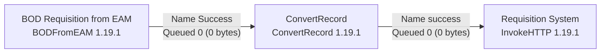

# HxGN EAM Databridge Pro

Hexagon Documentation

Generated 02/28/2026

# Overview

## What is Databridge Pro?

Databridge Pro, Powered by Apache NiFi, is the next generation of EAM Databridge, delivering advanced capabilities for data integration and movement between EAM and external applications.

Utilizing components both inside and outside of the EAM application, Databridge Pro provides the ability to build and manage customized data pipelines; streamline endpoint connections and usage; and simplify troubleshooting by offering insights into the complete EAM message journey.

## Intended audience

Databridge Pro is designed to ensure organizational roles and strengths work in harmony while minimizing mistakes and unexpected outcomes with integrations. It is built with the following user profiles in consideration:

- **Data engineers or Integration specialists**
  - Includes programmers, developers, data flow managers, and system administrators.
  - People who shape the data landscape and design, build, and maintain data pipelines and workflows, integrating data from multiple sources and systems.

- **System administrators or operations**
  - Includes enterprise architects, and network administrators.
  - People who configure infrastructure and system networks, monitor data flows, troubleshoot issues, and ensure smooth operations.

# Components

## Databridge Pro Cloud

Databridge Pro provides a no-code, graphical interface where users can build and configure customized data flows between HxGN EAM and other enterprise applications. Powered by Apache NiFi, it provides secure, real-time handling of data — from the moment it enters, through transformations, and its journey between systems. It is highly adaptable to meet a variety of integration needs and offers an array of processors dedicated to tasks from data transformations to validations, routing, and enrichment.

It provides the ability to securely communicate and move data across a variety of platforms, offering 90+ built-in connectors.

<table>
  <thead>
    <tr>
        <th>Who should use it?</th>
        <th>How should it be used?</th>
        <th>What not to do?</th>
    </tr>
  </thead>
  <tbody>
    <tr>
        <td>Users shaping the data landscape, such as:<br/>&lt;ul&gt;&lt;li&gt;Data Engineers&lt;/li&gt;&lt;li&gt;Data Integration Specialists&lt;/li&gt;&lt;li&gt;Developers/Configurators&lt;/li&gt;&lt;/ul&gt;</td>
        <td>&lt;ul&gt;&lt;li&gt;Transferring data between Hexagon products and other systems&lt;/li&gt;&lt;li&gt;Delivering and routing data&lt;/li&gt;&lt;li&gt;Basic enrich, preparation, extraction, and routing of data&lt;/li&gt;&lt;/ul&gt;</td>
        <td>&lt;ul&gt;&lt;li&gt;Computations&lt;/li&gt;&lt;li&gt;Complex event processing&lt;/li&gt;&lt;li&gt;Rolling windows or aggregate operations&lt;/li&gt;&lt;/ul&gt;</td>
    </tr>
  </tbody>
</table>

## Canvas

Databridge Pro is a standalone tool, accessed outside of the HxGN EAM application. The Canvas is the central component of the Databridge Pro interface where users design, configure, and monitor data flows. It provides visual representation of the flow of data, allowing users to easily interact and manage necessary components.

The canvas is dedicated to a specific tenant, allowing all tenant users to view and collaborate on the same canvas.

See the basic options and actions available within the canvas in the following sections.

The image shows a screenshot of the HxGN Databridge Pro interface, displaying a data flow canvas with various interconnected components such as "InboundMessagesProcessor", "RouteOnAttribute", "Assets", "Parts", and "ETC". The interface includes a navigation pane on the left, a status bar at the top, and a component toolbar.

### Component toolbar

The component toolbar is the primary access point for building data flows. Users can add various components onto the canvas through a drag-and-drop action from this toolbar.

The toolbar contains icons for:
*   Processor
*   Input Port
*   Output Port
*   Remote Process Group
*   Funnel
*   Template
*   Label
*   Connection

### Status bar

Status bar provides live updates on data flow, system health, and processing statistics for monitoring purposes. It displays information related to the canvas such as the amount of data existing, and the state of components.

The status bar includes the following metrics (from left to right):
*   Active Threads: 0 (0 bytes)
*   Total Queued Data: 0
*   In-flight Data: 0
*   Running Components: 0
*   Stopped Components: 27
*   Invalid Components: 5
*   Disabled Components: 0
*   Up-to-date Remote Process Groups: 0
*   Out-of-date Remote Process Groups: 0
*   Unauthorized Remote Process Groups: 0
*   In-sync Remote Process Groups: 0
*   Last Refresh Time: 14:21:10 UTC

### Search

Search box allows users to find specific components, process groups, or connections within the canvas and navigate directly to the selected area via a single click.

The search interface consists of a text input field with a magnifying glass icon.

### Global menu

The Global menu provides different management and configuration options like access to data provenance, flow configuration history, available templates, and user management capabilities.

Summary
Counters
Monitoring
Data Provenance
Parameter Contexts
Certificate / Key Manager
Flow Configuration History
Cloud Connector
Users
Password Policies
Settings
Help
Reference
About

## Navigate palette

The navigate palette provides quick and easy adjustment of the canvas view. Users can pan, zoom, fit, or drag within this palette to get a specific view of the canvas. This palette can be minimized to provide more canvas visibility, if desired.

Navigate
[Image of Navigate palette with icons for pan, zoom, fit, and drag]

(Additionally, a simple click-and-drag of the pointer on the canvas itself will adjust the view.)

## Operate palette

Operate palette provides real-time operation controls of selected components or the canvas. Available options include starting and stopping or enabling and disabling the element whether a specific processor, process group, or other selected component. This palette can be minimized to provide more canvas visibility, if desired.

The image shows a user interface component titled "Operate" for a Process Group named "EAM121EB1719_AX2" with ID "d0cefdc6-0189-1000-0000-00007ebc81a1". It includes various control icons such as settings, search, lightning bolt, tools, play, stop, and a "DELETE" button.

Alix palette

Databridge Pro is integrated with HxGN Alix, the Digital Assets’ AI Assistant. When enabled by the tenant Administrator, the Alix palette is displayed on the tenant canvas for all users.

The Alix palette opens a chat window where users can interact with and ask questions to HxGN Alix. The window can be expanded horizontally, if desired, to provide more visibility to chat content.

The image shows the HxGN Alix chat interface. It features a robot icon and the greeting "Hello! How can I help you?". At the bottom, there is a text input field labeled "Ask your question" with a history icon on the left and a send arrow on the right. A disclaimer at the bottom mentions that AI-generated content should be verified.

Breadcrumbs

At the bottom of the screen, the breadcrumbs display the current depth and viewing level of the canvas. This provides yet another way to navigate within the canvas and between process groups.

The image shows a breadcrumb navigation bar at the bottom of a gridded canvas, displaying the path: EAM121EB1719_AX2 » Work Orders.

# Key concepts

Databridge Pro has several key concepts that form the foundation of its functionality and usability.

## Data flow

A data flow (or flow) represents the arrangement of processors (or other components) and the connections between them. It defines the flow of data from source to destination, including any transformations or routing logic along the path.

It typically starts with a component retrieving data from a source system and ends with one transmitting the data, with varying components in between handling processing, transformation, and transport.

## FlowFile

FlowFile represents a piece of data within Databridge Pro. It encapsulates the data itself, attributes, and metadata. FlowFiles move through the data flow and undergo processing.

## Processor

Processors are the most used component of building data flows. These are responsible for actions like data ingestion, transformation, routing, and interaction with external systems. Processors can be configured and connected to create data processing pipelines.

## EAM Endpoint Processor

EAM Endpoint Processors are akin to standard Processors but are coupled with endpoint connections defined in the DFS Catalog within HxGN EAM. These Endpoint Processors act as gateways for sending or receiving data within integration flows.

Connection definitions for Endpoint Processors are centrally administered within the DFS Catalog, streamlining information management and system-wide distribution throughout Databridge Pro system.

## Connections

Connections are the links between processors or other components. These define the relationships between processors, specifying how data is routed and processed from one processor to another.

## Process Group

Process Groups are organizational containers or folders wherein processors, connections, and other components can be grouped together to streamline manageability. Groups can be created as needed to separate different parts of a larger pipeline, separate departmental business flows, or even to provide separate canvas workspaces for individual users.

# Data provenance

Provenance is a critical feature that tracks and records the history of data FlowFiles as they move through the system. A detailed audit trail provides information about all events that occur on the within a flow, enabling debugging and visibility into data lineage.

## Bulletins

Bulletins are informational messages and notifications that provide insights into status or behavior of a data flow or individual processor. They offer real-time visibility into the health and performance, notify users within the UI about issues or errors that require attention. Each processor's bulletin level can be configured to receive the desired messaging including info, warning, error, and debug.

## Controller Services

Controller Services provide reusable and shared configurations for processors or other components. They are typically used to store sensitive information, such as credentials, and allow for centralized management, enhancing security and configuration consistency.

## Funnel

Funnels act as connection points that gather and consolidate data from various sources, directing it to a single destination. They help reduce visual clutter and simplify connection management.

Funnels are intended to serve as intermediate points and should not be used as endpoints without outgoing connections. Doing so can lead to file accumulation and create a backlog.

## Ports: Input and output

Typically used for complex data pipelines, Input and Output ports are used together to provide local connections within a Databridge Pro tenant. Ports allow users to break down data pipelines into smaller, manageable components, each performing a specific task.

The Input Port is an entry point allowing data to be passed from one flow to another without exiting the system. It acts as a gateway to receive data transfer from another processor or flow within the tenant.

Similarly, the Output Port is an exit point allowing data to be passed from one flow to another without exiting the system. It acts as a transmitter to an Input Port, sending data from one processor or flow to another within the tenant.

## Flow Definition

Reusable representation of a data flow. Provides a way to save and share data flows in a more efficient manner between tenants or process groups, to aid in configuration setup.

# Available connections

Databridge Pro supports a wide range of connections and protocols to facilitate data ingestion and integration.

The primary supported connections include:

## HxGN EAM

Interact with HxGN EAM event-driven message BODs (Business Object Documents) from Databridge queues.

- **BODs.** Utilize HxGN EAM’s native event-driven message BODs (Business Object Documents) for outbound and inbound events. Two built-in processors are available for BODs: BODFromEAM_V2 and BODToEAM. See the HxGN EAM Integrating with Dataflow Studio technical brief.
- **RESTful API (SOAP).** Connect to EAM’s available RESTful APIs (or SOAP services) via an HTTPS connection to retrieve data. Add custom parameter properties to support specific header details for EAM connections.

## HTTPS

Make HTTPS requests to external web services, RESTful APIs, or websites using various HTTP Methods (Get, Post, Put, Delete, etc.) to send or retrieve data.

- **RESTful API.** Connect to any RESTful (or SOAP) services exposed by an application. Note: Custom header parameters can be added, as needed, to support communications.

## Amazon Web Services

Interact with various Amazon Web Service systems.

- **S3.** Interact with AWS S3 (Simple Storage Service) buckets to retrieve, write, put, or tag files within an S3 bucket.
- **Kinesis Stream.** Define a connection to Amazon Kinesis Data Streams to send or read data for real-time analytics.

## Microsoft Azure

Interact with Microsoft Azure systems to manage large data sets.

- **Data Lake.** Define a connection to retrieve and send data to Azure Data Lake Store.
- **Blob Storage.** Define a connection to Azure Blob Storage containers, a scalable object storage service, to retrieve and send data.

- **Event Hub.** Receive or send messages with Azure Event Hub for event ingestion and stream processing.

## File storage

Interact with other file storage systems to read, write, manipulate, and manage files.

- **FTP/SFTP.** Transfer files to and from remote servers using File Transfer Protocol (FTP) and Secure File Protocol Transfer (SFTP).
- **Box.** Connect to Box cloud content to interact with specified files and folders.
- **Snowflake.** Push data into Snowflake using Snowpipes or Database Record Processors.
- **Mongo.** Insert, update, and delete documents, or run an aggregation query on MongoDB based on specific criteria.
- **Databases.** Connect to various databases to query or interact with files, including DynamoDB, MS SQL Server, Postgres SQL, and Oracle DB 12 & 23.

## Others

- **Apache Kafka.** Consume or publish messages through Apache Kafka to facilitate data streaming.
- **MQTT.** Connect to MQTT (Message Queuing Telemetry Transport) brokers to publish data or subscribe to specific topics for IoT and messaging use cases.
- **Elasticsearch.** Perform various operations such as indexing, querying, and other management tasks on Elasticsearch indices or clusters.
- **Salesforce.** Retrieve and create data record objects through a Salesforce CRM connection.
- **Workday.** Read and pull data from configurable reports within Workday.

## Available processors

Databridge Pro provides a selection of Processors with a variety of functions to meet different requirements for routing, transformation, splitting, and distribution across systems.

The following section highlights some of the main categories available and processors commonly used.

### Data transformation

Change or alter the content of a FlowFile to something different than the original input.

- **ReplaceText:** Use Regular Expressions to modify textual content.

- EncodeContent: Encode or decode the content of a Flowfile (Base64, Base32, hex schemes, etc.)
- JoltTransformJSON: apply a JOLT specification to transform JSON content.

## Routing and mediation

Control the rate at which data is transferred, as well as route FlowFiles to different processors or data flows according to attributes or content.

- RouteOnAttribute: Route a FlowFile based on the attributes that it contains.
- RouteOnContent: Search Content of a FlowFile to see if it matches any user-defined Regular Expression; routing to the configured Relationship.
- ControlRate: Throttle the rate at which data can flow through one part of the flow.

## Attribute extraction

Extract, analyze, or change attributes of a FlowFile.

- EvaluateJsonPath: User supplies JSONPath Expressions, used to evaluate against the JSON Content to either replace the FlowFile Content or extract the value into the user-named Attribute.
- ExtractText: User supplies one or more Regular Expressions that are evaluated against the textual content of the FlowFile, and the values that are extracted are then added as user-named Attributes.
- UpdateAttribute: Adds or updates any number of user-defined Attributes to a FlowFile. It also provides an "Advanced User Interface," allowing users to update Attributes conditionally, based on user-supplied rules.

## Splitting and aggregation

Split or merge the content of a FlowFile.

- SplitText: Take a single FlowFile whose contents are textual and split it into 1 or more FlowFiles based on the configured number of lines.
- SplitJson: Split a JSON object that is comprised of an array or many child objects into a FlowFile per JSON element.
- MergeContent: Merge many FlowFiles into a single FlowFile based on a user-defined strategy.

## Sending notification

Send notification outside of the system. Typically used as part of an error handling route within a flow.

- PutEmail: Sends an E-mail to the configured recipients, using the configured, public SMTP server. The content of the FlowFile is optionally sent as an attachment.
- PublishSlack: Posts a message to a specified Slack channel.

## Scripting

Use scripts to interact with a FlowFile.

- GroovyExecutionService: Execute a custom Groovy script to read, write, or otherwise interact with a FlowFile.

## Endpoint Catalog

Centralized registry to create and manage application connections for data integrations, such as REST APIs or sFTP file storage. These connections are available within Databridge Pro, to utilize in customized data flows, allowing secure communication and integration between systems. See the HxGN EAM Integrating with Dataflow Studio technical brief for more information.

- Inside EAM application, through the HxGN-DFS Databridge Partner
- User Profiles: System Administrators, Operations

## Application connections

The Endpoint Catalog supports eight endpoint connection types, capturing the information required by Databridge Pro for connecting to the designated applications.

Each endpoint type corresponds to a built-in Processor within Databridge Pro, based on the information entered.

Endpoint types supported:

- BOD. Track BOD connection usage through Endpoint Catalog. (Subscription and other Databridge setup still required.)
- AWS Kinesis. Defines a stream connection to Amazon Kinesis Data Streams to send or consume data for real-time analytics.
- Azure DataLake Storage. Defines a connection to Azure DataLake Storage to retrieve and send data.
- Azure Blob Storage. Defines a connection to Azure Blob Storage containers to retrieve and send data.

- HTTP-AWS Signature. Defines a connection to an AWS Gateway API endpoint.
- HTTP-General. Defines a connection to call REST (or SOAP) services exposed by applications, through API Gateway.
> NOTE Header parameters must be defined in Databridge Pro.
- S3. Defines a connection to an AWS S3 bucket to create or process files.
- SFTP. Defines a connection to an external SFTP server to securely transfer files.

## 360 Transaction view

Provides insights on what happened to a Databridge document message, outside of the EAM system. This view integrates data events from Databridge Pro into a comprehensible flow, extending visibility and accessibility not available before. See the HxGN EAM Integrating with Dataflow Studio technical brief for more information.

- Inside EAM application, extending Databridge Message Status view
- User Profiles: System Administrators, Operations

> NOTE 360 View will also be available within Databridge Pro for Data Engineers/Integration Specialists.

## Cloud Connector (DCC)

The Databridge Pro Cloud Connector provides connectivity between cloud and on-premises systems. It's a lightweight version of Databridge Pro Cloud, built for edge systems where access may be limited or restricted.

For more information on the Cloud Connector component of Databridge Pro, see the Databridge Pro Cloud Connector Help.

# Configuration tasks

> ★ IMPORTANT The topics in this section assume base EAM has been set up and configured.

## Configuring EAM

This section describes the configuration and implementation from the EAM application side for the integration of EAM with Databridge Pro.

See the HxGN EAM Integrating with Dataflow Studio technical brief for more information about the EAM application side of the integration.

## Databridge partner

- Activating HXGN-DFS partner

See the HxGN EAM Integrating with Dataflow Studio technical brief for more information about activating the HxGN-DFS partner.

- Employing BOD subscriptions

Subscription enablement and configuration is only required if using BOD messages as part of integrations.

## Install parameter

- Setting DFSCID install parameter

See the HxGN EAM Integrating with Dataflow Studio technical brief for more information about setting the install parameter.

## Configuring Databridge Pro

This section contains procedures for configuring the Databridge Pro application. It is intended to be used by administrators, implementation consultants, or support personnel.

### Managing Databridge Pro users

Databridge Pro uses Standard Authentication and Log On. All users requiring access must be added to the Databridge Pro system.

User management functionality is only available to administrator users.

### Adding standard users

Users are created through the Databridge Pro menu option.

1. Select the **Users** option from the Global Menu.
2. In the **Users** window, click the + (Add) icon.
3. In the Add User window,
   a. Select the user's Role:
      i. ADMIN: Access to administrative functions such as user management, certificate management, password policy configuration, etc. in Databridge Pro.
      ii. BASIC: Access to data flow related operations in Databridge Pro.
   b. Specify the user's email address.
4. Click Add.

System confirmation will display successful addition of the user and the new account should display in the User list.

An email will be sent to the email address entered, providing an access link to the tenant canvas. Upon accessing the link, the user is prompted to set their password, prior to logging in.

> **NOTES** Email must be unique for each user record. For standard users, the user's email address will also serve as their username.

A valid email address is required to successfully deliver the New User access communication. Invalid emails or errors in entry may result in failed delivery, and block users from access.

## Adding service account users

Service Account is a restricted user which can be utilized for accessing the Inbound Messages API. This user will not have access to the canvas.

1. Select the **Users** option from the Global Menu.
2. In the **Users** window, click the + (Add) icon.
3. In the Add User window,
   a. Select **SERVICE ACCOUNT** role.
   b. Specify the email address to be used with the record.
4. Click Add.

System confirmation will display successful addition of the user, including the generated username for the record. An email will be sent to the email address entered, providing a link to set the password for the Service Account user.

Both the username generated, and the password set, must be used to access the Inbound Messages API.

> NOTE A maximum of 3 Service Account users can be created within a tenant.

## Modifying users

User records can be modified.

1. Select the **Users** option from the Global Menu.
2. For the user to be modified, click the pencil (**Edit**) icon.
3. Make necessary edits:
   - a. For standard users, only Role can be modified.
   - b. For Service Account and predefined Admin user, only email can be modified.
4. Click **Update**.

System confirmation will display successful update for the user record.

> NOTE If the email address is incorrect for a standard user, remove the incorrect record and add a new one with the appropriate changes. Email address cannot be updated or modified for standard user records.

## Deleting users

A user account can be entirely removed from a tenant.

1. Select the **Users** option from the Global Menu.
2. In the user list, select the user account to be removed.
   - a. User can be found by scrolling through the list or via the filter/search option.
3. Select the user account row and click the **Remove** (Trash) icon.

> NOTE The deleted user account will no longer appear in the list of users. The predefined administrator user record cannot be deleted.

# Defining password policies

Databridge Pro uses Standard Authentication, requiring a username and password to access the system. Password requirement policies can be configured by tenant to further protect access to the Databridge Pro module.

Password requirement functionality is only available to administrator users.

## Configuring password requirements

Password requirements can be configured for all users created within the tenant.

1. Select the **Password Policies** option from the Global Menu.

2. In the **Password Configuration** screen, adjust the values for each requirement, as desired.

    a. **Minimum Password Length**: Indicates the minimum number of characters allowed for a user password.

    b. **Minimum Number of Non-Alphanumeric Characters**: Indicates the minimum number of non-alphanumeric characters required for a user password. (Allowed characters: !\"#$%&'()*+,-./:;<=>?@[]^_`{|}~)

    c. **Minimum Number of Lower-Case Characters**: Indicates the minimum number of lower-case characters required for a user password.

    d. **Minimum Number of Upper-Case Characters**: Indicates the minimum number of upper-case characters required for a user password.

    e. **Minimum Number of Numerical Characters**: Indicates the minimum number of numeric characters required for a password.

    f. **Password Duration Days**: Indicates the number of days a password can be used before the user must reset their password.

    > NOTE Duration Days does not apply to Service Account user records.

3. Click **Save**.

The configured password requirements will apply to any new users added to the tenant, or users which have not yet set their password.

> NOTE Password For any existing users, the configured requirements will only take effect when they reset their passwords—either due to a previous expiry or if they manually select to update their passwords.

# Managing certificates and keys

Databridge Pro provides a storage vault for certificate and key-based authentications. The vault currently supports Sockets Layer (SSL) Keystore and Truststore certificates and public/private SFTP keys for use within the system.

SSL certificates and SFTP keys are used for secure communication between Databridge Pro and external systems.

They authenticate the identity of communicating parties to ensure they are who they claim to be. Certificate / Key Manager functionality is only available to administrator users.

## Adding a certificate/key

SSL Certificates and SFTP keys can be added to the system for reference by components within Databridge Pro.

Only Administrator role can add certificates and keys to the system.

1. Select the **Certificate / Key Manager** option from the Global Menu.
2. In the **Certificate / Key Manager** window, click the **Add (+)** icon.
3. In the **Add Certificate** window, complete the required fields:
   - a. **File Name**: Name of the certificate file to be added.
   - b. **Type**: Select the certificate type being added, ‘Private SSL Keystore’ or ‘Private SSL Truststore’, SFTP Private Key Path, or SFTP Host Public Key.
   - c. **Upload File**: Select the file to be uploaded from your local machine.
   - d. **Password**: Password for the attached file, if required. (System will automatically use this password in the component.)
   - e. **Component** and **Property** fields are automatically populated by the system, based on the Type selected from the list.
     - i. **Component**: References the component in which the certificate will be available for use.
     - ii. **Property**: References the property field of the component in which the certificate can be referenced.
4. Click **Add**.

> **NOTE** All files will be validated prior to being stored in the system to ensure they are an accepted format. Certificates formats accepted: BCFKS, PKCS12, or JKS. Key formats

accepted: Files that do not conform to these formats will not be accepted and cannot be added to the system.

## Referencing a certificate/key

### Adding a certificate/key reference

Once a certificate or key is added within the Certificate / Key Manager screen, it can be referenced within the corresponding component for use by data flows.

> **NOTE** Currently, SSL Certificate files can only be referenced within the HxGNPrivateSSLContextService controller service.

Any user can add a certificate or key reference, however coordination will be required with an Administrator user.

To reference a certificate or key:

1. Navigate to the corresponding component.
2. In the appropriate property field, enter the filename used in the Certificate/Key Manager screen. The filename entered must match exactly.
    - a. Keystore Filename for keystore certificates.
    - b. Truststore Filename for truststore certificates.
    - c. Private Key Path for SFTP private keys.
    - d. Host Key File for SFTP host public keys.
3. Once the configuration is applied, the system will validate if the file name entered in the properties tab exists within the system. If the file does not exist, a validation error is displayed indicating the file cannot be found.

## Removing a certificate/key reference

Certificate and key references can be removed from components, as needed, by any user in Databridge Pro. However, removal should be performed with caution to ensure no unintended disruptions or issues occur as removing a certificate will prevent the service from functioning as expected.

To remove a certificate or key reference:

1. Navigate to the corresponding component from which the certificate or key should be removed.
2. In the **Properties** tab, remove the file name from the appropriate property.

3. Click Apply.

# Deleting a certificate/key

Certificate and key records which are not in-use or referenced by any component within Databridge Pro can be deleted from the system, if desired. If a file is in-use, the system will prevent its deletion regardless of the component's status.

To delete a certificate or record:

1. Select the **Certificate / Key Manager** option from the Global Menu.
2. In the **Certificate / Key Manager** window, locate the file to be deleted and click the **Delete** icon.
3. Click **Delete** to remove the file from the system.

Be aware that once a file is deleted, it cannot be recovered from within the system. If deletion was accidental, the file can be re-uploaded and re-linked to the appropriate component(s).

# Accessing a certificate or key

If the delete action is not allowed, the file must be removed from all referencing components before it can be deleted. Referencing component(s) can be viewed and subsequently remove the file reference, by following these steps:

1. Select the **Certificate / Key Manager** option from the Global Menu.
2. In the **Certificate / Key Manager** window, click the **Info (View Details)** icon.
3. Select a component from the **Referencing Components** list.
4. In the component properties, remove or clear the certificate file.

Repeat these steps for all remaining Referencing Components listed for the certificate record. Once component is referencing the file, it can be deleted.

Viewing the list of Referencing Components from within the Certificate / Key Manager screen is restricted to Administrator role only. However, any user can navigate directly to the component from within canvas to remove the certificate reference, if it is known.

# Replacing a certificate or key

SSL certificates and SFTP keys have a limited lifespans, after which they need to be renewed to maintain secure connections. Scenarios such as expiration, security updates, or compliance related changes may prompt the need to update a file in Databridge Pro.

Due to security measures, certificate and key files cannot be directly modified within the system. Any changes to a file must be made externally before making an update in Databridge Pro.

In lieu of replacement, it is recommended instead to add a new file record, as this will reduce the possibility of flow disruption or user error.

However, Databridge Pro does accommodate replacing a certificate/key file for existing records, if desired.

Replacement should be used and approached with caution, as it could cause disruption in data flows.

To replace a file for an existing certificate record, the Administrator user should follow these steps:

1. Disable all components referencing the certificate record to be updated.
    a. Referencing components can be found by viewing the certificate record details. See the Viewing certificate/key details section.
2. In the Certificate / Key Manager screen, copy (or notate) the exact File Name for the record which needs the file replaced.
3. Click the Add (+) icon in the right-hand corner.
4. In the Add Certificate window, complete the required fields:
    a. **File Name**: Paste (or enter) the File Name for the existing record to be updated.
    b. **Type**: Select the certificate type being added.
    c. **Upload File**: Select the updated file to be uploaded from your local machine.
    d. **Password**: Enter the password for the attached file, if required. (System will automatically use this password in the component.)
5. The system will verify that all referencing components were disabled, prior to allowing the replacement.
    a. If not disabled, an error will display instructing the user to disable all referencing components.
    b. If already disabled, a warning will display requesting the user's acknowledgement to replace the existing file.
6. Once complete, re-enable all referencing components which were previously disabled in step 1.

# Viewing certificate/key details

Basic details for the certificate and key files are available for viewing, if desired. For security purposes, the file's content is not available for viewing.

1. Select the **Certificate / Key Manager** option from the Global Menu.
2. In the **Certificate / Key Manager** window, click the Info (View Details) icon.

The system will display basic information for the certificate file, including:

- Name: Name of the file.
- Uploaded Date: Date the file was uploaded to the system.
- Connection Type: Type of the connection.
- Certificate Format: Format of the certificate.
- Certificate Expiration: Date of expiration from the certificate.

Additionally, a list of Referencing Components is displayed, if available. This list includes any processors and/or controller services that currently reference the file.

# Managing API Client Authorization

Databridge Pro APIs utilize OAuth 2.0 protocol for authentication and authorization, alongside basic authentication managed through Service Account users.

The API Client Auth screen, found under the Settings option, is used to define and manage OAuth 2.0 client credentials for the tenant. This screen also provides a list view of all API Client records created within the tenant.

The API Client Auth screen and functionality is only available to administrator users.

# Adding an API Client record

An API Client record must be created in the system to obtain OAuth 2.0 client credentials for Databridge Pro APIs. Credentials generated are specific to the selected API Service.

To add an API Client record for OAuth 2.0 credentials:

1. Select Settings option from the Global Menu.
2. Click the API Client Auth tab.
3. Complete the Add API Client Auth form:

a. **Service Type**: Inbound Message API is automatically selected. Indicates the API Service for which the credentials and access will be generated.

b. **Grant Type**: Client Credentials is automatically selected.

c. **Client Name**: Enter a name for the API client record.

    i. It is recommended to use a descriptive name, such as the system or application using the service.

d. **Client Description**: (Optional) Enter a description for the API client record.

e. **Active (box)**: Automatically checked to make the new record active.

4. Click Add.

5. In the confirmation dialogue, click **Download** to download the client credentials file.

Once added, the new API Client record will appear in the list view.

> NOTE A maximum of 5 API Client records are allowed per tenant.

## Editing API Client record

An API Client record can be modified within the system, if desired. The only modifications available are: client name, client description, and active box.

To edit an API Client record:

1. Select Edit (pencil icon) for the appropriate API Client record.

2. Complete the desired updates in the form:

    a. **Client Name**: Modify the name for the client record. It is recommended to use a descriptive name, such as the system or application using the service.

    b. **Client Description**: (Optional) Modify the description for the client record.

    c. **Active box**: (Optional) Uncheck/check to change the record status.

        i. Checked = Active

        ii. Unchecked = Inactive

3. Click Edit to save.

> NOTE If a record is made inactive, the associated OAuth 2.0 client credentials will be disabled and unavailable for use with the Databridge Pro API.

# Obtaining credentials for API Client record

When an API Client record is first created, the OAuth 2.0 credentials are automatically provided through a download option. If the credentials need to be obtained or accessed again, the **Show Credentials** option is available to download the associated file for the API Client record.

To obtain OAuth 2.0 credentials:

1. Select **Show Credentials** (agent icon) for the appropriate API Client record.
2. In the dialogue window, click **Download** button.
3. The OAuth 2.0 client credentials will be downloaded to the local machine.

> **NOTE** Client Credentials should be kept secure and never shared publicly.

## API Credentials File

The OAuth 2.0 credentials file provide the following information for the API Client record:

- Client id
- Client secret
- Scope
- Authorization URL to generate the token.

See the HxGN EAM Databridge Pro Technical Reference for details on how to use OAuth2.0 credentials to connect to Databridge Pro APIs.

> **NOTE** Client Credentials should be kept secure and never shared publicly.

## HxGN Alix

Databridge Pro is integrated with HxGN Alix, the Digital Assets' AI Assistant. HxGN Alix is designed for natural language processing tasks and has specialized knowledge about Hexagon products as well as industry and coding standards.

Administrator users can configure their Databridge Pro tenant to access and interact with Alix, if desired.

## Enabling access to Alix

Enable access to Alix in Databridge Pro..

1. Select **Settings** from the Global menu.
2. In the HxGN Alix tab, select **Enabled** from the drop-down.

3. Click **Save**.

4. Review and Acknowledge the Disclaimer prompt and Terms.

5. Click **Ok** and close the Settings screen.

Once acknowledged, the Alix palette is added to the canvas alongside the navigate and operate palettes. The Alix palette will appear for all users within the tenant.

## Disabling access to Alix

Disable access to Alix in Databridge Pro.

1. Select **Settings** from the Global menu.

2. In the HxGN Alix tab, select **Disabled** from the drop-down.

3. Click **Save** and close the screen.

> **NOTE** Disabling chat removes the Alix window from the canvas for all users.

## Using Alix

To open an Alix chat session, click the + icon from the Alix palette. When clicked, the Alix palette expands vertically, minimizing the navigation and operate palettes.

Alix palette will remain visible and open while working within Databridge Pro, unless minimized by the user. The Alix session will remain active until the user is logged out of Databridge Pro.

See HxGN Alix Help for guidance on prompt entry and best practices when interacting with Alix.

> **NOTE** Session history and interactions with Alix are not stored within the Databridge Pro system. Chat context is only used for processing requests or inquiries entered by the user within the current session.

# EAM user tasks

## Configuring endpoint catalog records

Create a centralized endpoint catalog in EAM to configure and manage integration network connections; establishing communication "connections" between EAM, Databridge Pro, and third-party delivery applications or endpoints.

Define the endpoint connections and corresponding authorization protocols to enable Databridge Pro to communicate with external systems. Databridge Pro uses these endpoints as final destinations to route transformed information between systems. The EAM Endpoint Catalog icon in Databridge Pro provides access to the tenant catalog defined inside the EAM application.

1. Click **Administration > Databridge > Databridge Partners**.

2. Select the HXGN-DFS partner record to configure DFS catalog endpoints, and then click the **DFS Catalog** tab.

3. Click **Add Catalog Record**.

4. In the **Catalog** section, specify this information:
    a. **Description** - Enter a description of the endpoint.
    b. Optionally, click the **Active** check box to make the endpoint record available in Databridge Pro.
    > **IMPORTANT** If the **Active** check box is cleared at any time, it does not affect the previous or current connections in Databridge Pro.

5. In the **Endpoint Definition** section, specify this information:
    > **NOTE** See the HxGN EAM Integrating with Dataflow Studio technical brief for more information on the selection of Type, Method, Processor Type, the system assigned Endpoint Databridge Pro Processor, and the relevant Endpoint Properties.
    a. **Type** - Select the type of endpoint connection. Some options include `AWS Kinesis`, `Azure Blob Storage`, `Azure DataLake Storage`, `HTTPS - AWS Signature`, `HTTPS - General`, `S3`, `SFTP`, and `Smb File`.
    > **NOTE** Type is defined by the Setup Type of Type and the Databridge Pro Endpoint Type (DFTP) entity.
    b. **Method** - Select the endpoint method. Some options include: `Consume`, `Delete`, `Fetch`, `Get`, `List`, `Move`, `Put`, and `HTTP Method`.

c. **Processor Type** - Select the specific processor type.

6. In the **Endpoint Properties** section, specify this information:

> **NOTE** The fields in this section are optional and yet important for mapping purposes when configuring connection points.

* Amazon Kinesis Stream Name
* Application Name
* Region
* Access Key ID
* Secret Access Key
* Container Name
* Blob Name
* Blob Name Prefix
* HTTP Method
* HTTP URL
* Amazon Region
* Amazon Gateway Api ResourceName
* Amazon Gateway Api Endpoint
* Request Username
* Request Password
* Filesystem Name
* Directory Name
* File Name
* Filesystem Object Type
* Source Filesystem
* Destination Directory
* Bucket
* Object Key
* Hostname
* Password
* Remote File
* Remote Path
* File Filter Regex
* Input Directory
* Share

- Directory
- Domain

7. Click Submit.

a. Optionally, select one of these options:

i. **Reset** - Click the **Reset** button to check the record's utilization in Databridge Pro.

ii. **UUID References** - A UUID reference signifies the record's inclusion in Databridge Pro and potential usage. Each instance of the catalog record will produce its own unique UUID reference.

> **NOTE** UUID References are generated only after adding the Catalog record in Databridge Pro. If the record remains unadded and unused, no UUIDs will be displayed.

## Viewing UUID reference details for endpoint catalog records

Access the **UUID References** pop-up window to view the unique identifiers assigned by Databridge Pro.

1. Click **Administration > Databridge > Databridge Partners**.
2. Select the HXGN-DFS partner record, and then click the **DFS Catalog** tab.
3. Select an endpoint catalog record.
4. Click the **Actions** drop-down, and then click **UUID References**.
5. View the information.

> **NOTES** UUIDs are generated and assigned to Endpoint Catalog records by Databridge Pro each time an endpoint (processor) record is referenced in a defined data flow. If an endpoint catalog record is referenced twice in a single Databridge Pro process flow, the endpoint catalog record is assigned two UUID reference values.

## Viewing Databridge Pro events for Databridge messages

1. Select **Administration > Databridge > Databridge Message Status**.
2. Select the message record, and then click the **Dataflow Events** tab.

> **NOTE** The primary message status record must be associated with the HXGN-DFS partner to view the information on this tab.

3. View the information captured for events generated from Databridge Pro.

# Databridge Pro user tasks

This section contains procedures for basic operations and best practices for building, managing, and monitoring flows, as well as viewing events, and using flow definitions within the application. This guide is intended for the Databridge Pro user.

## Managing passwords

### Setting a user password

Upon adding a new user record to a Databridge Pro tenant, a ‘New User’ email is sent to the specified email address. This email contains a password setup feature, enabling users to establish their password for system access.

1. In the ‘New User’ email, select the **Set Password** link to open a webpage.
2. In the **Update Password** screen, enter the desired password and repeat the password, as prompted.
    a. Password policies for the tenant are available for review.
3. Click **Continue**.
    a. If the password entered does not meet the tenant requirements, an error is displayed.
4. Upon success, close the window and re-access the tenant URL to log into the system with the username and password.

> **NOTE** Passwords cannot be set from within the Databridge Pro User Management screen. Users will be bound to the password policies for the specific tenant in which they are setting the password.

### Resetting a user password

Users can reset or change their password from the **Log In** screen.

1. On the **Log In** screen, select the **Forgot password** hyperlink.
2. Enter the username, and then click **Continue**. An email is sent to the user’s email address with a link to reset password.
3. Open the email with the reset link, and then select the **Update Password** link to open a web page.
4. On the **Update Password** screen, enter a new password and repeat the password as prompted.

5. Close the window and re-access the tenant URL to log in to the system with the new password.

> **NOTE** Passwords cannot be reset from within the Databridge Pro User Management screen. Users will be bound to the password policies for the specific tenant in which they are setting or updating their password.

# Building data flows

This section summarizes the general process and options available for building data flows in Databridge Pro. It does not intend to be an in-depth or full coverage guide detailing all aspects involved in building flows, as each flow will be unique to a specific business use case.

> **IMPORTANT Prerequisites:** Create endpoint connection records within the Endpoint DFS Catalog. Additionally, if using Databridge Events and Messages, enable all necessary outbound events and subscriptions within the HxGN-DFS partner.

See the Databridge Pro Technical Reference for information on how to optimize data flows.

## Building a flow

Typically, a data flow starts with a component retrieving data from a source system and ends with one transmitting the data, with varying components in between handling additional processing, transformation, or transport.

For example, the flow pictured below begins by retrieving a BOD message from HXGN EAM Databridge outbox. Next, details are extracted from the BOD XML using a built-in XQuery process, and the modified data is sent to an external application, such as SAP.



<table>
  <thead>
    <tr>
        <th></th>
        <th>BOD Requisition from EAM<br/>BODFromEAM 1.19.1</th>
        <th colspan="2"></th>
        <th>ConvertRecord<br/>ConvertRecord 1.19.1</th>
        <th colspan="2"></th>
        <th>Requisition System<br/>InvokeHTTP 1.19.1</th>
        <th></th>
    </tr>
  </thead>
  <tbody>
    <tr>
        <td>In</td>
        <td>0 (0 bytes)</td>
        <td colspan="2"></td>
        <td>0 (0 bytes)</td>
        <td colspan="2"></td>
        <td>0 (0 bytes)</td>
        <td>5 min</td>
    </tr>
    <tr>
        <td>Read/Write</td>
        <td>0 bytes / 0 bytes</td>
        <td colspan="2"></td>
        <td>0 bytes / 0 bytes</td>
        <td colspan="2"></td>
        <td>0 bytes / 0 bytes</td>
        <td>5 min</td>
    </tr>
    <tr>
        <td>Out</td>
        <td>0 (0 bytes)</td>
        <td>5 min</td>
        <td>Out</td>
        <td>0 (0 bytes)</td>
        <td>5 min</td>
        <td>Out</td>
        <td>0 (0 bytes)</td>
        <td>5 min</td>
    </tr>
    <tr>
        <td>Tasks/Time</td>
        <td>0 / 00:00:00.000</td>
        <td>5 min</td>
        <td>Tasks/Time</td>
        <td>0 / 00:00:00.000</td>
        <td>5 min</td>
        <td>Tasks/Time</td>
        <td>0 / 00:00:00.000</td>
        <td>5 min</td>
    </tr>
  </tbody>
</table>

Flows can vary in complexity, depending on the integration requirements and the number of processors or components involved.

A simple flow typically involves a straightforward data ingestion or transformation process with a few processors connected to perform basic tasks, like the sample pictured above. While complex flows will involve more intricate processing, consisting of multiple processors, connections, and branches to provide advanced enrichment, routing, or other orchestrations.

```mermaid
graph TD
    A["Get Greenville Weather via API<br/>InvokeHTTP 1.19.1"] -->|Name: Response<br/>Queued: 0 (0 bytes)| B["Extract 'Temp' from JSON<br/>EvaluateJsonPath 1.19.1"]
    A -->|Name: Response<br/>Queued: 2 (1.78 KB)| C["Extract 'Humidity' from JSON<br/>EvaluateJsonPath 1.19.1"]
    A -->|Name: Failure, Retry<br/>Queued: 0 (0 bytes)| D["LogMessage<br/>LogMessage 1.19.1"]
    B -->|Name: matched<br/>Queued: 0 (0 bytes)| E["MergeContent<br/>MergeContent 1.19.1"]
    B -->|Name: failure<br/>Queued: 0 (0 bytes)| E
    C -->|Name: matched<br/>Queued: 0 (0 bytes)| E
    C -->|Name: failure<br/>Queued: 0 (0 bytes)| E
    E -->|Name: merged<br/>Queued: 2 (10 bytes)| F["LogMessage<br/>LogMessage 1.19.1"]
    E -->|Name: failure<br/>Queued: 0 (0 bytes)| F
```

Building an effective data flow, whether simple or complex, involves planning to ensure the business requirements and desired data processing are understood to build an effective flow.

These are the basic steps to building a flow:

1. Adding processors/components
2. Configuring processors/components
3. Connecting processors/components

## Adding processors

Processors (and other components) are added to the canvas through a simple drag-and-drop action.

Databridge Pro supports two Processor types from the component toolbar:

* Endpoint Processor — direct link to the Endpoint records created in the EAM DFS Catalog.
* Standard Processor — built-in processors for BOD connection, data transformation, routing, and other actions.

To begin building flows, simply drag-and-drop a component icon from the toolbar onto the canvas. Processors and Endpoint Processors are the primary components used for building data flows.

After drag-and-drop, a dialog window will display the available processors for selection by the user. Double-click or select and click Add to put the processor on the canvas.

# Add Processor

Source
all groups

Displaying 100 of 100
Filter

<table>
    <tr>
        <th>Type</th>
        <th>Version</th>
        <th>Tags</th>
    </tr>
    <tr>
        <td>AttributeRollingWindow</td>
        <td>1.19.1</td>
        <td>rolling, data science, Attribute ...</td>
    </tr>
    <tr>
        <td>AttributesToCSV</td>
        <td>1.19.1</td>
        <td>flowfile, csv, attributes</td>
    </tr>
    <tr>
        <td>AttributesToJSON</td>
        <td>1.19.1</td>
        <td>flowfile, json, attributes</td>
    </tr>
    <tr>
        <td>BODFromEAM</td>
        <td>1.19.1</td>
        <td>hexagon</td>
    </tr>
    <tr>
        <td>BODToEAM</td>
        <td>1.19.1</td>
        <td>hexagon</td>
    </tr>
    <tr>
        <td>Base64EncodeContent</td>
        <td>1.19.1</td>
        <td>encode, base64</td>
    </tr>
    <tr>
        <td>CalculateRecordStats</td>
        <td>1.19.1</td>
        <td>stats, record, metrics</td>
    </tr>
    <tr>
        <td>ConsumeJMS</td>
        <td>1.19.1</td>
        <td>jms, receive, get, consume, me...</td>
    </tr>
    <tr>
        <td>ConsumeKinesisStream</td>
        <td>1.19.1</td>
        <td>amazon, stream, consume, aw...</td>
    </tr>
    <tr>
        <td>ControlRate</td>
        <td>1.19.1</td>
        <td>throttle, rate, rate control, throu...</td>
    </tr>
    <tr>
        <td>ConvertCharacterSet</td>
        <td>1.19.1</td>
        <td>characterst, character set, tex...</td>
    </tr>
    <tr>
        <td>ConvertJSONToSQL</td>
        <td>1.19.1</td>
        <td>database, rdbms, flat, icon, ine</td>
    </tr>
</table>adlsgen2 amazon
archive attributes
aws azure cloud
content hexagon
csvdatalake filter
find json logs
microsoft put
record regex
regular expression
schema search
storage text
transform

## AttributeRollingWindow 1.19.1

Track a Rolling Window based on evaluating an Expression Language expression on each FlowFile and add that value to the processor's state. Each FlowFile will be emitted with the count of FlowFiles and total aggregate value of values processed in the current time window.

CANCEL ADD

# Add EAM Endpoint Processor

Displaying 3 records

<table>
    <tr>
        <th>Type</th>
        <th>Description</th>
    </tr>
    <tr>
        <td>InvokeHTTP</td>
        <td>Get EAM Requisitions</td>
    </tr>
    <tr>
        <td>InvokeHTTP</td>
        <td>Post EAM Requisition</td>
    </tr>
    <tr>
        <td>PutSFTP</td>
        <td>sFTP Outbound</td>
    </tr>
</table>> CANCEL ADD

## Adding endpoint processors

Add an Endpoint Processor from the DFS Catalog records.

1. Drag and drop the EAM Endpoints Processor icon to the canvas.
2. In the “Add EAM Processor” window, select the desired connection.

> NOTE Only the connections marked “Active” within DFS Catalog are displayed.

   a. The Processor Type and Endpoint Description are displayed for selection.

   b. If desired, the list can be filtered by description keyword.

3. Click “Add” (or double-click the row) to put the selected Endpoint Processor onto the canvas.

Once added to the canvas:

- The properties defined in the DFS Catalog record are automatically populated and configured within the processor’s properties tab.

- These pre-defined properties cannot be changed or edited within the Databridge Pro canvas. Any updates or changes to these properties must be made to the DFS Catalog record, in EAM.
- The corresponding Processor UUID is sent to EAM and stored with the corresponding DFS Catalog record.

## Adding standard processors

Add standard processors to the canvas, for EAM BOD connection or data transformations.

1. Drag the Processor icon to the canvas.
2. In the “Add Processor” window, select the desired processor.
   a. If desired, the list can be filtered by keyword entry, or by selecting a tag(s) from the Tag Cloud on the left-hand side.(Note: if multiple Tags are selected, only the Processors which contain all Tags will be displayed.)
3. Click “Add” (or double-click the row) to put the selected Processor onto the canvas.

Use the drag-and-drop action, following system prompts, to add other component to the canvas.

## Processor configuration

Processors can be configured to tailor behavior to match specific data processing needs. Each processor will have varying configuration options based on its purpose and capabilities. However, every configuration window will display four tabs: **Settings**, **Scheduling**, **Properties**, **Relationships**; and the Comments.

See below for the common configurations available within each tab.

### Settings tab

- **Name**: Processor name can be customized to align with business or organizational terminology, allowing users to define meaning and context within a data flow. By default, the processor name (unless an Endpoint Processor) is the same as the processor type.
- **Enable**: This flag determines whether a processor is enabled or disabled within a flow. If a processor is disabled, it cannot be started and will be excluded from a flow, if the flow has been started.
- **Penalty Duration**: If a processor encounters a problem where a FlowFile cannot be processed at the current time, a penalty duration can be set to prevent the FlowFile from being processed for a period. For example, if the processor encounters a filename conflict it will penalize the FlowFile for the defined period before attempting its processing again.

- **Yield Duration**: Like penalty, if a processor itself can no longer make progress, a yield duration can be set to prevent the processor from running for the indicated period. For example, if a remote service is unresponsive, the processor will wait for the defined period before running again. **NOTE** The minimum value for Yield Duration is 1 second.

- **Bulletin Level**: This determines what level messages should be logged and displayed as a bulletin within the canvas, such as WARN or DEBUG. Bulletins communicate important information about data processing such as warnings, errors, or other messages and are used for monitoring and troubleshooting data flows. Bulletins are displayed on the component and in the global Bulletin Board.

## Scheduling tab

- **Scheduling Strategy**: Determines the frequency and timing of performing tasks, whether Timer driven to run on a regular interval or CRON driven, to run based on the specified CRON expression. (**NOTE** Event driven is also available, however is not recommended due to performance.)

- **Concurrent Tasks**: Control how many FlowFiles should be processed at the same time. Concurrency uses relative weighting of processors, controlling how much resources should be allocated specifically to this processor instead of other processors. (**NOTE** Tasks must be equal or less than 2.)

- **Run Schedule**: Dictates how often the processor should be scheduled to run, based on the Scheduling Strategy selected. If Timer driven, the value is specified as a time duration followed by a time unit (e.g., 0 sec, 1 mins, 2 days). If CRON driven, specify the standard expression string of six required fields and one optional, separated by a space. **NOTE** The minimum value for Run Schedule is 1 second. Some processors may not allow you to change this value.

- **Run Duration**: Controls how long a processor should be schedule to run each time its triggered, wherein the user can choose to favor lower latency or higher throughput based on their requirements.

## Properties tab

Property fields will vary based on each processor’s capabilities. Options may include fields for defining input directories, output paths, connection details or protocols, fields related to data processing, and other settings.

Properties noted in **bold** must be configured to run the processor. A help symbol is provided for most properties within the dialog window, to provide additional details and information about the field and its default values.

Custom property fields can also be added to extend the capability or functionality of a processor. This may be necessary when utilizing a REST API, for example, as specific header fields may be required for an API.

> **NOTE** Custom properties with sensitive values should be used with caution. These custom sensitive properties are not retained when exporting a flow definition. These properties and their values would need to be manually re-entered.

## Relationships tab

Relationships: Processors have relationships with other components in the dataflow, such as success, failure, or retry relationships. On the **Relationship** tab, users can define how the processor interacts with these relationships.

Relationships also define what connections are available when connecting a processor to another component.

> **NOTE** It is recommended that failure relationship be utilized to ensure users can see or be notified of any issues or failures, instead of using automatic termination.

## Example configuration

When using the InvokeHTTP processor to retrieve Work Orders through the EAM Rest API connection, a user will likely configure the following:

1. In the **Scheduling** tab, set the **Run Schedule** value to the time interval desired between the execution of tasks. Example: 1 day. This determines how often the specified EAM API will be queried.

2. In the **Properties** tab, define the following:

   a. Input the appropriate method in **HTTP Method** field for the API call, such as **GET**.

   b. Input the EAM webservice URL in the **HTTP URL** field, such as `https://us1.eam.hxgnsmartcloud.com/axis/restservices/workorders`

   c. If using basic authentication, input the EAM username and password in **Request Username and Password** fields. The user entered should have webservices access privileges. (*not needed if using API key*)

   d. Add a custom property **tenant**, inputting the EAM tenant id to which the connection is made.

   i. It is recommended to use Parameters and Parameter Context when defining custom properties to better manage flows. See Using parameters and parameter context for more information.

e. Add a custom property **organization**, inputting the org ID for the EAM tenant and data being retrieved.

i. It is recommended to use Parameters and Parameter Context when defining custom properties to better manage flows. See Using parameters and parameter context for more information.

3. In the **Relationships** tab, terminate the relationships which will not be connected in the flow, such as No Retry, Original, and Retry.

## Configuring processors

Once a processor is on the canvas, it can be configured to tailor behavior to match specific data processing needs. Users can customize properties, set up scheduling, define relationships, and configure other parameters that dictate how the processor should process data.

# Configure Processor | ValidateXml 1.19.1

- **Stopped**
- **SETTINGS**
- **SCHEDULING**
- **PROPERTIES**
- **RELATIONSHIPS**
- **COMMENTS**

Scheduling Strategy
Timer driven
Concurrent Tasks
1
Run Schedule
0 sec
Execution
All nodes
Run Duration
0ms 25ms 50ms 100ms 250ms 500ms 1s 2s
Lower latency
Higher throughput

- **CANCEL**
- **APPLY**

# Configure Processor | ValidateXml 1.19.1

- **Stopped**
- **SETTINGS**
- **SCHEDULING**
- **PROPERTIES**
- **RELATIONSHIPS**
- **COMMENTS**

Required field
Property
Value
Schema File
No value set
XML Source Attribute
No value set

- **CANCEL**
- **APPLY**

Each processor will also require a minimum set of configurations to perform its function(s). Databridge Pro will validate if the required configurations have been set, displaying an Invalid symbol ( ) on the processor if items are missing. From the canvas, hovering over this icon will display a list of the missing elements needing correction to run the processor. Once the required elements are entered, the processor icon will change to Stopped ( ), indicating the processor is configured.

PutEmail
PutEmail 1.19.1
In
Read/Write
Out
Tasks/Time
• 'Relationship success' is invalid because Relationship 'success' is not connected to any component and is not auto-terminated
• 'SMTP Hostname' is invalid because SMTP Hostname is required
• 'Relationship failure' is invalid because Relationship 'failure' is not connected to any component and is not auto-terminated
• 'From' is invalid because From is required

# Accessing configuration

Access the configuration window for a processor.

1. Double-click the processor, or right-click and select **Configure** from the context menu.
2. Review each tab and define the configuration settings as required, or desired, for the intended data flow.
    a. On the **Properties** tab, ensure all fields in bold are completed.
3. Click **Apply** to save the configurations and close the window.

> **NOTE** Configurations cannot be adjusted when a processor is running. A message to stop the processor to adjust its configuration will display on the **Configure** screen.

# Validating properties

On the **Properties** tab, users can validate the values provided to ensure they meet the expected format or requirements.

1. Access the **Properties** tab within a processor configuration window.
2. Complete the Property fields as needed.
3. Click **Verify Properties** check mark in the right-hand corner.
    System will present a loading pop-up window indicating the verification.
4. View the Verification Results message:
    a. "Component Validation passed" – Indicates the configuration is valid and no changes are required or expected for the processor to run.
    b. "Component is Invalid" – An error or issue exists in the configuration. Invalid message will include the field(s) which need correction.

# Adding custom properties

Processors may require additional connection information beyond the default fields provided. For example, EAM REST APIs require two header parameters, tenant and organization, be provided in communications.

To accommodate these additional fields, user-defined properties can be added to processors, extending its function and capabilities.

1. Go the **Properties** tab within the Processor’s configuration window.
2. Select the “Add Property” (+) icon in the right-hand corner.
3. On the “Add Property” pop-up window, enter the property name.

> **NOTE** The property name entered must match the receiving system’s expected field to work as intended.

4. Click **Ok** to add the custom property to the list.
5. Enter a value for the newly added property.

Repeat steps 2-5 for all desired custom properties within a processor.

> **NOTE** User-defined properties labeled as ‘sensitive’ are excluded during the flow definition import process. If a sensitive user-defined property is necessary within a component, the property and it’s value must be manually re-entered following a flow definition import. ‘Sensitive’ label cannot be changed once the property is created.

# Connecting processors

Connecting processors establishes the path and relationship by which the FlowFiles move through a defined data flow when a task is finished. Each processor supports a specific set of connection relationships, relative to its function and potential task outcomes.

Complete a data flow by defining connections between processors (or other components) on the canvas, establishing the path or flow of data from start to finish.

Connections determine the relationship(s) between processors, or how a FlowFile is handled from one processor to another when a task is finished. Each processor has a set of defined relationships based on the possible outcomes or results of its functionality and users can establish as many connections as supported.

Connections enable efficient data processing and distribution by queuing FlowFiles, using configured attributes to determine prioritization rules and backpressure definitions.

The two common relationship connections are success and failure. A user may configure data to route through one way if processing is successful while defining a different path when a task cannot be completed without error.

Click-and-drag a connection line between processors to establish the desired relationship(s).

> 

1. Hover over the center of a processor to display the **Connection Icon** (arrow).
2. Click and drag the arrow to the desired processor and release the mouse.

> **NOTE** A green-dashed line indicates a valid connection is possible between components. A red-dashed line indicates a connection cannot be made between components.

3. On the **Create Connection** window, select the intended relationship and click **Add**.

> **Optional**: Click the **Settings** tab to further customize the connection.

Repeat these steps for all desired and available relationship connections, as well as across all processors for the data flow.

## Managing data flows

### Starting and stopping components

A component must be started to be triggered and processing in a data flow. A component can be stopped at any time to adjust component configuration or a data flow itself.

Once a data flow is defined and processors are configured, the flow and its components must be started to begin processing.

Starting and stopping a component (or flows) refers to actively initiating or halting its execution.

Users can start individual components, an entire process group, entire canvas, or selected components. Through right-click, users can select "Start" ( ▶ ) to trigger running and processing. All required configuration must be valid and defined relationship connections must be defined to Start a component.

Data flows and components can also be stopped to cease processing, following the same methods as the start action. Stop action is typically used if a data flow or individual component needs to be adjusted or re-configured.

Start and Stop actions are visually noted on the canvas, displaying green ( ▶ ) and red ( ■ ) icons on the processors. Status bar will also notate how many components are running or stopped for the tenant.

<table>
    <tr>
        <td>![Started component showing green play icon]</td>
        <td>![Stopped component showing red square icon]</td>
    </tr>
    <tr>
        <td>**BODFromEAM**&lt;br/&gt;BODFromEAM 1.19.1</td>
        <td>**BODFromEAM**&lt;br/&gt;BODFromEAM 1.19.1</td>
    </tr>
</table>**NOTE** If Starting/Stopping at the canvas or process-group level, all valid components within that grouping will be marked as selected. If not all components in the grouping should be started (or stopped), utilize the start function from each applicable component.

**IMPORTANT Prerequisite:** Component configuration must be valid and all defined relationships must be connected or auto-terminated.

1. Right-click on **Component/Process Group/Canvas** and select **Start** or **Stop** option.

System will display a red-color icon for Stopped components and a green-color icon for Started components.

## Enabling and disabling components

Enabling and disabling a component is a state where the component remains available but inactive. Enabling a component makes it ready to be started but will not process data until started. When disabled, a component can't be started and will not process data.

1. Right-click on **Component/Process Group/Canvas** and select **Enable** or **Disable** option.

System will display a disable-icon for Disabled components. Status bar will display the total number of components disabled for the tenant. When a component is enabled, the appropriate Start/Stop icon is displayed.

**IMPORTANT** If a single component within a data flow is disabled and other components are running, the disabled component will be skipped or passed over. The disabled

component will not process data. If a disabled component is necessary within a flow, it's recommended a label or comment be added to note the reason for clarification.

## Step-based runs

Data flows can also be tested or checked in a step-by-step manner to confirm whether it's functioning as expected. Using the “Run Once” operation on each component, with a FlowFile, users can check the output of each processor and corresponding relationship to confirm results. This allows users to double check that each stage is acting as intended before fully starting and running a flow.

Starting on the first flow processor, right-click and select “Run Once” option to begin one-time processing. A thread icon ( ) will display in the processor to indicate running. The corresponding relationship can be selected to view the file output, via right-click on the relationship box and select “List queue.”

> 

> 

Continue the “Run Once” and “List queue” output check for each processor in the flow, making any adjustments within the processors or relationships as needed.

## Connection queues

Each relationship connection has an associated queue mechanism to handle the data inflow. These queues temporarily store data and manage the flow between processors, allowing each to decouple and work independently.

Queue connections can be fine-tuned to optimize data movement and processing with configuration options to adjust settings based on factors like prioritization, routing rules, data expiration, and queue size. This enables processors to work at their own pace while maintaining an efficient and balanced data transfer between components.

Once a queue reaches its capacity, the feeding processor will suspend processing until there is room in the queue. This will slow down processing and create back-pressure. Proper configuration based on expected workload and regular monitoring will help maintain optimal performance and prevent processing delays in data flows.

> NOTE FlowFile entries will automatically expire after 5 days within a connection queue.

## Viewing queues

1. Right-click a relationship connection, and then select **List queue**.

Only the first 100 FlowFiles in the queue are displayed in the List view.

## Configuring queues

1. Right-click a relationship connection, and then select **Configure**.
2. Click the **Settings** tab and adjust the available options, as needed.
3. Click **Apply** to save when complete.

Each configuration will have a Help (?) icon. Hover over the icon to see additional information about the configuration setting.

> NOTE Proper configuration based on expected workload will help maintain optimal performance and prevent processing delays in data flows. FlowFile entries will automatically expire after 5 days within a connection queue.

## Monitoring data flows

### Monitoring a flow

Once a data flow is started and processing, built-in monitoring tools are available to watch the health, performance, and behavior of the flow. These monitoring tools provide real-time information to help users maintain smooth and efficient integrations. The primary tools likely to be utilized, include:

**Bulletins and Bulletin Board**: Bulletins are used to communicate real-time status messages or warnings, such as processing errors or validation issues, to help users monitor and troubleshoot their flows. Bulletins appear on individual components, the status bar, and the global Bulletin Board.

- **Bulletin Board**: Accessed from Global Menu>Monitoring, the Bulletin Board serves as the centralized message center displaying all bulletins from individual components such as status, errors, and warnings. It provides all details from the reported bullet including timestamp, severity level, and the reported message within a single screen.

- **Component bulletins**: Components will report bulletins based on the bulletin level configured within the component’s settings tab. When a bulletin is reported, the bullet icon (red note) is displayed on that component within the canvas. Hovering over the bullet icon will display the details including time, severity level, and reported message.

- **Status bar**: Tenant bulletins are displayed from the note icon on the status bar, under the Global Menu. Hovering over the bullet icon in the status bar will provide a quick look at the time, severity level, and message of the bulletin.

Bulletins automatically expire after five minutes.

**Summary Page**: Available from the Global Menu, Summary provides a high-level view and visual information on how the tenant is functioning. It provides information about each of the components on the canvas, separated by type for easy viewing. Users can review component categories to quickly see the health and status of the tenant processing.

> 💡 **TIP** The Connections tab within the Summary screen provides a view of all connection queues. Sorting in descending size will allow you to see any queues which have reached their capacity. Using the right-arrow, you can navigate directly to the queue for further investigation.


<table>
  <tbody>
    <tr>
      <td colspan="10"><b>Dataflow Studio Summary</b></td>
    </tr>
    <tr>
      <td colspan="10"><b>PROCESSORS</b> <b>INPUT PORTS</b> <b>OUTPUT PORTS</b> <b>REMOTE PROCESS GROUPS</b> <b>CONNECTIONS</b> <b>PROCESS GROUPS</b></td>
    </tr>
    <tr>
      <td colspan="10">Displaying 15 of 15</td>
    </tr>
    <tr>
      <td><b>Name</b></td>
      <td><b>Type</b></td>
      <td><b>Process Group</b></td>
      <td><b>Run Status</b></td>
      <td><b>In (Size) 5 min</b></td>
      <td><b>Read | Write 5 min</b></td>
      <td><b>Out (Size) 5 min</b></td>
      <td><b>Tasks | Time 5 min</b></td>
      <td><b>View: Single node Cluster</b></td>
    <td></td></tr>
    <tr>
      <td>BODFromEAM</td>
      <td>BODFromEAM</td>
      <td>EAM121EB1719_AX2</td>
      <td>Stopped</td>
      <td>0 (0 bytes)</td>
      <td>0 bytes | 0 bytes</td>
      <td>0 (0 bytes)</td>
      <td>0 | 00:00:00.000</td>
      <td></td>
    <td></td></tr>
    <tr>
      <td>BODFromEAM</td>
      <td>BODFromEAM</td>
      <td>Sample</td>
      <td>Invalid</td>
      <td>0 (0 bytes)</td>
      <td>0 bytes | 0 bytes</td>
      <td>0 (0 bytes)</td>
      <td>0 | 00:00:00.000</td>
      <td></td>
    <td></td></tr>
    <tr>
      <td>BODToEAM</td>
      <td>BODToEAM</td>
      <td>EAM121EB1719_AX2</td>
      <td>Running</td>
      <td>0 (0 bytes)</td>
      <td>0 bytes | 0 bytes</td>
      <td>0 (0 bytes)</td>
      <td>0 | 00:00:00.000</td>
      <td></td>
    <td></td></tr>
    <tr>
      <td>ConsumeKinesisStream</td>
      <td>ConsumeKinesisStream</td>
      <td>Sample</td>
      <td>Invalid</td>
      <td>0 (0 bytes)</td>
      <td>0 bytes | 0 bytes</td>
      <td>0 (0 bytes)</td>
      <td>0 | 00:00:00.000</td>
      <td></td>
    <td></td></tr>
    <tr>
      <td>CreatePurchaseOrder</td>
      <td>ExecuteScript</td>
      <td>EAM121EB1719_AX2</td>
      <td>Stopped</td>
      <td>0 (0 bytes)</td>
      <td>0 bytes | 0 bytes</td>
      <td>0 (0 bytes)</td>
      <td>0 | 00:00:00.000</td>
      <td></td>
    <td></td></tr>
    <tr>
      <td>ExtractFromRequisition</td>
      <td>EvaluateXQuery</td>
      <td>EAM121EB1719_AX2</td>
      <td>Running</td>
      <td>0 (0 bytes)</td>
      <td>0 bytes | 0 bytes</td>
      <td>0 (0 bytes)</td>
      <td>0 | 00:00:00.000</td>
      <td></td>
    <td></td></tr>
    <tr>
      <td>GenerateFlowFile</td>
      <td>GenerateFlowFile</td>
      <td>Sample</td>
      <td>Stopped</td>
      <td>0 (0 bytes)</td>
      <td>0 bytes | 0 bytes</td>
      <td>0 (0 bytes)</td>
      <td>0 | 00:00:00.000</td>
      <td></td>
    <td></td></tr>
    <tr>
      <td>LogAttribute</td>
      <td>LogAttribute</td>
      <td>EAM121EB1719_AX2</td>
      <td>Stopped</td>
      <td>0 (0 bytes)</td>
      <td>0 bytes | 0 bytes</td>
      <td>0 (0 bytes)</td>
      <td>0 | 00:00:00.000</td>
      <td></td>
    <td></td></tr>
    <tr>
      <td>LogMessage</td>
      <td>LogMessage</td>
      <td>Sample</td>
      <td>Stopped</td>
      <td>0 (0 bytes)</td>
      <td>0 bytes | 0 bytes</td>
      <td>0 (0 bytes)</td>
      <td>0 | 00:00:00.000</td>
      <td></td>
    <td></td></tr>
    <tr>
      <td>PutEmail</td>
      <td>PutEmail</td>
      <td>EAM121EB1719_AX2</td>
      <td>Invalid</td>
      <td>0 (0 bytes)</td>
      <td>0 bytes | 0 bytes</td>
      <td>0 (0 bytes)</td>
      <td>0 | 00:00:00.000</td>
      <td></td>
    <td></td></tr>
    <tr>
      <td>Receiving Requisitions - SAP</td>
      <td>ListS3</td>
      <td>Sample</td>
      <td>Invalid</td>
      <td>0 (0 bytes)</td>
      <td>0 bytes | 0 bytes</td>
      <td>0 (0 bytes)</td>
      <td>0 | 00:00:00.000</td>
      <td></td>
    <td></td></tr>
    <tr>
      <td>S3 - Purchase Orders</td>
      <td>PutS3Object</td>
      <td>Sample</td>
      <td>Invalid</td>
      <td>0 (0 bytes)</td>
      <td>0 bytes | 0 bytes</td>
      <td>0 (0 bytes)</td>
      <td>0 | 00:00:00.000</td>
      <td></td>
    <td></td></tr>
    <tr>
      <td>TransformXml</td>
      <td>TransformXml</td>
      <td>Sample</td>
      <td>Invalid</td>
      <td>0 (0 bytes)</td>
      <td>0 bytes | 0 bytes</td>
      <td>0 (0 bytes)</td>
      <td>0 | 00:00:00.000</td>
      <td></td>
    <td></td></tr>
    <tr>
      <td>TransformXml</td>
      <td>TransformXml</td>
      <td>Sample</td>
      <td>Invalid</td>
      <td>0 (0 bytes)</td>
      <td>0 bytes | 0 bytes</td>
      <td>0 (0 bytes)</td>
      <td>0 | 00:00:00.000</td>
      <td></td>
    <td></td></tr>
    <tr>
      <td>ValidateXml</td>
      <td>ValidateXml</td>
      <td>EAM121EB1719_AX2</td>
      <td>Stopped</td>
      <td>0 (0 bytes)</td>
      <td>0 bytes | 0 bytes</td>
      <td>0 (0 bytes)</td>
      <td>0 | 00:00:00.000</td>
      <td></td>
    <td></td></tr>
  </tbody>
</table>

**Processor Status History**: Many processors provide statistics on their recent performance such as throughput, latency, success and failure rates, and more. The information is akin to the Summary page details but only for the processor selected. Users can view status history from the context menu, by right-clicking on the processor.

# Status History

Status History
Type
ValidateXml
Id
22d5270e-9eff-3a33-a2cb-c78cc535496d
Group Id
d0cefdc6-0189-1000-0000-00007ebc81a1
Name
ValidateXml
Start
09/19/2023 22:29:33.951
End
09/20/2023 22:28:42.848
NiFi
Min / Max / Mean
0.00 bytes / 0.00 bytes / 0.00 bytes
Nodes
Min / Max / Mean
0.00 bytes / 0.00 bytes / 0.00 bytes
Last updated: 22:29:21 UTC

Bytes Out (5 mins)
Bytes Read (5 mins)
Bytes Written (5 mins)
Bytes Transferred (5 mins)
Bytes In (5 mins)
FlowFiles In (5 mins)
Bytes Out (5 mins)
FlowFiles Out (5 mins)
Tasks (5 mins)
Total Task Duration (5 mins)
Total Task Time (nanos)
FlowFiles Removed (5 mins)
Average Lineage Duration (5 mins)
Average Task Duration (nanoseconds)

> CLOSE

## Log Files:

Log files generated from the LogMessage and LogAttribute processors provide robust debugging and monitoring capabilities:

- LogMessage: Writes custom messages, allowing users to trace data flow execution and include dynamic content from FlowFile attributes.
- LogAttribute: Logs all attributes of a FlowFile, creating a comprehensive snapshot of metadata at specific points in a data flow.

This custom logging improves the ability to monitor, troubleshoot, and gain insights into data flows without disrupting actual data processing. Logs are available in a dedicated Log Files screen, accessed from Global Menu>Monitoring.

To access logs:

1. From the Global Menu, click the Monitoring option.
2. Select Log Files option.
3. The default view displays all logs for the current day, broken into hourly file blocks.
4. (Optional) Search past dates (or date range) to retrieve past log files.

5. Click the file hyperlink to download the log file.

> NOTE The ‘Log message’ property is required to generate a message when using the LogMessage processor. Log files are kept for 30 days.

## Viewing Data Flow events

Databridge Pro tracks and records the lineage and lifecycle of data as it moves through a data flow. It provides a detailed audit trail providing information about all events that occur on the ingested data in the data flow. Events can be accessed at every level, from full canvas, to process group or data flow, and processor level.

Provenance provides a detailed audit trail providing information about all events that occur on the ingested data in the data flow.

Events represent various actions related to the processing of data, categorized by type to provide a general understanding of the action(s) by a processor and through the lifecycle such as CREATE, FETCH, ROUTE, RECEIVE, SEND, and DROP.

Data provenance can be accessed at every level, from full canvas, to process group or data flow, as well as individual processor component level. Provenance data can be viewed as a table format or graphical lineage, allowing users to review details and content for specific events, tracing through a flow.

Users can visualize the complete lineage, showing how data moved through different stages within a flow, see event details such as timestamps and event types, as well as see the attributes and content associated to the data flow at each stage.

# Provenance Event

DETAILS
ATTRIBUTES
CONTENT

<table>
    <tr>
        <th>Time</th>
        <th>Parent FlowFiles (0)</th>
    </tr>
    <tr>
        <td>09/07/2023 19:04:53.633 UTC</td>
        <td>No parents</td>
    </tr>
    <tr>
        <td>Event Duration</td>
        <td>Child FlowFiles (0)</td>
    </tr>
    <tr>
        <td>00:00:01.068</td>
        <td>No children</td>
    </tr>
    <tr>
        <td>Lineage Duration</td>
        <td></td>
    </tr>
    <tr>
        <td>00:00:01.069</td>
        <td></td>
    </tr>
    <tr>
        <td>Type</td>
        <td></td>
    </tr>
    <tr>
        <td>CREATE</td>
        <td></td>
    </tr>
    <tr>
        <td>FlowFile Uuid</td>
        <td></td>
    </tr>
    <tr>
        <td>7c895cb9-3e5c-4628-9b36-0ce3aa4e6502</td>
        <td></td>
    </tr>
    <tr>
        <td>File Size</td>
        <td></td>
    </tr>
    <tr>
        <td>7.27 KB</td>
        <td></td>
    </tr>
    <tr>
        <td>Component Id</td>
        <td></td>
    </tr>
    <tr>
        <td>eb3e62a9-0b9a-3988-b340-65fa4868cc87</td>
        <td></td>
    </tr>
    <tr>
        <td>Component Name</td>
        <td></td>
    </tr>
    <tr>
        <td>BODFromEAM</td>
        <td></td>
    </tr>
    <tr>
        <td>Component Type</td>
        <td></td>
    </tr>
</table>> OK

## Viewing events for tenants/canvas views

1. Browse to the Global Menu, and then select **Data Provenance**.

2. Optional actions:

    a. Filter the list by clicking the **Search** icon. Use fields available to search for a specific event such as event type, UUID, date/time, etc.

    b. To view details of a specific event, click the **Event Details** icon (i).

    c. To view a graphical representation of the event lineage, click the **Lineage Graph** icon.

    d. To navigate to a specific component on the canvas, click the **Go To** (arrow) icon.

## Viewing events specific to processors

1. Right-click **Processor**, and select **View data provenance**.

2. Optional actions:

    a. To view details of a specific event, click the **Event Details** icon (i).

    b. To view a graphical representation of the event lineage, click the **Lineage Graph** icon.

    c. To navigate to a specific component on the canvas, click the **Go To** (arrow) icon.

# Event types

Events represent various actions or events related to the processing of data within a data flow. These are categorized into several types, each providing specific information about the data's lifecycle and the actions taken. Event types vary by the component used with the primary types including:

The provenance event types are:

<table>
<thead>
<tr>
<th>Provenance Event</th>
<th>Description</th>
</tr>
</thead>
<tbody>
<tr>
<td>ADDINFO</td>
<td>Indicates a provenance event when additional information such as a new linkage to a new URI or UUID is added</td>
</tr>
<tr>
<td>ATTRIBUTES_MODIFIED</td>
<td>Indicates that a FlowFile's attributes were modified in some way</td>
</tr>
<tr>
<td>CLONE</td>
<td>Indicates that a FlowFile is an exact duplicate of its parent FlowFile</td>
</tr>
<tr>
<td>CONTENT_MODIFIED</td>
<td>Indicates that a FlowFile's content was modified in some way</td>
</tr>
<tr>
<td>CREATE</td>
<td>Indicates that a FlowFile was generated from data that was not received from a remote system or external process</td>
</tr>
<tr>
<td>DOWNLOAD</td>
<td>Indicates that the contents of a FlowFile were downloaded by a user or external entity</td>
</tr>
<tr>
<td>DROP</td>
<td>Indicates a provenance event for the conclusion of an object's life for some reason other than object expiration</td>
</tr>
<tr>
<td>EXPIRE</td>
<td>Indicates a provenance event for the conclusion of an object's life due to the object not being processed in a timely manner</td>
</tr>
<tr>
<td>FETCH</td>
<td>Indicates that the contents of a FlowFile were overwritten using the contents of some external resource</td>
</tr>
<tr>
<td>FORK</td>
<td>Indicates that one or more FlowFiles were derived from a parent FlowFile</td>
</tr>
<tr>
<td>JOIN</td>
<td>Indicates that a single FlowFile is derived from joining together multiple parent FlowFiles</td>
</tr>
<tr>
<td>RECEIVE</td>
<td>Indicates a provenance event for receiving data from an external process</td>
</tr>
<tr>
<td>REMOTE_INVOCATION</td>
<td>Indicates that a remote invocation was requested to an external endpoint (e.g., deleting a remote resource)</td>
</tr>
<tr>
<td>REPLAY</td>
<td>Indicates a provenance event for replaying a FlowFile</td>
</tr>
<tr>
<td>ROUTE</td>
<td>Indicates that a FlowFile was routed to a specified relationship and provides information about why the FlowFile was routed to this relationship</td>
</tr>
<tr>
<td>SEND</td>
<td>Indicates a provenance event for sending data to an external process</td>
</tr>
</tbody>
</table>

<table>
  <tbody>
    <tr>
        <td>UNKNOWN</td>
        <td>Indicates that the type of provenance event is unknown because the user who is attempting to access the event is not authorized to know the type</td>
    </tr>
  </tbody>
</table>

# Using flow definitions

Databridge Pro supports the ability to create, download, and import flow definitions. Flow definitions are like templates, offering a way to share flow configurations for enhanced consistency and implementation between tenants.

Flow definitions are built from process groups (or the root canvas). When building flows, it is highly recommended to use process groups not only to organize the canvas but also to make the sharing of flow definitions simpler and easier across tenants.

## Creating flow definitions

1. Right-click on the process group (or root canvas) for the definition you want to create.
2. From the context menu, go to ‘Download flow definition’ and select:
3. Without external services: Does not include controller services used by the selected process group but located outside its scope (such as in a parent group).
4. With external services: Does include controller services used by the selected process group but located outside its scope (such as in a parent group).
5. Once selected, a JSON definition file will be saved to your local machine. The name of the process group will be used as the name of the file.

## Importing flow definitions

1. Drag and drop the Process Group icon from the Component toolbar.
2. In the Process Group dialog box, click the **Browse** button.
3. Select the Flow Definition file you’d like to import from the file browser.
4. Click **Add**.

**NOTE** Importing does not automatically enable the controller services. These must be manually enabled. Additionally, any sensitive values within the flow definition, such as passwords or keys, will need to be re-entered. These values are not part of the definition due to security.

# Managing controller services

Controller services are shared components or extension points that provide information, such as connection credentials, which can be used by other processors or services. This allows simple centralized management and reuse of information to enhance usability, security and configuration consistency.

## Creating controller service

Controller services can exist at any level of the canvas. However, the placement of the service, or where it’s added, is crucial as it determines their accessibility to other components:

- Tenant level (root): Accessible by all processors and components within the entire tenant. Best for widely used services.
- Process Group: Accessible only within the specified process group and any subsequent child groups. Best for specialized or unique services for particular flows or components.

To create a controller service, at any level:

1. In the Operate Palette, select the **Configuration** (gear) icon.
2. Select the **Controller Services** tab.
3. Click the **Add** (+) icon.
4. Select and add the appropriate service.

The service will be added to the controller services list.

> **NOTE** If the controller service requires configuration, it will show an invalid symbol in the list view.

## Configuring controller service

Controller services may require configuration to be used within the system. An invalid symbol will display in the list view, noting the properties or configurations required for the service to run effectively.

To configure a Controller Service:

1. In the **Controller Service** tab, click the Configure (gear) icon for the desired service.
2. In the **Settings** tab, adjust the Name for context or easy reference for your use case.
3. In the **Properties** tab, configure the necessary properties.

   a. Optional: Perform validation to ensure the set properties are valid.

4. Click Apply.

If all required properties are configured for the controller service, the invalid symbol will no longer display in the list view. If still invalid, hover over the symbol to see which configurations are still required to enable and use the service.

## Enabling/Disabling controller service

Once valid, a controller service must be enabled for other components to utilize the information. A controller service can be disabled to adjust configurations or stop usage, when needed.

To enable a controller service:

1. In the **Controller Service** tab, click the **Enable** (lightning) icon for the desired service.
2. Select the scope:
   a. **Service only** (Recommended): enables only the service.
   b. **Service and referencing components**: enables the service and enables/starts any referencing component listed.
3. System will perform the necessary steps to enable the controller service.
   a. If successful, green checkmarks will display indicating successful enablement of the Service.
   b. If unsuccessful, red checkmark(s) will display with reason(s) for inability to enable the service. User must correct these issues before enabling.

To disable a controller service:

1. In the **Controller Service** tab, click the **Disable** (lightning-strike) icon for the desired service.
2. Click the **Disable** button.
3. System will perform the necessary steps to enable the controller service.
   a. If successful, green checkmarks will display indicating successful disabling of the service.
   b. If unsuccessful, red checkmark(s) will display with reason(s) for inability to disable the service. User must correct these issues before retrying the disable action.

Re-enable a disabled controller service:

If you need to re-enable a controller service that has been disabled, follow these steps:

1. Open the configuration screen for the disabled controller service.
2. Review the current settings.
3. Click **Apply** to save the configuration.
4. The **Enable** icon will now reappear, allowing the service to be re-enabled.

> ★ IMPORTANT This process must be completed even if no changes are required. Opening the configuration screen is necessary for the system to reactivate the Enable option.

## Using parameters and parameter context

Parameter Contexts act as reusable containers for Parameters, which are key-value pairs used across multiple components. These provide a single place to define and manage information used across components, such as connection details or file paths.

> ★ IMPORTANT Parameters and Parameter Contexts are replacing Variables in Databridge Pro. Variables can no longer be added or modified.

### Parameter contexts

Parameter Contexts can be defined for the global tenant level, or defined for individual process groups.

### Accessing parameter contexts

Access Parameter Contexts from the Global menu.

The Parameter Context screen provides a single location to view and manage all contexts available within the tenant.

- View Details: Clicking the info icon opens the details screen for the selected context. This screen includes:
  - **Settings** tab: Provides the Id, Name, Description, and Process Groups to which the context is applied.
  - **Parameters** tab: Lists the available parameters within the context, including the components referencing each of the parameters (as selected).

### Creating parameter contexts

Parameter Contexts are defined globally for a tenant:

1. Select Parameter Contexts from the Global Menu.

2. In the Parameter Contexts screen, click the Add (+) button.

3. In the Settings tab, add a name for the Parameter Context and description, if desired.

4. Click Apply to save.

## Assigning a parameter context to a process group

Associating a Parameter Context to a Process Group allows all processors and components within that group to access defined parameters, enabling centralized configuration management without hardcoding values.

To assign a Parameter Context to a Process Group:

1. Right-click the Process Group and select ‘Configure’ from the context menu.

2. In the General tab, navigate to the ‘Process Group Parameter Context’ drop down.

3. Select the desired Parameter Context, previously created.

4. Click Apply To associate the Context with the Process Group.

Once associated, any processor within the Process Group can reference the parameters. Additionally, a ‘Parameters’ option will be displayed in the context menu of the Process Group, allowing quick access to update any Parameters.

## Parameters

The values of properties in a component, including sensitive properties, can be parameterized using Parameters. Parameters are created within Parameter Contexts, which are globally defined and accessible across the canvas.

## Accessing parameters

Parameters can be accessed from two locations within the canvas:

1. Parameter Context screen > View Details > Parameters tab.

2. Within a Process Group > right-click the canvas and select Parameters.

## Adding parameters

Parameters can be added through multiple avenues.

### Add to existing Parameter Context:

To add or create Parameters within an existing Parameter Context, follow the steps below.

1. From the Global Menu, select Parameter Contexts.
2. Click the Edit icon for the desired context.
3. In the Update Parameter Context window, click the Add (+) icon.
4. Add the following details:
   a. **Name**: Name of the parameter. Only alphanumeric characters, hyphens, underscores, periods, and spaces are allowed.
   b. **Value**: the value that will be used when the Parameter is referenced. If a Parameter makes use of the Expression Language, it is important to note that the Expression Language will be evaluated in the context of the component that references the Parameter.
   c. **Set empty string**: Check to set the value of the Parameter to an empty string.
   d. **Sensitive Value**: Set to “Yes” if the value should be considered sensitive. If sensitive, the value of the Parameter will not be shown in the UI once applied. Sensitive Parameters can only be referenced by sensitive properties and Non-Sensitive Parameters by non-sensitive properties.
   e. **Description**: Optional field. Explanation of what the parameter is or how it is used.
5. Click Apply to add the new Parameter.
6. From the Parameter Context window, click Apply to complete the process and save the Parameters.

## Add from Process Group canvas:

If a Process Group is referencing a Parameter Context, new Parameters can be from that group’s canvas view, without having to go to the Global menu.

To add Parameters to an existing Parameter Context within a Process group, follow the steps below:

1. Navigate to the Process Group which requires new Parameters.
2. Right-click the canvas.
3. Select **Parameters** option from the context menu
4. In the Parameter Context window, click the Add (+) button.
5. In the Parameters screen, complete the following settings:

- **Name**: Name of the parameter. Only alphanumeric characters, hyphens, underscores, periods, and spaces are allowed.
- **Value**: the value that will be used when the Parameter is referenced. If a Parameter makes use of the Expression Language, it is important to note that the Expression Language will be evaluated in the context of the component that references the Parameter.
- **Set empty string**: Check to set the value of the Parameter to an empty string.
- **Sensitive Value**: Set to “Yes” if the value should be considered sensitive. If sensitive, the value of the Parameter will not be shown in the UI once applied. Sensitive Parameters can only be referenced by sensitive properties and Non-Sensitive Parameters by non-sensitive properties. Once a Parameter is created, its sensitivity flag cannot be changed.
- **Description (optional)**: Explanation of what the parameter is or how it is used.

To complete the process, select "Apply" from the Parameter window. Operations are performed to validate all components that reference the added or modified parameters, including: Stopping/Restarting affected Processors, Disabling/Re-enabling affected Controller Services, Updating Parameter Context.

## Referencing parameters

Parameters can be easily referenced when configuring components in a flow.

To configure an eligible property to reference a Parameter:

1. Select the property value field.
2. Use the # symbol as the start with the Parameter’s name enclosed in curly braces. Example: #{ParameterName}.
3. Click **Ok** button to save.

> **NOTE** Help text describing this process is displayed when hovering over the Expression Language and Parameters eligibility indicators.

Parameters can also be created on the fly when configuring components. If a property is eligible for parameterization, a "Convert to Parameter" icon (up arrow) will appear in that property’s row.

1. Click the **Convert to Parameter** icon.
2. In the Add Parameter dialogue configure the parameter as desired.
3. Click **Apply** button to save.

Once applied, the process group’s Parameter Context is updated, and the new parameter is referenced by the property with the proper syntax automatically applied.

# Parameters with sensitive properties

Sensitive properties may only reference sensitive Parameters. The value of a sensitive property must be set to a single Parameter reference. For example, values of #{password}123 and #{password}#{suffix} are not allowed.

# Using Hexagon components

This section outlines the dedicated Hexagon processors and services, including a summary of what each component is and how best to use it within Databridge Pro.

## Hexagon processors

### BODFromEAM_V2

BODFromEAM_V2 connects to HxGN EAM’s Databridge, retrieving all outbound BOD messages published for the tenant. A flowfile is created for each message retrieved. The flowfile content is not re-formatted or validated during retrieval.

#### Properties

- (BOD Types): Supported EAM BODs are listed as a separate ‘BOD Type’ properties (e.g., Sync.AssetMasster), which can be set to true or false. When ‘true,’ the processor creates a relationship for that BOD type to route them accordingly.

#### Relationships

- (BOD Type): Relationship is created for each BOD Type property set to ‘true.’ A flowfile is created from each message retrieved from EAM Databridge and routed according to the appropriate relationship.
- Unmatched: Flowfiles created which do not match any available BOD Type relationship are transferred to this relationship. This includes Confirm or Acknowledgement, as well as any BOD message received which BOD Type property set to ‘false.’

#### Attributes

- databridge.contentType: reflects the publication format (json or xml) sent from HxGN EAM’s Databridge.
- bodType: reflects the BOD Type sent from HxGN EAM’s Databridge (ex. Sync.Requisition).

> **NOTE** Publication format is controlled within the HXGN-DFS partner record in HxGN EAM. See EAM documentation for more details.

#### Usage

BODFromEAM_V2 should only be used once within a tenant canvas, as it reads all outbound messages published by EAM Databridge. Multiples of BODFromEAM_V2 will cause unintended outcomes and behaviors.

For better organization and manageability, it is recommended to connect all relationships from BODFromEAM_V2 to separate process groups that contain specific flows for each BOD type as well as handling for any unmatched flowfiles.

## BODToEAM

BODToEAM connects to HxGN EAM's Databridge, posting the content from the flowfile received to the Databridge inbound mechanism. Each flowfile is assumed to contain only a single BOD message for the corresponding type specified. The flowfile contents is not validated or formatted prior to sending to EAM Databridge.

### Properties

- BOD Type: Supported BOD types are displayed in selectable list. User must select the BOD type being sent to EAM Databridge. Content of the flowfile must match the BOD type selected for EAM processing.

### Relationships

- Success: Flowfiles that have been successfully written to EAM Databridge are transferred to this relationship.

### Usage

BODToEAM supports a single BOD Type selection. It should be used in each flow where inbound EAM Databridge communication is required with the appropriate BOD type selected. Using multiple instances of this processor is expected.

## InboundMessagesProcessor

InboundMessagesProcessor retrieves and processes all messages sent through the Databridge Pro Inbound Messages API mechanism. This mechanism is in place to send messages inbound to Databridge Pro. A flowfile is created for each message retrieved. The flowfile content is not re-formatted or validated during retrieval.

### Properties

- None

### Relationships

- Success: All created FlowFiles are routed to this relationship.

### Usage

InboundMessagesProcessor should only be used once within a tenant canvas, as it reads all messages published to the Inbound Messages API for the tenant. Multiples of

InboundMessagesProcessor will cause unintended outcomes and behaviors.

It is recommended to connect InboundMessagesProcessor to a routing processor wherein the im.tag attribute can be leveraged to route flowfiles appropriately downstream. The routing processor can be connected to process groups which contain specified flows based on the tag attribute for easy manageability. See attached example.

## GetEAMDataLakeMessageProcessor

GetEAMDataLakeMessageProcessor connects to EAM’s Data Lake Utility tool, retrieving all messages published for the tenant. A flowfile is created for each message retrieved. Flowfiles are automatically labeled with an attribute (datalake.tag) following the format of 'eam_TableName'.

### Properties

- None

### Relationships

- Success: All created FlowFiles are routed to this relationship.

### Usage

GetEAMDataLakeMessageProcessor should only be used once within a tenant canvas, as it reads all messages published by the EAM Data Lake Utility tool. Multiples of GetEAMDataLakeMessageProcessor will cause unintended outcomes and behaviors.

It is recommended to connect GetEAMDataLakeMessageProcessor to a routing processor wherein the datalake.tag attribute can be leveraged to route flowfiles appropriately downstream. The routing processor can be connected to process groups which contain specified flows based on the tag attribute for easy manageability.

## GroovyExecutionService

GroovyExecutionService connects to an external service (via HTTP) to offload script execution, allowing access to a wider range of Groovy libraries fewer restrictions.

### Properties

- Script Body: The Groovy script to execute
- Failure Strategy: What to do with unhandled exceptions: rollback or transfer to failure.
  - Rollback: all flowFiles received from incoming queues will be penalized and returned.
  - Transfer to failure: all flowFiles in this session will be transferred to `failure` relationship with additional attributes set: `ERROR_MESSAGE`.

*   Batch Size: How many flowfiles to process in each run. If the processor has no incoming connections then this property has no affect.

Relationships

*   Failure: Flowfiles that fail processing.
*   Success: Flowfiles processed successfully.

Usage

It is recommended that GroovyExecutionService be used in cases when other, existing processors cannot perform the function or transformation required.

**★ IMPORTANT** ExecuteScript will be removed and no longer supported within the Databridge Pro November 2025 release. Additionally, ExecuteGroovyScript has been deprecated and support will be removed in a coming release. All flows should be modified to use the new GroovyExecutionService processor, replacing the deprecated and unsupported components.

# Hexagon controller services

## HxGNStandardSSLContextService

HxGNStandardSSLContextService provides one-way SSL (Secure Sockets Layer) context for securing network communications between Databridge Pro and external systems. The service is preconfigured to use Databridge Pro's context and certificate.

Properties

*   **TLS Protocol**: SSL or TLS Protocol Version for encrypted connections.

Usage

HxGNStandardSSLContextService can be configured once and reused or referenced throughout the application. Service can be enabled at the root tenant level or within specific process groups, as required. If enabled at the root tenant level, all child process groups and processors can access and utilize the service.

## HxGNPrivateSSLContextService

HxGNPrivateSSLContextService provides a way for private SSL (Secure Sockets Layer) certificates to be used for securing network communications between Databridge Pro and external systems. The service can be configured to use private certificates added within the Certificate / Key Manager.

Properties

- Keystore Filename: The filename of the Keystore certificate to be used. Filename must exist in Certificate / Key Manager.
- Truststore Filename: The filename of the Truststore certificate to be used. Filename must exist in Certificate / Key Manager.
- TLS Protocol: SSL or TLS Protocol Version for encrypted connections.

## Usage

HxGNPrivateSSLContextService can be configured once and reused or referenced throughout the application. The filename entered must be available within Databridge Pro, through the Certificate / Key Manager function. Service can be enabled at the root tenant level or within specific process groups, as required.

# Using Groovy scripts

Databridge Pro allows you to run custom code within data flows, using the GroovyExecutionService processor. This is useful when pre-built processors are not sufficient or available for the task desired.

> ★ IMPORTANT ExecuteScript will be removed and no longer supported within the Databridge Pro November 2025 release. Additionally, ExecuteGroovyScript has been deprecated and support will be removed in a coming release. All flows should be modified to use the new GroovyExecutionService processor, replacing the deprecated and unsupported components.

## Validating scripts

Databridge Pro has two validation mechanisms for Groovy scripts used in the GroovyExecutionService processor:

1.  **Verify Properties**: This is manually triggered from the Properties tab and performs basic validations, such as formatting checks.
2.  **Apply Configurations**: This is automatically triggered when you apply or save configurations. It performs a full validation, including checking libraries and classes.

When first configuring GroovyExecutionScript, ‘Verify Properties’ may not catch all script issues. If you encounter a general error, click **Apply** to run a complete validation. Detailed validation errors will appear when hovering over the “Invalid” symbol or after re-running ‘Verify Properties.’

> ★ IMPORTANT The ‘Verify Properties’ function might give a false pass or incomplete validation since it performs minimal checks, especially on the initial configuration. Always rely on full validation after applying configurations.

# Understanding integration requirements

It's important to understand integration requirements to create efficient and effective data flows in Databridge Pro. This section outlines key planning steps and best practices to help users in building data flows.

## Key planning steps

1. **Define the purpose**

   Outline the primary purpose and goals of the data flow to establish a foundation for a design.

   - Set clear goals for what the flow should achieve.
   - Include expected outcomes and success criteria.
   - Align to key business objectives.

2. **Identify the data sources and targets**

   Identify the source and target systems involved in the flow, where the data will originate and where it will be sent or stored. Understand the connection types, data formats, and access protocols for each, including any characteristics such as varying data loads and structures.

   - Identify the connections (database, APIs, queues) and access required.
   - Know the data formats, structures, or schemas involved (e.g., JSON, XML, etc.).
   - Understand the data characteristics such as volume, velocity, and variety.

3. **Map the data processing logic**

   Outline the sequence of events needed to process the data for the end goal. Review the appropriate processors for each event, such as ingestion, transformation, enrichment, and routing.

   - Choose the appropriate processor for each event and step within the flow.
   - Plan for error handling, null values, and other exceptions.
   - Minimize unnecessary transformations for flow efficiency.

4. **Identify data dependencies**

Determine if any data dependencies exist between the systems or datasets involved within the flow. Understanding these can help ensure data is processed in the correct order and any delays are handled appropriately.

- Identify any required sequences or synchronization points.
- Ensure data is available when needed by scheduling appropriately.
- Plan for failures or delays by using retries or notification.

## 5. Plan monitoring and notification

Set up monitoring and notification mechanisms to track performance and health of your flows. The built-in data provenance feature allows you to trace data movement and transformations.

- Use data provenance to track data lineage and transformations.
- Set up notifications, such as PutEmail, to alert when key events or issues occur,

## 6. Design flow control and scheduling

Plan when and how the flow should run by configuring the appropriate scheduling option. Implement flow control logic using processors such as Wait or ControlRate to manage flow timings.

- Use Wait to synchronize flows between different branches.
- Configure ControlRate to manage data throughput to downstream systems.
- Adjust prioritization using attributes, when needed, to process critical records first.

## 7. Test and validate

The last crucial step before deploying a flow is to thoroughly test to ensure it performs as expected. Validate each component independently with sample data and conduct end-to-end testing with appropriate datasets.

- Test with different data scenarios, including edge cases.
- Validate data accuracy at each step.
- Simulate expected and peak loads to confirm stability.
- Understand performance impacts to external systems.

# Best practices

- **Connection Management**: Define all application connections within the DFS Endpoint Catalog in EAM. Regardless of how many data flows utilize the endpoint, the connection information is easily managed from a single entry in the DFS Catalog.

- **Planning**: Begin with a clear plan for your data flow, including data sources, transformations, and destinations. Review the description and properties of a processor to understand its purpose and usage.

- **Organize**: Organize your canvas and process flows into logical groups by using Process Groups feature. Grouping data flows helps with manageability, streamlines productivity, and enhances troubleshooting capabilities.

- **Naming Convention**: Assign meaningful names to Processors using clear and consistent naming conventions that indicate a purpose or usage. This will provide better understanding of their significance and purpose within a given data flow, when viewing the canvas. For example, instead of naming a connection “EAM - WO”, try something more descriptive such as “EAM Add WO” or similar to indicate purpose)

- **Error Handling**: Implement error handling strategies, including failure and retry mechanisms, to ensure data integrity. Defining a failure relationship, when available, ensures reliable processes as well as enables proper monitoring in case of failures or other issues in the data flow.

> **NOTE** It is the responsibility of the data flow designer to define all relationships and how they are handled.

- **Performance Tuning**: Adjust the Processor scheduling to run according to your interval requirements.

- **Optimize Scalability**: Create data flows with scalability in mind, considering future growth and resource requirements. Utilize node and scheduling configurations based on the type of data being ingested. See the Databridge Pro Technical Reference.

- **Testing**: Utilize the “Run Once” operation when creating or modifying data flows to confirm it is functioning as expected. Checking processor connections in a step-by-step manner can help make sure the flows and transformations will function as intended by the designer.

- **Community Resources**: Databridge Pro is powered by Apache NiFi.

- **Built-in Language**: Utilize and learn NiFi’s Expression Language to dynamically configure and modify attributes and properties based on conditions and calculations.

- **Complete Data Flows**: Always ensure data flows are well-designed with components that take meaningful action with data, including the final stop of the flow. Data should not

remain unresolved by accumulating indefinitely in queues. Every piece of data should have a clear path to resolution, whether it’s being processed, stored, transmitted, or deliberately discarded.

Flow files should terminate with processors. Funnels should NEVER be used as the final step in a flow file since queue entries will never be removed.

- Optimize Processor Usage: Minimize the number of processors used when designing flows for transformation tasks, as each additional processor introduces overhead through queuing and serialization operations. To reduce processing time and improve performance, consider consolidating transformation logic into fewer, more powerful processors rather than chaining multiple simpler processors.

# Supported Apache NiFi components

Databridge Pro supports various components of Apache NiFi. See the following lists of available processors, controller services, and parameter providers within the Databridge Pro UI.

Reference documentation for the supported components and languages below is available directly in Databridge Pro.

1. Browse to the Global Menu, and then select **Reference**.
2. Select the language or component to view more detailed information.

> NOTES Certain NiFi and community-developed components are excluded due to reasons like reliability concerns, incomplete coverage, or deviations from EAM's best practices.

## Processors

<table>
  <tbody>
    <tr>
        <td>AttributeRollingWindow</td>
        <td>GenerateFlowFile</td>
        <td>PutElasticsearchJson</td>
    </tr>
    <tr>
        <td>AttributesToCSV</td>
        <td>GenerateRecord</td>
        <td>PutElasticsearchRecord</td>
    </tr>
    <tr>
        <td>AttributesToJSON</td>
        <td>GenerateTableFetch</td>
        <td>PutEmail</td>
    </tr>
    <tr>
        <td>Base64EncodeContent</td>
        <td>GetAzureEventHub</td>
        <td>PutFTP</td>
    </tr>
    <tr>
        <td>CalculateRecordStats</td>
        <td>GetDynamoDB</td>
        <td>PutGCSObject</td>
    </tr>
    <tr>
        <td>CompressContent</td>
        <td>GetElasticsearch</td>
        <td>PutKinesisFirehose</td>
    </tr>
    <tr>
        <td>ConsumeAMQP</td>
        <td>GetFTP</td>
        <td>PutKinesisStream</td>
    </tr>
    <tr>
        <td>ConsumeAzureEventHub</td>
        <td>GetMongo</td>
        <td>PutMongo</td>
    </tr>
    <tr>
        <td>ConsumeElasticsearch</td>
        <td>GetMongoRecord</td>
        <td>PutMongoRecord</td>
    </tr>
    <tr>
        <td>ConsumeKafka_2_6</td>
        <td>GetS3ObjectMetadata</td>
        <td>PutRecord</td>
    </tr>
  </tbody>
</table>

<table>
  <tbody>
    <tr>
        <td>ConsumeKafkaRecord_2_6</td>
        <td>GetSFTP</td>
        <td>PutS3Object</td>
    </tr>
    <tr>
        <td>ConsumeKinesisStream</td>
        <td>GetSnowflakeIngestStatus</td>
        <td>PutSalesforceObject</td>
    </tr>
    <tr>
        <td>ConsumeMQTT</td>
        <td>GetWorkdayReport</td>
        <td>PutSFTP</td>
    </tr>
    <tr>
        <td>ControlRate</td>
        <td>InvokeAWSGatewayApi</td>
        <td>PutSnowflakeInternalStage</td>
    </tr>
    <tr>
        <td>ConvertAvroToJSON</td>
        <td>InvokeHTTP</td>
        <td>PutSNS</td>
    </tr>
    <tr>
        <td>ConvertCharacterSet</td>
        <td>JoinEnrichment</td>
        <td>PutSQL</td>
    </tr>
    <tr>
        <td>ConvertJSONToSQL</td>
        <td>JoltTransformJSON</td>
        <td>QueryDatabaseTable</td>
    </tr>
    <tr>
        <td>ConvertRecord</td>
        <td>JoltTransformRecord</td>
        <td>QueryDatabaseTableRecord</td>
    </tr>
    <tr>
        <td>CopyS3Object</td>
        <td>JSLTTransformJSON</td>
        <td>QueryRecord</td>
    </tr>
    <tr>
        <td>CountText</td>
        <td>JsonQueryElasticsearch</td>
        <td>QuerySalesforceObject</td>
    </tr>
    <tr>
        <td>DebugFlow</td>
        <td>ListAzureBlobStorage_v12</td>
        <td>RemoveRecordField</td>
    </tr>
    <tr>
        <td>DeduplicateRecord</td>
        <td>ListAzureDataLakeStorage</td>
        <td>ReplaceText</td>
    </tr>
    <tr>
        <td>DeleteAzureBlobStorage_v12</td>
        <td>ListBoxFile</td>
        <td>ReplaceTextWithMapping</td>
    </tr>
    <tr>
        <td>DeleteAzureDataLakeStorage</td>
        <td>ListDatabaseTables</td>
        <td>RetryFlowFile</td>
    </tr>
    <tr>
        <td>DeleteByQueryElasticsearch</td>
        <td>ListDropbox</td>
        <td>RouteOnAttribute</td>
    </tr>
    <tr>
        <td>DeleteDynamoDB</td>
        <td>ListFTP</td>
        <td>RouteOnContent</td>
    </tr>
  </tbody>
</table>

<table>
  <tbody>
    <tr>
        <td>DeleteGCSObject</td>
        <td>ListGCSBucket</td>
        <td>RouteText</td>
    </tr>
    <tr>
        <td>DeleteGridFS</td>
        <td>ListS3</td>
        <td>RunMongoAggregation</td>
    </tr>
    <tr>
        <td>DeleteMongo</td>
        <td>ListSFTP</td>
        <td>SampleRecord</td>
    </tr>
    <tr>
        <td>DeleteS3Object</td>
        <td>LogAttribute</td>
        <td>SearchElasticsearch</td>
    </tr>
    <tr>
        <td>DeleteSFTP</td>
        <td>LogMessage</td>
        <td>SegmentContent</td>
    </tr>
    <tr>
        <td>DistributeLoad</td>
        <td>LookupAttribute</td>
        <td>Snowflake Processor</td>
    </tr>
    <tr>
        <td>DuplicateFlowFile</td>
        <td>LookupRecord</td>
        <td>SplitAvro</td>
    </tr>
    <tr>
        <td>EncodeContent</td>
        <td>MergeContent</td>
        <td>SplitContent</td>
    </tr>
    <tr>
        <td>EnforceOrder</td>
        <td>MergeRecord</td>
        <td>SplitExcel</td>
    </tr>
    <tr>
        <td>EvaluateJsonPath</td>
        <td>ModifyCompression</td>
        <td>SplitJson</td>
    </tr>
    <tr>
        <td>EvaluateXPath</td>
        <td>MonitorActivity</td>
        <td>SplitRecord</td>
    </tr>
    <tr>
        <td>EvaluateXQuery</td>
        <td>MoveAzureDataLakeStorage</td>
        <td>SplitText</td>
    </tr>
    <tr>
        <td>ExecuteGroovyScript</td>
        <td>PaginatedJsonQueryElasticsearch</td>
        <td>SplitXml</td>
    </tr>
    <tr>
        <td>ExecuteScript</td>
        <td>PartitionRecord</td>
        <td>StartSnowflakeIngest</td>
    </tr>
    <tr>
        <td>ExecuteSQL</td>
        <td>PublishAMQP</td>
        <td>TagS3Object</td>
    </tr>
    <tr>
        <td>ExecuteSQLRecord</td>
        <td>PublishKafka_2_6</td>
        <td>TransformXml</td>
    </tr>
  </tbody>
</table>

<table>
  <tbody>
    <tr>
        <td>ExtractAvroMetadata</td>
        <td>PublishKafkaRecord_2_6</td>
        <td>UnpackContent</td>
    </tr>
    <tr>
        <td>ExtractRecordSchema</td>
        <td>PublishMQTT</td>
        <td>UpdateAttribute</td>
    </tr>
    <tr>
        <td>ExtractText</td>
        <td>PublishSlack</td>
        <td>UpdateByQueryElasticsearch</td>
    </tr>
    <tr>
        <td>FetchAzureBlobStorage_v12</td>
        <td>PutAzureBlobStorage_v12</td>
        <td>UpdateCounter</td>
    </tr>
    <tr>
        <td>FetchAzureDataLakeStorage</td>
        <td>PutAzureCosmosDBRecord</td>
        <td>UpdateDatabaseTable</td>
    </tr>
    <tr>
        <td>FetchBoxFile</td>
        <td>PutAzureDataLakeStorage</td>
        <td>UpdateRecord</td>
    </tr>
    <tr>
        <td>FetchDropBox</td>
        <td>PutAzureEventHub</td>
        <td>ValidateCsv</td>
    </tr>
    <tr>
        <td>FetchFTP</td>
        <td>PutBigQuery</td>
        <td>ValidateJson</td>
    </tr>
    <tr>
        <td>FetchGridFS</td>
        <td>PutBoxFile</td>
        <td>ValidateRecord</td>
    </tr>
    <tr>
        <td>FetchS3Object</td>
        <td>PutDropbox</td>
        <td>ValidateXML</td>
    </tr>
    <tr>
        <td>FetchSFTP</td>
        <td>PutDynamoDB</td>
        <td></td>
    </tr>
    <tr>
        <td>FilterAttribute</td>
        <td>PutDatabaseRecord</td>
        <td></td>
    </tr>
    <tr>
        <td>FlattenJson</td>
        <td>PutDropbox</td>
        <td></td>
    </tr>
    <tr>
        <td>ForkEnrichment</td>
        <td>PutDynamoDB</td>
        <td></td>
    </tr>
    <tr>
        <td>ForkRecord</td>
        <td>PutDynamoDBRecord</td>
        <td></td>
    </tr>
  </tbody>
</table>

# Controller services

<table>
  <tbody>
    <tr>
        <td>ADLSCredentialsControllerService</td>
        <td>JsonRecordSetWriter</td>
    </tr>
    <tr>
        <td>AvroReader</td>
        <td>JsonTreeReader</td>
    </tr>
    <tr>
        <td>AvroRecordSetWriter</td>
        <td>KafkaRecordSink_2_6</td>
    </tr>
    <tr>
        <td>AvroSchemaRegistry</td>
        <td>MongoDBControllerService</td>
    </tr>
    <tr>
        <td>AWSCredentialsProviderControllerService</td>
        <td>ParquetReader</td>
    </tr>
    <tr>
        <td>AzureCosmosDBClientService</td>
        <td>ParquetRecordSetWriter</td>
    </tr>
    <tr>
        <td>AzureEventHubRecordSink</td>
        <td>ReaderLookup</td>
    </tr>
    <tr>
        <td>AzureStorageCredentialsControllerService_v12r</td>
        <td>RecordSetWriterLookup</td>
    </tr>
    <tr>
        <td>AzureStorageCredentialsControllerServiceLookup_v12</td>
        <td>SimpleDatabaseLookupService</td>
    </tr>
    <tr>
        <td>CSVReader</td>
        <td>SimpleKeyValueLookupService</td>
    </tr>
    <tr>
        <td>CSVRecordSetWriter</td>
        <td>StandardDropboxCredentialService</td>
    </tr>
    <tr>
        <td>DatabaseRecordSink</td>
        <td>StandardJsonSchemaRegistry</td>
    </tr>
    <tr>
        <td>DatabaseTableSchemaRegistry</td>
        <td>StandardOauth2AccessTokenProvider</td>
    </tr>
    <tr>
        <td>DBCPConnectionPool</td>
        <td>StandardPrivateKeyService</td>
    </tr>
    <tr>
        <td>DBCPConnectionPoolLookup</td>
        <td>StandardProxyConfigurationService</td>
    </tr>
  </tbody>
</table>

<table>
  <tbody>
    <tr>
        <td>ElasticSearchClientServiceImpl</td>
        <td>StandardS3EncryptionService</td>
    </tr>
    <tr>
        <td>ElasticSearchStringLookupService</td>
        <td>StandardWebClientServiceProvider</td>
    </tr>
    <tr>
        <td>EmailRecordSink</td>
        <td>VolatileSchemaCache</td>
    </tr>
    <tr>
        <td>ExcelReader</td>
        <td>XMLReader</td>
    </tr>
    <tr>
        <td>FrreeFormTextRecordSetWriter</td>
        <td>XMLRecordSetWriter</td>
    </tr>
    <tr>
        <td>GCPCredentialsControllerService</td>
        <td></td>
    </tr>
    <tr>
        <td>JsonConfigBasedBoxClientService</td>
        <td></td>
    </tr>
    <tr>
        <td>JsonPathReader</td>
        <td></td>
    </tr>
  </tbody>
</table>

# Expression language

The NiFi Expression Language is a domain-specific scripting language for Apache NiFi. It is used to dynamically evaluate and manipulate data attributes and values within data flows. It provides a way to define complex expressions and logic to transform, route, and filter data as it moves through the system. It allows users to create dynamic and adaptable data processing workflows by referencing attributes, functions, and operators within components like processors, routing rules and properties.

For a simple example, say a FlowFile needs to be routed based on a data attribute called "temperature" and specific value of 30 degrees. This could be achieved by configuring a RouteOnAttribute processor with:

* Property Name: "temperature_filter"
* Expression Language Value: **${temperature:gt(30)}**
    * **${temperature}** references the "temperature attribute of the FlowFile.
    * **:gt(30)** checks if the temperature is greater than 30

FlowFiles are routed based on the evaluation of **${temperature:gt(30)}**, whether "true" with temp value greater than 30 or "false" with temp value less than or equal to 30.

# RecordPath

RecordPath is a powerful tool for extracting and manipulating data within structured records and data structures such as JSON or XML. It provides a concise and flexible syntax to navigate and manipulate fields, making it useful for tasks like data transformation, extraction, and filtering within data flows. RecordPath enhances the flexibility and versatility of data processing.

For a simple example, say a “name” field needs to be extracted from a JSON data object. The EvaluateJsonPath processor could be used to perform this processing, configured with:

- Property Name: name
- JsonPath Expression: $.name
  - .(dot) represents the root data structure for navigation
  - name is the field or attribute to access in the data structure

When processing, the “name” field is accessed and a new attribute is created with the extracted value from each record in the array, such as:

- FlowFile 1: name attribute = “Alice”
- FlowFile 2: name attribute = “Bob”
- FlowFile 3: name attribute = “Charlie”

# Glossary of terms

## Data flow

Movement of data from one system to another; source system to destination system.

## Data pipeline

Movement and transformation of data from one system to another.

## Endpoint connection

(or Endpoint Processor) Processors linked to a pre-defined connection, managed within the HxGN EAM DFS Catalog.

- **Endpoint uuid**: Universally Unique Identifier that distinguishes one Endpoint Processor connection from another within the Dataflow System.
- **Endpoint id**: Identifier that distinguishes the Endpoint record from another within EAM.

## FlowFile

Represent each object moving, or “user data”, through the system, analogous to a BOD, document, or message.

- **FlowFile uuid**: Universally Unique Identifier that distinguishes one FlowFile from another within the system.

## Processors

Component that performs the work related to a FlowFile, responsible for sending, receiving, transforming, routing, splitting, or merging FlowFile content.

- **Processor id**: Universally Unique Identifier that distinguishes one Processor from another within Databridge Pro.

## Processor group

Specific set of processes and their connections to organize specific data flows. Also used for creation of new components which can receive data via input ports and send data out via output ports.

# Relationship

Defines the data paths between processors or other components, illustrating how data flows and transforms within the dataflow pipeline.

# Connection

Links between processors or other components, determining data movement within the dataflow. Enables efficient data processing and distribution by queuing FlowFiles between Processors with prioritization rules and backpressure definitions.

# Controller service

Reusable components providing shared configurations, credentials, and resources for processors.

# Parameter provider

Provides dynamic values for processor properties by retrieving data from external sources, enabling flexible configuration.