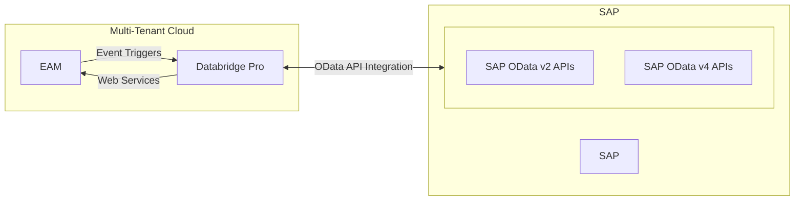
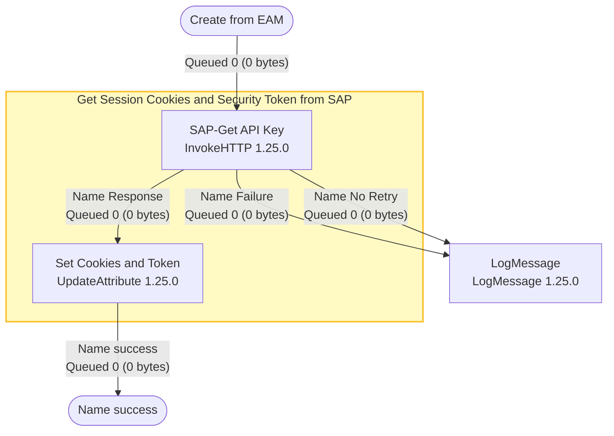
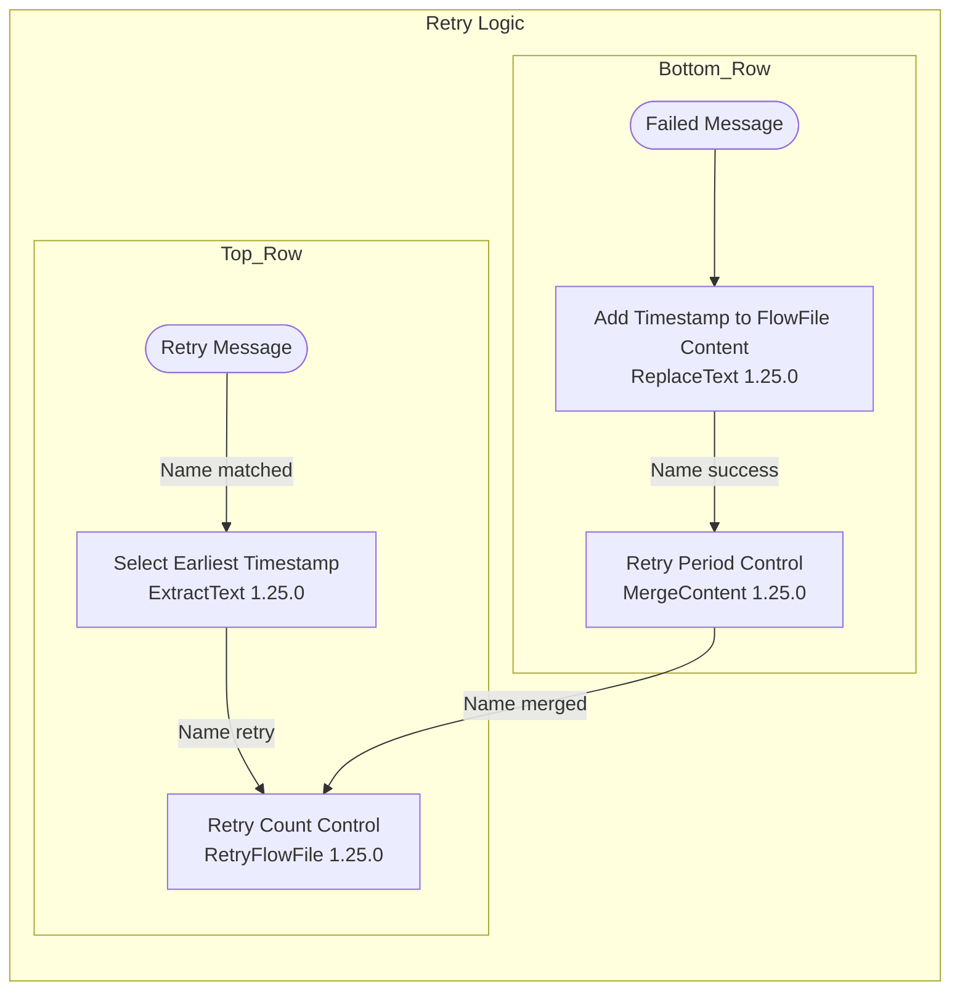
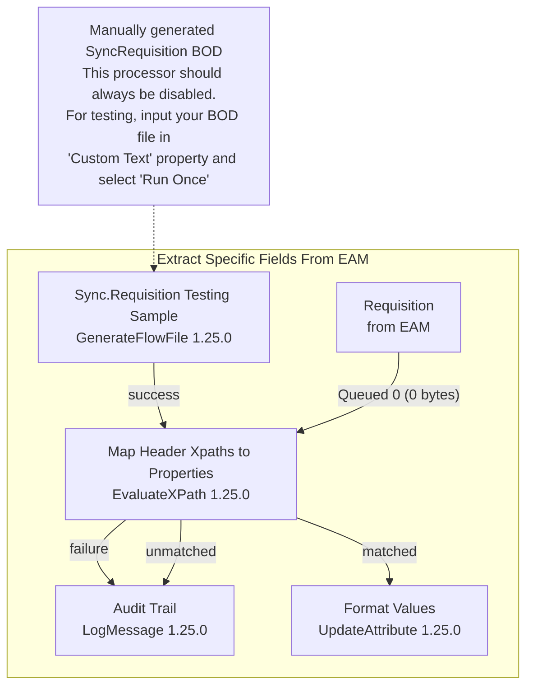
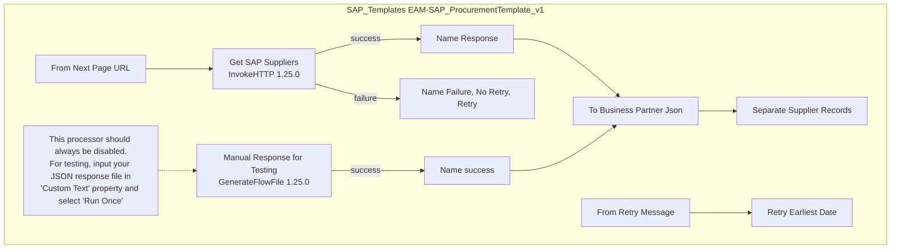

HEXAGON

# HxGN EAM Integration with SAP S/4HANA

Version 12.2.1
May 2025

The page features a large, abstract geometric graphic composed of overlapping blue and teal triangles. Within the central triangular section of this graphic, there is a detailed 3D industrial model showing complex piping systems, structural steel, and equipment in yellow, grey, and black.

In the bottom left corner, there is a small icon consisting of a blue stylized geometric shape on a white square with a shadow.

Synchronization of SAP Purchase Orders .................................................. 50
Synchronization of SAP Receipts ............................................................... 58
Synchronization of SAP Invoices ................................................................ 72

## Procurement Procedures ................................................................................ 79
### Requisitions .......................................................................................... 79
### Purchase Orders ................................................................................... 80
### Receipts ................................................................................................ 80
### Invoices ................................................................................................. 81

## Verifying the integration ................................................................................. 81
### Verifying EAM data is generated ................................................................. 81
### Verifying Databridge Pro receives data ...................................................... 81
### Technical issues and resolutions ................................................................ 82

## Appendix A – Technical Components ........................................................... 85
### Outbound Data to SAP ................................................................................ 85
### Inbound Data from SAP .............................................................................. 85
### Template InvokeHTTP Processors ............................................................. 85

## Appendix B – Solution integration mapping ................................................. 87

## Appendix C – Enablement of Third-Party Cookies ...................................... 89

## Appendix D – Synchronization Retry Logic .................................................. 91

## Appendix E – Testing the Flow Definition ..................................................... 94

## Appendix F – Implementation notes .............................................................. 98
### Deployment Considerations ........................................................................ 98
### Core Competencies .................................................................................... 98
### Procedural Limitations ................................................................................. 98

HxGN EAM Integration with SAP S/4HANA 5

# HxGN EAM integration with SAP S/4HANA

This brief provides configuration and implementation procedures for the integration of HxGN EAM with SAP S/4HANA using HxGN EAM Databridge Pro to exchange data between the two solutions.

This document describes configuration requirements, provides setup instructions, and details Dataflow Studio and application connection points used in the integration. This brief is intended to supplement the documentation of this feature. It is not comprehensive and may not include all the details about this functionality.

## Overview

This brief provides configuration and implementation information for the integration of HxGN EAM with SAP S/4HANA using Databridge Pro as middleware to exchange data. Additionally, instruction is provided for HxGN EAM, Dataflow Studio, and SAP S/4HANA to support related interface functionality.

The preconfigured SAP integration template for Databridge Pro is designed to provide default procurement functionality to satisfy most standard use cases for integrating EAM with SAP S/4HANA.

It is also possible to customize and modify the integration process flows to accommodate requirements specific to a customer’s operational procedures not satisfied by the delivered configuration. This is available through the unique user interface of Databridge Pro which supports modification of logic and data mapping without code development.

## Intended audience

This brief is intended for the system administrator or services consultant who configures the integration of HxGN EAM and SAP S/4HANA for use with Dataflow Studio.

## Attachments

This document includes attachments. The attached files include:

* EAM-SAPMapping_Phase1_BODDetail.xls

**Note:** Download the PDF to your local machine to view the attachments. Attachments are not accessible while viewing the PDF in your web browser.

HxGN EAM Integration with SAP S/4HANA 6

# Integration of solution components

The following diagram illustrates the integration and data flow between EAM and SAP S/4HANA.

### Integration of Solution Components

<table>
  <thead>
    <tr>
        <th>HxGN EAM</th>
        <th>Dataflow Studio / Databridge Pro</th>
        <th>SAP</th>
        <th>Category</th>
    </tr>
  </thead>
  <tbody>
    <tr>
        <td>Item (Parts)</td>
        <td>←</td>
        <td>Item</td>
        <td>Master Data Reference</td>
    </tr>
    <tr>
        <td>Supplier</td>
        <td>←</td>
        <td>Vendor</td>
        <td>Master Data Reference</td>
    </tr>
    <tr>
        <td>Requisitions (Parts)</td>
        <td>→</td>
        <td>Purchase Requisitions</td>
        <td>Transactional Data</td>
    </tr>
    <tr>
        <td>Purchase Orders (Parts)</td>
        <td>←</td>
        <td>Purchase Orders</td>
        <td>Transactional Data</td>
    </tr>
    <tr>
        <td>Receipts (Parts)</td>
        <td>←</td>
        <td>Receipts</td>
        <td>Transactional Data</td>
    </tr>
    <tr>
        <td>Invoices</td>
        <td>←</td>
        <td>Invoices</td>
        <td>Transactional Data</td>
    </tr>
  </tbody>
</table>

HxGN EAM is an industry-leading enterprise asset management solution for tracking assets, digitalizing maintenance operations, and enabling customers across all industries to optimize operational efficiency. From asset structure and work orders to mobile, barcoding and GIS or BIM capabilities, HxGN EAM provides the information, features, and functionality to make better, more strategic decisions that extend asset life, increase safety and improve profitability.

SAP S/4HANA is an enterprise resource planning (ERP) software solution. Deployed on premises or in the cloud, SAP S/4HANA unifies business processes with a standardized framework of capabilities. Businesses can configure the solution to meet their unique organizational requirements and procedural practices. Machine learning analytics, real-time insights, and advanced functionalities incorporated into the product enable businesses to analyze spending and risk, make informed decisions, and simplify sourcing, purchasing, and payments.

The integration of EAM and SAP S/4HANA, as architected and deployed, synchronizes master data including Product Master and Vendor data from SAP to HxGN EAM. Transactional data including Purchase Orders, Receipts, and Invoices are synchronized from SAP to EAM, and Purchase Requisitions are synchronized from EAM to SAP.

With the integration of HxGN EAM and SAP S/4HANA, customers can seamlessly exchange requisitions, purchase orders, receipts, and invoices to support operational inventory and procurement processes.

HxGN EAM Integration with SAP S/4HANA 7

# Deployment Architecture

The initial release of the EAM - SAP integration will be cloud based. EAM and Databridge Pro will be hosted in the Hexagon Multi-Tenant cloud. Communication with and synchronization of data to SAP will leverage OData web service APIs over the cloud.

## Deployment Architecture - Cloud



# Required Products

The following prerequisites are required for the integration:

* HxGN Enterprise Asset Management (EAM) 12.2 or later.
* HxGN Databridge Pro, release 24.3.3 or later.
  See the HxGN EAM Integrating with Dataflow Studio and HxGN EAM Databridge Pro Help briefs for related information.
* SAP S/4HANA 2023 On premise or SAP S/4HANA 2023 Private Cloud Edition or later.

HxGN EAM Integration with SAP S/4HANA 8

# Configuring EAM

In HxGN EAM you must complete the configuration tasks that are specific to this integration. These tasks can be completed by the EAM services consultant or the EAM system administrator.

## Setting install parameters for EAM

***(Navigation: Administration > Security > Install Parameters)***

For each install parameter outlined in the table below, select the recommended value.

<table>
  <thead>
    <tr>
        <th>Installation Parameter and Value</th>
        <th>Description</th>
    </tr>
  </thead>
  <tbody>
    <tr>
        <td>DFSCID</td>
        <td>ClientID for the HXGN-DFS partner. EAM will harvest this value to support usage and enforce security of web services.</td>
    </tr>
  </tbody>
</table>

> **Note:** This install parameter does not have a specific value. The DFSCID parameter can be any value of the client’s choosing (e.g., “ValidateAPI”). When Dataflow Studio subsequently makes an API call to EAM, it will pass this parameter in the header which EAM will then use to validate the call.

<table>
  <thead>
    <tr>
        <th>Installation Parameter and Value</th>
        <th>Description</th>
    </tr>
  </thead>
  <tbody>
    <tr>
        <td>LGNCON = STD</td>
        <td>The login authentication method used for the EAM Connector (web services) users. It has these values:<br/>Standard (STD) - Use the standard credentials defined on user records within EAM.<br/>LDAP (LDAP) - Use the credential defined in the LDAP provider configured for the EAM deployment.<br/>External (EXTERN) - Use an external authentication service configured for the EAM deployment.</td>
    </tr>
    <tr>
        <td>LGNEAM = STD</td>
        <td>The default login authentication method used for EAM web users. It has these values:<br/>Standard (STD) - Use the credential defined on user records within EAM.<br/>LDAP (LDAP) - Use the credential defined in the LDAP provider configured for the EAM deployment.<br/>External (EXTERN) - Use an external authentication service configured for the EAM deployment.</td>
    </tr>
  </tbody>
</table>

> **Note:** If EXTERNAL is selected for LGNCON and LGNEAM, this requires additional

HxGN EAM Integration with SAP S/4HANA | 9

configuration for SSO authentication. The SSO Configuration screen in EAM is used to support Single Sign-On authentication. Both WS-Trust and OIDC configuration will be supported using the parameters populated on this screen. A customer may choose to configure both WS-Trust and OIDC; these are not mutually exclusive. See HxGN EAM SSO Configuration for more information.

<table>
  <thead>
    <tr>
        <th>Installation Parameter and Value</th>
        <th>Description</th>
    </tr>
  </thead>
  <tbody>
    <tr>
        <td>@ADDREQ = Y</td>
        <td>The Add Requisition Outbound option determines whether the event is enabled.<br/>- Yes: When a requisition is approved for the first time, Databridge will generate an event.<br/>- No: Databridge will not generate an event.</td>
    </tr>
    <tr>
        <td>@CHGREQ = N</td>
        <td>The Change Requisition Outbound option determines whether the event is enabled.<br/>- Yes: When a requisition is updated after approval and then re-approved, Databridge will generate an event.<br/>- No: Databridge will not generate an event.<br/>- All: When a requisition is updated with a re-approval, cancelled or rejected status after initial approval, Databridge will generate an event.<br/>-S: Databridge will generate an outbound event for all status changes</td>
    </tr>
    <tr>
        <td>@CANPORL = Y</td>
        <td>The Cancel Requisition Lines in Cancel PO Inbound process option determines whether when processing a Cancelled PO inbound message, the system should cancel the corresponding requisition line.<br/>- Yes: Cancel the corresponding requisition lines.<br/>- No: Databridge will not cancel the corresponding requisition lines.</td>
    </tr>
    <tr>
        <td>@CANREQ = Y</td>
        <td>The Cancel Requisition Outbound Event option determines whether the event is enabled.<br/>- Yes: When a requisition is cancelled after initial approval, Databridge will generate an event.<br/>- No: Databridge will not generate an event.</td>
    </tr>
    <tr>
        <td>PRICELEV = P</td>
        <td>Indicates whether price is tracked at the part level or stock level.<br/>Part Level = The value of a part is tracked at the Part and Organization level. The value of a part will be the same in all Stores of the same organization.<br/>Stock Level = The value of the part is tracked at the Store level. The value of the part can be different in different stores even within the same organization.</td>
    </tr>
  </tbody>
</table>

HxGN EAM Integration with SAP S/4HANA 10

<table>
  <tbody>
    <tr>
        <td>PRICETIM = R</td>
        <td>Indicates when price updates take place: 'R' - Receipt Time, 'I' - Invoice Time, or 'RI' - Receipt and Invoice Time</td>
    </tr>
    <tr>
        <td>PRICETYP = A</td>
        <td>How storeroom materials are priced: 'A' = average unit price; 'FIFO' = first in first out; 'L' = last price; 'LIFO' = last in first out; 'S' = standard price.</td>
    </tr>
    <tr>
        <td>SPF_REQ = EAM</td>
        <td>Requisition Sequence Prefix.<br/><br/>**Note:** This will support having the same requisition number assigned to the SAP purchase requisition</td>
    </tr>
  </tbody>
</table>

# Multi-Org Security

SAP configures transactional data at the accounting entity level. EAM has an established entity-level security model that can support this requirement. Multi-org security is enabled by an install parameter setting.

**Navigation: Administration > Security > Install Parameters**

<table>
  <thead>
    <tr>
        <th>Installation Parameter and Value</th>
        <th>Description</th>
    </tr>
  </thead>
  <tbody>
    <tr>
        <td>MULTIORG = YES</td>
        <td>Whether multi organization security is set, 'YES' or 'NO'.</td>
    </tr>
  </tbody>
</table>

The following multi-org security settings should be applied.

**Navigation: Administration > Security > Multi-Org Security**

<table>
  <thead>
    <tr>
        <th>EAM Entity</th>
        <th>Multi-Org</th>
        <th>Comment</th>
    </tr>
  </thead>
  <tbody>
    <tr>
        <td>COMM (Commodity Code)</td>
        <td>Enabled</td>
        <td>Data entry to common '*' organization</td>
    </tr>
    <tr>
        <td>COMP (Supplier)</td>
        <td>Enabled</td>
        <td></td>
    </tr>
    <tr>
        <td>CSTC (Cost Code)</td>
        <td>Enabled</td>
        <td></td>
    </tr>
    <tr>
        <td>DOCK (On-dock Receipt)</td>
        <td>Enabled</td>
        <td></td>
    </tr>
    <tr>
        <td>INV (Invoice)</td>
        <td>Enabled</td>
        <td></td>
    </tr>
    <tr>
        <td>ORDT (Order Terms)</td>
        <td>Enabled</td>
        <td>Data entry to common '*' organization</td>
    </tr>
    <tr>
        <td>PART (Part)</td>
        <td>Enabled</td>
        <td></td>
    </tr>
    <tr>
        <td>PERS (Person)</td>
        <td>Enabled</td>
        <td></td>
    </tr>
    <tr>
        <td>PORD (Purchase Order)</td>
        <td>Enabled</td>
        <td></td>
    </tr>
  </tbody>
</table>

HxGN EAM Integration with SAP S/4HANA 11

<table>
  <tbody>
    <tr>
        <td>REQ (Requisition)</td>
        <td>Enabled</td>
        <td></td>
    </tr>
    <tr>
        <td>STOR (Store)</td>
        <td>Enabled</td>
        <td></td>
    </tr>
    <tr>
        <td>TAX (Tax Codes)</td>
        <td>Enabled</td>
        <td>Data entry to common '*' organization</td>
    </tr>
  </tbody>
</table>

# Store Security

EAM supports the ability to create items (N-parts or temporary items) in stores during the requisitioning process. This functionality is not in scope for the EAM-SAP integration and should be disabled by using Store Security.

**Navigation: Administration > Security > Install Parameters**

<table>
  <thead>
    <tr>
        <th>Installation Parameter and Value</th>
        <th>Description</th>
    </tr>
  </thead>
  <tbody>
    <tr>
        <td>STORESEC = ON</td>
        <td>ON: Use Store Security for User Groups. OFF: No Store Security for User Groups</td>
    </tr>
  </tbody>
</table>

Now, for each defined User Group, each store location will be added and for each store location, the ability to create stock records with qty > 0 will be disabled.

**Navigation: Administration > Security > User Groups**

For each defined store location, select the store, and then uncheck the "Create stock records with qty > 0" checkbox and save the store record to the User Group.

The following image shows the HxGN EAM User Groups screen with the Store Security tab selected. In the Store Security Details section, the "Create Stock Records with Qty > 0" checkbox is highlighted.

*   **User Group:** ADMIN - ADMIN
*   **Tab:** Store Security
*   **Store Security Details:**
    *   Issues/Returns: [x]
    *   Store-to-Store Issues (From Store): [x]
    *   Store-to-Store Receipts (To Store): [x]
    *   PO Receipts/Supplier Returns: [x]
    *   Physical Inventory: [x]
    *   Non-PO Receipts: [ ]
    *   Create Stock Records with Qty > 0: [x] (Highlighted for action)
    *   Update Stock Records: [x]
    *   Scrap Parts from Stock: [x]

Figure 1: User Group, Store Security tab

HxGN EAM Integration with SAP S/4HANA 12

# Databridge Partner Configuration
**(Navigation: Administration > Databridge > Databridge Partners)**

On the **Databridge Partners** screen, select the HXGN-DFS partner record. This partner record must be set as Active and configured with valid credentials for User ID and Password. The **Address** value should be set to HXGNDFSIMS to support the transmission of data from EAM to Databridge Pro. Note, the INFOR-ONRAMP partner and the INFOR-IMS partner must both be disabled.

<table>
  <thead>
    <tr>
        <th>Field</th>
        <th>Value</th>
        <th>Field</th>
        <th>Value</th>
    </tr>
  </thead>
  <tbody>
    <tr>
        <td>Partner</td>
        <td>HXGN-DFS</td>
        <td colspan="2">Dataflow Studio Partner</td>
    </tr>
    <tr>
        <td>Partner ID</td>
        <td>dfsims</td>
        <td>Active</td>
        <td>[x]</td>
    </tr>
    <tr>
        <td>Default Organization</td>
        <td>[___]</td>
        <td colspan="2"></td>
    </tr>
    <tr>
        <th colspan="4">Databridge Login</th>
    </tr>
    <tr>
        <td>User ID</td>
        <td>[___]</td>
        <td>Special Handling</td>
        <td>[___]</td>
    </tr>
    <tr>
        <td>Password</td>
        <td>[___]</td>
        <td colspan="2"></td>
    </tr>
    <tr>
        <th colspan="4">Credentials</th>
    </tr>
    <tr>
        <td>User ID</td>
        <td>DATABRIDGEINTERNALUSEF</td>
        <td>Password</td>
        <td>************</td>
    </tr>
    <tr>
        <th colspan="2">Response Details</th>
        <th colspan="2">Processing Retry Schedule</th>
    </tr>
    <tr>
        <td>Address</td>
        <td>HXGNDFSIMS</td>
        <td>1st Retry again in [hh:mm]</td>
        <td>[___] : [___]</td>
    </tr>
    <tr>
        <td>Login ID</td>
        <td>[___]</td>
        <td>2nd Retry again in [hh:mm]</td>
        <td>[___] : [___]</td>
    </tr>
    <tr>
        <td>Login Password</td>
        <td>[___]</td>
        <td>3rd Retry again in [hh:mm]</td>
        <td>[___] : [___]</td>
    </tr>
    <tr>
        <td>Response Special Handling</td>
        <td>[___]</td>
        <td>4th Retry again in [hh:mm]</td>
        <td>[___] : [___]</td>
    </tr>
    <tr>
        <td>Retry Count</td>
        <td>[___]</td>
        <td>5th Retry again in [hh:mm]</td>
        <td>[___] : [___]</td>
    </tr>
    <tr>
        <td>Retry Interval (min.)</td>
        <td>[___]</td>
        <td colspan="2"></td>
    </tr>
  </tbody>
</table>

Figure 2: Databridge Partners screen, HXGN-DFS partner record

On the **Subscriptions** tab for the HXGN-DFS partner, search and select each of the events and set them as follows.

<table>
  <thead>
    <tr>
        <th>Event</th>
        <th>Document Type</th>
        <th>Enabled</th>
    </tr>
  </thead>
  <tbody>
    <tr>
        <td>ADDREQUISTN</td>
        <td>SyncRequisition</td>
        <td>Yes</td>
    </tr>
    <tr>
        <td>CHANGEREQUISTN</td>
        <td>SyncRequisition</td>
        <td>No</td>
    </tr>
  </tbody>
</table>

HxGN EAM Integration with SAP S/4HANA 13

HxGN EAM | Work | Materials | Equipment | Purchasing | Operations | Administration | HXGNDEV0010_PP1 | R5 | R5
Partner: HXGN-DFS Dataflow Studio Partner

<table>
  <thead>
    <tr>
        <th>Search within All Partners</th>
        <th colspan="8">Record View  Comments x  Subscriptions x  References x  Addresses x  Inbound Documents x  DFS Catalog x</th>
        <th></th>
    </tr>
  </thead>
  <tbody>
    <tr>
        <td>* - My enterprise<br/>Partner ID: 1<br/>Default Organizati..<br/>User ID:</td>
        <td>All Events</td>
        <td colspan="2">Edit</td>
        <td colspan="3"></td>
        <td>Event</td>
        <td>[___]</td>
        <td>Run</td>
    </tr>
    <tr>
        <th>2 - Default integration partner<br/>Partner ID: 2<br/>Default Organizati..<br/>User ID:</th>
        <th>Event</th>
        <th>Enabled</th>
        <th>Document Type</th>
        <th>Address</th>
        <th>User ID</th>
        <th>Password</th>
        <th>Special Handling</th>
        <th></th>
        <th></th>
    </tr>
    <tr>
        <td>HXGN-DFS - Dataflow Studio Part..<br/>Partner ID: dfsims<br/>Default Organizati..<br/>User ID:</td>
        <td>ADDREQUISTN</td>
        <td>[ ]</td>
        <td>ProcessPurchaseO...</td>
        <td>[___]</td>
        <td>[___]</td>
        <td>[___]</td>
        <td>InforSoaDocumentE..</td>
        <td></td>
        <td></td>
    </tr>
    <tr>
        <td>INFOR-ESB - Connection to Infor ..<br/>Partner ID: instance1<br/>Default Organizati..<br/>User ID:</td>
        <td>ADDREQUISTN</td>
        <td>[x]</td>
        <td>SyncRequisition</td>
        <td>[___]</td>
        <td>[___]</td>
        <td>[___]</td>
        <td>InforSoaDocumentE..</td>
        <td></td>
        <td></td>
    </tr>
    <tr>
        <td>INFOR-IMS - Infor IMS partner<br/>Partner ID: eam:databridgeims<br/>Default Organizati..<br/>User ID:</td>
        <td>CALLCENTER</td>
        <td>[ ]</td>
        <td>ProcessCustomer...</td>
        <td>[___]</td>
        <td>[___]</td>
        <td>[___]</td>
        <td>InforSoaDocumentE..</td>
        <td></td>
        <td></td>
    </tr>
    <tr>
        <td>INFOR-ONRAMP - Infor ION 3.1 p...<br/>Partner ID: eam<br/>Default Organizati..<br/>User ID:</td>
        <td>CALLCENTER</td>
        <td>[ ]</td>
        <td>SyncCustomerCall</td>
        <td>[___]</td>
        <td>[___]</td>
        <td>[___]</td>
        <td>InforSoaDocumentE..</td>
        <td></td>
        <td></td>
    </tr>
    <tr>
        <td></td>
        <td>CANCELPOH...</td>
        <td>[ ]</td>
        <td>ProcessPurchaseO...</td>
        <td>[___]</td>
        <td>[___]</td>
        <td>[___]</td>
        <td>InforSoaDocumentE..</td>
        <td></td>
        <td></td>
    </tr>
    <tr>
        <td colspan="7">Records: 50 of 86</td>
        <td colspan="2">Show Filter Row: [x]</td>
        <td></td>
    </tr>
    <tr>
        <td colspan="9">**Subscription Details**</td>
        <td></td>
    </tr>
    <tr>
        <td colspan="4">Event: ADDREQUISTN</td>
        <td colspan="5">Document Type: SyncRequisition</td>
        <td></td>
    </tr>
    <tr>
        <td colspan="9">Enabled: [x]</td>
        <td></td>
    </tr>
    <tr>
        <td colspan="9">**Message Delivery**</td>
        <td></td>
    </tr>
    <tr>
        <td colspan="9">Address: [___]</td>
        <td></td>
    </tr>
    <tr>
        <td colspan="4">User ID: [___]</td>
        <td colspan="5">Password: [___]</td>
        <td></td>
    </tr>
    <tr>
        <td colspan="9">Special Handling: InforSoaDocumentExporter</td>
        <td></td>
    </tr>
  </tbody>
</table>

Figure 3: Partners screen, HXGN-DFS partner record, Subscriptions tab

**Note:** During the provisioning process for the EAM tenant, Databridge must also be provisioned.

# Configuring EAM screens

In this section, entities and screens that require configuration or data population to initialize values to support the integration will be outlined. Information is organized by EAM module and then in alphabetical order.

## Administration Module

### Cost Codes screen

**(Navigation: Administration > Setup > Cost Codes)**

Cost codes (SAP Cost Centers) allow expenses to be recorded as they relate to a specific business function or department within a company structure enabling financial analysis of spending and budgetary tracking.

The EAM Cost Code should align with the SAP Cost Center and be assigned to the EAM Organization associated with the SAP Plant assignment. Cost Codes are optional on the requisition, however, if a Cost Code is specified on a requisition, then SAP requires an Account Assignment Category to be populated for any included part lines. The Account Assignment Category designated on a part line determines which accounts are charged for procured goods.

**Note:** There is no automatic synchronization of Cost Codes between the two solutions so they will need to be manually synchronized.

HxGN EAM Integration with SAP S/4HANA | 14

## Organizations screen

*(Navigation: Administration > Security > Organizations)*

In EAM, the Organization is equivalent to the SAP Plant. On the Organizations screen in HxGN EAM, when creating the organization, the Organization code and the Accounting Entity fields must be populated in alignment with the Plant in SAP (both fields with the same value).

Additionally, the organization default currency must match the default currency of the corresponding Plant currency in SAP.

Note: The organization default currency cannot be changed after the organization is created.

## Organizations screen - Enterprise Locations tab

*(Navigation: Administration > Security > Organizations > Enterprise Locations)*

In EAM, the Organization is equivalent to the SAP Plant. On the Enterprise Locations tab of the Organizations screen in HxGN EAM, when creating the organization, the Enterprise Location must be populated in alignment with the Organization code (SAP Plant) for all 4 BOD Groups (Asset, Material, Purchasing, and Work).

## User Setup screen

*(Navigation: Administration > Security > User Setup)*

On the User Setup screen in EAM, verify the user specified as the Request User for any InvokeHTTP processors used in the flow definition that access EAM is defined as a valid user in HxGN EAM and has the **Connector** checkbox selected on their user record. This will enable web service operation for the user.

# Materials Module

## Commodities screen

*(Navigation: Materials > Setup > Commodities)*

In EAM, the Commodity will be used to reflect the SAP Material Group. In SAP, Material Groups provide a methodology to organize materials with similar characteristics. For each Material Group in SAP, equivalent Commodity values should be manually configured within EAM to a common organization (these values are not automatically synchronized).

## Currencies screen

*(Navigation: Materials > Setup > Currencies)*

Currency codes must be defined in both systems. EAM is installed with a full set of ISO currency codes so it is likely all the codes needed are already present, but this should be reviewed and verified against the set of currency codes in SAP. If there is an additional currency code required, it will need to be manually entered into EAM.

Note: Currency codes in EAM are limited to 3 characters.

HxGN EAM Integration with SAP S/4HANA                                                          15

# **Exchange Rates screen**

***(Navigation: Materials > Setup > Currencies > Exchange Rates)***

The EAM Organization has a base currency, and this will be the same as in the SAP Plant.

If the currency used for a part in the SAP part master is different from the organization (SAP Plant) currency, a valid exchange rate must be defined in EAM between the part currency and the organization’s currency.

SAP S/4HANA can have Purchase Orders in currencies other than the default currency of the supplier. For those currencies, an exchange rate must be defined in EAM

For Requisitions to be raised in a different currency than the Organization (SAP Plant), and for Purchase Orders and Invoices to be shown correctly, there should be exchange rates defined in EAM from these transaction currencies to base.

**Note:** There is no automatic synchronization of currency exchange rates between the two solutions so they will need to be manually synchronized.

# **Parts screen**

***(Navigation: Materials > Parts)***

On the **Parts** screen in EAM using Screen Designer, rename the **Commodity** field as **Material Group** and set this field as required. This will ensure alignment of nomenclature and population of required data between solutions.

For the **User Defined Field 01** field on the part record,

* Rename this field as **Purchasing Group** and leave this field as optional for the part record.
* The SAP Purchasing Group values need to be populated for the **User Defined Field 01** field (renamed as **Purchasing Group**) using the User Defined Field Lookup Values function.

Within SAP, the purchasing group is responsible for the procurement of a material or a class of materials, but it is not a specific named buyer. The Purchasing Group is optional on the part record.

# **Parts screen - Transactions**

***(Navigation: Materials > Parts > Transactions)***

On the **Transactions** tab of the **Parts** screen in EAM, for both the All Transactions and Recent Transactions Dataspys, edit these Dataspys to include **User Defined Field 01**. The **User Defined Field 01** field will include the Requesting Store information for receipt transactions. This detail will support having materials transferred from the central store to the specific store (using a store-to-store transaction) where the part is to be sourced.

# **PO Receipts screen - Active Lines**

***(Navigation: Materials > Transactions > PO Receipts > Active Lines)***

On the **Active Lines** tab of the **PO Receipts** screen in EAM using Screen Designer, for the **User Defined Field 01** field on the line, rename this field as **Requesting Store**.

HxGN EAM Integration with SAP S/4HANA 16

# Requisitions screen

**(Navigation: Materials > Requisitions)**

On the Record View tab of the **Requisitions** screen in EAM using Screen Designer, for the **User Defined Checkbox 01** field, rename this field as **Synchronized to SAP** and move this field to the top pane just below the Requisition code field. Additionally, set this checkbox as protected. When a requisition is synchronized to SAP, the response from SAP will be used to populate this checkbox and provide an on-screen reference indicating the synchronization of the requisition was successful.

**Note:** In the scenario where a requisition may be copied, it is advised to create a Post Insert Flex Business Rule for the R5REQUISITIONS table and set this record as Active. This will ensure the checkbox field indicating the requisition has been synchronized to SAP is not populated by the copy action.

<table>
  <tbody>
    <tr>
        <td>Table:*</td>
        <td>R5REQUISITIONS [lookup]</td>
        <td colspan="2"></td>
    </tr>
    <tr>
        <td>Sequence Number:*</td>
        <td>20</td>
        <td>Trigger:*</td>
        <td>Post Insert [dropdown]</td>
    </tr>
    <tr>
        <td>SQL Statement:*</td>
        <td>UPDATE R5REQUISITIONS<br/>SET REQ_UDFCHKBOX01 = '-'<br/>WHERE ROWID = :rowid</td>
        <td colspan="2"></td>
    </tr>
  </tbody>
</table>

## Requisitions screen - Parts tab

**(Navigation: Materials > Requisitions > Parts)**

On the **Parts** tab of the **Requisitions** screen in EAM using Screen Designer,

*   For the **User Defined Field 01** field on the requisition part tab, rename this field as **Purchasing Group** and mark this field as required. Additionally, the User Defined Field 01 field should be designated as a Code and Description Lookup Type using the User Defined Field Options function. Within SAP, the purchasing group is responsible for the procurement of a material or a class of materials, but it is not a specific named buyer.
    *   The SAP Purchasing Group values need to be populated for the **User Defined Field 01** field (renamed as **Purchasing Group**) using the User Defined Field Lookup Values function.
*   For the **User Defined Field 02** field on the requisition part tab, rename this field as **Acct Assignment Category**. Additionally, the User Defined Field 02 field should be designated as a Code and Description Lookup Type using the User Defined Field Options function. This field should remain optional.
    *   The SAP Account Assignment Category values need to be populated for the **User Defined Field 02** field (renamed as **Acct Assignment Category**) using the User Defined Field Lookup Values function.
*   For the **User Defined Field 03** field on the requisition part tab, rename this field as **Requesting Store**. With the usage of centralized store receiving, allocation of this field supports the user providing a specific store assignment for the part request.

Within SAP, the purchasing group is responsible for the procurement of a material or a class of materials, but it is not a specific named buyer. The Purchasing Group is required on the requisition part line.

If a Cost Code is specified on a requisition, then SAP requires an Account Assignment Category to be populated for any included part lines. The Account Assignment Category designated on a part line determines which accounts are charged for procured goods.

HxGN EAM Integration with SAP S/4HANA | 17

## Stores screen

**_(Navigation: Materials > Stores)_**

On the Stores screen in HxGN EAM, for each defined organization, the included Stores will need to be defined. The naming of these store locations should be in alignment with the corresponding Storage Location in SAP for the Plant.

One additional store must be defined to act as the centralized store location for each EAM organization. Stores cannot belong to common organizations in EAM.

**Note:** As deployed, the EAM - SAP integration leverages centralized store receiving. That is, all receiving will be made to a single central store/warehouse location for an organization. A central store must be defined in EAM for each organization. These central stores should all be defined with the same description and this description populated to the variable **EAMSAPReceivingStore** in the delivered flow definition template.

A methodology of centralized store receiving is employed to accommodate the difference in functional design of how purchase orders are used in EAM and how purchase orders are used in SAP. In SAP, a store (Storage Location) is optionally assigned to a purchase order line; it is not mandatory. In EAM, a store assignment is required, and it is defined on the Requisition and Purchase Order header, subsequently, all lines included on a requisition or purchase order in EAM are for the same store. As the procurement process is followed, the purchase order, when synchronized to EAM, will be created with the central store defined on the purchase order header, and the SAP store value (if assigned) populated to a user defined field on the purchase order line. With this detail, the EAM user will be required to create store-to-store transactions to issue the received goods from the central store location for the organization to the designated requesting store as indicated on the purchase order line.

## Tax Codes

In EAM, Tax Code records represent a combination of one or more tax rate codes and tax rate valuations to create a structure that will apply the applicable taxes to material and service purchases. Tax codes can support multiple tax rate codes and be applied as a composite assessment on purchases. There is no automatic synchronization of tax codes or tax rates between the two solutions so they will need to be manually configured within EAM to a common organization.

Tax code structures are created in several steps, first tax rate types are defined, then tax rates, then values for the defined tax rates, then tax codes are defined, and in the final step, tax rates are assigned to the defined tax codes.

*   **_Navigation: Materials > Setup > Tax Rate Types_**
    On the Tax Rate Type screen, define a unique code to classify the type of tax to be applied and a description. Type can be used to identify a federal, state, city, local, excise, or other type of tax that may be assessed in the procurement process.
*   **_Navigation: Materials > Setup > Tax Rates_**
    Tax Rates represent the second level of a tax structure. A tax rate should have a name to classify what the tax rate is for and it should be further clarified by assigning it a tax rate type. Optionally, a tax rate can be included in stock valuation as well as in work order costs for services. To include taxes in calculations of inventory value, the checkbox **Include Part Taxes in Stock Value** should be selected. To include taxes in

HxGN EAM Integration with SAP S/4HANA 18

calculations of Work Order service costs, the checkbox **Include Service Taxes in WO Cost** should be selected.

**Navigation: Materials > Setup > Tax Rates > Values (tab)**

Navigate to the **Values** tab for the **Tax Rate** to define the effective date and expiration date for the tax rate, and then specify the tax percentage.

**Navigation: Materials > Setup > Tax Codes**

Tax Codes represent one or more tax rates and their valuation as a composite entity to be applied to purchases of materials or services. On the Tax Code screen, specify a unique code to identify the tax and then provide a description off the tax code.

**Navigation: Materials > Setup > Tax Codes > Rates (tab)**

On the Rates tab of the Tax Code screen, select the tax rate to be applied by the tax code. The system will automatically populate the tax rate description and tax percentage. Tax codes can support multiple tax rate codes and be applied as a composite assessment on purchases. As additional tax rates are added to a single tax code, the total percentage to be assessed as a tax on a purchase will be displayed on the Tax Code screen in the **Total Tax %** field.

### Units of Measure screen

*(Navigation: Materials > Setup > Units of Measure)*

Units of Measure (UOM) must be defined in both systems. EAM is installed with a standard set of ISO unit of measure values so it is likely all the UOM codes needed are already present, but this should be reviewed and verified against the set of UOM codes in SAP. If there is an additional unit of measure required, it will need to be manually entered into EAM.

## Purchasing Module

### PO Terms screen

*(Navigation: Purchasing > Setup > PO Terms)*

Purchase order terms include codes, references, or special conditions agreed upon between a buyer and a supplier. These terms may represent when possession takes place, how freight charges are paid, how a supplier is paid and by what method, or how a supplier ships an item. In EAM, purchase order terms are defined on the PO Terms screen. If purchasing terms will be applied on purchase orders generated by SAP, equivalent values should be manually configured within EAM to a common organization (these values are not automatically synchronized). Mapping logic to populate these values in the synchronization process will also have to be added.

### Purchase Orders screen

*(Navigation: Purchasing > Purchase Orders)*

On the **Purchase Orders** screen in EAM using Screen Designer,

HxGN EAM Integration with SAP S/4HANA 19

*   For the **User Defined Field 01** field on the purchase order header, rename this field as **Purchasing Group** and move this field to the Purchase Order Details section. Within SAP, the purchasing group is responsible for the procurement of a material or a class of materials, but it is not a specific named buyer.

## Purchase Orders screen - Parts tab

***(Navigation: Purchasing > Purchase Orders > Parts)***

On the **Parts** tab of the **Purchase Orders** screen in EAM using Screen Designer,

*   For the **User Defined Field 01** field on the purchase order part line, rename this field as **Requesting Store**.
*   For the **User Defined Field 02** field on the purchase order part line, rename this field as **Material Group**. The SAP Materials Group aligns with the EAM Commodity.
*   For the **User Defined Field 03** field on the purchase order part line, rename this field as **Acct Assignment Category**.

If a Cost Code is specified on a purchase order part line, then SAP requires an Account Assignment Category to be populated. The Account Assignment Category designated on a part line determines which accounts are charged for procured goods.

# Work Module

## Employees screen

***(Navigation: Work > Setup > Employees)***

In EAM, employees are selected as requestors on requisitions, that is, the **Requested By** field on a requisition contains an employee code that is defined in EAM. In EAM, employee records must be defined with an employee code in alignment with the user code that is defined in SAP S/4HANA. This configuration step supports the requisition process flow.

HxGN EAM Integration with SAP S/4HANA 20

# Configuring Dataflow Studio

Databridge Pro, Powered by Apache NiFi, is the next generation of EAM Databridge, delivering advanced capabilities for data integration between EAM and external applications. Utilizing components both internal and outside of the EAM application, Databridge Pro provides the ability to build and manage customized data pipelines, streamline endpoint connections and usage, and simplify troubleshooting by offering insights into the complete EAM message journey.

Dataflow Studio, a component of Databridge Pro, is a graphical interface middleware utility based on Apache NiFi used to integrate EAM with other software applications. This utility is the primary middleware for cloud-based integrations.

## Dataflow Studio flow definitions

Dataflow Studio supports the ability to create, download, and import flow definitions. Flow definitions offer a way to share flow configurations for enhanced consistency and implementation between tenants.

The pipeline for synchronizing procurement data and transactions between EAM and SAP S/4HANA has been delivered in a flow definition. This flow definition should be imported to a process group on the canvas.

## Creating flow definitions

1. Right-click on the process group (or root canvas) for the definition you want to create.
2. From the context menu, go to ‘Download flow definition’ and select:
    a. **Without external services:** Does not include controller services used by the selected process group but located outside its scope (such as in a parent group).
    b. **With external services:** Does include controller services used by the selected process group but located outside its scope (such as in a parent group).
3. Once selected, a JSON definition file will be saved to your local machine. The name of the process group will be used as the name of the file.

## Importing flow definitions

1. Drag and drop the Process Group icon from the Component toolbar on to the canvas.
2. In the Process Group dialog box, click the **Browse** button (see Figure xx). Select the flow definition to import from your local directory. The Processor Group name will default as the flow definition name. After selection of the flow definition, the Process Group Name can be edited at this step.

**Note:** If desired, the Process Group name can be revised later by right-clicking the Process Group and then selecting Configure from the Context menu.

HxGN EAM Integration with SAP S/4HANA 21

<table>
  <thead>
    <tr>
        <th colspan="3">Add Process Group</th>
    </tr>
  </thead>
  <tbody>
    <tr>
        <td colspan="3">Process Group Name</td>
    </tr>
    <tr>
        <td colspan="3">Enter a name or select a file to upload</td>
    </tr>
    <tr>
        <td>Import from Registry...</td>
        <td>CANCEL</td>
        <td>ADD</td>
    </tr>
  </tbody>
</table>
Figure 4: Process Group Browse to import flow definition

3. Select the EAM-SAP integration flow definition file to be imported from the file browser.
4. Click **Add**.

> **Note:** To uphold security best practices, sensitive properties are not stored within flow definition configurations; all included processors will have been deactivated from operation. All sensitive values within the flow definition, such as passwords and access/authorization credentials will need to be re-entered and configured appropriately. And, any processors with Controller Services will also have to be reactivated and configured when a flow definition has been added to the canvas.

Processors that require configuration for sensitive properties following importation will have a Warning icon ( ⚠️ ) on the processor.

## Configuring sensitive data for processors

InvokeHTTP processors that access either EAM or SAP will require both Request Username and Request Password to be populated. The HTTP URL for the EAM specified InvokeHTTP processor references a flow definition variable and will be updated automatically if the flow definition variable is revised.

Within the pipeline, by processor group, locate each of the processors that need configuration of sensitive data. These processors will have a warning icon ( ⚠️ ) next to the title of the processor. The user should right-click on the processors, and then click **Configure** in the context menu. Clicking the **Configure** option will open the Configure Processor pane. **Note:** The InvokeHTTP processor does not require Request Username or Request Password, this processor type will need individual review where used in the flow definition as it may not be flagged with a warning icon.

HxGN EAM Integration with SAP S/4HANA 22

The image shows the HxGN EAM | Dataflow Studio interface. The top navigation bar includes the application name, user email (MARY.WEINBERGER@HEXAGON.COM), and a LOGOUT button. The main workspace displays a data flow diagram with several processors and connections.

**Dataflow Studio Canvas Components:**
*   **Get SAP Suppliers** (InvokeHTTP 1.25.0): Labeled "Communicate with SAP using ODATA".
*   **Next Page URL** (ExtractText 1.25.0)
*   **Separate Supplier Records**
*   **To Business Partner Json**
*   **Manual Response for Testing** (GenerateFlowFile 1.25.0): Accompanied by a note: "This processor should always be stopped. For testing, input your JSON response in 'Custom Text' property and select 'R...'".
*   **Failed Message**
*   **Retry Earliest Date**
*   **Used to Filter Business Partners based on their Roles (Accept only vendors)** (Label)

A context menu is open for the **Get SAP Suppliers** processor with the following options:
*   Configure
*   Start
*   Run Once
*   Disable
*   View data provenance
*   Replay last event
*   View status history
*   View usage
*   View connections
*   Center in view
*   Change color
*   Copy
*   Delete

Figure 5: Accessing the processor context menu

The second image shows the configuration dialog for the processor.

<table>
  <thead>
    <tr>
        <th></th>
        <th colspan="2">Configure Processor | InvokeHTTP 1.25.0</th>
        <th colspan="2"></th>
    </tr>
  </thead>
  <tbody>
    <tr>
        <td colspan="2">■ Stopped</td>
        <td colspan="3"></td>
    </tr>
    <tr>
        <td>SETTINGS</td>
        <td>SCHEDULING</td>
        <td>PROPERTIES</td>
        <td>RELATIONSHIPS</td>
        <td>COMMENTS</td>
    </tr>
    <tr>
        <td>Name</td>
        <td>[x] Enabled</td>
        <td colspan="3"></td>
    </tr>
    <tr>
        <td>Get SAP Suppliers</td>
        <td></td>
        <td colspan="3"></td>
    </tr>
    <tr>
        <td>Id</td>
        <td></td>
        <td colspan="3"></td>
    </tr>
    <tr>
        <td>c5f53e31-04e7-1401-98f6-2a7587fbaca6</td>
        <td></td>
        <td colspan="3"></td>
    </tr>
    <tr>
        <td>Type</td>
        <td></td>
        <td colspan="3"></td>
    </tr>
    <tr>
        <td>InvokeHTTP 1.25.0</td>
        <td></td>
        <td colspan="3"></td>
    </tr>
    <tr>
        <td>Penalty Duration 🛈</td>
        <td>Yield Duration 🛈</td>
        <td colspan="3"></td>
    </tr>
    <tr>
        <td>[0 sec]</td>
        <td>[1 sec]</td>
        <td colspan="3"></td>
    </tr>
    <tr>
        <td>Bulletin Level 🛈</td>
        <td></td>
        <td colspan="3"></td>
    </tr>
    <tr>
        <td>[WARN]</td>
        <td></td>
        <td colspan="3"></td>
    </tr>
    <tr>
        <td colspan="2">[CANCEL] [APPLY]</td>
        <td colspan="3"></td>
    </tr>
  </tbody>
</table>

Figure 6: Configure Processor pane, InvokeHTTP Settings tab

The user should navigate to the **Properties** tab. On the **Properties** tab, all the properties of the processor will be listed in a grid with their specified value. If a property is listed in bold text, it is required. Other properties not in bold text are optional but may still be required for usage with the specified application being accessed by the processor.

In the screenshot below, this InvokeHTTP processor is accessing the SAP environment. While the Request Username and Request Password are not in bold text, they are required values for the SAP environment and will need to be populated.

HxGN EAM Integration with SAP S/4HANA 23

EAM HxGN EAM | Dataflow Studio MARY.WEINBERGER@HEXAGON.COM LOGOUT

<table>
  <thead>
    <tr>
        <th>Property</th>
        <th>Value</th>
    </tr>
  </thead>
  <tbody>
    <tr>
        <td>Proxy Configuration Service</td>
        <td>No value set</td>
    </tr>
    <tr>
        <td>Proxy Host</td>
        <td>No value set</td>
    </tr>
    <tr>
        <td>Request OAuth2 Access Token Provider</td>
        <td>No value set</td>
    </tr>
    <tr>
        <td>Request Username</td>
        <td>HEX_USER</td>
    </tr>
    <tr>
        <td>Request Password</td>
        <td>Sensitive value set</td>
    </tr>
    <tr>
        <td>Request Digest Authentication Enabled</td>
        <td>false</td>
    </tr>
    <tr>
        <td>Request Failure Penalization Enabled</td>
        <td>false</td>
    </tr>
    <tr>
        <td>Request Date Header Enabled</td>
        <td>True</td>
    </tr>
    <tr>
        <td>Request Header Attributes Pattern</td>
        <td>No value set</td>
    </tr>
    <tr>
        <td>Request User-Agent</td>
        <td>No value set</td>
    </tr>
    <tr>
        <td>Response Body Attribute Name</td>
        <td>No value set</td>
    </tr>
    <tr>
        <td>Response Body Ignored</td>
        <td>false</td>
    </tr>
  </tbody>
</table>
Figure 7: Configure Processor pane, InvokeHTTP Properties tab (Sensitive value set)

Once values have been populated for the required properties, the property will read as Sensitive value set, and the user can then save these revisions by clicking APPLY. Clicking APPLY will close the Configure Processor pane and return the user to the dataflow.

See Appendix A - Technical Components, section Template InvokeHTTP Processors for a full listing of these processors.

# Declaration of flow definition variables

To enhance the efficiency of the overall data pipeline configuration and processing logic, the following flow definition variables have been defined. **Note:** In a future release, Databridge Pro will deprecate and rename the term “variables” as “parameters”.

<table>
  <thead>
    <tr>
        <th>Variable</th>
        <th>Description</th>
    </tr>
  </thead>
  <tbody>
    <tr>
        <td colspan="2">Template Level Variables</td>
    </tr>
    <tr>
        <td>EAMDefaultOrg</td>
        <td>The default organization for entities loaded to a common organization. It is advised to use the * organization</td>
    </tr>
    <tr>
        <td>EAMSAPReceivingStore</td>
        <td>EAM central store location. This variable represents the name for the central store and must be the same across all EAM organizations</td>
    </tr>
    <tr>
        <td>EAMTenant</td>
        <td>Tenant name of the EAM environment</td>
    </tr>
    <tr>
        <td>EAMURL</td>
        <td>EAM environment URL</td>
    </tr>
    <tr>
        <td>SAPHostname</td>
        <td>SAP hostname (environment URL)</td>
    </tr>
    <tr>
        <td>SAPODATA2Path</td>
        <td>SAP environment OData2 API path (extension to hostname)</td>
    </tr>
    <tr>
        <td>SAPODATA4Path</td>
        <td>SAP environment OData4 API path (extension to hostname)</td>
    </tr>
    <tr>
        <td>SAPServerTimeZone</td>
        <td>The time offset from UTC time zone (e.g. -0300 for Brazil)</td>
    </tr>
    <tr>
        <td>UseRESTAPI</td>
        <td>A secondary integration methodology leveraging EAM APIs is also included with the delivered template. This variable should be set to ‘false’ to enable integration using BOD methodology.</td>
    </tr>
    <tr>
        <td colspan="2">Processor Group Specific Variables</td>
    </tr>
    <tr>
        <td>LookbackHours</td>
        <td>Used in the Material-Parts Master processor group. This variable applies a lookback of 25 hours to ensure all Part records are captured for synchronization. This is an integer value.</td>
    </tr>
  </tbody>
</table>

HxGN EAM Integration with SAP S/4HANA 24

<table>
  <tbody>
    <tr>
        <td>EAMDefaultCurrency</td>
        <td>Used in the **Vendor-Supplier Master** processor group. This variable defines the default currency code if not specified</td>
    </tr>
    <tr>
        <td>EAMDefaultLanguage</td>
        <td>Used in the **Vendor-Supplier Master** processor group. This variable defines the default language code if not specified</td>
    </tr>
    <tr>
        <td>LookbackHours</td>
        <td>Used in the **Vendor-Supplier Master** processor group. This variable applies a lookback of 25 hours to ensure all Supplier records are captured for synchronization. This is an integer value.</td>
    </tr>
    <tr>
        <td>LookbackHours</td>
        <td>Used in the **Purchase Order Details** processor group. This variable applies a lookback of 25 hours to ensure all Purchase Order records are captured for synchronization. This is an integer value.</td>
    </tr>
    <tr>
        <td>LookbackHours</td>
        <td>Used in the **Good Receipts** processor group. This variable applies a lookback of 25 hours to ensure all Receipt records are captured for synchronization. This is an integer value.</td>
    </tr>
    <tr>
        <td>LookbackHours</td>
        <td>Used in the **Supplier Invoice Details** processor group. This variable applies a lookback of 25 hours to ensure all Invoice records are captured for synchronization. This is an integer value.</td>
    </tr>
  </tbody>
</table>

To access the set of flow definition variables in Dataflow Studio, inside the processor group that contains the flow definition, right-click on the canvas and then click **Variables** in the context menu. If the value of a flow definition variable is revised and applied (user clicks APPLY), this update will be cascaded to all relevant processors for the flow definition.

**Note:** The LookbackHours variable is replicated in multiple processor groups to support having different synchronization scheduling.

HxGN EAM Integration with SAP S/4HANA 25

# Configuring SAP S/4HANA

> **Note:** For any solution integration, a service consultant for each involved application should be engaged.

## Defining the Procurement Proposal

### External Numbering for Purchase Requisitions

The EAM requisition code will be carried forward to the SAP purchase requisition. That is, the SAP purchase requisition will also have the same code value as the EAM requisition.

A new SAP external alphanumeric numbering range for the purchase requisition document type ‘NB’ will need to be created to support this logic. Follow these steps:

1) Navigate to transaction **SPRO** to access the SAP IMG (implementation guide).
2) Navigate to **Material Management > Purchasing > Purchase Requisition > Define Number Ranges for Purchase Requisitions**.
3) On the **Define Number Ranges for Purchase Requisitions** screen, click the **Change Intervals** button ( [Intervals] ).
4) On the **Edit Intervals: Purchase requisition** screen, click the **Interval** icon ( [Insert Interval] ) to define a new number range interval.
5) Define the new interval with a unique number (column **Number Range No.**) and populate the numeric range to be applied to purchase requisitions in the **From No.** and **To Number** columns (EAM10000 and EAM99999 respectively). Select the **Ext** checkbox to indicate the numbering interval is an external reference.
6) Click **Save** to save the changes

This numbering interval now needs to be assigned to the SAP purchasing requisition document type.

7) Navigate to **Material Management > Purchasing > Purchase Requisition > Define Document Types for Purchase Requisition**.
8) On the **Document Types for Purchase requisition Change** screen, for the document type ‘NB’ (this is the standard SAP purchase requisition), in the **NoRge Ext** column, update this value to the unique number assigned (column **Number Range No.**) when the number range interval was defined.

It is advised to review this configuration with the SAP service consultant or SAP support representative for any impact on the SAP configuration from this customization.

### Setting Required fields on the Part record

The **Material Group** field will be set as required on the Part record to ensure EAM receives this information to support the requirements for requisition generation in SAP. Follow these steps:

1) Navigate to transaction **SPRO** to access the SAP IMG (implementation guide).

HxGN EAM Integration with SAP S/4HANA 26

2) Navigate to **Logistics General > Material Master > Basic Settings > Field Selection > Assign Fields to Field Selection Groups**.

3) On the **Change View "Field Groups": Overview** screen, scroll through the list of fields (the fields are in alphabetical order by technical name) and select the Material Group field, **MARA-MATKL**.

<table>
  <thead>
    <tr>
        <th colspan="3">Change View "Field Groups": Overview</th>
    </tr>
    <tr>
        <th>Field name in full</th>
        <th>Short Description</th>
        <th>Sel. group</th>
    </tr>
  </thead>
  <tbody>
    <tr>
        <td>MARA-KZUMW</td>
        <td>Environmentally Relevant</td>
        <td>125</td>
    </tr>
    <tr>
        <td>MARA-KZWSM</td>
        <td>Units of measure usage</td>
        <td>129</td>
    </tr>
    <tr>
        <td>MARA-LABOR</td>
        <td>Laboratory/Design Office</td>
        <td>10</td>
    </tr>
    <tr>
        <td>MARA-LAENG</td>
        <td>Length</td>
        <td>18</td>
    </tr>
    <tr>
        <td>MARA-LIQDT</td>
        <td>Deletion date</td>
        <td>154</td>
    </tr>
    <tr>
        <td>MARA-LOGISTICAL_MAT_CATEGORY</td>
        <td>Category of a Logistical Material</td>
        <td>199</td>
    </tr>
    <tr>
        <td>MARA-LOGLEV_RETO</td>
        <td>Return to Logistics Level</td>
        <td>147</td>
    </tr>
    <tr>
        <td>MARA-LOGUNIT</td>
        <td>EWM CW: Logistics Unit of Measure</td>
        <td>135</td>
    </tr>
    <tr>
        <td>MARA-MAGRV</td>
        <td>Material Group: Packaging Materials</td>
        <td>103</td>
    </tr>
    <tr>
        <td>MARA-MATKL</td>
        <td>Material Group</td>
        <td>17</td>
    </tr>
    <tr>
        <td>MARA-MAXB</td>
        <td>Maximum Packing Width of Packaging Material</td>
        <td>135</td>
    </tr>
    <tr>
        <td>MARA-MAXC</td>
        <td>Maximum Allowed Capacity of Packaging Material</td>
        <td>135</td>
    </tr>
    <tr>
        <td>MARA-MAXC_TOL</td>
        <td>Overcapacity Tolerance of the Handling Unit</td>
        <td>135</td>
    </tr>
    <tr>
        <td>MARA-MAXDIM_UOM</td>
        <td>Unit of Measure for Maximum Packing Length/Width/Height</td>
        <td>135</td>
    </tr>
    <tr>
        <td>MARA-MAXH</td>
        <td>Maximum Packing Height of Packaging Material</td>
        <td>135</td>
    </tr>
    <tr>
        <td>MARA-MAXL</td>
        <td>Maximum Packing Length of Packaging Material</td>
        <td>135</td>
    </tr>
  </tbody>
</table>
Sort and Position

4) Now, a listing of transaction codes associated with the Material Group field MARA-MATKL will be displayed. Scroll through this list, and for transaction code **MM01** (create or extend a material master), select the **Reqd Entry** radio dial.

<table>
  <thead>
    <tr>
        <th colspan="5">Change View "Field Selection for Data Screens": Overview</th>
    </tr>
  </thead>
  <tbody>
    <tr>
        <td>Field sel. group</td>
        <td>17</td>
        <td colspan="3"></td>
    </tr>
    <tr>
        <th colspan="5">Fields ( Field selection group 17 )</th>
    </tr>
    <tr>
        <th>Field name</th>
        <th colspan="4">Short Description</th>
    </tr>
    <tr>
        <td>MARA-MATKL</td>
        <td colspan="4">Material Group</td>
    </tr>
    <tr>
        <th colspan="5">Field selection (Field selection group 17 )</th>
    </tr>
    <tr>
        <th>Field ref.</th>
        <th>Hide</th>
        <th>Display</th>
        <th>Reqd Entry</th>
        <th>Opt. entry</th>
    </tr>
    <tr>
        <td>MM01</td>
        <td>[ ]</td>
        <td>[ ]</td>
        <td>[x]</td>
        <td>[ ]</td>
    </tr>
    <tr>
        <td>MM02</td>
        <td>[ ]</td>
        <td>[ ]</td>
        <td>[ ]</td>
        <td>[x]</td>
    </tr>
    <tr>
        <td>MM03</td>
        <td>[ ]</td>
        <td>[x]</td>
        <td>[ ]</td>
        <td>[ ]</td>
    </tr>
    <tr>
        <td>MM0L</td>
        <td>[ ]</td>
        <td>[ ]</td>
        <td>[ ]</td>
        <td>[x]</td>
    </tr>
    <tr>
        <td>MM11</td>
        <td>[ ]</td>
        <td>[ ]</td>
        <td>[ ]</td>
        <td>[x]</td>
    </tr>
  </tbody>
</table>

5) Click **Save** to save these field settings.

It is advised to review this configuration with the SAP service consultant or SAP support representative for any impact on the SAP configuration from this customization.

HxGN EAM Integration with SAP S/4HANA 27

# Setting Required fields on the Purchase Order

The **Storage Location** will be set as required on the Purchase Order to ensure EAM receives necessary details to maintain alignment in the synchronization process. Follow these steps:

1) Navigate to transaction **SPRO** to access the SAP IMG (implementation guide).
2) Navigate to **Material Management > Purchasing > Purchase Order > Define Screen Layout at Document Level**.
3) On the **Change View "Screen Layout: Purchase Orders": Overview** screen, scroll through the list of fields (the fields are in alphabetical order by technical name) and select the transaction code for the Purchase Order, **ME21N**.

<table>
  <thead>
    <tr>
        <th colspan="2">Change View "Screen Layout: Purchase Orders": Overview</th>
    </tr>
    <tr>
        <th colspan="2">[New Entries Icon] New Entries [Details Icon] [Copy Icon] [Delete Icon] [Undo Icon] [Select All Icon] [Deselect All Icon]</th>
    </tr>
    <tr>
        <th>FSel.</th>
        <th>Description</th>
    </tr>
  </thead>
  <tbody>
    <tr>
        <td>$$$$</td>
        <td>Without prices</td>
    </tr>
    <tr>
        <td>$DE1</td>
        <td>Without entry of price</td>
    </tr>
    <tr>
        <td>$DE2</td>
        <td>Without displaying price</td>
    </tr>
    <tr>
        <td>AKTA</td>
        <td>Display</td>
    </tr>
    <tr>
        <td>AKTE</td>
        <td>Extend purchase order</td>
    </tr>
    <tr>
        <td>AKTH</td>
        <td>Create</td>
    </tr>
    <tr>
        <td>AKTV</td>
        <td>Change</td>
    </tr>
    <tr>
        <td>FOF</td>
        <td>Framework order</td>
    </tr>
    <tr>
        <td>ME21</td>
        <td>Create purchase order</td>
    </tr>
    <tr>
        <td>ME21N</td>
        <td>Purchase order</td>
    </tr>
    <tr>
        <td>ME22</td>
        <td>Change purchase order</td>
    </tr>
    <tr>
        <td>ME23</td>
        <td>Display purchase order</td>
    </tr>
    <tr>
        <td>[Position Icon] Position...</td>
        <td>Entry 1 of 52</td>
    </tr>
  </tbody>
</table>

4) Click the Details icon ( [Details Icon] ) to continue
5) Now, on the **Maintain Table T162: Field Selection Groups** screen, select the **Basic Data, Item** selection group. The fields on the purchase order are sorted based on how they are applied in SAP for various relevant functions, these field groupings are named as Selection groups.
    a. Click the Details icon ( [Details Icon] ) to access the fields associated to the **Basic Data, Item** selection group
    b. For the **Storage Location** field, select the **Reqd. entry** checkbox to set this field as required.

HxGN EAM Integration with SAP S/4HANA 28

<table>
  <thead>
    <tr>
        <th>Maintain Table T162: Fields for Field Selection Group</th>
        <th colspan="4"></th>
    </tr>
  </thead>
  <tbody>
    <tr>
        <td>Field Selection Key</td>
        <td>ME2... Purchase order</td>
        <td colspan="2"></td>
        <td></td>
    </tr>
    <tr>
        <td>Selection group</td>
        <td>Basic Data, Item</td>
        <td colspan="2"></td>
        <td></td>
    </tr>
    <tr>
        <th>Fields</th>
        <th colspan="4"></th>
    </tr>
    <tr>
        <th>Field Label</th>
        <th>Reqd.entry</th>
        <th>Opt. entry</th>
        <th>Display</th>
        <th></th>
    </tr>
    <tr>
        <td>Plant</td>
        <td>[ ]</td>
        <td>[x]</td>
        <td>[ ]</td>
        <td></td>
    </tr>
    <tr>
        <td>Item category</td>
        <td>[ ]</td>
        <td>[x]</td>
        <td>[ ]</td>
        <td></td>
    </tr>
    <tr>
        <td>Storage location</td>
        <td>[x]</td>
        <td>[ ]</td>
        <td>[ ]</td>
        <td></td>
    </tr>
    <tr>
        <td>Account assignment category</td>
        <td>[ ]</td>
        <td>[x]</td>
        <td>[ ]</td>
        <td></td>
    </tr>
    <tr>
        <td>Indicator: "Texts exist"</td>
        <td>[ ]</td>
        <td>[x]</td>
        <td>[ ]</td>
        <td></td>
    </tr>
    <tr>
        <td>Short Text</td>
        <td>[ ]</td>
        <td>[x]</td>
        <td>[ ]</td>
        <td></td>
    </tr>
    <tr>
        <td>Material group</td>
        <td>[ ]</td>
        <td>[x]</td>
        <td>[ ]</td>
        <td></td>
    </tr>
    <tr>
        <td>Material description</td>
        <td>[ ]</td>
        <td>[x]</td>
        <td>[ ]</td>
        <td></td>
    </tr>
    <tr>
        <td>External service fields</td>
        <td>[ ]</td>
        <td>[x]</td>
        <td>[ ]</td>
        <td></td>
    </tr>
    <tr>
        <td>Value limit fields</td>
        <td>[ ]</td>
        <td>[x]</td>
        <td>[ ]</td>
        <td></td>
    </tr>
    <tr>
        <td>Manufacturer part number</td>
        <td>[ ]</td>
        <td>[ ]</td>
        <td>[x]</td>
        <td></td>
    </tr>
    <tr>
        <td>Advice Code</td>
        <td>[ ]</td>
        <td>[x]</td>
        <td>[ ]</td>
        <td></td>
    </tr>
    <tr>
        <td>Requirement Urgency</td>
        <td>[ ]</td>
        <td>[x]</td>
        <td>[ ]</td>
        <td></td>
    </tr>
    <tr>
        <td>Product Type Group</td>
        <td>[ ]</td>
        <td>[ ]</td>
        <td>[ ]</td>
        <td></td>
    </tr>
    <tr>
        <td>Service Performer</td>
        <td>[ ]</td>
        <td>[ ]</td>
        <td>[ ]</td>
        <td></td>
    </tr>
    <tr>
        <td>Overall Limit</td>
        <td>[ ]</td>
        <td>[ ]</td>
        <td>[ ]</td>
        <td></td>
    </tr>
  </tbody>
</table>

6) Click **Save** to save this field settings.

It is advised to review this configuration with the SAP service consultant or SAP support representative for any impact on the SAP configuration from this customization.

# Setting Required fields on the Invoice

The **Reference Number** field (REST API element SupplierInvoiceIDByInvcgParty) and the **Document Header Text** will be set as required on the invoice to ensure EAM receives necessary details to maintain alignment of required information in the synchronization process. Follow these steps:

1) Navigate to transaction **SPRO** to access the SAP IMG (implementation guide).
2) Navigate to **Financial Accounting > Financial Accounting Global Settings > Logistics Invoice Verification > Document > Define Document Types**.
3) On the **Display View “Document Types”: Overview** screen, scroll through the list of document types (the fields are in alphabetical order by type) and select the document type **RE** for Invoice - gross.
4) Click the Details icon ( [Details icon] ) to continue
5) On the **Display View “Document Types”: Details** screen, in the pane **Required during document entry**, select the checkbox for **Reference Number** and **Document Header Text**.

HxGN EAM Integration with SAP S/4HANA 29

<table>
  <thead>
    <tr>
        <th colspan="4">Display View "Document Types": Details</th>
    </tr>
  </thead>
  <tbody>
    <tr>
        <td>Document Type</td>
        <td>RE</td>
        <td colspan="2">Invoice - Gross</td>
    </tr>
    <tr>
        <th colspan="4">Properties</th>
    </tr>
    <tr>
        <td>Number Range</td>
        <td>51</td>
        <td colspan="2">Number range information</td>
    </tr>
    <tr>
        <td>Reverse DocumentType</td>
        <td>[___]</td>
        <td colspan="2"></td>
    </tr>
    <tr>
        <td>Authorization Group</td>
        <td>[___]</td>
        <td colspan="2"></td>
    </tr>
    <tr>
        <th colspan="2">Account types allowed</th>
        <th colspan="2">Control data</th>
    </tr>
    <tr>
        <td>[x] Assets</td>
        <td></td>
        <td colspan="2">[ ] Net document type</td>
    </tr>
    <tr>
        <td>[x] Customer</td>
        <td></td>
        <td colspan="2">[ ] Cust/vend Check</td>
    </tr>
    <tr>
        <td>[x] Supplier</td>
        <td></td>
        <td colspan="2">[x] Negative Postings Permitted</td>
    </tr>
    <tr>
        <td>[x] Material</td>
        <td></td>
        <td colspan="2">[ ] Inter-Company</td>
    </tr>
    <tr>
        <td>[x] G/L Account</td>
        <td></td>
        <td colspan="2">[ ] Enter trading partner</td>
    </tr>
    <tr>
        <td>[ ] Secondary Costs</td>
        <td></td>
        <td colspan="2"></td>
    </tr>
    <tr>
        <th colspan="2">Special usage</th>
        <th colspan="2">Default values</th>
    </tr>
    <tr>
        <td>[ ] BI Only</td>
        <td></td>
        <td>Exchange Rate Type for FC Documents</td>
        <td>[___]</td>
    </tr>
    <tr>
        <th colspan="2">Required during document entry</th>
        <th colspan="2">Joint venture</th>
    </tr>
    <tr>
        <td>[x] Reference Number</td>
        <td></td>
        <td>Debit Rec.Indic</td>
        <td>[___]</td>
    </tr>
    <tr>
        <td>[x] Document Header Text</td>
        <td></td>
        <td>Rec.Ind. Credit</td>
        <td>[___]</td>
    </tr>
  </tbody>
</table>

6) Click **Save** to save these field settings.

It is advised to review this configuration with the SAP service consultant or SAP support representative for any impact on the SAP configuration from this customization.

# Time Zone Configuration

## Maintaining System Settings

When the customer logs on to the SAP system for the first time, the system automatically determines the time zone in which the system is located. Regardless, due to various factors, such as daylight savings time rules, it is advised to review this setting to ensure it is correct.

To review the SAP time zone function, proceed as follows:

1) In **Customizing**, choose **General Settings > Time Zones > Maintain System Settings**. Enter the system's time zone and the user's default time zone.
   **Note:** Since a system and the majority of its users are often in the same location, the system's time zone and the users' default time zone are typically the same.
2) To activate the time zone function, select the **Time Zones Active** field.

HxGN EAM Integration with SAP S/4HANA 30

# Maintaining Time Zones

The standard time zones are delivered with SAP. However, it is advised to review these tables for the time zones in the customer’s operational area to ensure there are no errors.

To review time zone information, proceed as follows:

1) In **Customizing**, choose **General Settings > Time Zones > Maintain Time Zones**.
2) Since the parts of a time zone's structure build on each other, define time zones by completing the table as follows:
    a. First define the variable daylight saving time rules or fixed daylight saving time dates (choose **Variable summer time rules or Fixed summer time rules**).
    b. Then define the daylight saving time offsets (choose **Summer Time Rules**).
    c. Next define the time zone offsets (choose **Time Zone Rules**).
    d. Next define the time zone indicators (choose **Time Zones**).
    If any updates have been made to the individual tables, save these data revisions.
3) Return to the Customizing tree and execute the steps described in Maintaining System Settings in this guide.

# Reviewing Application Time Zone Details

To view the SAP application time zone, proceed as follows:

1) At the very top of the screen, click **System** and then click **Status**.
2) The **System Status** screen will display, and the user can observe the System Time and the Time Zone specified in the Usage data section

HxGN EAM Integration with SAP S/4HANA 31

<table>
  <thead>
    <tr>
        <th colspan="4">System: Status</th>
    </tr>
    <tr>
        <th colspan="4">Usage data</th>
    </tr>
  </thead>
  <tbody>
    <tr>
        <td>Client</td>
        <td>100</td>
        <td>Previous logon</td>
        <td>12.02.2025 16:34:33</td>
    </tr>
    <tr>
        <td>User</td>
        <td>AMOHAPATRA</td>
        <td>Logon</td>
        <td>19:33:51</td>
    </tr>
    <tr>
        <td>Language</td>
        <td>EN</td>
        <td>System time</td>
        <td>14:57:47</td>
    </tr>
    <tr>
        <td colspan="2"></td>
        <td>Time Zone</td>
        <td>INDIA 20:27:47</td>
    </tr>
    <tr>
        <td colspan="3">Number of Failed Password Logon Attempts:</td>
        <td>0</td>
    </tr>
    <tr>
        <th colspan="4">SAP data</th>
    </tr>
    <tr>
        <th colspan="4">Repository data</th>
    </tr>
    <tr>
        <td>Transaction</td>
        <td>BP</td>
        <td colspan="2"></td>
    </tr>
    <tr>
        <td>Program (screen)</td>
        <td>SAPLBUS_LOCATOR</td>
        <td>Screen number</td>
        <td>3000</td>
    </tr>
    <tr>
        <td>Program (Subdynpro)</td>
        <td>SAPLBUPA_DIALOG_J...</td>
        <td>Screen number</td>
        <td>1510</td>
    </tr>
    <tr>
        <td>Program (GUI)</td>
        <td>SAPLBUPA_DIALOG_J...</td>
        <td>GUI status</td>
        <td>SCREEN_1000_2</td>
    </tr>
    <tr>
        <th colspan="4">SAP System data</th>
    </tr>
    <tr>
        <td>Product Version</td>
        <td>- See Details -</td>
        <td colspan="2"></td>
    </tr>
    <tr>
        <td>Installation Number</td>
        <td>0020814602</td>
        <td>License Expires On</td>
        <td>31.12.9999</td>
    </tr>
    <tr>
        <td>Unicode System</td>
        <td>Yes</td>
        <td colspan="2"></td>
    </tr>
    <tr>
        <th colspan="4">Host data</th>
    </tr>
    <tr>
        <td>Operating system</td>
        <td>Linux</td>
        <td>Server name</td>
        <td>alinhanan24_S23_00</td>
    </tr>
    <tr>
        <td>Machine type</td>
        <td>x86_64</td>
        <td>Platform ID</td>
        <td>390</td>
    </tr>
    <tr>
        <th colspan="4">Database data</th>
    </tr>
    <tr>
        <td colspan="4">[checkmark] Navigate [printer] [X]</td>
    </tr>
  </tbody>
</table>

HxGN EAM Integration with SAP S/4HANA 32

# Operating the integration

## EAM Master Data Initialization

### Initial load of Part data

The initial load of SAP Part data will employ the **Get Full Material Collection** processor group. A flowfile will be allocated to hold the Part data retrieved from SAP. The **GenerateFlowFile** processor is used to allocate this empty flowfile (processor name, *Get Parts Collection*).

The **GenerateFlowFile** processer includes the property HTTPURL which stores a structured URL to retrieve parts.

```
${SAPURL}/API_PRODUCT_SRV/A_Product?
$expand=to_Description,to_Plant,to_ProductBasicText,to_ProductInspectionText,to_ProductProcurement,to_ProductPurch
aseText,to_ProductQualityMgmt,to_ProductSales,to_ProductSalesTax,to_ProductStorage,to_ProductUnitsOfMeasure,to_Sal
esDelivery,to_Valuation
```

Figure 8: Configure Processor pane, GenerateFlowFile, HTTPURL property

This structured URL is passed to the **InvokeHTTP** processor (processor name, *Get SAP Materials*) to begin the initial load of part data.

The retrieved batch of parts is then processed following all the steps included to synchronize part data. See *Synchronization of SAP Part data* for in depth review of the synchronization logic.

While the query response continues to provide a '`__next`' pagination link, the logic of the template will retrieve another batch of Part data. The '`__next`' pagination link is leveraged to construct an API call to retrieve the “next” batch of Part data in the **ExtractText** processor (processor name, *Next Page URL*).

HxGN EAM Integration with SAP S/4HANA 33

# Initial load of Supplier data

The initial load of SAP Supplier data will employ the **Get Full Supplier Collection** processor group. A flowfile will be allocated to hold the Supplier data retrieved from SAP. The **GenerateFlowFile** processor is used to allocate an empty flowfile (processor name, *Get Full Supplier Collection*).

The **GenerateFlowFile** processer includes the property HTTPURL which stores a structured URL to retrieve suppliers.

```
${SAPURL}/API_BUSINESS_PARTNER/A_BusinessPartner?
$expand=to_BuPaIndustry,to_BusinessPartnerAddress,to_BusinessPartnerBank,to_BusinessPartnerRole,to_Supplier/
to_SupplierCompany,to_Supplier,to_Supplier/to_SupplierPurchasingOrg
```
Figure 9: Configure Processor pane, GenerateFlowFile, HTTPURL property

This structured URL is passed to the **InvokeHTTP** processor (processor name, *Get SAP Suppliers*) to begin the initial load of supplier data.

The retrieved batch of suppliers is then processed following all the steps included to synchronize supplier data. See *Synchronization of SAP Supplier data* for in depth review of the synchronization logic.

While the query response continues to provide a '`__next`' pagination link, the logic of the template will retrieve another batch of Supplier data. The '`__next`' pagination link is leveraged to construct an API call to retrieve the "next" batch of Part data in the **ExtractText** processor (processor name, *Next Page URL*).

**Note:** For both the initial load of part data and supplier data from SAP, pagination is applied to the retrieval logic in the delivered template. A single SAP OData GET request can return a maximum of 1000 records. Therefore, it is required to tune these retrieval queries and manage the data batch size for them to complete without timing out. Pagination for the SAP OData standard provides a '`__next`' link in the query response when there are more results in the database.

# Synchronization of SAP Part data

SAP will act as the system of record for parts. In the initial step of the Part synchronization process (processor group Material-Parts Master), a flowfile will be allocated to hold the Part data retrieved from SAP. The **GenerateFlowFile** processor is used to allocate an empty flowfile (processor name, *Update Schedule*). This processor is delivered with a schedule to run every 24 hours based on when the prior synchronization is completed. The frequency of when data is extracted can be adjusted on the Scheduling tab of this processor. This execution schedule can also be adjusted to run at a fixed time each day using the CRON driven scheduling strategy function.

A time window will be applied in the next step using the **UpdateAttribute** processor (processor: *Update URL with DateTime Filter*). This will ensure any records created or updated when the prior synchronization was started are captured. This step constructs the API call inclusive of the URL, the Parts API, and the time window, and saves it to the HTTPURL property.

Now, part data will be retrieved from SAP. An **InvokeHTTP** processor is used (processor name, *Get SAP Materials*) configured with a GET request.

HxGN EAM Integration with SAP S/4HANA 34

The synchronization process now has a single flowfile populated with a batch of Part data from SAP to be synchronized to EAM and an indicator if more data is to be retrieved.

The first **SplitJson** processor will separate the pagination indicator from the Part data. The remaining data array contained in the flowfile will be parsed into individual Part records using a second **SplitJson** processor. Each resultant flowfile will contain a single Part record from the original specified array and is transferred to relationship 'split,' with the original file transferred to the 'original' relationship. The user can double click on each of these processors to view the processor properties; specifically, the JsonPath Expression for these processors.

While the query response continues to provide a '`__next`' pagination link, the logic of the template will retrieve another batch of Part data. The '`__next`' pagination link is leveraged to construct an API call to retrieve the “next” batch of Part data in the **ExtractText** processor (processor name, *Next Page URL*).

Translation of the SAP Part data to individual flowfile attributes will be accomplished by utilizing the **EvaluateJsonPath** processor (processor name, *Map Fields to Attributes*) and the **JoltTransformJSON** processor (processor name, *SAP to EAM Mapping*).

The Destination property for the **EvaluateJsonPath** processor is flowfile-attribute which means the results of this evaluation step will be written to individual attributes. These attributes are individually defined as additional properties within the **EvaluateJsonPath** processor. In this step, Part date values will be assigned to attributes.

**Processor Details | EvaluateJsonPath 1.25.0**
**Running** [STOP & CONFIGURE]

<table>
    <tr>
        <th>SETTINGS</th>
        <th>SCHEDULING</th>
        <th>**PROPERTIES**</th>
        <th>RELATIONSHIPS</th>
        <th>COMMENTS</th>
    </tr>
</table>Required field

<table>
  <thead>
    <tr>
        <th>Property</th>
        <th>Value</th>
    </tr>
  </thead>
  <tbody>
    <tr>
        <td>Destination</td>
        <td>flowfile-attribute</td>
    </tr>
    <tr>
        <td>Return Type</td>
        <td>auto-detect</td>
    </tr>
    <tr>
        <td>Path Not Found Behavior</td>
        <td>ignore</td>
    </tr>
    <tr>
        <td>Null Value Representation</td>
        <td>empty string</td>
    </tr>
    <tr>
        <td>Max String Length</td>
        <td>20 MB</td>
    </tr>
    <tr>
        <td>CreationDate</td>
        <td>$.CreationDate</td>
    </tr>
    <tr>
        <td>LastChangeDateTime</td>
        <td>$.LastChangeDateTime</td>
    </tr>
  </tbody>
</table>
[OK]

Figure 10: Processor Details pane, EvaluateJsonPath Properties tab

In the **JoltTransformJSON** processor, the part record attributes will be mapped to their corresponding fields in EAM. The Jolt Specification property of the processor includes this logic.

HxGN EAM Integration with SAP S/4HANA 35

<table>
    <tr>
        <th>[colspan=3] Processor Details</th>
        <th>JoltTransformJSON 1.25.0</th>
    </tr>
    <tr>
        <td>[colspan=2] Running</td>
        <td>STOP &amp; CONFIGURE</td>
    </tr>
    <tr>
        <td>SETTINGS</td>
        <td>SCHEDULING</td>
        <td>PROPERTIES</td>
        <td>RELATIONSHIPS</td>
        <td>COMMENTS</td>
    </tr>
    <tr>
        <td>**Required field**</td>
        <td>[rowspan=8] 1 [&lt;br/&gt;2 {&lt;br/&gt;3 "operation": "shift",&lt;br/&gt;4 "spec": {&lt;br/&gt;5 "Product": "COMMON.PARTID.PARTCODE",&lt;br/&gt;6 "ProductType": {&lt;br/&gt;7 "FERT": {&lt;br/&gt;8 "#TRPQ": "COMMON.TRACKMETHOD.TYPECODE"&lt;br/&gt;9 },&lt;br/&gt;10 "NLAG\</td>
        <td>NIEN": {&lt;br/&gt;11 "#NOST": "COMMON.TRACKMETHOD.TYPECODE"&lt;br/&gt;12 },&lt;br/&gt;13 "UNBW": {&lt;br/&gt;14 "#TRQ": "COMMON.TRACKMETHOD.TYPECODE"&lt;br/&gt;15 },&lt;br/&gt;16 "*": {&lt;br/&gt;17 "#TRPQ": "COMMON.TRACKMETHOD.TYPECODE"&lt;br/&gt;18 }&lt;br/&gt;19 },&lt;br/&gt;20 "IsMarkedForDeletion": "COMMON.OUTOFSERVICE",&lt;br/&gt;21 "ProductGroup": "COMMON.PRIMARYCOMMODITY.COMMODITYCODE",&lt;br/&gt;22 "to_Description": {&lt;br/&gt;23 "results": {&lt;br/&gt;24 "0": {&lt;br/&gt;25 "ProductDescription": "COMMON.PARTID.DESCRIPTION"&lt;br/&gt;26 }&lt;br/&gt;27 }&lt;br/&gt;28 }&lt;br/&gt;29 }&lt;br/&gt;30 }&lt;br/&gt;31 ]</td>
        <td></td>
    </tr>
    <tr>
        <td>**Property**</td>
        <td></td>
    </tr>
    <tr>
        <td>Jolt Transformation DSL</td>
        <td></td>
    </tr>
    <tr>
        <td>Jolt Specification</td>
        <td></td>
    </tr>
    <tr>
        <td>Transform Cache Size</td>
        <td></td>
    </tr>
    <tr>
        <td>Pretty Print</td>
        <td></td>
    </tr>
    <tr>
        <td>Max String Length</td>
        <td></td>
    </tr>
    <tr>
        <td>[ADVANCED]</td>
        <td>OK</td>
    </tr>
</table>Figure 11: Processor Details pane, JoltTransformJSON Jolt Specification property

The **SplitJson** processor (processor name, SplitJson) will be used to create a single part record for each EAM Organization as defined by the Plant assignment in SAP.

Now the mapped Part records will be routed to be synchronized to EAM using the **RouteOnAttribute** processor (processor name, *EAM Communication Method*). The routing is based on the template variable **UseRESTAPI**. If this variable is set to 'false' the SyncItemMaster BOD will be generated and the Part data synchronized to EAM. Else, if the variable is set to 'true' the EAM Parts REST API will be employed to synchronize Part data to EAM.

### BOD Processing

Following the variable setting UseRESTAPI = false, BOD generation will be employed as the synchronization methodology.

The **ExtractText** processor (processor name, *Move Content to Attribute*) is used to store the flowfile content to an attribute, inputJSON, which will be used to construct the ItemMasterHeader node of the SyncItemMaster BOD.

The **ReplaceText** processor (processor name, *Map EAM inbound BOD*) will construct the SyncItemMaster BOD using the flowfile attributes. The Replacement Value property of the processor includes the logic to generate the BOD file.

HxGN EAM Integration with SAP S/4HANA 36

<table>
  <thead>
    <tr>
        <th>Processor Details | ReplaceText 1.25.0</th>
        <th></th>
    </tr>
  </thead>
  <tbody>
    <tr>
        <td>Running</td>
        <td>STOP &amp; CONFIGURE</td>
    </tr>
  </tbody>
</table>
<table>
  <thead>
    <tr>
        <th>SETTINGS</th>
        <th>SCHEDULING</th>
        <th>PROPERTIES</th>
        <th>RELATIONSHIPS</th>
        <th>COMMENTS</th>
    </tr>
  </thead>
  <tbody>
    <tr>
        <td rowspan="8">Required field<br/><br/>**Property**<br/>Replacement Strategy<br/>**Replacement Value**<br/>Character Set<br/>Maximum Buffer Size<br/>Evaluation Mode<br/>Line-by-Line Evaluation Mode</td>
        <td colspan="4">1 &lt;?xml version="1.0" encoding="UTF-8"?&gt;<br/>2 &lt;SyncItemMaster xmlns="http://schema.infor.com/InforOAGIS/2"<br/>3                     xmlns:oa="http://www.openapplications.org/oagis/9"<br/>4                     xmlns:oag="http://schema.infor.com/InforOAGIs/2"<br/>5                     systemEnvironmentCode="Production"<br/>6                     releaseID="2.0"<br/>7                     xmlns:xsi="http://www.w3.org/2001/XMLSchema-instance"<br/>8                     xsi:schemaLocation="http://schema.infor.com/InforOAGIs/2<br/>9                     C:\InforSchema\v2.6.x\InforOAGIs\BODs\Developer\SyncItemMaster.xsd"&gt;<br/>10          &lt;ApplicationArea&gt;<br/>11          &lt;Sender&gt;<br/>12          &lt;LogicalID&gt;lid://hxgn.eam.iobox&lt;/LogicalID&gt;<br/>13          &lt;ComponentID&gt;MasterData&lt;/ComponentID&gt;<br/>14          &lt;TaskID/&gt;<br/>15          &lt;ReferenceID schemeDataURI="http://www.infor.com" schemeURI="http://ww<br/>16          &lt;ConfirmationCode listSchemeURI="http://www.infor.com" listURI="http:/<br/>17          &lt;/Sender&gt;<br/>18          &lt;CreationDateTime&gt;${CreationDate:substring(6,17):format("yyyy-MM-dd'T'HH:m<br/>19          &lt;BODID&gt;SAP-ItemMaster:event=${now():format("yyyy-MM-dd'T'HH:mm:ss'Z'", "GM<br/>20          &lt;/ApplicationArea&gt;<br/>21          &lt;DataArea&gt;<br/>22          &lt;Sync&gt;<br/>23          &lt;TenantID&gt;${EAMTenant}&lt;/TenantID&gt;<br/>24          &lt;ActionCriteria&gt;<br/>25                    &lt;ActionExpression actionCode="Add"/&gt;<br/>26</td>
    </tr>
    <tr>
        <td colspan="4">OK</td>
    </tr>
  </tbody>
</table>

Figure 12: Processor Details pane, ReplaceText Replacement Value property

The **BODToEAM** processor (processor name, *BODToEAM*) is the mechanism that identifies the BOD verb (Sync) and noun (ItemMaster) and will deliver the BOD to EAM.

## REST API Processing

Following the variable setting UseRESTAPI = true, synchronization will be performed using the EAM Parts REST API.

The **UpdateAttribute** processor (processor name, *Initial Part REST Config*) is used to construct the REST API call using a POST operation

HxGN EAM Integration with SAP S/4HANA 37

**Processor Details** | UpdateAttribute 1.25.0

Running | STOP & CONFIGURE

* SETTINGS
* SCHEDULING
* **PROPERTIES**
* RELATIONSHIPS
* COMMENTS

Required field

<table>
  <thead>
    <tr>
        <th>Property</th>
        <th>Value</th>
    </tr>
  </thead>
  <tbody>
    <tr>
        <td>Delete Attributes Expression</td>
        <td>No value set</td>
    </tr>
    <tr>
        <td>Store State</td>
        <td>Do not store state</td>
    </tr>
    <tr>
        <td>Stateful Variables Initial Value</td>
        <td>No value set</td>
    </tr>
    <tr>
        <td>Cache Value Lookup Cache Size</td>
        <td>100</td>
    </tr>
    <tr>
        <td>HTTPMethod</td>
        <td>POST</td>
    </tr>
    <tr>
        <td>HTTPURL</td>
        <td>${EAMURL}/parts</td>
    </tr>
  </tbody>
</table>

ADVANCED | OK

Figure 13: Processor Details pane, UpdateAttribute processor Properties tab

The **InvokeHTTP** processor (processor name, *EAM Part REST API*) will use the EAM Parts REST API to create a part record in EAM. To create the new Part record in EAM, the processor will use the POST operation specified in the prior step.

> If the part is not created (because it already exists) the logic of the template will send this event error to the **UpdateAttribute** processor (processor name, *Parse Error Response*) to save the error type to the Error attribute and then advance the flowfile to the **RouteOnAttribute** processor (processor name, *Record Already Exists*). The **RouteOnAttribute** processor will then evaluate the Error attribute. If the Error is "Already Exists" the flowfile will be advanced to the **EvaluateJsonPath** processor (processor name, *Retrieve Part ID*) which reviews the attributes of the flowfile and populates the organization and part code to the defined attributes OrgCode and PartCode respectively to be used as parameters for the API request constructed in the **UpdateAttribute** processor (processor name, *PATCH Part REST Config*) so the existing part record can be updated. The **InvokeHTTP** processor (processor name, *EAM Part REST API*) is then used to update the existing part record in EAM with a PATCH operation.

For this segment of the synchronization process, the user can log in to EAM and view the synchronized Part records.

# Synchronization of SAP Supplier data

SAP will act as the system of record for suppliers. In the initial step of the Supplier synchronization process (processor group Vendor-Supplier Master), a flowfile will be allocated to hold the Supplier data retrieved from SAP. The **GenerateFlowFile** processor is used to allocate an empty flowfile. This processor is delivered with a schedule to run every 24 hours based on when the prior synchronization is completed. The frequency of when data is extracted can be adjusted on the Scheduling tab of this processor. This execution schedule can also be adjusted

HxGN EAM Integration with SAP S/4HANA 38

to run at a fixed time each day using the CRON driven scheduling strategy function.

A time window will be applied in the next step using the **UpdateAttribute** processor (processor: *Update URL with DateTime Filter*). This will ensure any records created or updated when the prior synchronization was started are captured. This step constructs the API call inclusive of the URL, the Supplier API, and the time window and saves it to the HTTPURL property.

Now, supplier data will be retrieved from SAP. An **InvokeHTTP** processor is used (processor name, *Get SAP Suppliers*) configured with a GET request.

The synchronization process now has a single flowfile populated with a batch of Supplier data from SAP to be synchronized to EAM and an indicator if more data is to be retrieved. The process continues with the processor group, Separate Supplier Records.

* The first **SplitJson** processor will separate the pagination indicator from the Supplier data. The remaining data array contained in the flowfile will be parsed into individual Supplier records using a second **SplitJson** processor. Each resultant flowfile will contain a single Supplier record from the original specified array and is transferred to relationship 'split,' with the original file transferred to the 'original' relationship. The user can double click on each of these processors to view the processor properties; specifically, the JsonPath Expression for these processors.

* While the query response continues to provide a '`__next`' pagination link, the logic of the template will retrieve another batch of Supplier data. The '`__next`' pagination link is leveraged to construct an API call to retrieve the “next” batch of Supplier data in the **ExtractText** processor (processor name, *Next Page URL*).

In the next segment of the process flow **Business Partner Roles**, the assigned role of each supplier record will be validated to determine if the record represents a Supplier / Purchasing Site or if the record is a Customer. In SAP, a "business partner" is a broader term encompassing any entity a company interacts with in a business context, including customers, suppliers, and other stakeholders, while a "customer" is specifically a business partner who purchases goods or services from your company.

* The **EvaluateJsonPath** processor (processor name, *Map Business Partner Roles*) will assign the SAP role to a new attribute BPRoles.

HxGN EAM Integration with SAP S/4HANA 39

# Configure Processor | EvaluateJsonPath 1.25.0
Stopped

SETTINGS | SCHEDULING | **PROPERTIES** | RELATIONSHIPS | COMMENTS

Required field [x] [+]

<table>
  <thead>
    <tr>
        <th>Property</th>
        <th>Value</th>
    </tr>
  </thead>
  <tbody>
    <tr>
        <td>Destination</td>
        <td>flowfile-attribute</td>
    </tr>
    <tr>
        <td>Return Type</td>
        <td>json</td>
    </tr>
    <tr>
        <td>Path Not Found Behavior</td>
        <td>ignore</td>
    </tr>
    <tr>
        <td>Null Value Representation</td>
        <td>empty string</td>
    </tr>
    <tr>
        <td>Max String Length</td>
        <td>20 MB</td>
    </tr>
    <tr>
        <td>BPRoles</td>
        <td>$.to_BusinessPartnerRole.results[*] BusinessPartnerR...</td>
    </tr>
  </tbody>
</table>

[CANCEL] [APPLY]

Figure 14: Configure Processor pane, EvaluateJsonPath Properties tab

In the **UpdateAttribute** processor (processor name, *Evaluate Date*) the assigned role, 'FLCU' or 'FLVN' as specified in the flowfile will be assigned to an attribute isCustomer or isSupplier respectively.

# Configure Processor | UpdateAttribute 1.25.0
Stopped

SETTINGS | SCHEDULING | **PROPERTIES** | RELATIONSHIPS | COMMENTS

Required field [x] [+]

<table>
  <thead>
    <tr>
        <th>Property</th>
        <th>Value</th>
    </tr>
  </thead>
  <tbody>
    <tr>
        <td>Delete Attributes Expression</td>
        <td>No value set</td>
    </tr>
    <tr>
        <td>Store State</td>
        <td>Do not store state</td>
    </tr>
    <tr>
        <td>Stateful Variables Initial Value</td>
        <td>No value set</td>
    </tr>
    <tr>
        <td>Cache Value Lookup Cache Size</td>
        <td>100</td>
    </tr>
    <tr>
        <td>isCustomer</td>
        <td>${BPRoles:contains('FLCU')}</td>
    </tr>
    <tr>
        <td>isSupplier</td>
        <td>${BPRoles:contains('FLVN')}</td>
    </tr>
  </tbody>
</table>

[ADVANCED] [CANCEL] [APPLY]

Figure 15: Configure Processor pane, UpdateAttribute Properties tab

Then, in the **RouteOnAttribute** processor (processor name, *Discard if it is not a Vendor*) will forward Supplier records for further processing and filter out Customer records.

HxGN EAM Integration with SAP S/4HANA 40

Translation of the SAP Supplier data to individual flowfile attributes will be accomplished by utilizing the **EvaluateJsonPath** processor (processor name, *Map Fields to Attributes*), the **UpdateAttribute** processor (processor name, *Evaluate Date*) and the **JoltTransformJSON** processor (processor name, *SAP to EAM Mapping*).

The Destination property for the **EvaluateJsonPath** processor is flowfile-attribute which means the results of this evaluation step will be written to individual attributes. These attributes must be individually defined as additional attributes within the **EvaluateJsonPath** processor. In this step, Supplier date and time values will be assigned to properties.

**Processor Details | EvaluateJsonPath 1.25.0**

Running [STOP & CONFIGURE]

SETTINGS | SCHEDULING | **PROPERTIES** | RELATIONSHIPS | COMMENTS

Required field

<table>
  <thead>
    <tr>
        <th>Property</th>
        <th>Value</th>
    </tr>
  </thead>
  <tbody>
    <tr>
        <td>Destination</td>
        <td>flowfile-attribute</td>
    </tr>
    <tr>
        <td>Return Type</td>
        <td>scalar</td>
    </tr>
    <tr>
        <td>Path Not Found Behavior</td>
        <td>ignore</td>
    </tr>
    <tr>
        <td>Null Value Representation</td>
        <td>empty string</td>
    </tr>
    <tr>
        <td>Max String Length</td>
        <td>20 MB</td>
    </tr>
    <tr>
        <td>CreationDate</td>
        <td>$.CreationDate</td>
    </tr>
    <tr>
        <td>CreationTime</td>
        <td>$.CreationTime</td>
    </tr>
    <tr>
        <td>LastChangeDate</td>
        <td>$.LastChangeDate</td>
    </tr>
    <tr>
        <td>LastChangeTime</td>
        <td>$.LastChangeTime</td>
    </tr>
  </tbody>
</table>

[OK]

Figure 16: Processor Details pane, EvaluateJsonPath Properties tab

In the **UpdateAttribute** processor (processor name, *Evaluate Date*) Supplier date and time values are reformatted.

HxGN EAM Integration with SAP S/4HANA 41

# Processor Details | UpdateAttribute 1.25.0

▶ **Running** [STOP & CONFIGURE]

<table>
    <tr>
        <th>SETTINGS</th>
        <th>SCHEDULING</th>
        <th>**PROPERTIES**</th>
        <th>RELATIONSHIPS</th>
        <th>COMMENTS</th>
    </tr>
</table>Required field

<table>
  <thead>
    <tr>
        <th>Property</th>
        <th>Value</th>
    </tr>
  </thead>
  <tbody>
    <tr>
        <td>Delete Attributes Expression</td>
        <td>No value set</td>
    </tr>
    <tr>
        <td>Store State</td>
        <td>Do not store state</td>
    </tr>
    <tr>
        <td>Stateful Variables Initial Value</td>
        <td>No value set</td>
    </tr>
    <tr>
        <td>Cache Value Lookup Cache Size</td>
        <td>100</td>
    </tr>
    <tr>
        <td>CreationDateTime</td>
        <td>${CreationDate:replaceFirst('^/Date\\((\\d+)\\)/$', '$1'):t...</td>
    </tr>
    <tr>
        <td>LastChangeDateTime</td>
        <td>${LastChangeDate:replaceFirst('^/Date\\((\\d+)\\)/$', '$...</td>
    </tr>
  </tbody>
</table>

[⚙ ADVANCED] [OK]

Figure 17: Processor Details pane, UpdateAttribute Properties tab

In the **JoltTransformJSON** processor, the supplier record attributes will be mapped to their corresponding fields in EAM. The Jolt Specification property of the processor includes this logic.

# Processor Details | JoltTransformJSON 1.25.0

▶ **Running** [STOP & CONFIGURE]

<table>
    <tr>
        <th>SETTINGS</th>
        <th>SCHEDULING</th>
        <th>**PROPERTIES**</th>
        <th>RELATIONSHIPS</th>
        <th>COMMENTS</th>
    </tr>
</table>Required field

<table>
  <thead>
    <tr>
        <th>Property</th>
        <th>Value</th>
    </tr>
  </thead>
  <tbody>
    <tr>
        <td>Jolt Transformation DSL</td>
        <td>shift</td>
    </tr>
    <tr>
        <td rowspan="4">Jolt Specification</td>
        <td>1 [<br/>2  {<br/>3    "operation": "shift",<br/>4    "spec": {<br/>5      "BusinessPartner": "SUPPLIERID.SUPPLIERCODE",<br/>6      "Language": {<br/>7        "": null,<br/>8        "*": {<br/>9          "@1": "LANGUAGEID.LANGUAGECODE"<br/>10       }<br/>11     },<br/>12     "to_Supplier": {<br/>13       "SupplierName": "SUPPLIERID.DESCRIPTION",<br/>14       "DeletionIndicator": {<br/>15         "true": {<br/>16           "#+": "OUTOFSERVICE"<br/>17         },<br/>18         "false": {<br/>19           "#-": "OUTOFSERVICE"<br/>20         }<br/>21       },<br/>22       "to_SupplierCompany": {<br/>23         "results": {<br/>24           "0": {<br/>25             "Currency": {</td>
    </tr>
    <tr>
        <td>Transform Cache Size</td>
        <td></td>
    </tr>
    <tr>
        <td>Pretty Print</td>
        <td></td>
    </tr>
    <tr>
        <td>Max String Length</td>
    </tr>
  </tbody>
</table>

[⚙ ADVANCED] [OK]

Figure 18: Processor Details pane, JoltTransformJSON Jolt Specification property

HxGN EAM Integration with SAP S/4HANA 42

Now the mapped Supplier records will be routed to be synchronized to EAM using the **RouteOnAttribute** processor (processor name, *EAM Communication Method*). The routing is based on the template variable **UseRESTAPI**. If this variable is set to 'false' the SyncSupplierPartyMaster BOD will be generated and the Supplier data synchronized to EAM. Else, if the variable is set to 'true' the EAM Supplier REST API will be employed to synchronize Part data to EAM.

### BOD Processing

Following the variable setting UseRESTAPI = false, BOD generation will be employed as the synchronization methodology.

The **ExtractText** processor (processor name, *Move Content to Attribute*) is then used to store the transformed JSON content to the inputJSON property to be used as the input to construct the BOD file.

The **ReplaceText** processor (processor name, *Map EAM inbound BOD*) will construct the SyncSupplierPartyMaster BOD using the flowfile attributes. The Replacement Value property of the processor includes the logic to generate the BOD file. For suppliers, these records are loaded to the EAM organization based on the SAP assigned Purchasing Organization.

<table>
  <thead>
    <tr>
        <th>Configure Processor | ReplaceText 1.25.0</th>
        <th></th>
    </tr>
  </thead>
  <tbody>
    <tr>
        <td rowspan="11">Stopped</td>
        <td></td>
    </tr>
    <tr>
        <td colspan="2">SETTINGS    SCHEDULING    PROPERTIES    RELATIONSHIPS    COMMENTS</td>
    </tr>
    <tr>
        <td>Required field</td>
        <td>EL ✔ PARAM ✔</td>
    </tr>
    <tr>
        <td>Property</td>
        <td>Value</td>
    </tr>
    <tr>
        <td>Replacement Strategy</td>
        <td></td>
    </tr>
    <tr>
        <td>Replacement Value</td>
        <td>1 &lt;?xml version="1.0" encoding="UTF-8"?&gt;<br/>2 &lt;SyncSupplierPartyMaster xmlns="http://schema.infor.com/InforOAGIS/2" languageCode=<br/>3      &lt;ApplicationArea&gt;<br/>4           &lt;Sender&gt;<br/>5                &lt;LogicalID&gt;lid://infor.erp.instance01&lt;/LogicalID&gt;<br/>6                &lt;ComponentID&gt;EAM&lt;/ComponentID&gt;<br/>7                &lt;TaskID&gt;Material&lt;/TaskID&gt;<br/>8                &lt;ConfirmationCode&gt;OnError&lt;/ConfirmationCode&gt;<br/>9           &lt;/Sender&gt;<br/>10          &lt;CreationDateTime&gt;${CreationDateTime}&lt;/CreationDateTime&gt;<br/>11          &lt;BODID&gt;SAP-Supplier:event=${now():format("yyyy-MM-dd'T'HH:mm:ss'Z'", "GMT")}<br/>12     &lt;/ApplicationArea&gt;<br/>13     &lt;DataArea&gt;<br/>14          &lt;Sync&gt;<br/>15               &lt;TenantID&gt;${EAMTenant}&lt;/TenantID&gt;<br/>16               &lt;AccountingEntityID&gt;${inputJSON:jsonPath('$.SUPPLIERID.ORGANIZATIONID.O<br/>17               &lt;ActionCriteria&gt;<br/>18                    &lt;ActionExpression actionCode="Add"/&gt;<br/>19                    &lt;ChangeStatus&gt;<br/>20                         &lt;Code&gt;Open&lt;/Code&gt;<br/>21                         &lt;Description&gt;Open&lt;/Description&gt;<br/>22                         &lt;EffectiveDateTime&gt;${LastChangeDateTime}&lt;/EffectiveDateTime&gt;<br/>23                    &lt;/ChangeStatus&gt;<br/>24               &lt;/ActionCriteria&gt;<br/>25          &lt;/Sync&gt;<br/>26</td>
    </tr>
    <tr>
        <td>Character Set</td>
        <td></td>
    </tr>
    <tr>
        <td>Maximum Buffer Size</td>
        <td></td>
    </tr>
    <tr>
        <td>Evaluation Mode</td>
        <td></td>
    </tr>
    <tr>
        <td>Line-by-Line Evaluation Mode</td>
        <td></td>
    </tr>
    <tr>
        <td>[ ] Set empty string</td>
        <td></td>
    </tr>
    <tr>
        <td colspan="2">CANCEL    OK</td>
    </tr>
  </tbody>
</table>

Figure 19: Configure Processor pane, ReplaceText Replacement Value property

The **BODToEAM** processor (processor name, *BODToEAM*) is the mechanism that identifies the BOD verb (Sync) and noun (SupplierPartyMaster) and will deliver the BOD to EAM.

HxGN EAM Integration with SAP S/4HANA 43

## REST API Processing

Following the variable setting UseRESTAPI = true, synchronization will be performed using the EAM Supplier REST API.

The **UpdateAttribute** processor (processor name, *Initial Supplier REST Config*) is used to construct the REST API call using a POST operation

The **InvokeHTTP** processor (processor name, *EAM Supplier REST API*) will use the EAM Supplier REST API to create a supplier record in EAM. To create the new Supplier record in EAM, the processor will use the POST operation specified in the prior step. For suppliers, these records are loaded to the EAM organization based on the SAP assigned Purchasing Organization.

> If the supplier is not created (because it already exists) the logic of the template will send this event error to the **UpdateAttribute** processor (processor name, *Parse Error Response*) to save the error type to the Error attribute and then advance the flowfile to the **RouteOnAttribute** processor (processor name, *Record Already Exists*). The **RouteOnAttribute** processor will then evaluate the Error attribute. If the Error is "Already Exists" the flowfile will be advanced to the **EvaluateJsonPath** processor (processor name, *Retrieve Supplier ID*) which reviews the attributes of the flowfile and populates the organization and supplier code to the defined attributes OrgCode and SupplierCode respectively to be used as parameters for the API request constructed in the **UpdateAttribute** processor (processor name, *PATCH Supplier REST Config*) so the existing part record can be updated. The **InvokeHTTP** processor (processor name, *EAM Supplier REST API*) is then used to update the existing supplier record in EAM with a PATCH operation

For this segment of the synchronization process, the user can log in to EAM and view the synchronized Supplier records.

# Synchronization of EAM Requisitions

EAM will act as the system of record for requisitions. Once the Requisition record has been created and approved in EAM, the requisition will be synchronized to SAP via the SyncRequisition BOD.

The SyncRequisition BOD will be received by the **BODFromEAM_V2** processor and routed to the **RouteOnAttribute** processor (processor name, *Route Based on BOD Type*) where the BOD type will be verified as a requisition BOD.

Once the BOD file type has been confirmed as a requisition BOD, the **EvaluateXPath** processor (processor name, *Map Header Xpaths to Properties*) will be used to transcribe the content of the SyncRequisition BOD. Each of the BOD elements will be converted to a flowfile attribute by mapping the XPath of each element to the defined attribute. The XPath for the BOD data elements is determined by its namespace based on the structure of the Requisition BOD.

HxGN EAM Integration with SAP S/4HANA 44

# Processor Details | EvaluateXPath 1.25.0

Running [STOP & CONFIGURE]

[SETTINGS] [SCHEDULING] [PROPERTIES] [RELATIONSHIPS] [COMMENTS]

Required field

<table>
  <thead>
    <tr>
        <th>Property</th>
        <th>Value</th>
    </tr>
  </thead>
  <tbody>
    <tr>
        <td>Destination</td>
        <td>flowfile-attribute</td>
    </tr>
    <tr>
        <td>Return Type</td>
        <td>auto-detect</td>
    </tr>
    <tr>
        <td>Allow DTD</td>
        <td>false</td>
    </tr>
    <tr>
        <td>AccountingEntityID</td>
        <td>/*[local-name()='SyncRequisition']...</td>
    </tr>
    <tr>
        <td>ActionCriteria_actionCode</td>
        <td>/*[local-name()='SyncRequisition']...</td>
    </tr>
    <tr>
        <td>ActionCriteria_Code</td>
        <td>/*[local-name()='SyncRequisition']...</td>
    </tr>
    <tr>
        <td>ActionCriteria_Desc</td>
        <td>/*[local-name()='SyncRequisition']...</td>
    </tr>
    <tr>
        <td>ActionCriteria_EffectiveDateTime</td>
        <td>/*[local-name()='SyncRequisition']...</td>
    </tr>
    <tr>
        <td>CreationDateTime</td>
        <td>/*[local-name()='SyncRequisition']...</td>
    </tr>
    <tr>
        <td>LocationID</td>
        <td>/*[local-name()='SyncRequisition']...</td>
    </tr>
    <tr>
        <td>RequisitionHeader_accountingEntity</td>
        <td>/*[local-name()='SyncRequisition']...</td>
    </tr>
    <tr>
        <td>RequisitionHeader_agencyRole</td>
        <td>/*[local-name()='SyncRequisition']...</td>
    </tr>
  </tbody>
</table>

[OK]

Figure 20: Processor Details pane, EvaluateXPath Properties tab

An interim step will be performed to ensure date values and the requisition header description length follow the formatting requirements of the SAP purchase requisition using the **UpdateAttribute** processor (processor name, *Format Values*).

# Processor Details | UpdateAttribute 1.25.0

Running [STOP & CONFIGURE]

[SETTINGS] [SCHEDULING] [PROPERTIES] [RELATIONSHIPS] [COMMENTS]

Required field

<table>
  <thead>
    <tr>
        <th>Property</th>
        <th>Value</th>
    </tr>
  </thead>
  <tbody>
    <tr>
        <td>Delete Attributes Expression</td>
        <td>No value set</td>
    </tr>
    <tr>
        <td>Store State</td>
        <td>Do not store state</td>
    </tr>
    <tr>
        <td>Stateful Variables Initial Value</td>
        <td>No value set</td>
    </tr>
    <tr>
        <td>Cache Value Lookup Cache Size</td>
        <td>100</td>
    </tr>
    <tr>
        <td>CreationDateTime</td>
        <td>${CreationDateTime:toDate("yyyy-MM-dd'T'HH:mm:s...</td>
    </tr>
    <tr>
        <td>RequisitionHeader_Desc</td>
        <td>${RequisitionHeader_Desc:length():lt(40):ifElse(${Req...</td>
    </tr>
    <tr>
        <td>RequisitionHeader_DocumentDateTime</td>
        <td>${RequisitionHeader_DocumentDateTime:toDate("yy...</td>
    </tr>
    <tr>
        <td>RequisitionHeader_Status_EffectiveDateTime</td>
        <td>${RequisitionHeader_Status_EffectiveDateTime:toDat...</td>
    </tr>
  </tbody>
</table>

[ADVANCED] [OK]

Figure 21: Processor Details pane, UpdateAttribute Properties tab

The **ExecuteScript** processor (processor name, *Dynamically Extract all the Line Items*) will then be employed to read the incoming flowfile and extract the requisition line items by mapping their XPath based on the structure of the Requisition BOD and defining a flowfile attribute for each element of the requisition line. This processor uses a Groovy script to perform the data conversion.

HxGN EAM Integration with SAP S/4HANA 45

### Configure Processor | ExecuteScript 1.25.0

■ Stopped

<table>
  <tbody>
    <tr>
        <td>SETTINGS</td>
        <td>SCHEDULING</td>
        <td>PROPERTIES</td>
        <td>RELATIONSHIPS</td>
        <td>COMMENTS</td>
    </tr>
  </tbody>
</table>
<table>
  <thead>
    <tr>
        <th>Required field</th>
        <th></th>
        <th>EL ∅  PARAM ✓</th>
    </tr>
    <tr>
        <th>Property</th>
        <th>Value</th>
        <th></th>
    </tr>
  </thead>
  <tbody>
    <tr>
        <td>Script Engine</td>
        <td>Groovy</td>
        <td></td>
    </tr>
    <tr>
        <td>Script File</td>
        <td>[___]</td>
        <td></td>
    </tr>
    <tr>
        <td>Script Body</td>
        <td>1 import org.apache.nifi.processor.io.StreamCallback<br/>2 import java.nio.charset.StandardCharsets<br/>3 import javax.xml.parsers.DocumentBuilderFactory<br/>4 import javax.xml.xpath.XPathFactory<br/>5 import javax.xml.xpath.XPathConstants<br/>6 import javax.xml.namespace.NamespaceContext<br/>7 import org.w3c.dom.Document<br/>8 import org.w3c.dom.NodeList<br/>9 import org.w3c.dom.Node<br/>10 import javax.xml.XMLConstants<br/>11<br/>12 flowFile = session.get()<br/>13 if (!flowFile) return<br/>14<br/>15 // Read the flowfile content into a string<br/>16 def xmlContent = ''<br/>17 flowFile = session.write(flowFile, { inputStream, outputStream -&gt;<br/>18     xmlContent = inputStream.getText('UTF-8')<br/>19     outputStream.write(xmlContent.getBytes(StandardCharsets.UTF_8))<br/>20 } as StreamCallback)<br/>21<br/>22 // Parse the XML content into a DOM Document<br/>23 def dbFactory = DocumentBuilderFactory.newInstance()<br/>24 dbFactory.setNamespaceAware(true)<br/>25</td>
        <td></td>
    </tr>
    <tr>
        <td>Module Directory</td>
        <td>[___]</td>
        <td></td>
    </tr>
    <tr>
        <td>[ ] Set empty string</td>
        <td></td>
        <td>CANCEL  OK</td>
    </tr>
  </tbody>
</table>

Figure 22: Configure Processor pane, ExecuteScript Script Body property

The flowfile of requisition data will continue to be routed for synchronization to SAP in the Process Group, Create/Approve Requisition.

First, an API key need to be retrieved, and the token and cookies need to be set. These actions support SAP authentication, security, and system accessibility.

> The **InvokeHTTP** processor (processor name, *SAP-Get API Key*) is employed to get the API token. The API token request returns the token type, expiration time in seconds, and the token value to be used to authorize API requests. The SAP authorization server also issues a temporary HTTP-only cookie. This cookie must be re-sent for all subsequent requests in the authentication workflow so these requests are secured correctly.
>
> The **UpdateAttribute** processor (processor name, *Set Cookies and Token*) captures and stores the API token and the HTTP-only cookie in the attributes token and Cookie respectively from the server response.
>
> See *Appendix C – Enablement of Third-Party Cookies* for more information.

The **ExecuteScript** processor (processor name, *Create Requisition Lines for JSON*) will be used to construct the SAP purchase requisition header and lines using the flowfile attribute data. This processor uses a Groovy script to apply a defined schema to the data.

HxGN EAM Integration with SAP S/4HANA 46

<table>
  <thead>
    <tr>
        <th></th>
        <th>EL ∅</th>
        <th>PARAM ✓</th>
    </tr>
  </thead>
  <tbody>
    <tr>
        <td colspan="3"></td>
    </tr>
  </tbody>
</table>
```groovy
1 import org.apache.nifi.processor.io.StreamCallback
2 import groovy.json.JsonOutput
3 
4 flowFile = session.get()
5 if (!flowFile) return
6 
7 // Retrieve the item_schema property and RequisitionLine_Count attribute
8 def itemSchema = context.getProperty("item_schema").evaluateAttributeExpressions(f
9 def lineCountAttr = flowFile.getAttribute("RequisitionLine_Count")
10 
11 if (!itemSchema || !lineCountAttr?.isInteger()) {
12     flowFile = session.putAttribute(flowFile, "error", "Missing item schema or inv
13     session.transfer(flowFile, REL_FAILURE)
14     return
15 }
16 
17 // Parse RequisitionLine_Count
18 int lineCount = lineCountAttr.toInteger()
19 
20 // Generate JSON for all lines
21 def jsonLines = []
22 (1..lineCount).each { lineIndex ->
23     def jsonLine = itemSchema.replaceAll(/\{\{([^}]+)\}\}/) { fullMatch, attribute
24 ◀                                                                              ▶
```
<table>
  <tbody>
    <tr>
        <td>[ ] Set empty string</td>
        <td colspan="3"></td>
    </tr>
    <tr>
        <td colspan="2"></td>
        <td>CANCEL</td>
        <td>OK</td>
    </tr>
  </tbody>
</table>

Figure 23: ExecuteScript processor, Script Body property

<table>
  <thead>
    <tr>
        <th></th>
        <th>EL ✓</th>
        <th>PARAM ✓</th>
    </tr>
  </thead>
  <tbody>
    <tr>
        <td colspan="3"></td>
    </tr>
  </tbody>
</table>
```json
1       {
2               "PurchaseRequisitionItem": {{LineNumber}},
3               "PurchaseRequisitionType": "NB",
4               "PurchaseRequisitionItemText": {{ItemDescription}},
5               "AccountAssignmentCategory": {{AccountAssignmentCategory}},
6               "Material": {{ItemID}},
7               "MaterialGroup": {{itemClassification}},
8               "RequestedQuantity": {{Quantity}},
9               "BaseUnit": {{UnitCode}},
10              "PurchaseRequisitionPrice": {{UnitPrice}},
11              "PurchaseRequisitionReleaseDate": {{ApproveDate}},
12              "PurchasingOrganization": "${AccountingEntityID}",
13              "PurchasingGroup": {{PurchasingGroup}},
14              "Plant": "${AccountingEntityID}",
15              "CompanyCode": "${AccountingEntityID}",
16              "CreationDate": "${CreationDateTime}",
17              "Supplier": "${RequisitionHeader_Supplier_ID}",
18              "RequisitionerName": {{ContactID}},
19              "PurReqnItemCurrency": {{currency}},
20              "CreatedByUser": "${RequisitionHeader_RequesterParty_PartyIDs_ID}",
21              "StorageLocation": {{location}},
22              "GoodsReceiptIsExpected": true,
23              "InvoiceIsExpected": true,
24              "TaxCode": {{TaxCode}}
25      }
```
<table>
  <tbody>
    <tr>
        <td>[ ] Set empty string</td>
        <td colspan="3"></td>
    </tr>
    <tr>
        <td colspan="2"></td>
        <td>CANCEL</td>
        <td>OK</td>
    </tr>
  </tbody>
</table>

Figure 24; ExecuteScript processor, item_schema property

The **ReplaceText** processor (processor name, *Map BOD fields to SAP JSON*) is used to build the JSON from the now formatted data that will then be used to create the SAP Purchase Requisition header.

HxGN EAM Integration with SAP S/4HANA 47

# Processor Details | ReplaceText 1.25.0

**Running** [STOP & CONFIGURE]

<table>
  <tbody>
    <tr>
        <td>SETTINGS</td>
        <td>SCHEDULING</td>
        <td>PROPERTIES</td>
        <td>RELATIONSHIPS</td>
        <td>COMMENTS</td>
    </tr>
  </tbody>
</table>

Required field

<table>
  <thead>
    <tr>
        <th>Property</th>
        <th>Value</th>
    </tr>
  </thead>
  <tbody>
    <tr>
        <td>Replacement Strategy</td>
        <td>Regex Replace</td>
    </tr>
    <tr>
        <td>Search Value</td>
        <td>(?s)(^.*$)</td>
    </tr>
    <tr>
        <td>Replacement Value</td>
        <td>1 {<br/>2 "PurchaseRequisition" : "${RequisitionHeader_ID}",<br/>3 "PurchaseRequisitionType" : "NB",<br/>4 "PurReqnDescription": "${RequisitionHeader_Desc}",<br/>5 "to_PurchaseReqnItem": {<br/>6 "results": ${RequisitionLines_json}<br/>7 }<br/>8 }<br/>[OK]</td>
    </tr>
    <tr>
        <td>Character Set</td>
        <td></td>
    </tr>
    <tr>
        <td>Maximum Buffer Size</td>
        <td></td>
    </tr>
    <tr>
        <td>Evaluation Mode</td>
        <td></td>
    </tr>
    <tr>
        <td>Line-by-Line Evaluation Mode</td>
        <td></td>
    </tr>
  </tbody>
</table>

[OK]

Figure 25: Processor Details pane, ReplaceText Replacement Value property

To create the purchase requisition in SAP, the **InvokeHTTP** processor (processor name, *SAP Purchase Requisition-Header*) will be employed with a POST request.

Once the purchase requisition record has been created in SAP, the API request response from SAP will be used to populate a checkbox on the requisition header in EAM (UDFCHKBOX01) indicating the synchronization was successful. The involved processor components for updating the EAM requisition are grouped in the Processor Group, Update Purchase Requisition in EAM, within the processor group employed to create the SAP purchase requisition.

The **ReplaceText** processor (processor name, *Reopen Requisition*) will be used to reopen the requisition by updating the requisition header status to ‘Unfinished’.

HxGN EAM Integration with SAP S/4HANA 48

<table>
  <thead>
    <tr>
        <th colspan="2">Processor Details | ReplaceText 1.25.0</th>
    </tr>
  </thead>
  <tbody>
    <tr>
        <td>Running</td>
        <td>STOP &amp; CONFIGURE</td>
    </tr>
    <tr>
        <td colspan="2">SETTINGS | SCHEDULING | PROPERTIES | RELATIONSHIPS | COMMENTS</td>
    </tr>
    <tr>
        <td colspan="2">Required field</td>
    </tr>
    <tr>
        <th>Property</th>
        <th>Value</th>
    </tr>
    <tr>
        <td>Replacement Strategy</td>
        <td>Regex Replace</td>
    </tr>
    <tr>
        <td>Search Value</td>
        <td>(?s)(^.*$)</td>
    </tr>
    <tr>
        <td>Replacement Value</td>
        <td>{ ...<br/>{<br/>  "STATUS": {<br/>    "STATUSCODE": "U"<br/>  }<br/>}</td>
    </tr>
    <tr>
        <td>Character Set</td>
        <td>UTF-8</td>
    </tr>
    <tr>
        <td>Maximum Buffer Size</td>
        <td>1 MB</td>
    </tr>
    <tr>
        <td>Evaluation Mode</td>
        <td>Entire text</td>
    </tr>
    <tr>
        <td>Line-by-Line Evaluation Mode</td>
        <td>All</td>
    </tr>
    <tr>
        <td></td>
        <td>OK</td>
    </tr>
  </tbody>
</table>

Figure 26: Processor Details pane, ReplaceText Properties tab

The EAM requisition will then be updated using the **InvokeHTTP** processor (processor name, *Update SAP Requisition Sync*). The processor will perform a PATCH operation using the EAM Requisitions REST API.

The process will then route the flowfile to be updated using the **RouteonContent** processor (processor name, *RouteonContent*).

The **ReplaceText** processor (processor name, *Update Selected Fields*) will be employed to create the message body with the checkbox Synchronized to SAP populated and the requisition status set to ‘Approved’. This mapping is stored in the Replacement Value property of the processor.

HxGN EAM Integration with SAP S/4HANA 49

<table>
  <thead>
    <tr>
        <th colspan="2">Processor Details | ReplaceText 1.25.0</th>
    </tr>
  </thead>
  <tbody>
    <tr>
        <td>▶ Running</td>
        <td>STOP &amp; CONFIGURE</td>
    </tr>
    <tr>
        <td colspan="2">SETTINGS | SCHEDULING | **PROPERTIES** | RELATIONSHIPS | COMMENTS</td>
    </tr>
    <tr>
        <td colspan="2">Required field</td>
    </tr>
    <tr>
        <th>Property</th>
        <th>Value</th>
    </tr>
    <tr>
        <td>Replacement Strategy</td>
        <td>Regex Replace</td>
    </tr>
    <tr>
        <td>Search Value</td>
        <td>(?s)(^.*$)</td>
    </tr>
    <tr>
        <td>Replacement Value</td>
        <td>{<br/>  "STATUS": {<br/>    "STATUSCODE": "A"<br/>  },<br/>  "UserDefinedFields": {<br/>    "UDFCHKBOX01": "true"<br/>  }<br/>}</td>
    </tr>
    <tr>
        <td>Character Set</td>
        <td>UTF-8</td>
    </tr>
    <tr>
        <td>Maximum Buffer Size</td>
        <td>1 MB</td>
    </tr>
    <tr>
        <td>Evaluation Mode</td>
        <td>Entire text</td>
    </tr>
    <tr>
        <td>Line-by-Line Evaluation Mode</td>
        <td>All</td>
    </tr>
    <tr>
        <td colspan="2">OK</td>
    </tr>
  </tbody>
</table>

Figure 27: Processor Details pane, ReplaceText Replacement value property

The EAM requisition will then be updated using the **InvokeHTTP** processor (processor name, *Update SAP Requisition Sync*). The processor will perform a PATCH operation using the EAM Requisitions REST API.

At this stage in the synchronization process, in SAP, the user will observe the Purchase Requisition code is the same as the EAM requisition number. The user will also observe the checkbox Synchronized to SAP checkbox is selected on the EAM requisition.

# Synchronization of SAP Purchase Orders

SAP will act as the system of record for purchase orders. Once the Purchase Order record has been created and approved in SAP, it will be synchronized to EAM. In the initial step of the Purchase Order synchronization process (processor group Purchase Order Details), a flowfile will be allocated to hold the Purchase Order data retrieved from SAP. The **GenerateFlowFile** processor is used to allocate an empty flowfile (processor name, *Update Schedule*). This processor is delivered with a schedule to run every 24 hours based on when the prior synchronization is completed. The frequency of when data is extracted can be adjusted on the Scheduling tab of this processor. This execution schedule can also be adjusted to run at a fixed time each day using the CRON driven scheduling strategy function.

A time window will be applied in the next step using the **UpdateAttribute** processor (processor: *Update URL with DateTime Filter*). This will ensure any records created or updated when the prior synchronization was started are captured. This step constructs the API call inclusive of the URL, the Purchase Order API, and the time window and saves it to the HTTPURL property.

Now, the purchase order data will be retrieved from SAP. An **InvokeHTTP** processor is used (processor name, *Get Last Updated POs*) configured with a GET request.

HxGN EAM Integration with SAP S/4HANA 50

The synchronization process now has a single flowfile populated with a batch of Purchase Order data from SAP to be synchronized to EAM and an indicator if more data is to be retrieved.

The first **SplitJson** processor will separate the pagination indicator from the Purchase Order data. The remaining data array contained in the flowfile will be parsed into individual Purchase Order records using a second **SplitJson** processor. Each resultant flowfile will contain a single Purchase Order record from the original specified array and is transferred to relationship 'split,' with the original file transferred to the 'original' relationship. The user can double click on each of these processors to view the processor properties; specifically, the JsonPath Expression for these processors.

While the query response continues to provide a `__next` pagination link, the logic of the template will retrieve another batch of Purchase Order data. The `__next` pagination link is leveraged to construct an API call to retrieve the “next” batch of Purchase Order data in the **ExtractText** processor (processor name, *Next Page URL*).

With usage of the SAP OData v4 API for Purchase Orders, the pagination link does not automatically include the SAP hostname. The logic of the template will prefix the pagination link with the SAP hostname in the **UpdateAttribute** processor (processor name, *Add Hostname to Next Page URL*)

Translation of the SAP Purchase Order data to individual flowfile attributes will be accomplished in several steps utilizing the **EvaluateJsonPath** processor (processor name, *Map Fields to Attributes*), the **JoltTransformJSON** processor (processor name, *SAP to EAM Mapping*), the **EvaluateJsonPath** processor (processor name, *Map Line Item Dates*), and the **UpdateAttribute** processor (processor name, *Evaluate Date*).

The Destination property for the **EvaluateJsonPath** processor is flowfile-attribute which means the results of this evaluation step will be written to individual attributes. These attributes must be individually defined as additional properties within the **EvaluateJsonPath** processor. In this step, Purchase Order date values will be assigned to attributes as well as the count of lines on the purchase order.

<table>
  <thead>
    <tr>
        <th></th>
        <th colspan="2">Processor Details | EvaluateJsonPath 1.25.0</th>
        <th colspan="2"></th>
    </tr>
  </thead>
  <tbody>
    <tr>
        <td colspan="2">▶ Running</td>
        <td colspan="2">STOP &amp; CONFIGURE</td>
        <td></td>
    </tr>
    <tr>
        <td>SETTINGS</td>
        <td>SCHEDULING</td>
        <td>PROPERTIES</td>
        <td>RELATIONSHIPS</td>
        <td>COMMENTS</td>
    </tr>
    <tr>
        <td colspan="2">Required field</td>
        <td colspan="3"></td>
    </tr>
    <tr>
        <th>Property</th>
        <th>Value</th>
        <th colspan="3"></th>
    </tr>
    <tr>
        <td>Destination</td>
        <td>flowfile-attribute</td>
        <td colspan="3"></td>
    </tr>
    <tr>
        <td>Return Type</td>
        <td>scalar</td>
        <td colspan="3"></td>
    </tr>
    <tr>
        <td>Path Not Found Behavior</td>
        <td>ignore</td>
        <td colspan="3"></td>
    </tr>
    <tr>
        <td>Null Value Representation</td>
        <td>empty string</td>
        <td colspan="3"></td>
    </tr>
    <tr>
        <td>Max String Length</td>
        <td>20 MB</td>
        <td colspan="3"></td>
    </tr>
    <tr>
        <td>ItemCount</td>
        <td>$.to_PurchaseOrderItem.length()</td>
        <td colspan="3"></td>
    </tr>
    <tr>
        <td>POCreationDate</td>
        <td>$.CreationDate</td>
        <td colspan="3"></td>
    </tr>
    <tr>
        <td>POLastChangeDateTime</td>
        <td>$.LastChangeDateTime</td>
        <td colspan="3"></td>
    </tr>
    <tr>
        <td>POTimestamp</td>
        <td>$.PurchaseOrderDate</td>
        <td colspan="3"></td>
    </tr>
    <tr>
        <td colspan="2">OK</td>
        <td colspan="3"></td>
    </tr>
  </tbody>
</table>
Figure 28: Processor Details pane, EvaluateJsonPath Properties tab

HxGN EAM Integration with SAP S/4HANA 51

In the **JoltTransformJSON** processor (processor name, *SAP to EAM Mapping*), the purchase order record attributes will be mapped to their corresponding fields in EAM. The Jolt Specification property of the processor includes this logic.

<table>
  <thead>
    <tr>
        <th>Processor Details | JoltTransformJSON 1.25.0</th>
        <th colspan="2"></th>
        <th colspan="2"></th>
    </tr>
  </thead>
  <tbody>
    <tr>
        <td>Running</td>
        <td colspan="2">STOP &amp; CONFIGURE</td>
        <td colspan="2"></td>
    </tr>
    <tr>
        <td>SETTINGS</td>
        <td>SCHEDULING</td>
        <td>PROPERTIES</td>
        <td>RELATIONSHIPS</td>
        <td>COMMENTS</td>
    </tr>
    <tr>
        <td>Required field</td>
        <td colspan="2"></td>
        <td colspan="2"></td>
    </tr>
    <tr>
        <td>Property</td>
        <td>Value</td>
        <td></td>
        <td colspan="2"></td>
    </tr>
    <tr>
        <td>Jolt Transformation DSL</td>
        <td colspan="2"></td>
        <td colspan="2"></td>
    </tr>
    <tr>
        <td>Jolt Specification</td>
        <td rowspan="4">1 [<br/>2  {<br/>3    "operation": "shift",<br/>4    "spec": {<br/>5      "PurchaseOrder": "PURCHASEORDERID.PURCHASEORDERCODE",<br/>6      "CompanyCode": ["PURCHASEORDERID.ORGANIZATIONID.ORGANIZATIONCODE",<br/>7                      "STOREID.ORGANIZATIONID.ORGANIZATIONCODE"],<br/>8      "Supplier": "SUPPLIERID.SUPPLIERCODE",<br/>9      "PurchaseOrderDate": "ORDERDATE.YEAR",<br/>10     "CreatedByUser": "ORIGINATOR.PERSONCODE",<br/>11     "DocumentCurrency": "CURRENCYCODE",<br/>12     "_PurchaseOrderItem": {<br/>13       "*": {<br/>14         "PurchaseOrderItem": "LineItems[&amp;1].PURCHASEORDERLINEID.PURCHA<br/>15         "Plant": "LineItems[&amp;1].PARTID.ORGANIZATIONID.ORGANIZATIONCODE<br/>16         "Material": "LineItems[&amp;1].PARTID.PARTCODE",<br/>17         "OrderQuantity": "LineItems[&amp;1].PARTQUANTITY.STRING",<br/>18         "NetPriceQuantity": "LineItems[&amp;1].PURCHASEQTY.STRING",<br/>19         "OrderPriceUnit": ["LineItems[&amp;1].PURCHASEQTY.UOM", "LineItems<br/>20         "PurchaseOrderQuantityUnit": ["LineItems[&amp;1].PARTQUANTITY.UOM"<br/>21         "NetPriceAmount": "LineItems[&amp;1].PRICE.STRING",<br/>22         "OrderPriceUnitToOrderUnitNmrtr": "LineItems[&amp;1].CONVERSIONFAC<br/>23         "OrdPriceUnitToOrderUnitDnmntr": "LineItems[&amp;1].CONVERSIONFACT<br/>24</td>
        <td></td>
        <td colspan="2"></td>
    </tr>
    <tr>
        <td>Transform Cache Size</td>
        <td></td>
        <td colspan="2"></td>
    </tr>
    <tr>
        <td>Pretty Print</td>
        <td></td>
        <td colspan="2"></td>
    </tr>
    <tr>
        <td>Max String Length</td>
        <td></td>
        <td colspan="2"></td>
    </tr>
    <tr>
        <td>ADVANCED</td>
        <td colspan="2">OK</td>
        <td colspan="2"></td>
    </tr>
  </tbody>
</table>

Figure 29: Processor Details pane, JoltTransformJSON Jolt Specification property

The **EvaluateJsonPath** processor will then read in the flowfile and assign the Due Date from each line to a new attribute PODueDates. The Delivery Dates for each of the lines included on the purchase order will be later evaluated to determine the maximum Due Date which will then be populated to the header of the purchase order record in EAM.

HxGN EAM Integration with SAP S/4HANA 52

# Processor Details | EvaluateJsonPath 1.25.0

Running STOP & CONFIGURE

<table>
    <tr>
        <th>SETTINGS</th>
        <th>SCHEDULING</th>
        <th>PROPERTIES</th>
        <th>RELATIONSHIPS</th>
        <th>COMMENTS</th>
    </tr>
</table>Required field

<table>
  <thead>
    <tr>
        <th>Property</th>
        <th>Value</th>
    </tr>
  </thead>
  <tbody>
    <tr>
        <td>Destination</td>
        <td>flowfile-attribute</td>
    </tr>
    <tr>
        <td>Return Type</td>
        <td>json</td>
    </tr>
    <tr>
        <td>Path Not Found Behavior</td>
        <td>ignore</td>
    </tr>
    <tr>
        <td>Null Value Representation</td>
        <td>empty string</td>
    </tr>
    <tr>
        <td>Max String Length</td>
        <td>20 MB</td>
    </tr>
    <tr>
        <td>PODueDates</td>
        <td>$.LineItems..DUEDATE.YEAR</td>
    </tr>
  </tbody>
</table>

OK

Figure 30: Processor Details pane, EvaluateJsonPath Properties tab

The **UpdateAttribute** processor will then be employed to format the date and time values to meet EAM date format requirements (processor name, *Evaluate Date*).

# Processor Details | UpdateAttribute 1.25.0

Running STOP & CONFIGURE

<table>
    <tr>
        <th>SETTINGS</th>
        <th>SCHEDULING</th>
        <th>PROPERTIES</th>
        <th>RELATIONSHIPS</th>
        <th>COMMENTS</th>
    </tr>
</table>Required field

<table>
  <thead>
    <tr>
        <th>Property</th>
        <th>Value</th>
    </tr>
  </thead>
  <tbody>
    <tr>
        <td>Delete Attributes Expression</td>
        <td>No value set</td>
    </tr>
    <tr>
        <td>Store State</td>
        <td>Do not store state</td>
    </tr>
    <tr>
        <td>Stateful Variables Initial Value</td>
        <td>No value set</td>
    </tr>
    <tr>
        <td>Cache Value Lookup Cache Size</td>
        <td>100</td>
    </tr>
    <tr>
        <td>POCreationDate</td>
        <td>${POCreationDate:replaceFirst('^/Date\\((\\d+)\\)/$', '...</td>
    </tr>
    <tr>
        <td>POLastChangeDateTime</td>
        <td>${POLastChangeDateTime:replaceFirst('^/Date\\((\\d...</td>
    </tr>
    <tr>
        <td>POTimeDay</td>
        <td>${POTimestamp:replaceFirst('^/Date\\((\\d+)\\)/$', '$1...</td>
    </tr>
    <tr>
        <td>POTimeHour</td>
        <td>${POTimestamp:replaceFirst('^/Date\\((\\d+)\\)/$', '$1...</td>
    </tr>
    <tr>
        <td>POTimeMinute</td>
        <td>${POTimestamp:replaceFirst('^/Date\\((\\d+)\\)/$', '$1...</td>
    </tr>
    <tr>
        <td>POTimeMonth</td>
        <td>${POTimestamp:replaceFirst('^/Date\\((\\d+)\\)/$', '$1...</td>
    </tr>
    <tr>
        <td>POTimestamp</td>
        <td>${POTimestamp:replaceFirst('^/Date\\((\\d+)\\)/$', '$1...</td>
    </tr>
  </tbody>
</table>

ADVANCED OK

Figure 31: Processor Details pane, UpdateAttribute Properties tab

The **JoltTransformJSON** processor (processor name, *Set Date Values*) will be used to construct the purchase order header Order Date and Due Date, and the Due Date for

HxGN EAM Integration with SAP S/4HANA 53

each of the included lines. The Jolt Specification property of the processor includes this logic.

<table>
  <thead>
    <tr>
        <th colspan="2">Processor Details | JoltTransformJSON 1.25.0</th>
        <th colspan="3"></th>
    </tr>
  </thead>
  <tbody>
    <tr>
        <td colspan="2">▶ Running [align=right]STOP &amp; CONFIGURE</td>
        <td colspan="3"></td>
    </tr>
    <tr>
        <td>SETTINGS</td>
        <td>SCHEDULING</td>
        <td>PROPERTIES</td>
        <td>RELATIONSHIPS</td>
        <td>COMMENTS</td>
    </tr>
    <tr>
        <td colspan="2">Required field</td>
        <td colspan="3"></td>
    </tr>
    <tr>
        <td>Property</td>
        <td>Value</td>
        <td colspan="3"></td>
    </tr>
    <tr>
        <td>Jolt Transformation DSL</td>
        <td>[___]</td>
        <td colspan="3"></td>
    </tr>
    <tr>
        <td>Jolt Specification</td>
        <td>1 [<br/>2 {<br/>3 "ORDERDATE" : {<br/>4 "YEAR" : ${POTimestamp},<br/>5 "MONTH" : ${POTimestamp:format("M")},<br/>6 "DAY" : ${POTimestamp:format("d")},<br/>7 "HOUR" : ${POTimestamp:format("H")},<br/>8 "MINUTE" : ${POTimestamp:format("m")},<br/>9 "SECOND" : ${POTimestamp:format("s")},<br/>10 "SUBSECOND" : ${POTimestamp:format("S")},<br/>11 "qualifier" : "OTHER"<br/>12 },<br/>13 "DUEDATE" : {<br/>14 "YEAR" : ${PODueDate},<br/>15 "MONTH" : ${PODueDate:format("M")},<br/>16 "DAY" : ${PODueDate:format("d")},<br/>17 "HOUR" : ${PODueDate:format("H")},<br/>18 "MINUTE" : ${PODueDate:format("m")},<br/>19 "SECOND" : ${PODueDate:format("s")},<br/>20 "SUBSECOND" : ${PODueDate:format("S")}<br/>21 },<br/>22 "LineItems" : {<br/>23 "*" : {<br/>24 "DUEDATE" : {</td>
        <td colspan="3"></td>
    </tr>
    <tr>
        <td>Transform Cache Size</td>
        <td>1</td>
        <td colspan="3"></td>
    </tr>
    <tr>
        <td>Pretty Print</td>
        <td>false</td>
        <td colspan="3"></td>
    </tr>
    <tr>
        <td>Max String Length</td>
        <td>20 MB</td>
        <td colspan="3"></td>
    </tr>
    <tr>
        <td colspan="2">⚙ ADVANCED [align=right]OK</td>
        <td colspan="3"></td>
    </tr>
  </tbody>
</table>

Figure 32: Processor Details pane, JoltTransformJSON Jolt Specification property

Now the mapped Purchase Order records will be routed to be synchronized to EAM using the **RouteOnAttribute** processor (processor name, *EAM Communication Method*). The routing is based on the template variable **UseRESTAPI**. If this variable is set to 'false' the SyncPurchaseOrder BOD will be generated and the Purchase Order data synchronized to EAM. Else, if the variable is set to 'true' the EAM Purchase Orders and Purchase Orders Parts REST APIs will be employed to synchronize Purchase Order data to EAM.

### BOD Processing

Following the variable setting UseRESTAPI = false, BOD generation will be employed as the synchronization methodology.

In the first step of the BOD processing, the **JoltTransformJSON** processor (processor name, *Modify JSON Values*) is used to transform any JSON formatted values to their corresponding EAM BOD format.

The **EvaluateJsonPath** processor (processor name, *Move Content to Attribute*) is then used to store the transformed JSON content to the inputJSON property to be used as the input to construct the BOD file.

The **ExecuteScript** processor (processor name, *Create PO Item Lines*) is used to read the incoming flowfile and dynamically map each purchase order line to its BOD format. In this processor, the PurchaseOrderLine node of the BOD is defined in the `item_schema` property.

HxGN EAM Integration with SAP S/4HANA 54

<table>
  <thead>
    <tr>
        <th></th>
        <th colspan="2">Configure Processor | ExecuteScript 1.25.0</th>
        <th colspan="2"></th>
    </tr>
  </thead>
  <tbody>
    <tr>
        <td colspan="2">Stopped</td>
        <td colspan="3"></td>
    </tr>
    <tr>
        <th>SETTINGS</th>
        <th>SCHEDULING</th>
        <th>PROPERTIES</th>
        <th>RELATIONSHIPS</th>
        <th>COMMENTS</th>
    </tr>
    <tr>
        <td colspan="2">Required field</td>
        <td>EL [x] PARAM [x]</td>
        <td colspan="2"></td>
    </tr>
    <tr>
        <td>Property</td>
        <td>Value</td>
        <td colspan="3"></td>
    </tr>
    <tr>
        <td>Script Engine</td>
        <td></td>
        <td colspan="3"></td>
    </tr>
    <tr>
        <td>Script File</td>
        <td></td>
        <td colspan="3"></td>
    </tr>
    <tr>
        <td>Script Body</td>
        <td></td>
        <td colspan="3"></td>
    </tr>
    <tr>
        <td>Module Directory</td>
        <td></td>
        <td colspan="3"></td>
    </tr>
    <tr>
        <td>item_schema</td>
        <td>1 &lt;PurchaseOrderLine&gt;<br/>2   &lt;LineNumber&gt;{{PURCHASEORDERLINEID.PURCHASEORDERLINENUM}}&lt;/LineNumber&gt;<br/>3   &lt;Status&gt;<br/>4     &lt;ReasonCode&gt;A&lt;/ReasonCode&gt;<br/>5   &lt;/Status&gt;<br/>6   &lt;!-- --&gt;<br/>7   &lt;Item&gt;<br/>8     &lt;ItemID&gt;<br/>9       &lt;ID accountingEntity="{{PARTID.ORGANIZATIONID.ORGANIZAT<br/>10    &lt;/ItemID&gt;<br/>11    &lt;ServiceIndicator&gt;false&lt;/ServiceIndicator&gt;<br/>12  &lt;/Item&gt;<br/>13  &lt;!-- --&gt;<br/>14  &lt;Quantity unitCode="{{PARTQUANTITY.UOM}}"&gt;{{PARTQUANTITY.VALUE}<br/>15  &lt;UnitPrice&gt;<br/>16    &lt;Amount currencyID="{{CURRENCYID.CURRENCYCODE}}"&gt;{{PRICE.V<br/>17    &lt;PerQuantity unitCode="{{PURCHASEQTY.UOM}}"&gt;{{PURCHASEQTY.<br/>18  &lt;/UnitPrice&gt;<br/>19  &lt;RequiredDeliveryDateTime&gt;2031-09-03&lt;/RequiredDeliveryDateTime&gt;<br/>20  &lt;PromisedDeliveryDateTime&gt;2031-09-03&lt;/PromisedDeliveryDateTime&gt;<br/>21<br/>22</td>
        <td colspan="3"></td>
    </tr>
    <tr>
        <td colspan="2">[ ] Set empty string</td>
        <td colspan="3"></td>
    </tr>
    <tr>
        <td colspan="2">CANCEL    OK</td>
        <td colspan="3"></td>
    </tr>
  </tbody>
</table>

Figure 33: Configure Processor pane, ExeuteScript item_schema property

The **ReplaceText** processor (processor name, *Map EAM Inbound BOD Header*) will construct the SyncPurchaseOrder BOD using the flowfile attributes. The Replacement Value property of the processor includes the logic to generate the BOD file header and append the PurchaseOrderLine node constructed in the prior step.

<table>
  <thead>
    <tr>
        <th></th>
        <th colspan="2">Configure Processor | ReplaceText 1.25.0</th>
        <th colspan="2"></th>
    </tr>
  </thead>
  <tbody>
    <tr>
        <td colspan="2">Stopped</td>
        <td colspan="3"></td>
    </tr>
    <tr>
        <th>SETTINGS</th>
        <th>SCHEDULING</th>
        <th>PROPERTIES</th>
        <th>RELATIONSHIPS</th>
        <th>COMMENTS</th>
    </tr>
    <tr>
        <td colspan="2">Required field</td>
        <td>EL [x] PARAM [x]</td>
        <td colspan="2"></td>
    </tr>
    <tr>
        <td>Property</td>
        <td>Value</td>
        <td colspan="3"></td>
    </tr>
    <tr>
        <td>Replacement Strategy</td>
        <td></td>
        <td colspan="3"></td>
    </tr>
    <tr>
        <td>Replacement Value</td>
        <td>1 &lt;?xml version="1.0" encoding="UTF-8"?&gt;<br/>2 &lt;!--Sample XML file generated by XMLSPY v5 rel. 2 U (http://www.xmlspy.com)--&gt;<br/>3 &lt;?xml-stylesheet type="text/xml" href="C:\dev5\bugs\49513IONPOEnhancement\jar\inb<br/>4 &lt;SyncPurchaseOrder xmlns="http://schema.infor.com/InforOAGIs/2" xmlns:xsi="http:/<br/>5   &lt;ApplicationArea&gt;<br/>6     &lt;Sender&gt;<br/>7       &lt;LogicalID&gt;lid://hxgn.eam.iobox&lt;/LogicalID&gt;<br/>8       &lt;ComponentID&gt;component01&lt;/ComponentID&gt;<br/>9       &lt;TaskID/&gt;<br/>10      &lt;ReferenceID/&gt;<br/>11      &lt;ConfirmationCode/&gt;<br/>12    &lt;/Sender&gt;<br/>13    &lt;CreationDateTime&gt;${POCreationDate:format("yyyy-MM-dd'T'HH:mm:ss'Z'", "GM<br/>14    &lt;BODID&gt;SAP-PurchaseOrder:event=${now():format("yyyy-MM-dd'T'HH:mm:ss'Z'"<br/>15  &lt;/ApplicationArea&gt;<br/>16  &lt;DataArea&gt;<br/>17    &lt;Sync&gt;<br/>18      &lt;TenantID&gt;${EAMTenant}&lt;/TenantID&gt;<br/>19      &lt;AccountingEntityID&gt;${inputJSON:jsonPath('$.PURCHASEORDERID.ORGANIZAT:<br/>20      &lt;ActionCriteria&gt;<br/>21        &lt;ActionExpression actionCode="Add"/&gt;<br/>22        &lt;!-- ActionExpression actionCode="Add,Change,Replace,Delete" /--&gt;<br/>23      &lt;/ActionCriteria&gt;<br/>24    &lt;/Sync&gt;<br/>25    &lt;PurchaseOrder&gt;<br/>26</td>
        <td colspan="3"></td>
    </tr>
    <tr>
        <td>Character Set</td>
        <td></td>
        <td colspan="3"></td>
    </tr>
    <tr>
        <td>Maximum Buffer Size</td>
        <td></td>
        <td colspan="3"></td>
    </tr>
    <tr>
        <td>Evaluation Mode</td>
        <td></td>
        <td colspan="3"></td>
    </tr>
    <tr>
        <td>Line-by-Line Evaluation Mode</td>
        <td></td>
        <td colspan="3"></td>
    </tr>
    <tr>
        <td colspan="2">[ ] Set empty string</td>
        <td colspan="3"></td>
    </tr>
    <tr>
        <td colspan="2">CANCEL    OK</td>
        <td colspan="3"></td>
    </tr>
  </tbody>
</table>

Figure 34: Configure Processor pane, ReplaceText Replacement Value property

HxGN EAM Integration with SAP S/4HANA | 55

The **BODToEAM** processor (processor name, *BODToEAM*) is the mechanism that identifies the BOD verb (Sync) and noun (PurchaseOrder) and will deliver the BOD to EAM.

## REST API Processing

Following the variable setting UseRESTAPI = true, synchronization will be performed using the EAM Purchase Orders and Purchase Orders Parts REST APIs.

The **EvaluateJsonPath** processor (processor name, *Save Line Items JSON in Attributes*) will be employed to store the purchase order lines to the LineItems attribute so each line can be individually created.

The **UpdateAttribute** processor (processor name, *Initial Purchase Order REST Config*) is then used to construct the Purchase Orders REST API call using a POST operation.

The **InvokeHTTP** processor (processor name, *EAM Purchase Order REST API*) is used to create the purchase order header in EAM with the POST operation specified in the prior step.

> If the purchase order is not created (because it already exists) the logic of the template will send this event error to the **UpdateAttribute** processor (processor name, *Parse Error Response*) to save the error type to the Error attribute and then advance the flowfile to the **RouteOnAttribute** processor (processor name, *Record Already Exists*). The **RouteOnAttribute** processor will then evaluate the Error attribute. If the Error is “Already Exists” the flowfile will be advanced to the **EvaluateJsonPath** processor (processor name, *Retrieve PO ID*) which reviews the attributes of the flowfile and populates the organization and the purchase order code to the properties OrgCode and POCode respectively to be used as parameters for the API request. The **JoltTransformJSON** processor (processor name, *Remove Fields*) is used to remove the Order Date and Due Date from the flowfile as it is not required for an update to an existing purchase order. The API request is then constructed in the **UpdateAttribute** processor (processor name, *PATCH Purchase Order REST Config*) so the existing purchase order can be updated. The **InvokeHTTP** processor (processor name, *EAM Purchase Order REST API*) is then used to update the existing purchase order in EAM with a PATCH operation.

With the EAM Purchase Order header record now created in EAM, the logic continues to add the line items to the purchase order in the processor group Create PO Lines.

The **EvaluateJsonPath** processor (processor name, *Retrieve PO ID*) will be employed to review the attributes of the flowfile and populate the organization and the purchase order code to the properties OrgCode and POCode respectively to be used as parameters for the API request to add the lines to the purchase order.

HxGN EAM Integration with SAP S/4HANA 56

<table>
  <thead>
    <tr>
        <th colspan="5">Processor Details | EvaluateJsonPath 1.25.0</th>
    </tr>
  </thead>
  <tbody>
    <tr>
        <td>Running</td>
        <td colspan="3"></td>
        <td>STOP &amp; CONFIGURE</td>
    </tr>
    <tr>
        <td>SETTINGS</td>
        <td>SCHEDULING</td>
        <td>PROPERTIES</td>
        <td>RELATIONSHIPS</td>
        <td>COMMENTS</td>
    </tr>
    <tr>
        <td colspan="5">Required field</td>
    </tr>
    <tr>
        <th>Property</th>
        <th colspan="4">Value</th>
    </tr>
    <tr>
        <td>Destination</td>
        <td colspan="4">flowfile-attribute</td>
    </tr>
    <tr>
        <td>Return Type</td>
        <td colspan="4">auto-detect</td>
    </tr>
    <tr>
        <td>Path Not Found Behavior</td>
        <td colspan="4">ignore</td>
    </tr>
    <tr>
        <td>Null Value Representation</td>
        <td colspan="4">empty string</td>
    </tr>
    <tr>
        <td>Max String Length</td>
        <td colspan="4">20 MB</td>
    </tr>
    <tr>
        <td>OrgCode</td>
        <td colspan="4">$.Result.ResultData.PURCHASEORDERID.ORGANIZATI...</td>
    </tr>
    <tr>
        <td>POCode</td>
        <td colspan="4">$.Result.ResultData.PURCHASEORDERID.PURCHASE...</td>
    </tr>
    <tr>
        <td colspan="4"></td>
        <td>OK</td>
    </tr>
  </tbody>
</table>

Figure 35: Processor Details pane, EvaluateJsonPath Properties tab

The **ReplaceText** processor (processor name, Load Line Items JSON Array) is then used to import the array of purchase order lines previously stored in the LineItems attribute to the flowfile of focus for processing.

The **SplitJson** processor (processor name, SplitJson) is then used to individually send each line item to be added as a new line to the existing purchase order header.

The **UpdateAttribute** processor (processor name, Create PO Lines Request) will construct the API call to create the part lines for the purchase order header using a POST operation.

The **InvokeHTTP** processor (processor name, Create PO Lines) will take the Organization and Purchase Order code attributes from the Retrieve PO ID step and use the POST operation to add the line to the referenced purchase order.

> If the line is not created because it is an update to an existing line already synchronized to EAM, the logic continues to evaluate the operation being performed for the line in the **RouteOnAttribute** processor (processor name, Could Not Create Line). If the request employed a POST operation, the flowfile is advanced to the **EvaluateJsonPath** processor (processor name, Retrieve Line ID) which reviews the attributes of the flowfile and populates the organization, purchase order code, and the Line number to the properties OrgCode, POCode, and LineNum respectively to be used as parameters for the API request constructed in the **UpdateAttribute** processor (processor name, PATCH Purchase Order REST Config) so the existing purchase order can be updated. The **InvokeHTTP** processor (processor name, Create PO Lines) is then used to update the existing purchase order in EAM with a PATCH operation

As the purchase order is being created in the synchronization process, the header has maintained a status of ‘Unfinished’. The purchase order now needs to be approved.

> The **MergeContent** processor (processor name, Merge All Responses) will merge all of the previously parsed JSON files containing associated purchase order lines into a single file.

HxGN EAM Integration with SAP S/4HANA 57

The **RouteOnAttribute** processor (processor name, *Verify if all Lines were Created*) will then be employed to verify all the lines received from SAP were successfully added to the purchase order synchronized to EAM.

If all the lines have been added to the purchase order in EAM, the logic advances to the **ReplaceText** processor (processor name, *Set Status Approved*) which will be used to construct the message body for the approval of the purchase order.

<table>
  <tbody>
    <tr>
        <td colspan="5">Processor Details | ReplaceText 1.25.0</td>
    </tr>
    <tr>
        <td colspan="5">▶ Running [align=right]STOP &amp; CONFIGURE</td>
    </tr>
    <tr>
        <td>SETTINGS</td>
        <td>SCHEDULING</td>
        <td>PROPERTIES</td>
        <td>RELATIONSHIPS</td>
        <td>COMMENTS</td>
    </tr>
    <tr>
        <td colspan="5">Required field</td>
    </tr>
    <tr>
        <th>Property</th>
        <th colspan="4">Value</th>
    </tr>
    <tr>
        <td>Replacement Strategy</td>
        <td colspan="4">Regex Replace</td>
    </tr>
    <tr>
        <td>Search Value</td>
        <td colspan="4">(?s)(^.*$)</td>
    </tr>
    <tr>
        <td>Replacement Value</td>
        <td colspan="4">{<br/>"STATUS": {<br/>"STATUSCODE": "A"<br/>}<br/>}</td>
    </tr>
    <tr>
        <td>Character Set</td>
        <td colspan="4">UTF-8</td>
    </tr>
    <tr>
        <td>Maximum Buffer Size</td>
        <td colspan="4">1 MB</td>
    </tr>
    <tr>
        <td>Evaluation Mode</td>
        <td colspan="4">Entire text</td>
    </tr>
    <tr>
        <td>Line-by-Line Evaluation Mode</td>
        <td colspan="4">All</td>
    </tr>
    <tr>
        <td colspan="5">[align=right]OK</td>
    </tr>
  </tbody>
</table>
Figure 36: Processor Details pane, ReplaceText Replacement Value property

And, in the final step, the **InvokeHTTP** processor (processor name, *Update Status*) will be used to perform the approval of the purchase order in EAM.

At this stage in the synchronization process, the user can log in to EAM and view the synchronized Purchase Order records.

# Synchronization of SAP Receipts

SAP will act as the system of record for receiving. Once the receipt has been made in SAP, it will be synchronized to EAM. In the initial step of the Receipt synchronization process (processor group Goods Receipts), a flowfile will be allocated to hold the Receipt data retrieved from SAP. The **GenerateFlowFile** processor is used to allocate an empty flowfile (processor name, *Update Schedule*). This processor is delivered with a schedule to run every 24 hours based on when the prior synchronization is completed. The frequency of when data is extracted can be adjusted on the Scheduling tab of this processor. This execution schedule can also be adjusted to run at a fixed time each day using the CRON driven scheduling strategy function.

A time window will be applied in the next step using the **UpdateAttribute** processor (processor: *Update URL with DateTime Filter*). This will ensure any records created or updated when the prior synchronization was started are captured. This step constructs the API call inclusive of the URL, the Receipt API, and the time window and saves it to the HTTPURL property.

Now, the receipt data will be retrieved from SAP. An **InvokeHTTP** processor is used (processor

HxGN EAM Integration with SAP S/4HANA 58

name, **Get Last Updated Receipts**) configured with a GET request.

The synchronization process now has a single flowfile populated with a batch of Receipt data from SAP to be synchronized to EAM and an indicator if more data is to be retrieved.

The first **SplitJson** processor will separate the pagination indicator from the Receipt data. The remaining data array contained in the flowfile will be parsed into individual Receipt records using a second **SplitJson** processor. Each resultant flowfile will contain a single Receipt record from the original specified array and is transferred to relationship 'split,' with the original file transferred to the 'original' relationship. The user can double click on each of these processors to view the processor properties; specifically, the JsonPath Expression for this processor.

While the query response continues to provide a `'__next'` pagination link, the logic of the template will retrieve another batch of Purchase Order data. The `'__next'` pagination link is leveraged to construct an API call to retrieve the “next” batch of Purchase Order data in the **ExtractText** processor (processor name, *Next Page URL*).

Translation of the SAP Receipt data to individual flowfile attributes will be accomplished in several steps utilizing the **EvaluateJsonPath** processor (processor name, *Map Fields to Attributes*), the **UpdateAttribute** processor (processor name, *Evaluate Date*), and the **JoltTransformJSON** processor (processor name, *SAP to EAM Mapping*).

The Destination property for the **EvaluateJsonPath** processor is flowfile-attribute which means the results of this evaluation step will be written to individual attributes. These attributes must be individually defined as additional properties within the **EvaluateJsonPath** processor. In this step, the Receipt timestamp value and the count of lines on the receipt will be assigned to properties.

**Processor Details | EvaluateJsonPath 1.25.0**
Running [STOP & CONFIGURE]

SETTINGS SCHEDULING **PROPERTIES** RELATIONSHIPS COMMENTS

**Required field**

<table>
  <thead>
    <tr>
        <th>Property</th>
        <th>Value</th>
    </tr>
  </thead>
  <tbody>
    <tr>
        <td>Destination</td>
        <td>flowfile-attribute</td>
    </tr>
    <tr>
        <td>Return Type</td>
        <td>scalar</td>
    </tr>
    <tr>
        <td>Path Not Found Behavior</td>
        <td>ignore</td>
    </tr>
    <tr>
        <td>Null Value Representation</td>
        <td>empty string</td>
    </tr>
    <tr>
        <td>Max String Length</td>
        <td>20 MB</td>
    </tr>
    <tr>
        <td>ItemCount</td>
        <td>$.to_MaterialDocumentItem.results.length()</td>
    </tr>
    <tr>
        <td>RecTimestamp</td>
        <td>$.DocumentDate</td>
    </tr>
  </tbody>
</table>
[OK]

Figure 37: Processor Details pane, EvaluateJsonPath Properties tab

The **UpdateAttribute** processor will then be employed to format the receipt timestamp value to meet EAM date format requirements (processor name, *Evaluate Date*).

HxGN EAM Integration with SAP S/4HANA 59

# Configure Processor | UpdateAttribute 1.25.0

Stopped

<table>
    <tr>
        <th>SETTINGS</th>
        <th>SCHEDULING</th>
        <th>PROPERTIES</th>
        <th>RELATIONSHIPS</th>
        <th>COMMENTS</th>
    </tr>
</table>Required field

<table>
  <thead>
    <tr>
        <th>Property</th>
        <th>Value</th>
    </tr>
  </thead>
  <tbody>
    <tr>
        <td>Delete Attributes Expression</td>
        <td>No value set</td>
    </tr>
    <tr>
        <td>Store State</td>
        <td>Do not store state</td>
    </tr>
    <tr>
        <td>Stateful Variables Initial Value</td>
        <td>No value set</td>
    </tr>
    <tr>
        <td>Cache Value Lookup Cache Size</td>
        <td>100</td>
    </tr>
    <tr>
        <td>RecTimeDay</td>
        <td>${RecTimestamp:replaceFirst("^/Date\\((\\d+)\\)/$", '$...</td>
    </tr>
    <tr>
        <td>RecTimeHours</td>
        <td>${RecTimestamp:replaceFirst("^/Date\\((\\d+)\\)/$", '$...</td>
    </tr>
    <tr>
        <td>RecTimeMinute</td>
        <td>${RecTimestamp:replaceFirst("^/Date\\((\\d+)\\)/$", '$...</td>
    </tr>
    <tr>
        <td>RecTimeMonth</td>
        <td>${RecTimestamp:replaceFirst("^/Date\\((\\d+)\\)/$", '$...</td>
    </tr>
    <tr>
        <td>RecTimestamp</td>
        <td>${RecTimestamp:replaceFirst("^/Date\\((\\d+)\\)/$", '$...</td>
    </tr>
  </tbody>
</table>

ADVANCED CANCEL APPLY

Figure 38: Configure Processor pane, UpdateAttribute properties tab

In the **JoltTransformJSON** processor (processor name, *SAP to EAM Mapping*), the receipt record attributes will be mapped to their corresponding fields in EAM. The Jolt Specification property of the processor includes this logic.

# Configure Processor | JoltTransformJSON 1.25.0

Stopped

<table>
    <tr>
        <th>SETTINGS</th>
        <th>SCHEDULING</th>
        <th>PROPERTIES</th>
        <th>RELATIONSHIPS</th>
        <th>COMMENTS</th>
    </tr>
</table>Required field

<table>
  <thead>
    <tr>
        <th>Property</th>
        <th>Value</th>
    </tr>
  </thead>
  <tbody>
    <tr>
        <td>Jolt Transformation DSL</td>
        <td></td>
    </tr>
    <tr>
        <td>Jolt Specification</td>
        <td>[<br/>  {<br/>    "operation": "shift",<br/>    "spec": {<br/>      "MaterialDocument": "PORECEIPTID.PORECEIPTCODE",<br/>      "MaterialDocumentHeaderText": "PORECEIPTID.DESCRIPTION",<br/>      "to_MaterialDocumentItem": {<br/>        "results": {<br/>          "*": {<br/>            "MaterialDocument": "LineItems[&amp;1].PACKINGSLIPID.PORECEIPTID.PORECEIPTC",<br/>            "Supplier": "LineItems[&amp;1].SUPPLIER",<br/>            "Plant": [<br/>              "LineItems[&amp;1].PURCHASEORDERLINEID.PURCHASEORDERID.ORGANIZATI",<br/>              "LineItems[&amp;1].PACKINGSLIPID.PORECEIPTID.ORGANIZATI"<br/>            ],<br/>            "PurchaseOrder": "LineItems[&amp;1].PURCHASEORDERLINEID.PURCHASEORDERID.PUR",<br/>            "PurchaseOrderItem": [<br/>              "LineItems[&amp;1].PURCHASEORDERLINEID.PURCHASEORDERL",<br/>              "LineItems[&amp;1].PACKINGSLIPI"<br/>            ],<br/>            "QuantityInEntryUnit": "LineItems[&amp;1].PACKINGSLIPDELQTY.STRING",<br/>            "EntryUnit": "LineItems[&amp;1].PACKINGSLIPDELQTY.UOM"<br/>          }<br/>        }<br/>      }<br/>    }<br/>  }<br/>]</td>
    </tr>
    <tr>
        <td>Transform Cache Size</td>
        <td></td>
    </tr>
    <tr>
        <td>Pretty Print</td>
        <td></td>
    </tr>
    <tr>
        <td>Max String Length</td>
        <td></td>
    </tr>
  </tbody>
</table>

[ ] Set empty string

ADVANCED CANCEL OK

Figure 39: Configure Processor pane, JoltTransformJSON, Jolt Specification property

HxGN EAM Integration with SAP S/4HANA 60

At this point in the synchronization process, the logic will verify if the receipt transaction from SAP already exists in EAM. Given the Lookback window being applied to retrieve data, this series of steps in the Processor group **Verify if record already exists** will ensure a duplicate receipt is not created inadvertently.

The **EvaluteJsonPath** processor (processor name, *Save Line Items JSONs in Attributes*) will read the flowfile and assign the receipt lines to the LineItems property so each line can be individually created. Additionally, the organization code and SAP receipt code are stored as properties (OrgCode and PORecCode respectively) to be used later in the synchronization process. The inputJSON is also allocated as a property in this step to be used later.

### Processor Details | EvaluateJsonPath 1.25.0

[ Running ] [ STOP & CONFIGURE ]

<table>
    <tr>
        <th>SETTINGS</th>
        <th>SCHEDULING</th>
        <th>PROPERTIES</th>
        <th>RELATIONSHIPS</th>
        <th>COMMENTS</th>
    </tr>
</table>**Required field**

<table>
  <thead>
    <tr>
        <th>Property</th>
        <th>Value</th>
    </tr>
  </thead>
  <tbody>
    <tr>
        <td>Destination</td>
        <td>flowfile-attribute</td>
    </tr>
    <tr>
        <td>Return Type</td>
        <td>json</td>
    </tr>
    <tr>
        <td>Path Not Found Behavior</td>
        <td>ignore</td>
    </tr>
    <tr>
        <td>Null Value Representation</td>
        <td>empty string</td>
    </tr>
    <tr>
        <td>Max String Length</td>
        <td>20 MB</td>
    </tr>
    <tr>
        <td>inputJSON</td>
        <td>$</td>
    </tr>
    <tr>
        <td>LineItems</td>
        <td>$.LineItems</td>
    </tr>
    <tr>
        <td>OrgCode</td>
        <td>$.PORECEIPTID.ORGANIZATIONID.ORGANIZATIONCODE</td>
    </tr>
    <tr>
        <td>PORecCode</td>
        <td>$.PORECEIPTID.PORECEIPTCODE</td>
    </tr>
  </tbody>
</table>

[ OK ]

Figure 40: Processor Details pane, EvaluateJsonPath Properties tab

The **EvaluteJsonPath** processor (processor name, *Retrieve Receipt ID*) will read the flowfile and assign the organization code and SAP receipt code to the properties OrgCode and PORecCode respectively to be used as parameters for the grid call to validate if the receipt already exists in EAM.

HxGN EAM Integration with SAP S/4HANA 61

# Processor Details | EvaluateJsonPath 1.25.0

Running [STOP & CONFIGURE]

<table>
  <thead>
    <tr>
        <th>SETTINGS</th>
        <th>SCHEDULING</th>
        <th>PROPERTIES</th>
        <th>RELATIONSHIPS</th>
        <th>COMMENTS</th>
    </tr>
  </thead>
  <tbody>
    <tr>
        <td colspan="5">Required field</td>
    </tr>
    <tr>
        <th>Property</th>
        <th>Value</th>
        <th colspan="3"></th>
    </tr>
    <tr>
        <td>Destination</td>
        <td>flowfile-attribute</td>
        <td colspan="3"></td>
    </tr>
    <tr>
        <td>Return Type</td>
        <td>auto-detect</td>
        <td colspan="3"></td>
    </tr>
    <tr>
        <td>Path Not Found Behavior</td>
        <td>ignore</td>
        <td colspan="3"></td>
    </tr>
    <tr>
        <td>Null Value Representation</td>
        <td>empty string</td>
        <td colspan="3"></td>
    </tr>
    <tr>
        <td>Max String Length</td>
        <td>20 MB</td>
        <td colspan="3"></td>
    </tr>
    <tr>
        <td>OrgCode</td>
        <td>$.PURCHASEORDERID.ORGANIZATIONID.ORGANIZATIO...</td>
        <td colspan="3"></td>
    </tr>
    <tr>
        <td>PORecCode</td>
        <td>$.PORECEIPTID.PORECEIPTCODE</td>
        <td colspan="3"></td>
    </tr>
  </tbody>
</table>

[OK]

Figure 41: Processor Details pane, EvaluateJsonPath Properties tab

The processing logic continues using the **ReplaceText** processor (processor name, *Get Filtered Grid of PO Receipts*) to construct the grid call to the SSRECV grid using the SAP receipt code stored in the PORecCode property. When the receipt is synchronized from SAP to EAM, the SAP Receipt code is appended to the EAM receipt description.

# Processor Details | ReplaceText 1.25.0

Running [STOP & CONFIGURE]

<table>
  <thead>
    <tr>
        <th>SETTINGS</th>
        <th>SCHEDULING</th>
        <th>PROPERTIES</th>
        <th>RELATIONSHIPS</th>
        <th>COMMENTS</th>
    </tr>
  </thead>
  <tbody>
    <tr>
        <td colspan="5">Required field</td>
    </tr>
    <tr>
        <th>Property</th>
        <th>Value</th>
        <th colspan="3"></th>
    </tr>
    <tr>
        <td>Replacement Strategy</td>
        <td></td>
        <td colspan="3"></td>
    </tr>
    <tr>
        <td>Search Value</td>
        <td></td>
        <td colspan="3"></td>
    </tr>
    <tr>
        <td>Replacement Value</td>
        <td>1 {<br/>2   "GRID_TYPE": {<br/>3     "TYPE": "LIST"<br/>4   },<br/>5   "GRID": {<br/>6     "GRID_NAME": "SSRECV",<br/>7     "USER_FUNCTION_NAME": "SSRECV",<br/>8     "NUMBER_OF_ROWS_FIRST_RETURNED": 1<br/>9   },<br/>10  "REQUEST_TYPE": "LIST.HEAD_DATA.STORED",<br/>11  "MULTIADDON_FILTERS": {<br/>12    "MADDON_FILTER": [<br/>13      {<br/>14        "ALIAS_NAME": "receiptdescription",<br/>15        "OPERATOR": "BEGINS",<br/>16        "VALUE": "[${PORecCode}]"<br/>17      }<br/>18    ]<br/>19  }<br/>20 }</td>
        <td colspan="3"></td>
    </tr>
    <tr>
        <td>Character Set</td>
        <td></td>
        <td colspan="3"></td>
    </tr>
    <tr>
        <td>Maximum Buffer Size</td>
        <td></td>
        <td colspan="3"></td>
    </tr>
    <tr>
        <td>Evaluation Mode</td>
        <td></td>
        <td colspan="3"></td>
    </tr>
    <tr>
        <td>Line-by-Line Evaluation Mode</td>
        <td colspan="4"></td>
    </tr>
  </tbody>
</table>

[OK]

Figure 42: Processor Details pane, ReplaceText Properties tab

HxGN EAM Integration with SAP S/4HANA 62

The **InvokeHTTP** processor (processor name, *EAM Receipt Grid REST API*) is used to formally makes the grid request to EAM to verify if the receipt already exists.

The **EvaluateJsonPath** processor (processor name, *Evaluate Grid Result*) will evaluate the results of the grid call to determine if the SAP receipt code is already associated to an existing EAM receipt. If there is an existing receipt record, the EAM receipt code is stored in the EAMPORecCode property and the number of records found which reference the SAP receipt code is stored in the RecordNumber property. Note, if there are no existing receipt records (RecordNumber is 0), a new receipt will be created, else the existing receipt will be updated.

<table>
  <thead>
    <tr>
        <th colspan="2">Processor Details | EvaluateJsonPath 1.25.0</th>
    </tr>
  </thead>
  <tbody>
    <tr>
        <td>Running</td>
        <td>STOP &amp; CONFIGURE</td>
    </tr>
    <tr>
        <td colspan="2">SETTINGS | SCHEDULING | **PROPERTIES** | RELATIONSHIPS | COMMENTS</td>
    </tr>
    <tr>
        <td colspan="2">Required field</td>
    </tr>
    <tr>
        <th>Property</th>
        <th>Value</th>
    </tr>
    <tr>
        <td>Destination</td>
        <td>flowfile-attribute</td>
    </tr>
    <tr>
        <td>Return Type</td>
        <td>json</td>
    </tr>
    <tr>
        <td>Path Not Found Behavior</td>
        <td>ignore</td>
    </tr>
    <tr>
        <td>Null Value Representation</td>
        <td>empty string</td>
    </tr>
    <tr>
        <td>Max String Length</td>
        <td>20 MB</td>
    </tr>
    <tr>
        <td>EAMPORecCode</td>
        <td>$.Result.ResultData.DATARECORD[0].DATAFIELD[?(@.FI...</td>
    </tr>
    <tr>
        <td>RecordNumber</td>
        <td>$.Result.ResultData.METADATA.RECORDS</td>
    </tr>
    <tr>
        <td colspan="2">OK</td>
    </tr>
  </tbody>
</table>
Figure 43: Processor Details pane, EvaluteJsonPath Properties tab

Now that it has been verified if the process will create a new receipt or update an existing receipt, the **ReplaceText** processor (processor name, *Reload Original JSON*), will place the initial flowfile of receipt data stored in the inputJSON attribute back into the logic as the flowfile of focus.

HxGN EAM Integration with SAP S/4HANA 63

<table>
  <thead>
    <tr>
        <th>Processor Details | ReplaceText 1.25.0</th>
        <th colspan="2"></th>
    </tr>
    <tr>
        <th>Property</th>
        <th>Value</th>
        <th></th>
    </tr>
  </thead>
  <tbody>
    <tr>
        <td>Replacement Strategy</td>
        <td>Regex Replace</td>
        <td></td>
    </tr>
    <tr>
        <td>Search Value</td>
        <td>(?s)(^.*$)</td>
        <td></td>
    </tr>
    <tr>
        <td>Replacement Value</td>
        <td>${inputJSON}</td>
        <td></td>
    </tr>
    <tr>
        <td>Character Set</td>
        <td>UTF-8</td>
        <td></td>
    </tr>
    <tr>
        <td>Maximum Buffer Size</td>
        <td>1 MB</td>
        <td></td>
    </tr>
    <tr>
        <td>Evaluation Mode</td>
        <td>Entire text</td>
        <td></td>
    </tr>
    <tr>
        <td>Line-by-Line Evaluation Mode</td>
        <td>All</td>
        <td></td>
    </tr>
  </tbody>
</table>

Figure 44: Processor Details pane, ReplaceText Properties tab

Now the mapped Receipt records will be routed to be synchronized to EAM using the **RouteOnAttribute** processor (processor name, *EAM Communication Method*). The routing is based on the template variable **UseRESTAPI**. If this variable is set to ‘false’ the SyncReceiveDelivery BOD will be generated and the Purchase Order data synchronized to EAM. Else, if the variable is set to ‘true’ the EAM PO Receipt and PO Receipt Active Line REST APIs will be employed to synchronize Purchase Order data to EAM.

### BOD Processing

Following the variable setting UseRESTAPI = false, BOD generation will be employed as the synchronization methodology.

In the first step of the BOD processing, the **JoltTransformJSON** processor (processor name, *Modify JSON Values*) is used to transform any JSON formatted values to their corresponding EAM BOD format.

The **EvaluateJsonPath** processor (processor name, *Move Content to Attribute*) is then used to store the transformed JSON content to the inputJSON attribute to be used as the input to construct the BOD file.

The **ExecuteScript** processor (processor name, *Create Item Lines*) is used to read the incoming flowfile and dynamically map each receipt line to its BOD format. In this processor, the ReceiveDeliveryItem node of the BOD is defined in the item_schema property.

HxGN EAM Integration with SAP S/4HANA 64

<table>
  <thead>
    <tr>
        <th colspan="2">Configure Processor | ExecuteScript 1.25.0</th>
    </tr>
  </thead>
  <tbody>
    <tr>
        <td colspan="2">Stopped</td>
    </tr>
    <tr>
        <td colspan="2">SETTINGS  SCHEDULING  PROPERTIES  RELATIONSHIPS  COMMENTS</td>
    </tr>
    <tr>
        <td colspan="2">Required field</td>
    </tr>
    <tr>
        <th>Property</th>
        <th>Value</th>
    </tr>
    <tr>
        <td>Script Engine</td>
        <td>[___]</td>
    </tr>
    <tr>
        <td>Script File</td>
        <td>[___]</td>
    </tr>
    <tr>
        <td>Script Body</td>
        <td>[___]</td>
    </tr>
    <tr>
        <td>Module Directory</td>
        <td>[___]</td>
    </tr>
    <tr>
        <td>item_schema</td>
        <td>[___]</td>
    </tr>
  </tbody>
</table>
<table>
  <thead>
    <tr>
        <th>EL [x]</th>
        <th>PARAM [x]</th>
    </tr>
  </thead>
  <tbody>
    <tr>
        <td colspan="2">1 &lt;ReceiveDeliveryItem&gt;<br/>2         &lt;ServiceIndicator&gt;false&lt;/ServiceIndicator&gt;<br/>3         &lt;Classification&gt;<br/>4                 &lt;Codes&gt;<br/>5                         &lt;Code listID="MRO Classes" sequence="1"&gt;*&lt;/Code&gt;<br/>6                 &lt;/Codes&gt;<br/>7         &lt;/Classification&gt;<br/>8         &lt;PurchaseOrderReference&gt;<br/>9                 &lt;DocumentID&gt;<br/>10                         &lt;ID accountingEntity="AE1" lid="lid://infor.erp.instance01" loca<br/>11                 &lt;/DocumentID&gt;<br/>12                 &lt;!--ReleaseNumber&gt;0&lt;/ReleaseNumber--&gt;<br/>13                 &lt;LineNumber&gt;1&lt;/LineNumber&gt;<br/>14                 &lt;!--ScheduleLineNumber&gt;2&lt;/ScheduleLineNumber--&gt;<br/>15         &lt;/PurchaseOrderReference&gt;<br/>16         &lt;ReceivedQuantity unitCode="EA"&gt;20&lt;/ReceivedQuantity&gt;<br/>17         &lt;UserArea&gt;<br/>18                 &lt;Property&gt;<br/>19                         &lt;NameValue name="eam.Bin"&gt;BIN1&lt;/NameValue&gt;<br/>20                 &lt;/Property&gt;<br/>21         &lt;/UserArea&gt;<br/>22         &lt;SerializedLot&gt;<br/>23                 &lt;Lot&gt;<br/>24</td>
    </tr>
    <tr>
        <td>[ ] Set empty string</td>
        <td>CANCEL  OK</td>
    </tr>
  </tbody>
</table>

Figure 45: Configure Processor pane, ExecuteScript, item_schema property

The **ReplaceText** processor (processor name, *Map EAM Inbound BOD Header*) will construct the SyncReceiveDelivery BOD using the flowfile attributes. The Replacement Value property of the processor includes the logic to generate the BOD file header and append the ReceiveDeliveryItem node constructed in the prior step.

HxGN EAM Integration with SAP S/4HANA 65

<table>
  <thead>
    <tr>
        <th colspan="2">Configure Processor | ReplaceText 1.25.0</th>
        <th colspan="3"></th>
    </tr>
  </thead>
  <tbody>
    <tr>
        <td>Stopped</td>
        <td colspan="4"></td>
    </tr>
    <tr>
        <td>SETTINGS</td>
        <td>SCHEDULING</td>
        <td>PROPERTIES</td>
        <td>RELATIONSHIPS</td>
        <td>COMMENTS</td>
    </tr>
    <tr>
        <td colspan="2">Required field</td>
        <td>EL [x] PARAM [x]</td>
        <td colspan="2"></td>
    </tr>
    <tr>
        <th>Property</th>
        <th>Value</th>
        <th colspan="3"></th>
    </tr>
    <tr>
        <td>Replacement Strategy</td>
        <td rowspan="6">1 &lt;?xml version="1.0" encoding="utf-8"?&gt;<br/>2 &lt;SyncReceiveDelivery releaseID="1.0" xmlns="http://schema.infor.com/InforOAGIS/2" x<br/>3 C:\InforSchema\v2.6.x\InforOAGIS\BODs\Developer\SyncReceiveDelivery.xsd"&gt;<br/>4           &lt;ApplicationArea&gt;<br/>5           &lt;Sender&gt;<br/>6                               &lt;LogicalID&gt;lid://infor.erp.instance01&lt;/LogicalID&gt;<br/>7                               &lt;ComponentID&gt;ERP&lt;/ComponentID&gt;<br/>8                               &lt;TaskID&gt;POReceipt&lt;/TaskID&gt;<br/>9                               &lt;ReferenceID&gt;infor-nid:Syteline:10001:1?.ReceiveDelivery&amp;amp;verb=Sync&amp;<br/>10                              &lt;ConfirmationCode&gt;OnError&lt;/ConfirmationCode&gt;<br/>11          &lt;/Sender&gt;<br/>12          &lt;CreationDateTime&gt;2011-11-10T10:11:22Z&lt;/CreationDateTime&gt;<br/>13          &lt;BODID&gt;infor-nid:Syteline:10001:1?.ReceiveDelivery&amp;amp;verb=Sync&amp;amp;variat<br/>14  &lt;/ApplicationArea&gt;<br/>15          &lt;DataArea&gt;<br/>16          &lt;Sync&gt;<br/>17                              &lt;TenantID&gt;DS_MP_1&lt;/TenantID&gt;<br/>18                              &lt;AccountingEntityID&gt;AE1&lt;/AccountingEntityID&gt;<br/>19                              &lt;LocationID&gt;LOC1&lt;/LocationID&gt;<br/>20                              &lt;ActionCriteria&gt;<br/>21                              &lt;ActionExpression actionCode="Add"/&gt;<br/>22                              &lt;/ActionCriteria&gt;<br/>23          &lt;/Sync&gt;<br/>24          &lt;ReceiveDelivery&gt;<br/>25                              &lt;ReceiveDeliveryHeader&gt;<br/>26</td>
        <td colspan="3"></td>
    </tr>
    <tr>
        <td>Replacement Value</td>
        <td colspan="3"></td>
    </tr>
    <tr>
        <td>Character Set</td>
        <td colspan="3"></td>
    </tr>
    <tr>
        <td>Maximum Buffer Size</td>
        <td colspan="3"></td>
    </tr>
    <tr>
        <td>Evaluation Mode</td>
        <td colspan="3"></td>
    </tr>
    <tr>
        <td>Line-by-Line Evaluation Mode</td>
        <td colspan="3"></td>
    </tr>
    <tr>
        <td>[ ] Set empty string</td>
        <td>CANCEL</td>
        <td>OK</td>
        <td colspan="2"></td>
    </tr>
  </tbody>
</table>

Figure 46: Configure Processor pane, ReplaceText Replacement Value property

The **BODToEAM** processor (processor name, *BODToEAM*) is the mechanism that identifies the BOD verb (Sync) and noun (ReceiveDelivery) and will deliver the BOD to EAM.

## REST API Processing

Following the variable setting `UseRESTAPI = true`, synchronization will be performed using the EAM PO Receipts and PO Receipt Active Line REST APIs.

The **RouteOnAttribute** processor (processor name, *Create/Modify Receipt*) is then used to route the flowfile to create a new receipt or update an existing receipt.

HxGN EAM Integration with SAP S/4HANA 66

<table>
  <thead>
    <tr>
        <th colspan="2">Processor Details | RouteOnAttribute 1.25.0</th>
    </tr>
  </thead>
  <tbody>
    <tr>
        <td>▶ Running</td>
        <td>⚙ STOP &amp; CONFIGURE</td>
    </tr>
    <tr>
        <td colspan="2">SETTINGS | SCHEDULING | PROPERTIES | RELATIONSHIPS | COMMENTS</td>
    </tr>
    <tr>
        <td colspan="2">Required field</td>
    </tr>
    <tr>
        <th>Property</th>
        <th>Value</th>
    </tr>
    <tr>
        <td>Routing Strategy</td>
        <td>Route to 'matched' if all match</td>
    </tr>
    <tr>
        <td>CreateNewRecord</td>
        <td>${RecordNumber:equals('0')}</td>
    </tr>
    <tr>
        <td colspan="2">OK</td>
    </tr>
  </tbody>
</table>

Figure 47: Processor Details pane, RouteOnAttribute Properties tab

To create a new receipt, the **UpdateAttribute** processor (processor name, *Create PO Receipt REST Config*) is used. The API request to be made to EAM is constructed using the poreceipts REST API and a POST operation

To update an existing receipt, the **UpdateAttribute** processor (processor name, *SYNC PO Receipt REST Config*) is used. The API request to be made to EAM is constructed using the poreceipts REST API, the OrgCode, and the EAMPORecCode with a PATCH operation.

For the update to an existing receipt record, there is an additional step using the **JoltTransformJSON** processor (processor name, Remove/Modify Fields) to replace the SAP receipt code in the flowfile with the EAM receipt code.

HxGN EAM Integration with SAP S/4HANA 67

<table>
  <thead>
    <tr>
        <th colspan="2">Processor Details | JoltTransformJSON 1.25.0</th>
    </tr>
  </thead>
  <tbody>
    <tr>
        <td>Running</td>
        <td>STOP &amp; CONFIGURE</td>
    </tr>
    <tr>
        <td colspan="2">SETTINGS    SCHEDULING    PROPERTIES    RELATIONSHIPS    COMMENTS</td>
    </tr>
    <tr>
        <td colspan="2">Required field</td>
    </tr>
    <tr>
        <th>Property</th>
        <th>Value</th>
    </tr>
    <tr>
        <td>Jolt Transformation DSL</td>
        <td>? Chain</td>
    </tr>
    <tr>
        <td>Jolt Specification</td>
        <td>? [{...</td>
    </tr>
    <tr>
        <td>Transform Cache Size</td>
        <td>? 1</td>
    </tr>
    <tr>
        <td>Pretty Print</td>
        <td>? false</td>
    </tr>
    <tr>
        <td>Max String Length</td>
        <td>? 20 M</td>
    </tr>
    <tr>
        <td>ADVANCED</td>
        <td>OK</td>
    </tr>
  </tbody>
</table>

```json
[{
  "operation": "modify-overwrite-beta",
  "spec": {
    "PORECEIPTID" : {
      "PORECEIPTCODE" : "${EAMPORecCode:jsonPath('$[0]')}"
    }
  }
}]
```

Figure 48: Processor Details pane, JoltTransformJSON Properties tab

The **InvokeHTTP** processor (processor name, *EAM Receipt REST API*) is used to create the Receipt header in EAM with a POST operation when creating a new receipt and with a PATCH operation when updating an existing receipt.

With the EAM Receipt header record now created in EAM, the logic continues to add the line items to the receipt in the processor group Create Receipt Lines.

The **EvaluateJsonPath** processor (processor name, *Retrieve Receipt ID*) will be employed to review the attributes of the flowfile and populate the organization and the receipt code to the properties OrgCode and PORecCode respectively to be used as parameters for the API request to add the lines to the receipt.

HxGN EAM Integration with SAP S/4HANA 68

# Processor Details | EvaluateJsonPath 1.25.0

▶ Running [STOP & CONFIGURE]

<table>
  <thead>
    <tr>
        <th>SETTINGS</th>
        <th>SCHEDULING</th>
        <th>PROPERTIES</th>
        <th>RELATIONSHIPS</th>
        <th>COMMENTS</th>
    </tr>
  </thead>
</table>
**Required field**

<table>
  <thead>
    <tr>
        <th>Property</th>
        <th>Value</th>
    </tr>
  </thead>
  <tbody>
    <tr>
        <td>Destination</td>
        <td>flowfile-attribute</td>
    </tr>
    <tr>
        <td>Return Type</td>
        <td>auto-detect</td>
    </tr>
    <tr>
        <td>Path Not Found Behavior</td>
        <td>ignore</td>
    </tr>
    <tr>
        <td>Null Value Representation</td>
        <td>empty string</td>
    </tr>
    <tr>
        <td>Max String Length</td>
        <td>20 MB</td>
    </tr>
    <tr>
        <td>OrgCode</td>
        <td>$.Result.ResultData.PORECEIPTID.ORGANIZATIONID.O.</td>
    </tr>
    <tr>
        <td>PORecCode</td>
        <td>$.Result.ResultData.PORECEIPTID.PORECEIPTCODE</td>
    </tr>
  </tbody>
</table>

[OK]

Figure 49: Processor Details pane, EvaluateJsonPath Properties tab

The **ReplaceText** processor (processor name, *Build Receipt ID JSON*) is then used to construct a request to retrieve all the lines for the referenced purchase order in a similar manner as the PO Receipts Active Lines tab Actions > Retrieve Parts (Skip Packing Slip) function.

# Configure Processor | ReplaceText 1.25.0

■ Stopped

<table>
  <thead>
    <tr>
        <th>SETTINGS</th>
        <th>SCHEDULING</th>
        <th>PROPERTIES</th>
        <th>RELATIONSHIPS</th>
        <th>COMMENTS</th>
    </tr>
  </thead>
</table>
**Required field**

<table>
  <thead>
    <tr>
        <th>Property</th>
        <th>Value</th>
    </tr>
  </thead>
  <tbody>
    <tr>
        <td>Replacement Strategy</td>
        <td>Regex Replace</td>
    </tr>
    <tr>
        <td>Search Value</td>
        <td>(?s)(^.*$)</td>
    </tr>
    <tr>
        <td>Replacement Value</td>
        <td>{--</td>
    </tr>
    <tr>
        <td>Character Set</td>
        <td>UTF-8</td>
    </tr>
    <tr>
        <td>Maximum Buffer Size</td>
        <td>EL ✔ PARAM ✔</td>
    </tr>
    <tr>
        <td>Evaluation Mode</td>
        <td></td>
    </tr>
    <tr>
        <td>Line-by-Line Evaluation Mode</td>
        <td></td>
    </tr>
  </tbody>
</table>

```json
1 {
2   "PORECEIPTID": {
3     "PORECEIPTCODE": "${PORecCode}",
4     "ORGANIZATIONID": {
5       "ORGANIZATIONCODE": "${OrgCode}"
6     }
7   },
8   "ACTION": "RETRIEVE"
9 }
```

[ ] Set empty string

[CANCEL] [OK]

Figure 50: Configure Processor pane, ReplaceText Replacement Value property

HxGN EAM Integration with SAP S/4HANA 69

The **InvokeHTTP** processor (processor name, *Retrieve Receipt Lines from PO*) is used to make the API call with the logic constructed in the previous step to retrieve and add all the part lines for the referenced purchase order to the receipt in EAM.

The **InvokeHTTP** processor (processor name, *GET Receipt Lines*) is used to retrieve the EAM receipt lines and load them into a flowfile to be used to validate the part lines and received quantities for the receipt transaction.

At this stage, the EAM receipt has all the lines associated to the purchase order. The **SplitJson** processor (processor name, *SplitJson*) is then used to individually review each receipt line to compare them against the lines on the SAP receipt.

The **EvaluateJsonPath** processor (processor name, *Get PO Receipt ID*) will be employed to get the purchase order line number from the EAM receipt (being constructed) to compare to the receipt line detail from SAP.

<table>
  <thead>
    <tr>
        <th colspan="2">Processor Details | EvaluateJsonPath 1.25.0</th>
    </tr>
  </thead>
  <tbody>
    <tr>
        <td>Running</td>
        <td>STOP &amp; CONFIGURE</td>
    </tr>
    <tr>
        <td colspan="2">SETTINGS    SCHEDULING    **PROPERTIES**    RELATIONSHIPS    COMMENTS</td>
    </tr>
    <tr>
        <td colspan="2">Required field</td>
    </tr>
    <tr>
        <td>Property</td>
        <td>Value</td>
    </tr>
    <tr>
        <td>Destination</td>
        <td>? flowfile-attribute</td>
    </tr>
    <tr>
        <td>Return Type</td>
        <td>? scalar</td>
    </tr>
    <tr>
        <td>Path Not Found Behavior</td>
        <td>? ignore</td>
    </tr>
    <tr>
        <td>Null Value Representation</td>
        <td>? empty string</td>
    </tr>
    <tr>
        <td>Max String Length</td>
        <td>? 20 MB</td>
    </tr>
    <tr>
        <td>POLine</td>
        <td>? $.PURCHASEORDERLINEID.PURCHASEORDERLINENUM</td>
    </tr>
    <tr>
        <td>PORecLine</td>
        <td>? $.PORECEIPTLINEID.PORECEIPTLINENUM</td>
    </tr>
    <tr>
        <td colspan="2">OK</td>
    </tr>
  </tbody>
</table>

Figure 51: Processor Details pane, EvaluateJsonPath Properties tab

The **ReplaceText** processor (processor name, *Select Line JSON*) is then used to review the LineItems attribute (a JSON array with all of the receipt lines) to determine which SAP receipt lines have a purchase order reference matching the EAM receipt detail. The lines that match the purchase order are then loaded into the flowfile of focus.

HxGN EAM Integration with SAP S/4HANA	70

**Processor Details** | ReplaceText 1.25.0
▶ Running [STOP & CONFIGURE]

[SETTINGS] [SCHEDULING] [PROPERTIES] [RELATIONSHIPS] [COMMENTS]

Required field

<table>
  <thead>
    <tr>
        <th>Property</th>
        <th>Value</th>
    </tr>
  </thead>
  <tbody>
    <tr>
        <td>Replacement Strategy</td>
        <td>Regex Replace</td>
    </tr>
    <tr>
        <td>Search Value</td>
        <td>(?s)(^.*$)</td>
    </tr>
    <tr>
        <td>Replacement Value</td>
        <td>${LineItems:jsonPath(${POLine:prepend('$[?(@.PURC...</td>
    </tr>
    <tr>
        <td>Character Set</td>
        <td>UTF-8</td>
    </tr>
    <tr>
        <td>Maximum Buffer Size</td>
        <td>1 MB</td>
    </tr>
    <tr>
        <td>Evaluation Mode</td>
        <td>Entire text</td>
    </tr>
    <tr>
        <td>Line-by-Line Evaluation Mode</td>
        <td>All</td>
    </tr>
  </tbody>
</table>

```
1 ${LineItems:jsonPath(${POLine:prepend('$[?(@.PURCHASEORDERLINEID.PURCHASEORDERLINENUM == "'):append('")]')))}
```
[OK]

Figure 52: Processor Details pane, ReplaceText Replacement Value Property

The **EvaluateJsonPath** processor (processor name, *Does Line Exist in the Receipt?*) will be employed to determine if the flowfile has lines. That is, all the EAM receipt lines that align with the purchase order reference on the SAP receipt detail, these lines will be validated to ensure only these lines are included on the receipt in EAM.

The **UpdateAttribute** processor (processor name, *Define Action*) is then used to delete the lines not included on the SAP receipt or update the existing receipt line quantity and store location details. The HTTPMethod and HTTPURL properties are used to construct the API request in the next step.

The **InvokeHTTP** processor (processor name, *PATCH\DELETE Receipt Lines*) will take the constructed URL and apply the operation specified by the HTTPMethod in the prior processor step to update the line to the referenced receipt or delete the line accordingly. This aligns with how an EAM user would edit the lines and line detail on the Active Lines tab for the receipt transaction.

While the receipt record has been being constructed and edited, the receipt status has been ‘Unfinished’. In the final processor group, Approve Record, the receipt will be approved. This series of logic is similar to the Active Lines tab, Approve All Parts function.

The **MergeContent** processor (processor name, *Merge All Responses*) will merge all of the previously parsed JSON files to ensure they were all successfully updated.

The **RouteOnAttribute** processor (processor name, *Verify if all Lines were Created*) will then be employed to verify all the lines received from SAP were successfully synchronized to the receipt in EAM.

If all the lines have been synchronized to the receipt in EAM, the logic advances to the **ReplaceText** processor (processor name, *Set Status Approved*) which is used to construct the message body for the approval of the receipt.

HxGN EAM Integration with SAP S/4HANA 71

**Processor Details** | ReplaceText 1.25.0
▶ Running [STOP & CONFIGURE]

<table>
    <tr>
        <th>SETTINGS</th>
        <th>SCHEDULING</th>
        <th>PROPERTIES</th>
        <th>RELATIONSHIPS</th>
        <th>COMMENTS</th>
    </tr>
</table>Required field

<table>
  <thead>
    <tr>
        <th>Property</th>
        <th>Value</th>
    </tr>
  </thead>
  <tbody>
    <tr>
        <td>Replacement Strategy</td>
        <td>Regex Replace</td>
    </tr>
    <tr>
        <td>Search Value</td>
        <td>(?s)(^.*$)</td>
    </tr>
    <tr>
        <td>Replacement Value</td>
        <td>{<br/>  "PORECEIPTID": {<br/>    "PORECEIPTCODE": "${PORecCode}",<br/>    "ORGANIZATIONID": {<br/>      "ORGANIZATIONCODE": "${OrgCode}"<br/>    }<br/>  },<br/>  "ACTION": "APPROVE"<br/>}</td>
    </tr>
    <tr>
        <td>Character Set</td>
        <td>UTF-8</td>
    </tr>
    <tr>
        <td>Maximum Buffer Size</td>
        <td>1 MB</td>
    </tr>
    <tr>
        <td>Evaluation Mode</td>
        <td>Entire text</td>
    </tr>
    <tr>
        <td>Line-by-Line Evaluation Mode</td>
        <td>All</td>
    </tr>
  </tbody>
</table>

[OK]

Figure 53: Processor Details pane, ReplaceText Replacement Value property

And, in the final step, the **InvokeHTTP** processor (processor name, *Update Status*) will be used to perform the approval of the receipt in EAM.

At this stage in the synchronization process, the user can log in to EAM and view the synchronized Receipt records. The user can additionally review the associated purchase orders to view the updated receipt quantities on the Purchase Order Part lines tab.

# Synchronization of SAP Invoices

SAP will act as the system of record for invoicing. Once the Invoice record has been created in SAP, it will be synchronized to EAM. In the initial step of the Invoice synchronization process (processor group Supplier Invoice Details), a flowfile will be allocated to hold the Invoice data retrieved from SAP. The **GenerateFlowFile** processor is used to allocate an empty flowfile (processor name, *Update Schedule*). This processor is delivered with a schedule to run every 24 hours based on when the prior synchronization is completed. The frequency of when data is extracted can be adjusted on the Scheduling tab of this processor. This execution schedule can also be adjusted to run at a fixed time each day using the CRON driven scheduling strategy function.

A time window will be applied in the next step using the **UpdateAttribute** processor (processor: *Update URL with DateTime Filter*). This will ensure that records created or updated when the prior synchronization was started are captured. This step constructs the API call inclusive of the URL, the Invoice API, and the time window and saves it to the HTTPURL property.

Now, the invoice data will be retrieved from SAP. An **InvokeHTTP** processor is used (processor name, *Get SAP Supplier Invoices*) configured with a GET request.

The synchronization process now has a single flowfile populated with a batch of Invoice data from SAP to be synchronized to EAM and an indicator if more data is to be retrieved.

HxGN EAM Integration with SAP S/4HANA 72

The first **SplitJson** processor will separate the pagination indicator from the Invoice data. The remaining data array contained in the flowfile will be parsed into individual Invoice records using a second **SplitJson** processor. Each resultant flowfile will contain a single Invoice record from the original specified array and is transferred to relationship 'split,' with the original file transferred to the 'original' relationship. The user can double click on each of these processors to view the processor properties; specifically, the JsonPath Expression for this processor.

While the query response continues to provide a '`__next`' pagination link, the logic of the template will retrieve another batch of Purchase Order data. The '`__next`' pagination link is leveraged to construct an API call to retrieve the “next” batch of Purchase Order data in the **ExtractText** processor (processor name, *Next Page URL*).

Translation of the SAP Invoice data to individual flowfile attributes will be accomplished in several steps utilizing the **EvaluateJsonPath** processor (processor name, *Map Fields to Attributes*), the **UpdateAttribute** processor (processor name, *Evaluate Date*), and the **JoltTransformJSON** processor (processor name, *SAP to EAM Mapping*).

The Destination property for the **EvaluateJsonPath** processor is flowfile-attribute which means the results of this evaluation step will be written to individual attributes. These attributes must be individually defined as additional properties within the **EvaluateJsonPath** processor. In this step, Invoice timestamp values will be assigned to attributes as well as the count of lines on the invoice.

<table>
  <thead>
    <tr>
        <th>Property</th>
        <th>Value</th>
    </tr>
  </thead>
  <tbody>
    <tr>
        <td>Destination</td>
        <td>flowfile-attribute</td>
    </tr>
    <tr>
        <td>Return Type</td>
        <td>scalar</td>
    </tr>
    <tr>
        <td>Path Not Found Behavior</td>
        <td>ignore</td>
    </tr>
    <tr>
        <td>Null Value Representation</td>
        <td>empty string</td>
    </tr>
    <tr>
        <td>Max String Length</td>
        <td>20 MB</td>
    </tr>
    <tr>
        <td>InvCreationTimestamp</td>
        <td>$.CreationDate</td>
    </tr>
    <tr>
        <td>InvDocTimestamp</td>
        <td>$.DocumentDate</td>
    </tr>
    <tr>
        <td>ItemCount</td>
        <td>$.to_SuplrInvcItemPurOrdRef.results.length()</td>
    </tr>
  </tbody>
</table>

Figure 54: Processor Details pane, EvaluateJsonPath Properties tab

The **UpdateAttribute** processor will then be employed to format the date values to meet EAM date format requirements (processor name, *Evaluate Date*).

HxGN EAM Integration with SAP S/4HANA 73

<table>
  <thead>
    <tr>
        <th>Processor Details | UpdateAttribute 1.25.0</th>
        <th colspan="2"></th>
    </tr>
  </thead>
  <tbody>
    <tr>
        <td>Running</td>
        <td>STOP &amp; CONFIGURE</td>
        <td></td>
    </tr>
    <tr>
        <td colspan="2">SETTINGS    SCHEDULING    PROPERTIES    RELATIONSHIPS    COMMENTS</td>
        <td></td>
    </tr>
    <tr>
        <td colspan="2">Required field</td>
        <td></td>
    </tr>
    <tr>
        <td>Property</td>
        <td>Value</td>
        <td></td>
    </tr>
    <tr>
        <td>Delete Attributes Expression</td>
        <td>No value set</td>
        <td></td>
    </tr>
    <tr>
        <td>Store State</td>
        <td>Do not store state</td>
        <td></td>
    </tr>
    <tr>
        <td>Stateful Variables Initial Value</td>
        <td>No value set</td>
        <td></td>
    </tr>
    <tr>
        <td>Cache Value Lookup Cache Size</td>
        <td>100</td>
        <td></td>
    </tr>
    <tr>
        <td>InvCreationTimeDay</td>
        <td>${InvCreationTimestamp:replaceFirst("^/Date\\((\\d+...</td>
        <td></td>
    </tr>
    <tr>
        <td>InvCreationTimeHour</td>
        <td>${InvCreationTimestamp:replaceFirst("^/Date\\((\\d+...</td>
        <td></td>
    </tr>
    <tr>
        <td>InvCreationTimeMinute</td>
        <td>${InvCreationTimestamp:replaceFirst("^/Date\\((\\d+...</td>
        <td></td>
    </tr>
    <tr>
        <td>InvCreationTimeMonth</td>
        <td>${InvCreationTimestamp:replaceFirst("^/Date\\((\\d+...</td>
        <td></td>
    </tr>
    <tr>
        <td>InvCreationTimestamp</td>
        <td>${InvCreationTimestamp:replaceFirst("^/Date\\((\\d+...</td>
        <td></td>
    </tr>
    <tr>
        <td>InvDocTimeDay</td>
        <td>${InvDocTimestamp:replaceFirst("^/Date\\((\\d+)\\)/...</td>
        <td></td>
    </tr>
    <tr>
        <td>InvDocTimeHour</td>
        <td>${InvDocTimestamp:replaceFirst("^/Date\\((\\d+)\\)/...</td>
        <td></td>
    </tr>
    <tr>
        <td>InvDocTimeMinute</td>
        <td>${InvDocTimestamp:replaceFirst("^/Date\\((\\d+)\\)/...</td>
        <td></td>
    </tr>
    <tr>
        <td>ADVANCED</td>
        <td>OK</td>
        <td></td>
    </tr>
  </tbody>
</table>
Figure 55: Processor Details pane, UpdateAttribute Properties tab

In the **JoltTransformJSON** processor (processor name, *SAP to EAM Mapping*), the invoice record attributes will be mapped to their corresponding fields in EAM. The Jolt Specification property of the processor includes this logic.

<table>
  <thead>
    <tr>
        <th>Processor Details | JoltTransformJSON 1.25.0</th>
        <th colspan="2"></th>
    </tr>
  </thead>
  <tbody>
    <tr>
        <td>Running</td>
        <td>STOP &amp; CONFIGURE</td>
        <td></td>
    </tr>
    <tr>
        <td colspan="2">SETTINGS    SCHEDULING    PROPERTIES    RELATIONSHIPS    COMMENTS</td>
        <td></td>
    </tr>
    <tr>
        <td colspan="2">Required field</td>
        <td></td>
    </tr>
    <tr>
        <td>Property</td>
        <td>Value</td>
        <td></td>
    </tr>
    <tr>
        <td>Jolt Transformation DSL</td>
        <td></td>
        <td></td>
    </tr>
    <tr>
        <td>Jolt Specification</td>
        <td rowspan="5">1 [<br/>2   {<br/>3     "operation": "shift",<br/>4     "spec": {<br/>5       "SupplierInvoice": "INVOICEID.INVOICECODE",<br/>6       "CompanyCode": "INVOICEID.ORGANIZATIONID.ORGANIZATIONCODE",<br/>7       "DocumentHeaderText": {<br/>8         "": {<br/>9           "#SAP Invoice": "INVOICEID.DESCRIPTION"<br/>10        },<br/>11        "*": {<br/>12          "@(2,DocumentHeaderText)": "INVOICEID.DESCRIPTION"<br/>13        }<br/>14      },<br/>15      "DocumentCurrency": "CURRENCYID.CURRENCYCODE",<br/>16      "InvoicingParty": "SUPPLIERID.SUPPLIERCODE",<br/>17      "SupplierInvoiceIDByInvcgParty": {<br/>18        "": { "@(2,SupplierInvoice)": "INVOICEREFERENCE" },<br/>19        "*": { "@(2,SupplierInvoiceIDByInvcgParty)": "INVOICEREFERENCE" }<br/>20      },<br/>21      "to_SuplrInvcItemPurOrdRef": {<br/>22        "results": {<br/>23          "*": {<br/>24            "SupplierInvoice": "LineItems[&amp;1].InvoiceLineBasicInformation.INVOICEW"<br/>25          } } } } } ]</td>
        <td></td>
    </tr>
    <tr>
        <td>Transform Cache Size</td>
        <td></td>
    </tr>
    <tr>
        <td>Pretty Print</td>
        <td></td>
    </tr>
    <tr>
        <td>Max String Length</td>
        <td></td>
    </tr>
    <tr>
        <td>ADVANCED</td>
        <td>OK</td>
    </tr>
  </tbody>
</table>
Figure 56: Processor Details pane, JoltTransformJSON Jolt Specification property

HxGN EAM Integration with SAP S/4HANA 74

Now the mapped invoice records will be routed to be synchronized to EAM using the **RouteOnAttribute** processor (processor name, *EAM Communication Method*). The routing is based on the template variable **UseRESTAPI**. If this variable is set to 'false' the SyncSupplierInvoice BOD will be generated and the Invoice data synchronized to EAM. Else, if the variable is set to 'true' the EAM Invoice Voucher and Invoice Voucher Lines REST APIs will be employed to synchronize Invoice data to EAM.

## BOD Processing

Following the variable setting UseRESTAPI = false, BOD generation will be employed as the synchronization methodology.

In the first step of the BOD processing, the **JoltTransformJSON** processor (processor name, *Modify JSON Values*) is used to transform any JSON formatted values to their corresponding EAM BOD format.

The **EvaluateJsonPath** processor (processor name, *Move Content to Attribute*) is then used to store the transformed JSON content to the inputJSON attribute to be used as the input to construct the BOD file.

The **ExecuteScript** processor (processor name, *Create Invoice Lines*) is used to read the incoming flowfile and dynamically map each invoice line to its BOD format. In this processor, the SupplierInvoiceLine node of the BOD is defined in the item_schema property.

<table>
  <thead>
    <tr>
        <th colspan="3">Configure Processor | ExecuteScript 1.25.0</th>
        <th colspan="2"></th>
    </tr>
  </thead>
  <tbody>
    <tr>
        <td colspan="3">Stopped</td>
        <td colspan="2"></td>
    </tr>
    <tr>
        <td>SETTINGS</td>
        <td>SCHEDULING</td>
        <td>PROPERTIES</td>
        <td>RELATIONSHIPS</td>
        <td>COMMENTS</td>
    </tr>
    <tr>
        <td colspan="3">Required field</td>
        <td colspan="2"></td>
    </tr>
    <tr>
        <th>Property</th>
        <th>EL</th>
        <th>PARAM</th>
        <th colspan="2"></th>
    </tr>
    <tr>
        <td>Script Engine</td>
        <td></td>
        <td></td>
        <td colspan="2"></td>
    </tr>
    <tr>
        <td>Script File</td>
        <td></td>
        <td></td>
        <td colspan="2"></td>
    </tr>
    <tr>
        <td>Script Body</td>
        <td></td>
        <td></td>
        <td colspan="2"></td>
    </tr>
    <tr>
        <td>Module Directory</td>
        <td></td>
        <td></td>
        <td colspan="2"></td>
    </tr>
    <tr>
        <td>item_schema</td>
        <td colspan="2">1 &lt;SupplierInvoiceLine&gt;<br/>2     &lt;LineNumber&gt;{{InvoiceLineBasicInformation.INVOICEVOUCHERLINEID.INVOI<br/>3     &lt;Item&gt;<br/>4         &lt;ItemID&gt;<br/>5             &lt;ID accountingEntity="{{InvoiceLineBasicInformation.INVOICEV<br/>6         &lt;/ItemID&gt;<br/>7     &lt;/Item&gt;<br/>8     &lt;Quantity unitCode="{{InvoiceLineDetails.INVOICEDQTY.UOM}}"&gt;{{Invoic<br/>9     &lt;UnitPrice&gt;<br/>10        &lt;Amount currencyID="{{InvoiceLineDetails.INVOICEDPRICE.CURRENCY}<br/>11    &lt;/UnitPrice&gt;<br/>12    &lt;PurchaseOrderReference&gt;<br/>13        &lt;DocumentID agencyRole="Customer"&gt;<br/>14            &lt;ID accountingEntity="{{InvoiceLineDetails.PURCHASEORDERLINE<br/>15        &lt;/DocumentID&gt;<br/>16        &lt;LineNumber&gt;{{InvoiceLineDetails.PURCHASEORDERLINEID.PURCHASEORD<br/>17    &lt;/PurchaseOrderReference&gt;<br/>18 &lt;/SupplierInvoiceLine&gt;</td>
        <td colspan="2"></td>
    </tr>
    <tr>
        <td colspan="3">[ ] Set empty string</td>
        <td colspan="2"></td>
    </tr>
    <tr>
        <td colspan="3">CANCEL    OK</td>
        <td colspan="2"></td>
    </tr>
  </tbody>
</table>
Figure 57: Configure Processor pane, ExecuteScript, item_schema property

The **ReplaceText** processor (processor name, *Map EAM Inbound BOD Header*) will construct the SyncSupplierInvoice BOD using the flowfile attributes. The Replacement Value property of the processor includes the logic to generate the BOD file header and append the SupplierInvoiceLine node constructed in the prior step.

HxGN EAM Integration with SAP S/4HANA 75

<table>
  <thead>
    <tr>
        <th colspan="2">Processor Details | ReplaceText 1.25.0</th>
    </tr>
  </thead>
  <tbody>
    <tr>
        <td colspan="2">▶ Running [align=right]⏹ STOP &amp; CONFIGURE</td>
    </tr>
    <tr>
        <td colspan="2">SETTINGS | SCHEDULING | PROPERTIES | RELATIONSHIPS | COMMENTS</td>
    </tr>
    <tr>
        <td>Required field</td>
        <td rowspan="9">1 &lt;SyncSupplierInvoice xmlns="http://schema.infor.com/InforOAGIS/2" xmlns:xsd="http:/<br/>2   &lt;ApplicationArea&gt;<br/>3     &lt;Sender&gt;<br/>4       &lt;LogicalID&gt;lid://infor.AElan4.AElan4eam&lt;/LogicalID&gt;<br/>5       &lt;ComponentID&gt;erp&lt;/ComponentID&gt;<br/>6       &lt;ConfirmationCode&gt;OnError&lt;/ConfirmationCode&gt;<br/>7     &lt;/Sender&gt;<br/>8     &lt;CreationDateTime&gt;2013-09-04T08:54:38Z&lt;/CreationDateTime&gt;<br/>9     &lt;BODID&gt;infor-nid:infor:311:311:311_999_19970009:?SupplierInvoice&amp;amp;verb=F<br/>10  &lt;/ApplicationArea&gt;<br/>11  &lt;DataArea&gt;<br/>12    &lt;Process&gt;<br/>13      &lt;TenantID&gt;${EAMTenant}&lt;/TenantID&gt;<br/>14      &lt;AccountingEntityID&gt;${inputJSON:jsonPath('$.INVOICEID.ORGANIZATIONID.OF<br/>15      &lt;LocationID/&gt;<br/>16      &lt;ActionCriteria&gt;<br/>17        &lt;ActionExpression actionCode="Add"/&gt;<br/>18      &lt;/ActionCriteria&gt;<br/>19    &lt;/Process&gt;<br/>20    &lt;SupplierInvoice type="Invoice"&gt;<br/>21      &lt;SupplierInvoiceHeader&gt;<br/>22        &lt;DocumentID agencyRole="Customer"&gt;<br/>23          &lt;ID accountingEntity="${inputJSON:jsonPath('$.INVOICEID.ORGANIZ<br/>24</td>
    </tr>
    <tr>
        <td>Property</td>
    </tr>
    <tr>
        <td>Replacement Strategy</td>
    </tr>
    <tr>
        <td>Replacement Value</td>
    </tr>
    <tr>
        <td>Character Set</td>
    </tr>
    <tr>
        <td>Maximum Buffer Size</td>
    </tr>
    <tr>
        <td>Evaluation Mode</td>
    </tr>
    <tr>
        <td>Line-by-Line Evaluation Mode</td>
    </tr>
    <tr>
        <td colspan="2">[align=right]OK</td>
    </tr>
  </tbody>
</table>

Figure 58: Processor Details pane, ReplaceText Replacement Value property

The **BODToEAM** processor (processor name, *BODToEAM*) is the mechanism that identifies the BOD verb (Sync) and noun (SupplierInvoice) and will deliver the BOD to EAM.

## REST API Processing

Following the variable setting UseRESTAPI = true, synchronization will be performed using the EAM Invoice Vouchers and Invoice Vouchers Lines REST APIs.

The **EvaluateJsonPath** processor (processor name, *Save Invoice Lines JSON in Attributes*) will be employed to store the invoice lines to the LineItems attribute so each line can be individually created.

The **UpdateAttribute** processor (processor name, *Initial Invoice REST Config*) is then used to construct the Invoice Vouchers REST API call using a POST operation

The **InvokeHTTP** processor (processor name, *EAM Invoice REST API*) is used to create the invoice header in EAM with the POST operation specified in the prior step.

> If the invoice is not created (because it already exists) the logic of the template will send this event error to the **UpdateAttribute** processor (processor name, *Parse Error Response*) to save the error type to the Error attribute and then advance the flowfile to the **RouteOnAttribute** processor (processor name, *Record Already Exists*). The RouteOnAttribute processor will then evaluate the Error attribute. If the Error is “Already Exists” the flowfile will be advanced to the **EvaluateJsonPath** processor (processor name, *Retrieve Invoice ID*) which reviews the attributes of the flowfile and populates the organization and the invoice code to the attributes OrgCode and InvCode respectively to be used as parameters for the API request constructed in the **UpdateAttribute** processor (processor name, *PATCH Invoice REST Config*) so the existing invoice can be updated. The **InvokeHTTP** processor (processor name, *EAM Invoice REST API*) is then used to update the existing invoice in EAM with a PATCH operation.

HxGN EAM Integration with SAP S/4HANA 76

With the EAM Invoice header record now created in EAM, the logic continues to add the line items to the invoice in the processor group Add Invoice Lines.

The **EvaluateJsonPath** processor (processor name, *Retrieve Invoice ID*) will be employed to review the attributes of the flowfile and populate the organization and the invoice code to the attributes OrgCode and InvCode respectively to be used as parameters for the API request to add the lines to the invoice.

<table>
  <thead>
    <tr>
        <th colspan="2">Processor Details | EvaluateJsonPath 1.25.0</th>
    </tr>
    <tr>
        <th>Running</th>
        <th>STOP &amp; CONFIGURE</th>
    </tr>
    <tr>
        <th colspan="2">SETTINGS | SCHEDULING | PROPERTIES | RELATIONSHIPS | COMMENTS</th>
    </tr>
    <tr>
        <th colspan="2">Required field</th>
    </tr>
    <tr>
        <th>Property</th>
        <th>Value</th>
    </tr>
  </thead>
  <tbody>
    <tr>
        <td>Destination</td>
        <td>flowfile-attribute</td>
    </tr>
    <tr>
        <td>Return Type</td>
        <td>auto-detect</td>
    </tr>
    <tr>
        <td>Path Not Found Behavior</td>
        <td>ignore</td>
    </tr>
    <tr>
        <td>Null Value Representation</td>
        <td>empty string</td>
    </tr>
    <tr>
        <td>Max String Length</td>
        <td>20 MB</td>
    </tr>
    <tr>
        <td>InvCode</td>
        <td>$.Result.ResultData.INVOICEID.INVOICECODE</td>
    </tr>
    <tr>
        <td>OrgCode</td>
        <td>$.Result.ResultData.INVOICEID.ORGANIZATIONID.ORGA...</td>
    </tr>
    <tr>
        <td colspan="2">OK</td>
    </tr>
  </tbody>
</table>
Figure 59: Processor Details pane, EvaluateJsonPath Properties tab

The **ReplaceText** processor (processor name, *Load Invoice Items JSON Array*) is then used to import the array of invoice lines stored in the LineItems attribute to the flowfile for processing.

The **SplitJson** processor (processor name, *SplitJson*) is then used to individually send each line item to be added as a new line to the existing invoice header.

The **UpdateAttribute** processor (processor name, *Create Invoice Lines Request*) will construct the API call to create the item lines for the invoice header using a POST operation.

The **InvokeHTTP** processor (processor name, *Create Invoice Lines*) will take the Organization and Invoice code attributes from the Retrieve Invoice ID step and use the POST operation to add the line to the referenced invoice.

> If the line is not created because it is an update to an existing line already synchronized to EAM, the logic continues to evaluate the operation being performed for the line in the **RouteOnAttribute** processor (processor name, *Could Not Create Line*). If the request employed a POST operation, the flowfile is advanced to the **EvaluateJsonPath** processor (processor name, *Retrieve Line ID*) which reviews the attributes of the flowfile and populates the Organization, Invoice code, and the Line number to the properties OrgCode, InvCode, and LineNum respectively to be used as parameters for the API request constructed in the **UpdateAttribute** processor (processor name, *PATCH Invoice REST Config*) so the existing invoice can be updated. The **InvokeHTTP** processor (processor

HxGN EAM Integration with SAP S/4HANA 77

name, *Create Invoice Lines*) is then used to update the existing invoice in EAM with a PATCH operation

As the invoice is being created in the synchronization process, the header has maintained a status of ‘Unfinished’. The invoice now needs to be approved in the Approve Record processor group.

The **MergeContent** processor (processor name, *Merge All Responses*) will merge all of the previously parsed JSON files containing associated invoice lines into a single file.

The **RouteOnAttribute** processor (processor name, *Verify if all Lines were Created*) will then be employed to verify all the lines received from SAP were successfully added to the invoice synchronized to EAM.

If all the lines have been added to the invoice in EAM, the logic advances to the **ReplaceText** processor (processor name, *Set Status Matched*) will be used to construct the message body for the status update to “Matched” for the invoice.

### Processor Details | ReplaceText 1.25.0

**Running** [STOP & CONFIGURE]

<table>
    <tr>
        <th>SETTINGS</th>
        <th>SCHEDULING</th>
        <th>**PROPERTIES**</th>
        <th>RELATIONSHIPS</th>
        <th>COMMENTS</th>
    </tr>
</table>**Required field**

<table>
  <thead>
    <tr>
        <th>Property</th>
        <th>Value</th>
    </tr>
  </thead>
  <tbody>
    <tr>
        <td>Replacement Strategy</td>
        <td>Regex Replace</td>
    </tr>
    <tr>
        <td>Search Value</td>
        <td>(?s)(^.*$)</td>
    </tr>
    <tr>
        <td>Replacement Value</td>
        <td>{<br/>  "STATUS": {<br/>    "STATUSCODE": "M"<br/>  }<br/>}</td>
    </tr>
    <tr>
        <td>Character Set</td>
        <td>UTF-8</td>
    </tr>
    <tr>
        <td>Maximum Buffer Size</td>
        <td>1 MB</td>
    </tr>
    <tr>
        <td>Evaluation Mode</td>
        <td>Entire text</td>
    </tr>
    <tr>
        <td>Line-by-Line Evaluation Mode</td>
        <td>All</td>
    </tr>
  </tbody>
</table>

[OK]

Figure 60: Processor Details pane, ReplaceText Replacement Value property

The **InvokeHTTP** processor (processor name, *Update Status*) will be used to set the invoice status to “Matched”.

The **RouteOnContent** processor (processor name, *Verify Invoice Status M*) will then be employed to review the current status of the invoice. The status of the invoice is compared to the processor property Status. If the invoice status is “Matched” the flowfile will be routed for approval.

If the invoice status is “Matched”, the logic advances to the **ReplaceText** processor (processor name, *Set Status Approved*) will be used to construct the message body for the status update to “Approved/active” for the invoice.

HxGN EAM Integration with SAP S/4HANA 78

<table>
    <tr>
        <th>Processor Details</th>
        <th>ReplaceText 1.25.0</th>
    </tr>
    <tr>
        <td>**Running**</td>
        <td>**STOP &amp; CONFIGURE**</td>
    </tr>
    <tr>
        <td></td>
    </tr>
    <tr>
        <td>SETTINGS</td>
        <td>SCHEDULING</td>
        <td>PROPERTIES</td>
        <td>RELATIONSHIPS</td>
        <td>COMMENTS</td>
    </tr>
</table>Required field

<table>
  <thead>
    <tr>
        <th>Property</th>
        <th>Value</th>
    </tr>
  </thead>
  <tbody>
    <tr>
        <td>Replacement Strategy</td>
        <td>Regex Replace</td>
    </tr>
    <tr>
        <td>Search Value</td>
        <td>(?s)(^.*$)</td>
    </tr>
    <tr>
        <td>Replacement Value</td>
        <td>{<br/>  "STATUS": {<br/>    "STATUSCODE": "A"<br/>  }<br/>}</td>
    </tr>
    <tr>
        <td>Character Set</td>
        <td>UTF-8</td>
    </tr>
    <tr>
        <td>Maximum Buffer Size</td>
        <td>1 MB</td>
    </tr>
    <tr>
        <td>Evaluation Mode</td>
        <td>Entire text</td>
    </tr>
    <tr>
        <td>Line-by-Line Evaluation Mode</td>
        <td>All</td>
    </tr>
  </tbody>
</table>

[OK]

Figure 61: Processor Details pane, ReplaceText Replacement Value property

And, in the final step, the **InvokeHTTP** processor (processor name, *Update Status*) will be used to perform the approval of the invoice in EAM.

At this stage in the synchronization process, the user can log in to EAM and view the synchronized Invoice records.

# Procurement Procedures

In this section, business operating practices that directly support integration functionality and solution specific requirements are outlined. This section is not comprehensive of all included data entities nor is it intended as a tutorial on data entry for either HxGN EAM or SAP S/4HANA.

## Requisitions

The EAM user will create the requisition with the central store location populated to the header of the requisition. The specific store for sourcing the requested parts will be indicated on the requisition part line, User Defined Field 03, renamed as Requesting Store. As deployed, the EAM - SAP integration leverages centralized store receiving. With usage of centralized store receiving, population of this user defined field supports the user providing a specific store assignment for the part request. See *Requisitions screen - Parts tab* for more information.

The Purchasing Group is additionally required on the requisition part line. Within SAP, the purchasing group is responsible for the procurement of a material or a class of materials, but it is not a specific named buyer.

HxGN EAM Integration with SAP S/4HANA 79

In EAM, if a Cost Code is specified on the requisition line, then SAP requires an Account Assignment Category to be populated for any included part lines. The Account Assignment Category designated on a part line determines which accounts are charged for procured goods. When Cost Code is provided, the value for Account Assignment Category should be set as ‘K’ on the part line. If Cost Code is not populated on the requisition line, then the Account Assignment Category should remain null for all part lines.

**Note:** The logic of the delivered template will require customization to validate the Cost Code and Account Assignment being populated or not on the requisition and for these values to follow the accounting combinations for these values as required by SAP.

In SAP, the user will observe the Purchase Requisition code is the same as the EAM requisition number and additionally, the External Document value (PurReqnExternalReference) on the requisition line is populated with the EAM requisition number.

## Purchase Orders

As deployed, the EAM - SAP integration leverages centralized store receiving. That is, all receiving will be made to a single central store/warehouse location for an organization. A central store will be defined in EAM for each organization.

A methodology of centralized store receiving is employed to accommodate the difference in functional design of how purchase orders are used in EAM and how purchase orders are used in SAP. In SAP, a store (Storage Location) is optionally assigned to a purchase order line; it is not mandatory by design. In EAM, a store assignment is required, and it is defined at the Purchase Order header, subsequently, all lines included on a purchase order in EAM are for the same store. As the procurement process is followed, the purchase order, when synchronized to EAM, will be created with the central store defined on the purchase order header, and the SAP store value populated to a user defined field on the purchase order line. With this detail, the EAM user will be required to create store-to-store transactions to issue the received goods from the central store location for the organization to the designated requesting store as indicated on the purchase order line and parts receipt transaction.

To support the differences in functional design of each solution, it is mandatory for the SAP buyer to consistently populate a Storage Location on the purchase order line. With this detail, when the purchase order is synchronized to EAM, it will be created with the central store of the organization defined on the EAM purchase order header and the SAP store value populated to a user defined field on the purchase order line.

The EAM user will also observe the Purchasing Group is populated to the purchase order header and Material Group (EAM Commodity) and the Account Assignment Category (optional) are populated to the purchase order part line.

## Receipts

With the employment of centralized store receiving, the receipt, when synchronized to EAM, will be created with the central store of the organization as defined on the purchase order header, and the SAP store value populated to a user defined field on the receipt line. The receipt will be made to the central store of the organization, and the EAM user will be required to create store-to-store transactions to issue the received goods from the central store location for the organization to the designated store as indicated on the purchase order line and parts receipt transaction.

HxGN EAM Integration with SAP S/4HANA 80

The EAM user will observe the SAP storage location from the purchase order line is populated to the EAM receipt line as Requesting Store (UDFCHAR01). The SAP storage location will also be populated on the receipt transaction on the Transactions tab for the Part. See *Parts screen - Transactions* for information on Dataspy configuration.

## Invoices

The EAM user will observe the invoice description includes the SAP invoice number and any invoice header text provided by procurement on the SAP invoice (the invoice header description is optional in SAP).

# Verifying the integration

There are numerous points within EAM, Dataflow Studio, and SAP S4/HANA that require configuration to facilitate a successful integration of these solutions and synchronization of procurement data. This section describes how to verify the integration, and address issues that may be encountered.

## Verifying EAM data is generated

Within EAM, validation of requisition information being sent to Databridge Pro can be reviewed within the Message Status log.

The user can navigate to the Databridge Message Status screen (Administration > Databridge > Databridge Message Status) and then search the messages by message type for the requisition of concern.

## Verifying Databridge Pro receives data

To verify the Databridge Pro template is receiving BOD data from EAM and API request responses from SAP for integration and synchronization between solutions the user can review the data provenance for any processor or access the List queue option from the associated context menu for any connections between processors.

The processor groups **From EAM To SAP** and **From SAP to EAM** include multiple processors that route, format, evaluate, and transform the data attributes of flowfiles. Databridge Pro logs and stores information about the processor events on the ingested data in the flow. The data provenance repository stores this information and can be accessed from any processor (for that processor) by clicking View data provenance option from the context menu of a processor.

The processor groups **From EAM To SAP** and **From SAP to EAM** include multiple connections between processors that direct flowfiles through the template logic. Each data flow connection has a queuing system to manage the data inflow which can be reviewed for content. These connections also have a counter associated to the queue which tracks any accrued files. Click the List queue option from the context menu of a connector to view any accrued flowfiles.

If problems are encountered, see *Technical issues and resolutions* in this guide.

HxGN EAM Integration with SAP S/4HANA 81

# Technical issues and resolutions

For any encountered errors, the error will be written to a log file for further review. Optionally, the user can view the Provenance details for a processor for some error information. The user can click **View data provenance** for any processor in the flow definition from the context menu.

## General Issues

<table>
  <thead>
    <tr>
        <th>Encountered Issue</th>
        <th>Cause &amp; Resolution</th>
    </tr>
  </thead>
  <tbody>
    <tr>
        <td>**EAM Web Services: The user specified is not authorized to use this application. Contact your system administrator.**</td>
        <td>The user may not have authorization for the web services layer.<br/>Verify the user record has the Connector checkbox selected in the HxGN EAM Products section on the User Setup screen (**Administration &gt; Security &gt; User Setup**).</td>
    </tr>
    <tr>
        <td>**EAM Web Services: Invalid tenant**</td>
        <td>Verify valid environment references are used in the pipeline processors.</td>
    </tr>
    <tr>
        <td>**SAP: 400: The server can't or won't process the request because of client error, such as malformed syntax.**<br/>“The given value `&lt;a&gt;` for property `<b>` is invalid. `&lt;c&gt;`.“<br/>“Entity or function name `&lt;a&gt;` is not found. `<b>`”<br/>“Invalid function import name: `&lt;a&gt;`.”<br/>“Invalid property names: {0}.”<br/>“A record for entity `&lt;a&gt;` with key `<b>` already exists. “<br/>“Maximum length limit exceeded for field `&lt;a&gt;`: actual length: `<b>`; maximum length: `&lt;c&gt;`.”</td>
        <td>Check the OData API Data Dictionary for the property attribute setting or the entity metadata.<br/>Check spellings.<br/>Check if a navigation is missing and add it in the object definition.<br/>If there has been a recent change in the object definition in the data model, refresh the OData metadata.<br/>Verify the correct function name is referenced.<br/>For GET requests, ensure the field names are correct, and the navigation is properly formed.<br/>For POST requests, ensure the mandatory fields are present in the request payload and verify the format in which the request is being sent.<br/>Verify usage of key values, revise source data as indicated.</td>
    </tr>
    <tr>
        <td>**SAP; 401: The request hasn't been completed due to authentication error**<br/>ODATA_ADMIN_PERM_REQUIRED<br/>CREDENTIALS_MISSING<br/>AUTHENTICATION_DENIED<br/>OAUTH_TOKEN_FORMAT_INVALID<br/>INTERNAL_TOKEN_EXPIRED<br/>TOKEN_INVALID</td>
        <td>Authentication failed. You do not have the admin permission to access OData API. Please check the permission setting for your role at **Manage Integration Tools Allow Admin to Access OData API through Basic Authentication**<br/>- Assign the corresponding permission in RBP.<br/>Authentication credentials are required. Please provide a valid username, password, and company ID.<br/>- Provide your credentials (`&lt;username&gt;@&lt;companyID&gt;:&lt;password&gt;`) and encode them using Base64 format.<br/>You are not allowed to access OData APIs using Basic Auth or OAuth on a non-API server. To do this, you need to switch to the corresponding API server.<br/>- Choose the appropriate API server.<br/>Wrong token format. Please check your token for OAuth authentication.<br/>- Generate a new token.</td>
    </tr>
  </tbody>
</table>

HxGN EAM Integration with SAP S/4HANA 82

<table>
  <tbody>
    <tr>
        <td>Token has expired. Please log in again or perform a getToken<br/>operation to refresh your access token.<br/>- Generate a new token.<br/><br/>Invalid OAuth token {0}. Please check the token value.<br/>- Validate your token or generate a new OAuth token if needed.</td>
        <td></td>
    </tr>
    <tr>
        <td>SAP: 500: SAP server error encountered<br/><br/>“The query has exceeded the &lt;n&gt;-minute<br/>timeout limit.”<br/><br/>“The server has run out of resource. Please<br/>retry after &lt;n&gt; minutes.”</td>
        <td>Retry the request.</td>
    </tr>
  </tbody>
</table>

## Data Entity Related Issues

<table>
  <thead>
    <tr>
        <th>Encountered Issue</th>
        <th>Cause &amp; Resolution</th>
    </tr>
  </thead>
  <tbody>
    <tr>
        <td>Part record not created in EAM</td>
        <td>Part/Product code exceeds 30 characters. EAM Part code is 30<br/>characters, SAP Product name can be up to 40 characters.<br/><br/>Part/Product code may include a special character. The following<br/>special characters are restricted from code values in EAM,<br/>Percentage (%), Single Quote (‘), Ampersand (&amp;), Question Mark<br/>(?), eszett (ß) and Pound (#).<br/><br/>Part Organization (SAP Plant) is not defined in EAM, is invalid, or is<br/>not provided.<br/><br/>Part UOM is not defined in EAM, is invalid, or is not provided.<br/><br/>Part Commodity (SAP Material Group) is not defined in EAM, is<br/>invalid, or is not provided.</td>
    </tr>
    <tr>
        <td>Supplier record not created in EAM</td>
        <td>Supplier name may include a special character. The following<br/>special characters are restricted from code values in EAM,<br/>Percentage (%), Single Quote (‘), Ampersand (&amp;), Question Mark<br/>(?), eszett (ß) and Pound (#).<br/><br/>Supplier Organization (SAP Plant) is not defined in EAM, is invalid,<br/>or is not provided.<br/><br/>Supplier language is not defined in EAM, is invalid, or is not<br/>provided.<br/><br/>Supplier currency is not defined in EAM, is invalid, or is not<br/>provided.</td>
    </tr>
    <tr>
        <td>Requisition not created in SAP or rejected</td>
        <td>Named supplier may not have referenced Country/Region code on<br/>the requisition. SAP requires a country/region to be associated with<br/>a supplier reference on a requisition.<br/><br/>Part is not valid in SAP. SAP is the system of record for parts;<br/>initiation of parts from the EAM requisition is not in scope for the<br/>integration.<br/><br/>Commodity (SAP Material Group) is not populated on the part<br/>record.<br/><br/>Supplier is not valid for SAP Purchasing Organization (error<br/>message like “Supplier 10300050 not yet created by purchasing<br/>organization 1710”)</td>
    </tr>
  </tbody>
</table>

HxGN EAM Integration with SAP S/4HANA 83

<table>
  <thead>
    <tr>
        <th></th>
        <th>If Cost Code and Account Assignment Category are in use, these values have valid combinations/associations (error message like “Combination item category /account assignment category G not defined”)<br/><br/>An error message like “Enter G/L Account”, on the SAP side, verify the Valuation Class for the part is valid/populated (access /NMM03, the Material master screen, Basic Data 1 view)</th>
    </tr>
  </thead>
  <tbody>
    <tr>
        <td>Purchase order not created in EAM</td>
        <td>Organization (SAP Plant) is not defined in EAM, is invalid, or is not provided.<br/>Purchase order is not associated to an EAM requisition.<br/>Originator is not a valid employee in EAM.<br/>Currency is not defined in EAM or is invalid.<br/>Exchange rate is not defined in EAM. An error message like “No active exchange rate found for this currency.”<br/>Tax Code on part line is not valid. Review the defined tax codes in EAM and adjust as indicated.</td>
    </tr>
    <tr>
        <td>Receipt transaction not created in EAM</td>
        <td>Organization (SAP Plant) is not defined in EAM, is invalid, or is not provided.<br/>Purchase order is not valid.<br/>Received By is not valid.</td>
    </tr>
    <tr>
        <td>Invoice is not created in EAM</td>
        <td>Organization (SAP Plant) is not defined in EAM, is invalid, or is not provided.<br/>Purchase order is not valid.<br/>Currency is not defined in EAM or is invalid.<br/>Exchange rate is not defined in EAM.<br/>Tax Code on invoice line is not valid. Review the defined tax codes in EAM and adjust as indicated.<br/>Qty invoiced on invoice line is greater than quantity received.<br/>Supplier Invoice (SAP Reference on invoice) cannot be duplicated; an error message like “the value already exists”. Each subsequent supplier invoice for the same supplier should be unique.</td>
    </tr>
  </tbody>
</table>

HxGN EAM Integration with SAP S/4HANA 84

# Appendix A – Technical Components

The Enterprise Asset Management SAP S4/HANA Connector delivers and receives data in the directions stated. This appendix includes two tables outlining the data supported by the integration and by what mechanism the data is conveyed to the alternate solution.

See the HxGN EAM OData Open Data Protocol and HxGN EAM Rest Web Services briefs for related information.

## Outbound Data to SAP

In the below table, the component used for each data entity is identified and from where its data content is sourced from EAM.

<table>
  <thead>
    <tr>
        <th>EAM Verb / Noun</th>
        <th>Entity</th>
        <th>SAP API</th>
    </tr>
  </thead>
  <tbody>
    <tr>
        <td>Process Requisition</td>
        <td>Requisition</td>
        <td>API_PURCHASEREQ_PROCESS_SRV</td>
    </tr>
  </tbody>
</table>

## Inbound Data from SAP

In the below table, the API used for each included data entity is identified and the associated BOD it populates to synchronize data to EAM is noted.

<table>
  <thead>
    <tr>
        <th>SAP API</th>
        <th>EAM Verb / Noun</th>
        <th>Entity</th>
    </tr>
  </thead>
  <tbody>
    <tr>
        <td>API_PRODUCT_SRV</td>
        <td>Sync ItemMaster</td>
        <td>Part</td>
    </tr>
    <tr>
        <td>API_BUSINESS_PARTNER</td>
        <td>Sync SupplierPartyMaster</td>
        <td>Supplier</td>
    </tr>
    <tr>
        <td>API_PURCHASEORDER_2 (OData V4)</td>
        <td>Sync PurchaseOrder</td>
        <td>Purchase Order</td>
    </tr>
    <tr>
        <td>API_MATERIAL_DOCUMENT_SRV</td>
        <td>Sync ReceiveDelivery</td>
        <td>Receipt</td>
    </tr>
    <tr>
        <td>API_SUPPLIERINVOICE_PROCESS_SRV</td>
        <td>Sync SupplierInvoice</td>
        <td>Invoice</td>
    </tr>
  </tbody>
</table>

## Template InvokeHTTP Processors

The delivered template includes InvokeHTTP processors that require configuration of sensitive data (usernames and passwords). These processors are indexed below by integration data entity and processor group.

### ***From EAM to SAP***

**Requisitions: Requisition To SAP**

HxGN EAM Integration with SAP S/4HANA 85

*   Create/Approve Requisition: **SAP-Get API Key**, (SAP credentials)
*   Create/Approve Requisition: **SAP Purchase Requisition-Header**, (SAP credentials)
*   Update Purchase Requisition in EAM: **Update SAP Requisition Sync** (EAM credentials)

## From SAP to EAM

**Parts: Materials-Parts Master**
*   **Get SAP Materials**, (SAP credentials)
*   Create\Update Parts (REST API): **EAM Part REST API**, (EAM credentials)

**Suppliers: Vendor-Supplier Master**
*   **Get SAP Suppliers**, (SAP credentials)
*   Create\Update Supplier (REST API): **EAM Supplier REST API**, (EAM credentials)

**Purchase Orders: Purchase Order Details ODATA v4**
*   **Get Last Updated POs**, (SAP credentials)
*   Create\Update Purchase Order (REST API): **EAM Purchase Order REST API**, (EAM credentials)
*   Create PO Lines (REST API): **Create PO Lines**, (EAM credentials)
*   Create PO Lines (REST API), Approve Record: **Update Status**, (EAM credentials)

**Receipts: Goods Receipts**
*   **Get Last Updated Receipts**, (SAP credentials)
*   Verify if record already exists, **EAM Receipt Grid REST API** (EAM credentials)
*   Create\Update Receipt (REST API): **EAM Receipt REST API**, (EAM credentials)
*   Create\Update Receipt (REST API), Create Receipt Lines: **Retrieve Receipt Lines from PO**, (EAM credentials)
*   Create\Update Receipt (REST API), Create Receipt Lines: **Get Receipt Lines**, (EAM credentials)
*   Create\Update Receipt (REST API), Create Receipt Lines: **PATCH\DELETE Receipt Lines**, (EAM credentials)
*   Create\Update Receipt (REST API), Create Receipt Lines, Approve Record: **Update Status**, (EAM credentials)

**Invoices: Supplier Invoice Details**
*   **Get SAP Supplier Invoices**, (SAP credentials)
*   Create\Update Invoice (REST API): **EAM Invoice REST API**, (EAM credentials)
*   Create\Update Invoice (REST API), Add Invoice Lines: **Create Invoice Lines**, (EAM credentials)
*   Create\Update Invoice (REST API), Add Invoice Lines, Approve Record: **Update Status**, (EAM credentials)

HxGN EAM Integration with SAP S/4HANA 86

# Appendix B – Solution integration mapping

In this section, the source system and target system of integrated data, and which conversions if any, may be performed between the source and target are defined. This cross-reference is not comprehensive of all data elements that may be included for integration. This mapping will also serve to provide visibility and alignment of nomenclature between solutions.

<table>
  <thead>
    <tr>
        <th>EAM Element</th>
        <th>SAP Element</th>
        <th>Data Description and Conversion Detail</th>
    </tr>
  </thead>
  <tbody>
    <tr>
        <td>Organization</td>
        <td>Plant<br/>PurchasingOrganization (POs)<br/>ValuationArea (Part)</td>
        <td>In SAP, Plant, Purchasing Organization and Valuation Area are equivalent entities specifying the key for a production facility or branch office within the company</td>
    </tr>
    <tr>
        <td>Part</td>
        <td>Product<br/>Material (POs)</td>
        <td>Part/Product Code<br/><br/>Product/Material codes in SAP can be up to 40 characters in length, EAM has a part code length of 30 characters</td>
    </tr>
    <tr>
        <td>Commodity (Part)</td>
        <td>MaterialGroup (Requisition Part)<br/>MaterialGroup (Purchase Order Part)<br/>ProductGroup (Part)</td>
        <td>Material Group or Product Group is a key used in SAP to group together materials or services with the same attributes</td>
    </tr>
    <tr>
        <td>Type</td>
        <td>ProductType</td>
        <td>Part Type<br/>If SAP ProductType in (NLAG, DIEN) element is ‘NOST’ (Non-stock), If SAP ProductType is UBNW, element is TRQ (Expense), for all other SAP ProductType values EAM Type is ‘TRPQ’ (Stock)</td>
    </tr>
    <tr>
        <td>Unit of Measure / UOM</td>
        <td>BaseUnit</td>
        <td>Part/Product unit of measure</td>
    </tr>
    <tr>
        <td>Out of Service</td>
        <td>IsMarkedforDeletion (Part)<br/>DeletionIndicator (Supplier)</td>
        <td>If SAP value is TRUE, EAM checkbox is ‘+’, else if FALSE the EAM checkbox is ‘-‘</td>
    </tr>
    <tr>
        <td>Price Type</td>
        <td>ProductPriceControl (Part)<br/>InventoryValuationProcedure (Part)</td>
        <td>EAM Price Types are Average, Last, and Standard<br/><br/>SAP ProductPriceType and InventoryValuationProcedure values are ‘V’ (Moving Average) or ‘S’ (Standard)</td>
    </tr>
    <tr>
        <td>Supplier</td>
        <td>BusinessPartner</td>
        <td>Supplier Code</td>
    </tr>
    <tr>
        <td>Line</td>
        <td>PurchaseRequisitionItem (Req)</td>
        <td>The line number for the named entity</td>
    </tr>
  </tbody>
</table>

HxGN EAM Integration with SAP S/4HANA 87

<table>
  <thead>
    <tr>
        <th>EAM Element</th>
        <th>SAP Element</th>
        <th>Data Description and Conversion Detail</th>
    </tr>
  </thead>
  <tbody>
    <tr>
        <td></td>
        <td>PurchaseOrderItem (POs)<br/>MaterialDocumentItem (Receipt)<br/>SupplierInvoiceItem (Invoice)</td>
        <td></td>
    </tr>
    <tr>
        <td>Currency</td>
        <td>DocumentCurrency</td>
        <td>Currency<br/>Currency codes in SAP can be up to 5 characters in length, EAM has a currency code length of 3 characters</td>
    </tr>
    <tr>
        <td>Receipt</td>
        <td>MaterialDocument</td>
        <td>Receipt transaction</td>
    </tr>
  </tbody>
</table>

HxGN EAM Integration with SAP S/4HANA 88

# Appendix C – Enablement of Third-Party Cookies

The delivered integration template includes structured logic to enable usage of cookies required by SAP to support security and session state. This acts as a secondary layer of security for the exchange of data in addition to the usage of tokens.

The API token request returns the token type, expiration time in seconds, and the token value to be used to authorize API requests. The access token expires 24 hours after it's generated. In subsequent requests, if a current access token hasn't expired yet, the request returns the same token by default with the remaining time indicated in the ‘expire_in’ field.

When EAM sends a POST request to SAP (for the Requisition data entity), the SAP authorization server validates the initial request and then issues a temporary HTTP-only cookie. This cookie must be re-sent for all subsequent requests in the authentication workflow so these requests are secured correctly. SAP uses cookies to exchange information between the client and server. This information may include session IDs, load-balancing information, or performance indicators.



Figure C-1: Get Session Cookies and Security Token from SAP

**Fetching the X-CSRF Token and Session Cookies:**
An initial **GET** request is sent to the SAP OData service with the header X-CSRF-Token: Fetch. The server responds with:
* The X-CSRF-Token, which prevents Cross-Site Request Forgery (CSRF) attacks.
* Session cookies, which maintain a secure and consistent session state between the client and the server.

**Storing Tokens and Cookies:**
The UpdateAttribute processor is used to capture and store both the X-CSRF-Token and session cookies from the server's response.

HxGN EAM Integration with SAP S/4HANA 89

**Cleaning Empty Cookies:**
Before sending requests, any empty or invalid cookies are removed to ensure efficient and error-free communication with the SAP OData service, also in the UpdateAttribute processor.

**Resending Tokens and Cookies:**
For subsequent **state-changing requests** (e.g., POST, PUT, DELETE), the X-CSRF-Token is included in the request headers, and the stored session cookies are resent to authenticate the requests.

HxGN EAM Integration with SAP S/4HANA 90

# Appendix D – Synchronization Retry Logic

It may occur that the SAP server is unavailable, there may be a disruption in connectivity to SAP, or some other factor interrupts the ability to synchronize data. The delivered flow definition for the EAM - SAP integration includes retry logic to reprocess data for each included data entity.

Within the main From SAP to EAM processor group, each primary data entity processor group includes the **Retry Earliest Date** processor group.



**Notes from Figure D-1:**
*   **Retry interval is defined here.** Update property 'Max Bin Age' to change it. (Associated with Retry Period Control)
*   **Maximum number of retries is defined here.** Modify 'Maximum Retries' property if necessary. (Associated with Retry Count Control)

Figure D-1: Retry Earliest Date processor group

HxGN EAM Integration with SAP S/4HANA
91

In the **ReplaceText** processor (processor name, *Add Timestamp to FlowFile Content*) the timestamp of the failed flowfile is added to the current flowfile and assigned to the property FilterDateTime

<table>
  <thead>
    <tr>
        <th colspan="3">Configure Processor | ReplaceText 1.25.0</th>
    </tr>
  </thead>
  <tbody>
    <tr>
        <td colspan="3">Stopped</td>
    </tr>
    <tr>
        <td colspan="3">SETTINGS | SCHEDULING | **PROPERTIES** | RELATIONSHIPS | COMMENTS</td>
    </tr>
    <tr>
        <td colspan="3">Required field</td>
    </tr>
    <tr>
        <td>Property</td>
        <td>Value</td>
        <td></td>
    </tr>
    <tr>
        <td>Replacement Strategy</td>
        <td>? Regex Replace</td>
        <td>↑</td>
    </tr>
    <tr>
        <td>Search Value</td>
        <td>? (?s)(^.*$)</td>
        <td>↑</td>
    </tr>
    <tr>
        <td>Replacement Value</td>
        <td>? ${FilterDateTime}</td>
        <td>↑</td>
    </tr>
    <tr>
        <td>Character Set</td>
        <td>? UTF-8</td>
        <td>↑</td>
    </tr>
    <tr>
        <td>Maximum Buffer Size</td>
        <td>? 1 MB</td>
        <td>↑</td>
    </tr>
    <tr>
        <td>Evaluation Mode</td>
        <td>? Entire text</td>
        <td>↑</td>
    </tr>
    <tr>
        <td>Line-by-Line Evaluation Mode</td>
        <td>? All</td>
        <td>↑</td>
    </tr>
    <tr>
        <td colspan="3">CANCEL    APPLY</td>
    </tr>
  </tbody>
</table>
Figure D-2: Configure Processor pane, ReplaceText Properties tab

The **MergeContent** processor (processor name, *Retry Period Control*) combines all the failed flowfiles into a single set of data and assesses the timestamp of each flowfile. The Max Bin Age property stores the retry interval in minutes, the frequency of how often a retry will be processed.

<table>
  <thead>
    <tr>
        <th colspan="2">Processor Details | MergeContent 1.25.0</th>
    </tr>
  </thead>
  <tbody>
    <tr>
        <td>Running</td>
        <td>STOP &amp; CONFIGURE</td>
    </tr>
    <tr>
        <td colspan="2">SETTINGS | SCHEDULING | **PROPERTIES** | RELATIONSHIPS | COMMENTS</td>
    </tr>
    <tr>
        <td colspan="2">Required field</td>
    </tr>
    <tr>
        <td>Property</td>
        <td>Value</td>
    </tr>
    <tr>
        <td>Merge Strategy</td>
        <td>? Bin-Packing Algorithm</td>
    </tr>
    <tr>
        <td>Merge Format</td>
        <td>? Binary Concatenation</td>
    </tr>
    <tr>
        <td>Attribute Strategy</td>
        <td>? Keep All Unique Attributes</td>
    </tr>
    <tr>
        <td>Correlation Attribute Name</td>
        <td>? No value set</td>
    </tr>
    <tr>
        <td>Minimum Number of Entries</td>
        <td>? 100</td>
    </tr>
    <tr>
        <td>Maximum Number of Entries</td>
        <td>? 1000</td>
    </tr>
    <tr>
        <td>Minimum Group Size</td>
        <td>? 0 B</td>
    </tr>
    <tr>
        <td>Maximum Group Size</td>
        <td>? No value set</td>
    </tr>
    <tr>
        <td>Max Bin Age</td>
        <td>? 20 min</td>
    </tr>
    <tr>
        <td>Maximum number of Bins</td>
        <td>? 1</td>
    </tr>
    <tr>
        <td>Delimiter Strategy</td>
        <td>? Text</td>
    </tr>
    <tr>
        <td>Header</td>
        <td>? No value set</td>
    </tr>
    <tr>
        <td colspan="2">OK</td>
    </tr>
  </tbody>
</table>
Figure D-3: Processor Details pane, MergeContent Properties tab

HxGN EAM Integration with SAP S/4HANA 92

The **RetryFlowFile** processor (processor name, *Retry Count Content*) is employed to define the number of times a failed flowfile will be retried.

**Processor Details | RetryFlowFile 1.25.0**

Running [STOP & CONFIGURE]

<table>
    <tr>
        <th>SETTINGS</th>
        <th>SCHEDULING</th>
        <th>PROPERTIES</th>
        <th>RELATIONSHIPS</th>
        <th>COMMENTS</th>
    </tr>
</table>Required field

<table>
  <thead>
    <tr>
        <th>Property</th>
        <th>Value</th>
    </tr>
  </thead>
  <tbody>
    <tr>
        <td>Retry Attribute</td>
        <td>flowfile.retries</td>
    </tr>
    <tr>
        <td>Maximum Retries</td>
        <td>50</td>
    </tr>
    <tr>
        <td>Penalize Retries</td>
        <td>false</td>
    </tr>
    <tr>
        <td>Fail on Non-numerical Overwrite</td>
        <td>false</td>
    </tr>
    <tr>
        <td>Reuse Mode</td>
        <td>Fail on Reuse</td>
    </tr>
  </tbody>
</table>

[OK]

Figure D-4: Processor Details pane, RetryFlowfile Properties tab

In the **ExtractText** processor (processor name, *Select Earliest Timestamp*) the logic will review the set of merged failed flowfiles and takes the timestamp of the earliest failed flowfile and assigns this timestamp to the FilterDateTime property. This FilterDateTime represents the timestamp of the earliest (oldest) failed data file. This value is then advanced forward to be used in the API request to retrieve the entity records from SAP.

**Configure Processor | ExtractText 1.25.0**

Stopped

<table>
    <tr>
        <th>SETTINGS</th>
        <th>SCHEDULING</th>
        <th>PROPERTIES</th>
        <th>RELATIONSHIPS</th>
        <th>COMMENTS</th>
    </tr>
</table>Required field [check icon] [+]

<table>
  <thead>
    <tr>
        <th>Property</th>
        <th>Value</th>
    </tr>
  </thead>
  <tbody>
    <tr>
        <td>Enable Case-insensitive Matching</td>
        <td>false</td>
    </tr>
    <tr>
        <td>Permit Whitespace and Comments in Pattern</td>
        <td>false</td>
    </tr>
    <tr>
        <td>Enable DOTALL Mode</td>
        <td>false</td>
    </tr>
    <tr>
        <td>Enable Literal Parsing of the Pattern</td>
        <td>false</td>
    </tr>
    <tr>
        <td>Enable Multiline Mode</td>
        <td>false</td>
    </tr>
    <tr>
        <td>Enable Unicode-aware Case Folding</td>
        <td>false</td>
    </tr>
    <tr>
        <td>Enable Unicode Predefined Character Classes</td>
        <td>false</td>
    </tr>
    <tr>
        <td>Enable Unix Lines Mode</td>
        <td>false</td>
    </tr>
    <tr>
        <td>Include Capture Group 0</td>
        <td>false</td>
    </tr>
    <tr>
        <td>Enable repeating capture group</td>
        <td>false</td>
    </tr>
    <tr>
        <td>Enable named group support</td>
        <td>false</td>
    </tr>
    <tr>
        <td>FilterDateTime</td>
        <td>^(.*)</td>
    </tr>
  </tbody>
</table>

[CANCEL] [APPLY]

Figure D-5: Configure Processor pane, ExtractText Properties tab

HxGN EAM Integration with SAP S/4HANA 93

# Appendix E – Testing the Flow Definition

The delivered flow definition for the EAM - SAP integration includes mechanisms to test the processing logic for each included data entity in advance of implementation. In this manner, the system administrator or solution consultant can confirm all data is being exported or retrieved, transformed, and imported as expected.

These processors are delivered as disabled and should only be enabled for testing purposes. These processors will facilitate review of the content, formatting, and mapping of the data being integrated. They will not verify connectivity to EAM or SAP, receipt of a Requisition BOD generated from EAM, or data being retrieved from SAP. When testing of a sample entity file is completed, the processor should be disabled.

In the Requisition to SAP processor group, At the top of the flow definition is a **GenerateFlowFile** processor named “Sync Requisition Testing Sample”. This processor is delivered as disabled and should only be enabled for testing purposes. This processor will facilitate review of the content and transformation of the Requisition BOD to be synchronized to SAP. It will not verify connectivity to EAM or receipt of the SyncRequisition BOD generated from EAM.



Figure E-1: Requisition to SAP Flow Definition with focus on the GenerateFlowFile processor ‘Sync Requisition Testing Sample’

Double-click this processor to access the Configure Processor pane, then click the Properties tab.

HxGN EAM Integration with SAP S/4HANA 94

# Configure Processor | GenerateFlowFile 1.25.0
Stopped

<table>
    <tr>
        <th>SETTINGS</th>
        <th>SCHEDULING</th>
        <th>PROPERTIES</th>
        <th>RELATIONSHIPS</th>
        <th>COMMENTS</th>
    </tr>
</table>Required field

<table>
  <thead>
    <tr>
        <th>Property</th>
        <th>Value</th>
    </tr>
  </thead>
  <tbody>
    <tr>
        <td>File Size</td>
        <td>[___]</td>
    </tr>
    <tr>
        <td>Batch Size</td>
        <td>[___]</td>
    </tr>
    <tr>
        <td>Data Format</td>
        <td>[___]</td>
    </tr>
    <tr>
        <td>Unique FlowFiles</td>
        <td>[___]</td>
    </tr>
    <tr>
        <td>Custom Text</td>
        <td>EL [v] PARAM [v]<br/>1 &lt;?xml version="1.0" encoding="UTF-8"?&gt;<br/>2 &lt;SyncRequisition languageCode="en-US" releaseID="9.2" systemEnvironmentCode="Production" vers<br/>3         &lt;ApplicationArea&gt;<br/>4             &lt;Sender&gt;<br/>5                 &lt;LogicalID&gt;lid://infor.eam.nyao&lt;/LogicalID&gt;<br/>6                 &lt;ComponentID&gt;EAM&lt;/ComponentID&gt;<br/>7                 &lt;TaskID&gt;Purchasing&lt;/TaskID&gt;<br/>8                 &lt;ConfirmationCode&gt;OnError&lt;/ConfirmationCode&gt;<br/>9             &lt;/Sender&gt;<br/>10            &lt;CreationDateTime&gt;2024-11-15T21:15:13Z&lt;/CreationDateTime&gt;<br/>11            &lt;BODID&gt;infor-nid:DS_MP_1:1710:1710:10003:1?Requisition&amp;amp;verb=Sync&amp;amp;event=17317<br/>12        &lt;/ApplicationArea&gt;<br/>13        &lt;DataArea&gt;<br/>14            &lt;Sync&gt;<br/>15                &lt;TenantID&gt;DS_MP_1&lt;/TenantID&gt;<br/>16                &lt;AccountingEntityID&gt;1710&lt;/AccountingEntityID&gt;<br/>17                &lt;LocationID&gt;1710&lt;/LocationID&gt;<br/>18                &lt;ActionCriteria&gt;<br/>19                    &lt;ActionExpression actionCode="Add"/&gt;<br/>20                    &lt;ChangeStatus&gt;<br/>21                        &lt;Code&gt;Approved&lt;/Code&gt;<br/>22                        &lt;Description&gt;Approved&lt;/Description&gt;<br/>23                        &lt;EffectiveDateTime&gt;2024-11-15T21:14:50Z&lt;/EffectiveDateTime&gt;<br/>24                    &lt;/ChangeStatus&gt;<br/>25                &lt;/ActionCriteria&gt;<br/>26            &lt;/Sync&gt;<br/>27<br/>[ ] Set empty string</td>
    </tr>
    <tr>
        <td>Character Set</td>
        <td>[___]</td>
    </tr>
    <tr>
        <td>Mime Type</td>
        <td>[___]</td>
    </tr>
  </tbody>
</table>

[ CANCEL ] [ OK ]

Figure E-2: Configure Processor pane, GenerateFlowFile Custom Text property, Value field with BOD content

On the Properties tab, double click the **Value** field of the **Custom Text** property and view a sample Sync.Requisition BOD provided for testing. Alternately, the user may select to copy the content of a recently generated Sync.Requisition BOD file from their EAM environment to this property value field to use for testing.

Now, when the user right-clicks the GenerateFlowFile processor to **Run Once**, the test Sync.Requisition BOD file will be passed into the flow definition processing logic. The logic of the flow definition can be run in a step-wise manner by right-clicking each processor in line to **Run Once** and then right-clicking on the canvas and clicking **Refresh** in the context menu. The user can watch the flowfile advance through the flow definition and review the content of the flowfile by accessing **List Queue** for a queue connector node or by accessing **View data provenance** for a processor node.

Similarly, for each of the data entity process flows included in the primary processor group **From SAP to EAM**, there is a GenerateFlowFile processor named “Manual Response for Testing”. These processors are delivered as disabled and should only be enabled for testing purposes. These processor will facilitate review of the content and transformation of the SAP API response (specific to the processor group data entity) to be synchronized to EAM. It will not verify connectivity to SAP or retrieval of a response from SAP. When testing of a sample entity file is completed, the processor should be disabled.

HxGN EAM Integration with SAP S/4HANA 95

HxGN EAM | Dataflow Studio MARY.WEINBERGER@HEXAGON.COM LOGOUT
3 / 3 | 3 | 3,185 (17.38 MB) | 0 | 0 | 72 | 1550 | 153 | 8 | 0 | 0 | 0 | 0 | 0 | 02:24:23 UTC



**Figure E-3: Vendor-Supplier Master Flow Definition with focus on the GenerateFlowFile processor ‘Manual Response for Testing’**

Double click this processor to access the Configure Processor pane, then click the Properties tab

# Configure Processor | GenerateFlowFile 1.25.0
**Stopped**

<table>
  <thead>
    <tr>
        <th>SETTINGS</th>
        <th>SCHEDULING</th>
        <th>PROPERTIES</th>
        <th>RELATIONSHIPS</th>
        <th>COMMENTS</th>
    </tr>
    <tr>
        <th>Property</th>
        <th>Value</th>
        <th colspan="3"></th>
    </tr>
  </thead>
  <tbody>
    <tr>
        <td>File Size</td>
        <td>[___]</td>
        <td colspan="3"></td>
    </tr>
    <tr>
        <td>Batch Size</td>
        <td>[___]</td>
        <td colspan="3"></td>
    </tr>
    <tr>
        <td>Data Format</td>
        <td>[___]</td>
        <td colspan="3"></td>
    </tr>
    <tr>
        <td>Unique FlowFiles</td>
        <td>[___]</td>
        <td colspan="3"></td>
    </tr>
    <tr>
        <td>Custom Text</td>
        <td>1 {<br/>2   "d": {<br/>3     "results": [<br/>4       {<br/>5         "__metadata": {<br/>6           "id": "http://100.29.81.238:8000/sap/opu/odata/sap/API_BUSINESS_PARTN",<br/>7           "uri": "http://100.29.81.238:8000/sap/opu/odata/sap/API_BUSINESS_PART",<br/>8           "type": "API_BUSINESS_PARTNER.A_BusinessPartnerType"<br/>9         },<br/>10        "BusinessPartner": "10300096",<br/>11        "Customer": "",<br/>12        "Supplier": "10300096",<br/>13        "AcademicTitle": "",<br/>14        "AuthorizationGroup": "",<br/>15        "BusinessPartnerCategory": "2",<br/>16        "BusinessPartnerFullName": "DE - Royalties Recipient",<br/>17        "BusinessPartnerGrouping": "BP03",<br/>18        "BusinessPartnerName": "DE - Royalties Recipient",<br/>19        "BusinessPartnerUUID": "bf28ca00-69fd-1eee-b4e7-775da83038f2",<br/>20        "CorrespondenceLanguage": "",<br/>21        "CreatedByUser": "BASIS",<br/>22        "CreationDate": "/Date(1708732800000)/",<br/>23        "CreationTime": "PT18H39M58S",<br/>24        "FirstName": "",<br/>25        "FormOfAddress": "0003",<br/>26</td>
        <td colspan="3"></td>
    </tr>
    <tr>
        <td>Character Set</td>
        <td>[___]</td>
        <td colspan="3"></td>
    </tr>
    <tr>
        <td>Mime Type</td>
        <td>[___]</td>
        <td colspan="3"></td>
    </tr>
  </tbody>
</table>
[ ] Set empty string

**Figure E-4: Configure Processor pane, GenerateFlowFile Custom Text property, Value field with API response content**

On the Properties tab, double click the **Value** field of the **Custom Text** property and view a sample API response for the data entity provided for testing. Alternately, the user may select to copy the content of a recently retrieved API response for the data entity from their SAP environment to this property value field to use for testing.

HxGN EAM Integration with SAP S/4HANA | 96

Now, when the user right-clicks the GenerateFlowFile processor to Run Once, the test Supplier API response file will be passed into the flow definition processing logic. The logic of the flow definition can be run in a step-wise manner by right-clicking each processor in line to Run Once and then right-clicking on the canvas and clicking Refresh in the context menu. The user can watch the flowfile advance through the flow definition and review the content of the flowfile by accessing List Queue for a queue connector node or by accessing View data provenance for a processor node.

Once testing and review of the content and transformation of the generated BOD or sample API response has been completed, these processors should be disabled. Right-click the processor and click Stop in the context menu to stop the processor, and then click Disable to disable the processor.

HxGN EAM Integration with SAP S/4HANA 97

# Appendix F – Implementation notes

## Deployment Considerations
The flow definition for the EAM - SAP integration includes the BODFromEAM_V2 processor. This processor is specialized to route all BODs that can be generated from EAM. It is possible this processor is already in use at a customer site for other integration activities.

In this scenario, this flow definition should be imported to a processor group within the existing processor group that includes the BODFromEAM_V2 processor. For the customer’s existing BODFromEAM_V2 processor, the property for the Sync.Requisition BOD will be set to true. A new connector will then be defined for the customer’s existing BODFromEAM_V2 processor to route the Sync.Requisition BOD to the EAM - SAP integration flow definition. And, in the flow definition for the EAM-SAP integration, in the ***From EAM to SAP*** processor group, the included BODFromEAM_V2 processor will be deleted and the included input port, “Input_Port” will route the Requisition BOD to the funnel of the flow definition.

## Core Competencies
This integration template includes complex logic applied to various data structures. Knowledge of the following skillsets is beneficial.
* NiFi Expression language
* JSONPath Expressions
* Jolt Specification Language
* Groovy Scripting Language

## Procedural Limitations
The initial deployment of the EAM - SAP integration has a focused scope including Parts, Suppliers, Requisitions (for Parts), Purchase Orders (for Parts), Receipts, and Invoices. Each data entity, for example, a Part, is maintained by only one system, which is the system of record. The system of record publishes all new entries of or changes to that data entity to the alternate solution.

- In EAM, users can rename the code of a Part to an alternate value. This action should not be performed as SAP is the system of record for Parts. Any Part code revision will not be synchronized back to SAP.
- In EAM, users can create new (temporary) parts via the requisition. For this integration, SAP is the system of record for parts. The initiation of parts from EAM via the requisition (N-part usage) is not within scope for this integration. See Store Security in this brief to disable this functionality
- In EAM, the following characters are not allowed in identifiers: Percentage (%), Single Quote (‘), Ampersand (&), Question Mark (?), eszett (ß) and Pound (#). Part and Supplier (Business Partner) codes containing those characters cannot be used in the EAM-SAP integration.

HxGN EAM Integration with SAP S/4HANA 98
